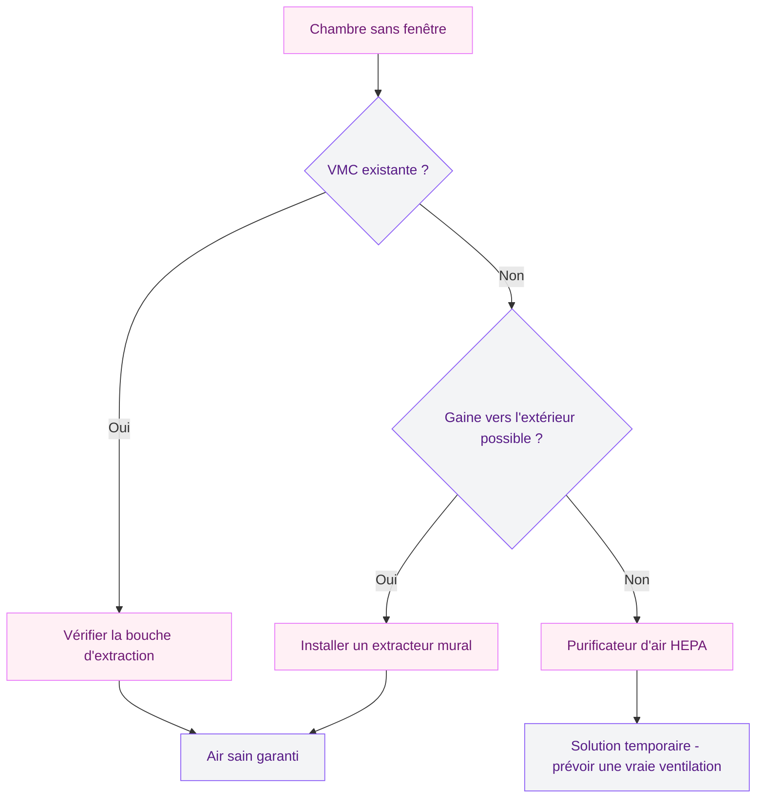
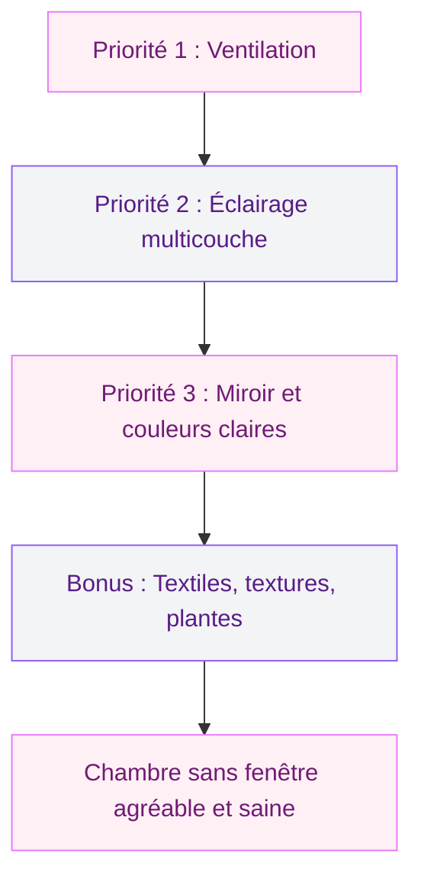

Une chambre sans fenêtre, ça fait peur sur le papier. L'image du cagibi sombre et étouffant vient tout de suite en tête. Pourtant, j'ai aménagé la chambre d'amis de mon appartement dans une pièce aveugle, et les gens qui y dorment me disent qu'ils s'y sentent très bien - certains ne remarquent même pas l'absence de fenêtre avant le lendemain matin.

Le secret, ce n'est pas un truc magique. C'est une combinaison de choix précis sur la lumière, les couleurs, les matières et surtout l'aération. Je te donne mes 15 idées testées, avec des produits concrets et des prix réels, pour transformer cette pièce en vrai cocon.

## Avant tout : la ventilation, le point non négociable

On va parler déco, promis. Mais d'abord, il faut régler le sujet santé. Une chambre sans fenêtre n'a pas d'aération naturelle. Sans système mécanique, l'humidité s'accumule, les odeurs stagnent, et tu respires un air de moins en moins bon pendant la nuit.

  

**Ce qu'il te faut au minimum :**
- Une **VMC simple flux** raccordée à la pièce (si ton logement en a une, vérifie que la chambre a bien une bouche d'extraction)
- Ou un **extracteur d'air mural** type Vent-Axia Silhouette (entre 45 et 80 euros selon le modèle) branché sur une gaine vers l'extérieur
- Ou au strict minimum un **purificateur d'air avec filtre HEPA** comme le Xiaomi Smart Air Purifier 4 Lite (environ 120 euros) pour filtrer l'air en circuit fermé

> [!WARNING]
> Sans ventilation mécanique, une chambre sans fenêtre peut accumuler un taux d'humidité de 70% et plus en quelques semaines. Moisissures sur les murs, acariens dans la literie, qualité de sommeil dégradée. Règle ce point avant de penser à la déco.

## Idée 1 : miser sur un éclairage multicouche

C'est le levier le plus puissant dans une pièce sans lumière naturelle. L'erreur classique ? Un seul plafonnier central. Résultat : une lumière plate qui rappelle un bureau administratif. L'objectif, c'est de reproduire les variations de la lumière naturelle.

  

**Les couches à combiner :**

1. **Éclairage général** : plafonnier diffus ou spots encastrés. Le plafonnier NYMANE d'IKEA (39 euros) ou des spots LED encastrables (8-15 euros pièce chez Leroy Merlin).

2. **Éclairage d'ambiance** : rubans LED derrière la tête de lit ou sous les meubles. Kit LEDBERG d'IKEA (15 euros pour 5 m) ou ruban LIFX connecté (autour de 50 euros).

3. **Éclairage ponctuel** : lampes de chevet, liseuse murale. Les appliques articulées RANARP d'IKEA (30 euros) fonctionnent bien.

> [!TIP]
> Choisis des ampoules avec une température de couleur entre 2700K et 3000K (blanc chaud). C'est la teinte la plus proche de la lumière du soleil en fin d'après-midi, idéale pour une chambre. Et prends du 800-1000 lumens minimum pour le plafonnier, les pièces sans fenêtre ont besoin de plus de puissance lumineuse qu'on ne croit.

## Idée 2 : installer un grand miroir face à la lumière

Le miroir, c'est la fausse fenêtre du pauvre - et ça marche. Un grand miroir placé face à ta source lumineuse principale va refléter et redistribuer la lumière dans toute la pièce. L'effet d'agrandissement visuel est réel : le mur semble reculer.

  

**Où le placer :** en face du mur où se concentrent tes luminaires, ou sur le mur adjacent à la porte si elle laisse entrer de la lumière depuis le couloir.

**Budget :** le miroir HOVET d'IKEA (199 euros, 78 x 196 cm) fait le job. En plus économique, le miroir LOTS (4 miroirs carrés pour 10 euros) crée un effet graphique intéressant en les assemblant.

## Idée 3 : peindre en couleurs claires, mais pas que du blanc

Le blanc total dans une chambre sans fenêtre donne un effet "hôpital" assez froid. Les couleurs claires fonctionnent mieux : elles réfléchissent la lumière artificielle sans créer une ambiance clinique.

  

**Les teintes gagnantes :**
- **Blanc cassé tirant sur le crème** : Farrow & Ball "Pointing" ou Tollens "Blanc lin" (35-45 euros le pot de 2,5 L)
- **Bleu pastel très clair** : Dulux Valentine "Bleu scandinave" (environ 28 euros le pot de 2,5 L)
- **Beige rosé** : Leroy Merlin 1825 "Poudre de riz" (20 euros le pot de 2,5 L)

Si tu veux creuser les combinaisons de teintes pour ta chambre, mon guide sur [les couleurs pour une chambre adulte à deux teintes](/les-meilleures-options-de-couleurs-pour-une-chambre-dadulte-a-deux-teintes/) te sera utile.

## Idée 4 : la fausse fenêtre lumineuse

Oui, ça existe. Ce sont des panneaux LED qui reproduisent la forme et la luminosité d'une fenêtre. Sur Amazon, les panneaux LED type "fenêtre" coûtent entre 80 et 200 euros (60 x 120 cm en moyenne).

  

**Version DIY** : un cadre photo grand format IKEA RIBBA (15 euros), un panneau LED plat (40-60 euros) et un film diffuseur imprimé ciel bleu (10-15 euros). Total : environ 70 euros. Place-la en hauteur avec un voilage devant pour renforcer l'illusion.

## Idée 5 : des meubles bas et peu profonds

Dans une pièce sans lumière naturelle, chaque zone d'ombre compte. Un meuble haut ou massif crée des ombres portées qui rétrécissent visuellement la pièce et renforcent la sensation d'enfermement.

**Les bons réflexes :**
- Table de chevet suspendue plutôt que posée au sol (elle libère de l'espace visuel en dessous)
- Commode basse (max 80 cm de haut) plutôt qu'une armoire
- Lit bas type futon ou cadre de lit sans montants hauts

> [!NOTE]
> Si tu as besoin de rangement en hauteur, préfère des étagères ouvertes à une armoire fermée. Elles laissent circuler la lumière entre les objets au lieu de créer un gros bloc opaque.

## Idée 6 : miser sur le verre et la transparence

Le verre laisse passer la lumière, et c'est exactement ce dont cette pièce a besoin. Remplace les surfaces opaques par du verre ou du plexiglas quand c'est possible : table de chevet en verre (IKEA VITTSJÖ, 20 euros), étagères en verre au mur, vases transparents.

Le plus gros impact ? Remplacer la porte pleine par une **porte coulissante vitrée** type verrière (150-350 euros chez Leroy Merlin, pose par un pro : 200-400 euros). La lumière du couloir entre dans la chambre même porte fermée, avec un verre dépoli pour l'intimité.

## Idée 7 : un mur de texture pour casser la monotonie

Quatre murs lisses et identiques dans une pièce sans vue, ça manque de vie. Ajouter du relief sur un mur crée de la profondeur visuelle :
- **Papier peint texturé** effet briques blanches : 20-40 euros le rouleau (Lutèce ou Casadeco chez Leroy Merlin)
- **Tasseaux de bois** verticaux peints en blanc : 3-5 euros le tasseau chez Brico Dépôt, 10-15 pour un mur
- **Panneau 3D en plâtre ou PVC** : à partir de 15 euros le m2

Garde des teintes claires pour le mur texturé. Le but c'est du relief, pas de l'ombre.

## Idée 8 : des textiles en nuances douces

Les coussins, le plaid, le linge de lit apportent la chaleur dans une pièce qui manque de personnalité sans lumière naturelle. Privilégie le bleu pastel, le vert d'eau, le gris perle et la lavande. Ces couleurs donnent une impression de fraîcheur. Mes [tendances déco chambre 2026](/decoration-de-la-chambre-a-coucher-2026-tendances-et-photos/) t'aideront à choisir.

**Bon plan :** housses de coussin en lin mélangé H&M Home (8-12 euros), plaids en gaze de coton La Redoute Interieurs (25-35 euros).

## Idée 9 : multiplier les petites sources de lumière chaude

Les petites lumières d'appoint donnent de la profondeur et rappellent les variations de la lumière naturelle :
- **Guirlande lumineuse à LED** BLÖTSNÖ d'IKEA (10 euros) sur une étagère ou autour d'un miroir
- **Bougies LED avec minuterie** GODAFTON d'IKEA (12 euros les 3), elles s'éteignent seules après 6 heures
- **Lampe en papier washi** (15-30 euros) pour une lumière très douce

## Idée 10 : jouer avec les hauteurs de lumière

Place tes luminaires à différentes hauteurs : au plafond, à mi-mur (appliques), au niveau du sol (lampadaire, guirlande basse). Cette verticalité lumineuse reproduit la façon dont la lumière entre par une fenêtre et se répartit du haut vers le bas.

Un rail LED collé au plafond le long de la jonction avec le mur (environ 20-30 euros pour un kit de 3 mètres) crée un effet de lumière indirecte qui agrandit visuellement la hauteur sous plafond.

## Idée 11 : opter pour des tons de bois clair

Le mobilier en bois foncé absorbe la lumière. Dans une chambre sans fenêtre, c'est l'ennemi. Préfère le bouleau, le hêtre clair, le pin blanchi ou le chêne clair.

Si tu as déjà du mobilier en bois sombre, tu peux le peindre (un pot de peinture pour meuble Rust-Oleum "Chalky finish" blanc coûte environ 12 euros le 750 mL) ou le céruser pour l'éclaircir. Ça change tout sans racheter de meubles, et [mon guide pour décorer sa chambre avec peu de budget](/decorer-la-chambre-a-coucher-avec-peu-dargent/) te donnera d'autres pistes.

## Idée 12 : accrocher un tableau lumineux ou rétroéclairé

Un tableau avec un éclairage intégré ou rétroéclairé sert de point focal décoratif et de source de lumière en même temps. C'est malin parce que ça remplit deux fonctions.

Les tableaux LED avec paysages (forêt, ciel, plage) entre 40 et 100 euros sur Amazon ajoutent une profondeur visuelle qui compense l'absence de vue extérieure. Pour savoir comment bien le choisir et le positionner, consulte mon guide sur [les tableaux lumineux](/choisir-tableau-lumineux/).

> [!TIP]
> Accroche ton tableau lumineux en face de la porte d'entrée de la chambre. C'est la première chose que tu vois en entrant, et ça donne immédiatement une sensation d'ouverture et de lumière.

## Idée 13 : dégager le sol au maximum

Plus tu vois de sol, plus la pièce semble grande. Ça vaut pour toutes les petites pièces, mais c'est encore plus vrai sans lumière naturelle parce que chaque centimètre d'ombre compte.

**Astuces concrètes :**
- Fixe tes tables de chevet au mur (IKEA MALM, 35 euros chacune)
- Choisis un sommier avec pieds visibles (pas un lit coffre posé au sol)
- Range sous le lit dans des boîtes plates (les STUK d'IKEA, 10 euros pièce, se glissent sous la plupart des lits)
- Pas de tapis qui recouvre tout le sol - un tapis de descente de lit suffit

## Idée 14 : ajouter de la verdure adaptée à l'ombre

Oui, des plantes dans une pièce sans fenêtre, c'est possible. Pas toutes, évidemment. Mais certaines se contentent de très peu de lumière et apportent cette touche de vie et de fraîcheur dont la pièce a besoin.

**Plantes qui tolèrent l'ombre :**
- **Zamioculcas (plante ZZ)** : quasi indestructible, supporte le manque de lumière et les oublis d'arrosage. Environ 15-25 euros en jardinerie
- **Sansevieria (langue de belle-mère)** : se plaît en luminosité faible, purifie l'air, très graphique. Autour de 10-20 euros
- **Pothos** : retombant, très tolérant, parfait sur une étagère haute. Dès 8 euros le pot

Si la pièce est vraiment très sombre, une lampe horticole LED (20-30 euros) branchée sur minuterie 8h par jour suffit à garder tes plantes en forme.

## Idée 15 : simuler la lumière du jour avec un réveil lumineux

Dans une chambre sans fenêtre, le réveil est souvent le moment le plus désagréable. Sans lumière naturelle qui monte progressivement, ton corps ne reçoit pas le signal de se réveiller. Un simulateur d'aube résout ce problème en reproduisant un lever de soleil artificiel sur 20 à 30 minutes.

Le **Philips Wake-Up Light HF3520** (environ 100 euros) est la référence du marché. En version plus accessible, le **Lumie Bodyclock Spark** tourne autour de 60 euros. C'est un vrai gain de confort au quotidien.

## Le budget global

Commence par les trois postes les plus impactants : ventilation (50-120 euros), éclairage (80-200 euros) et miroir (10-200 euros). Avec moins de 200 euros, tu changes déjà l'ambiance de la pièce. Budget total pour une transformation complète : entre 300 et 800 euros.

> [!IMPORTANT]
> Vérifie la réglementation de ton logement avant d'aménager une chambre sans fenêtre. En France, le Code de la construction impose une ouverture sur l'extérieur pour qu'une pièce soit considérée comme "chambre" au sens légal. Une pièce aveugle peut servir de bureau, dressing ou chambre d'amis, mais elle ne peut pas être déclarée comme chambre principale dans un bail.

## Sur le meme theme

- [décorer sa chambre en location](/decorer-chambre-coucher-location/)

## FAQ

**Est-ce légal de dormir dans une chambre sans fenêtre ?**

En France, une pièce sans fenêtre ne peut pas être louée comme chambre principale (décret du 30 janvier 2002). Tu peux y dormir chez toi, mais un propriétaire ne peut pas la compter comme chambre dans la surface habitable officielle.

**Quelle est la meilleure couleur pour une chambre sans fenêtre ?**

Le blanc cassé, le beige clair et le bleu pastel très clair. Elles réfléchissent la lumière artificielle sans l'effet froid du blanc pur. Évite les couleurs sombres qui absorbent la lumière.

**Comment aérer une chambre sans fenêtre ?**

Avec une VMC raccordée à la pièce ou un extracteur d'air mural relié à une gaine vers l'extérieur. En attendant, un purificateur d'air HEPA (80-150 euros) et la porte ouverte en journée aident à renouveler l'air.

**Quelles plantes survivent dans une pièce sans lumière naturelle ?**

Le zamioculcas, le sansevieria et le pothos tolèrent une luminosité très faible pendant des mois. Ajoute une lampe horticole LED (20-30 euros) sur minuterie pour les garder en forme.

**Combien coûte l'aménagement d'une chambre sans fenêtre ?**

Compte entre 255 et 795 euros pour une transformation complète : ventilation (50-120 euros), éclairage multicouche (80-200 euros), miroir (10-200 euros), peinture (20-50 euros), textiles (50-100 euros) et plantes (15-50 euros). En commençant par la ventilation et l'éclairage, 200 euros suffisent à changer radicalement l'ambiance.
