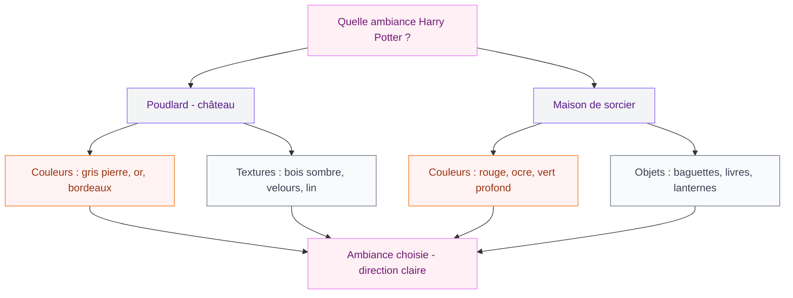
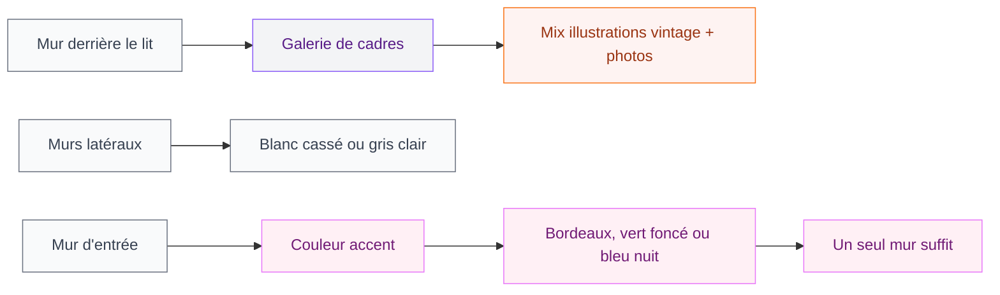

Tu as relu les livres pour la dixième fois, tu connais chaque réplique par coeur, et tu rêves depuis longtemps d'une chambre qui sente bon l'encre de la carte du Maraudeur. Bonne nouvelle : c'est tout à fait faisable, même dans un appartement ordinaire et sans budget de sorcier.

La déco chambre Harry Potter, c'est bien plus qu'une accumulation de produits dérivés. C'est une ambiance, une palette de couleurs, des textures et des petits détails qui font qu'en entrant dans la pièce, on se sent ailleurs. Et ça, tu peux l'atteindre avec de la créativité et quelques achats bien choisis.

## Choisir l'ambiance : Poudlard ou maison de sorcier ?

Avant de foncer acheter des posters, prends cinq minutes pour définir l'atmosphère que tu veux. Il y a deux grandes directions, et elles ne se décorent pas du tout pareil.

  

**L'ambiance Poudlard et ses grandes salles** : pierre, bois sombre, chandelles, dorures usées, livres empilés partout. C'est l'ambiance des grandes salles du château, un peu gothique et très cosy à la fois. Parfaite si tu veux quelque chose d'immersif et d'un peu mystérieux.

**L'ambiance maison de sorcier** : plus quotidienne, plus chaleureuse. On pense à la salle commune de Gryffondor avec son rouge profond, ses fauteuils confortables et sa cheminée. Ou à la maison des Weasley, avec ses objets enchantés et son côté patchwork adorable. Cette direction est souvent plus facile à habiter au quotidien.

Tu peux aussi mixer les deux, mais il vaut mieux ancrer la déco dans une direction principale pour garder de la cohérence. Choisis la tienne et note deux ou trois mots-clés qui la définissent. Ça t'aidera à faire les bons choix par la suite.

## La palette de couleurs qui fait tout

Les couleurs, c'est la base de tout. Et dans l'univers Harry Potter, il y a des associations qui reviennent partout : elles créent l'ambiance instantanément même sans un seul produit dérivé visible.

  

**Le bordeaux et l'or** : c'est la combinaison Gryffondor par excellence, mais elle fonctionne aussi dans un contexte plus général. Un mur peint en bordeaux profond (type "wine" ou "burgundy"), avec des accessoires dorés, ça évoque Poudlard sans tomber dans le déco enfant.

**Le vert bouteille et l'argent** : pour ceux qui assument leur côté Serpentard, ou qui veulent juste une atmosphère plus mystérieuse. Le vert profond sur un mur d'accent, combiné à des cadres argentés et des bougies blanches, c'est vraiment beau.

**Le gris ardoise et le beige lin** : plus neutre, ça rappelle les murs de pierres du château. C'est une base qui permet d'ajouter facilement des touches de couleur via des accessoires.

> [!TIP]
> Pour peindre un mur sans te ruiner, Dulux Valentine et Farrow & Ball ont des teintes parfaites. "Hague Blue", "Mahogany" ou "Studio Green" font exactement l'ambiance voulue. Une seule pièce de teinte profonde change tout.

Le plus important : ne peins pas tout en rouge et or. Choisis une couleur dominante sur un seul mur (le mur en face du lit, idéalement), et garde le reste dans des tons neutres. Ça évite l'effet "chambre d'enfant de 8 ans" et ça reste beau sur la durée.

## Les éléments de déco à ne pas manquer

  

### La bibliothèque qui raconte une histoire

Dans l'univers de J.K. Rowling, les livres sont partout. Une bibliothèque bien garnie est le premier accessoire de déco Harry Potter qui soit - et qui reste élégant pour n'importe quelle chambre.

L'idée : mélange de vraies collections avec des livres décoratifs au dos patiné ou aux couleurs coordonnées. Tu peux acheter des lots de vieux livres en brocante pour quelques euros et les disposer façon "bibliothèque de sorcier". Ajoute une ou deux bougies (ou des fausses bougies LED pour la sécurité), un crâne décoratif ou quelques pierres naturelles entre les rangées.

Si tu as une petite bibliothèque, envisage de la peindre en noir ou en bordeaux à l'intérieur. Le fond coloré met en valeur les livres et donne un effet vitrine très réussi.

### Le miroir du Riséd version DIY

C'est une idée qui revient souvent sur Pinterest et dans les blogs déco Harry Potter, et pour une bonne raison : c'est magnifique. Un grand miroir avec un cadre doré patiné, sur lequel tu écris (ou fais écrire) en belle calligraphie une phrase en latin inversé ou la citation originale du miroir.

Tu trouves des miroirs avec cadre doré dans toutes les brocantes ou sur Vinted pour pas grand chose. La phrase peut être peinte directement sur le verre avec de la peinture spéciale miroir, ou gravée si tu veux quelque chose de plus durable.

> [!NOTE]
> Le texte original du miroir est "Erised stra ehru oyt ube cafru oyt on wohsi" (une phrase en anglais écrite à l'envers). En français, on peut adapter avec "ed esiram tse eriaf te eriov ec tse xueim el tE" - mais une phrase que tu as choisie toi-même a encore plus de sens.

### La lumière : l'élément qui change tout

La lumière dans une déco Harry Potter, c'est une priorité absolue. Oublie le néon du plafond - il tue toute ambiance en une seconde.

Ce qui fonctionne vraiment bien :
- **Les guirlandes lumineuses à ampoules vintage** posées sur l'armoire ou autour de la fenêtre
- **Les bougies LED** (à piles ou USB) dans des photophores en verre dépoli ou des lanternes anciennes
- **Une lampe de chevet à abat-jour en velours** bordeaux, vert ou bleu nuit
- **Une veilleuse en forme de Choixpeau magique** ou de la Tour de l'Horloge de Poudlard, si tu aimes les détails thématiques

Le résultat qu'on cherche : des sources de lumière multiples, à hauteur différentes, avec une lumière chaude (2700K maximum). C'est ce qui donne l'impression des chandelles du Grand Hall.

> [!WARNING]
> Évite les ampoules LED blanc froid (5000K et plus) dans une chambre Harry Potter. La lumière froide casse complètement l'atmosphère chaleureuse et ancienne qu'on cherche à créer. Choisis du "warm white" ou "extra warm white" pour tous tes éclairages.

### Les accessoires qui font la différence

Ici, la règle c'est : quelques pièces bien choisies plutôt que beaucoup de petits trucs qui s'accumulent. L'accumulation de produits dérivés peut vite faire "chambre de collectionneur" plutôt que "chambre de sorcier".

**Ce qui a du sens** :
- Une réplique de baguette dans son emballage (une ou deux, pas dix)
- Un vrai vieux coffre en bois à placer au pied du lit (brocante ou ikea hack)
- Des photos encadrées en noir et blanc des décors du film, façon photos d'époque
- Un globe terrestre ancien, des cartes astrologiques, une boussole
- Des bocaux en verre avec des plantes séchées, des pierres ou des petits objets naturels

**Ce qu'on évite** :
- Les sets de literie Harry Potter bon marché avec les personnages imprimés dessus
- Les autocollants muraux de mauvaise qualité
- Trop de produits dérivés officiels qui font "boutique à l'entrée du parc d'attractions"

> [!TIP]
> La brocante est ton meilleur allié. Un vieux microscope, une loupe avec manche en bois, un sablier, une vieille boîte en métal... Tous ces objets évoquent instantanément la salle de potions ou le bureau de Dumbledore, et ils sont beaux dans n'importe quelle déco, pas seulement en thème Harry Potter.

## La literie et les textiles

Les textiles font 50% de l'ambiance dans une chambre. Et c'est là que tu peux vraiment aller vers l'univers HP sans que ça fasse trop.

  

**La housse de couette** : oublie les modèles avec les personnages. Choisis plutôt une couleur unie dans ta palette (bordeaux, vert bouteille, bleu nuit) ou un tissu avec un petit motif répétitif type houndstooth (pied-de-poule), plaid écossais ou jacquard géométrique. C'est très "uniformes de Poudlard" et ça reste intemporel.

**Les coussins** : là tu peux te permettre quelques détails thématiques. Un coussin avec l'armoirie de ta maison préférée, ou une phrase en latin brodée. Mélange avec des coussins neutres pour équilibrer.

**Le plaid** : investis dans un beau plaid en laine (ou imitation cachemire) dans une couleur chaude. Bordeaux, ocre, vert... à jeter sur le lit ou un fauteuil. C'est ça, le cosy britannique qui rappelle les salles communes de Poudlard.

**Le rideau** : velours épais ou lin lavé, selon l'ambiance choisie. Le velours bordeaux ou vert bouteille est spectaculaire. Le lin lavé gris-beige est plus polyvalent.

## Les murs : affiches et art DIY

Pour les murs, l'idée est de créer quelque chose qui ressemble à un vrai appartement décoré avec passion, pas à une chambre d'enfant.

  

**Les affiches et cadres** : cherche des illustrations de style vintage ou botanique qui évoquent le monde magique sans être des affiches officielles du film. Il y a plein de graphistes sur Etsy et Society6 qui proposent des prints de plantes de la salle de Sprout, des cartes de l'école, des partitions de musique façon ancien... C'est beau, c'est subtilement Harry Potter, et ça ne date pas.

**Le mur de cadres** : une galerie de photos et illustrations encadrées dans des cadres noirs, dorés ou en bois sombre. Mélange photos en noir et blanc, illustrations botaniques, petites aquarelles... C'est facile à faire soi-même et l'effet est vraiment réussi.

**Le fond de la bibliothèque** : si tu as une bibliothèque avec des niches, tu peux tapisser le fond avec un papier peint à motif de briques (parfait pour l'ambiance Diagon Alley) ou un papier peint étoilé.

## Adapter la déco selon ta maison de Poudlard

Si tu as une maison préférée, autant jouer la carte jusqu'au bout - mais subtilement.

**Gryffondor** : rouge profond et or, cuir brun, bois doré, plaid à carreaux rouge et or. Chaleur, feu de cheminée, fauteuils moelleux.

**Serpentard** : vert bouteille et argent, marbre blanc, métal brossé, draps satinés. Élégance froide et mystérieuse.

**Poufsouffle** : jaune ocre et noir, tons terreux, céramique artisanale, plantes dans tous les coins. Chaleur et nature.

**Serdaigle** : bleu marine et bronze (pas or), livres empilés partout, cartes du ciel, globes, instruments de mesure. Curiosité intellectuelle.

> [!IMPORTANT]
> La déco de ta maison de Poudlard doit rester une inspiration, pas une application littérale. Si tu peins tout en vert et argent pour Serpentard, le résultat risque d'être froid et difficile à vivre. Prends les couleurs comme point de départ et module en fonction de ce qui te plait vraiment.

## Sur le meme theme

- [déco terracotta chambre](/guides/chambre/deco-terracotta-chambre/)
- [décorer sa chambre en location](/guides/chambre/decorer-chambre-coucher-location/)
- [déco pop chambre](/guides/chambre/guide-pour-une-deco-pop-dans-la-chambre-a-coucher/)
- [chambre style jungle](/guides/chambre/decorer-une-chambre-dans-un-style-jungle/)
- [chambre sans fenêtre](/guides/chambre/chambre-sans-fenetre/)

## Budget et priorités

Tu n'as pas besoin de tout faire en une fois. Voici comment prioriser si tu pars de zéro.

**Priorité 1 - Couleur et lumière (50-150€)** : un pot de peinture pour un mur d'accent et deux ou trois sources de lumière chaleureuses. C'est ce qui change le plus l'ambiance, le plus vite, pour le moins cher.

**Priorité 2 - Textiles (80-200€)** : une belle housse de couette dans ta couleur, un plaid et deux coussins. Tu n'as pas besoin de changer tout en même temps - commence par la housse.

**Priorité 3 - Bibliothèque et objets (brocante, 20-80€)** : un passage en brocante pour dénicher des vieux livres, une ou deux lanternes, un petit coffre en bois. C'est souvent là qu'on trouve les meilleures pièces pour pas grand chose.

**Priorité 4 - Murs (30-100€)** : des cadres abordables (IKEA fait très bien l'affaire), des prints téléchargés et imprimés en maison ou chez un imprimeur en ligne.

Au total, tu peux avoir une chambre transformée pour 200-400€ si tu fais les choses dans l'ordre et que tu chines un peu. Et le résultat sera bien plus beau et personnel qu'une chambre déco officielle à 1000€ de produits sous licence.

---

La déco chambre Harry Potter, c'est avant tout une histoire d'atmosphère. Le château de Poudlard n'était pas une chambre d'enfant - c'était un espace riche, mystérieux, plein d'histoire et de vie. C'est cette direction qui rend la déco HP belle à tout âge. Pars des couleurs, soigne ta lumière, chine quelques belles pièces - et le reste suivra naturellement.
