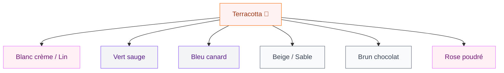
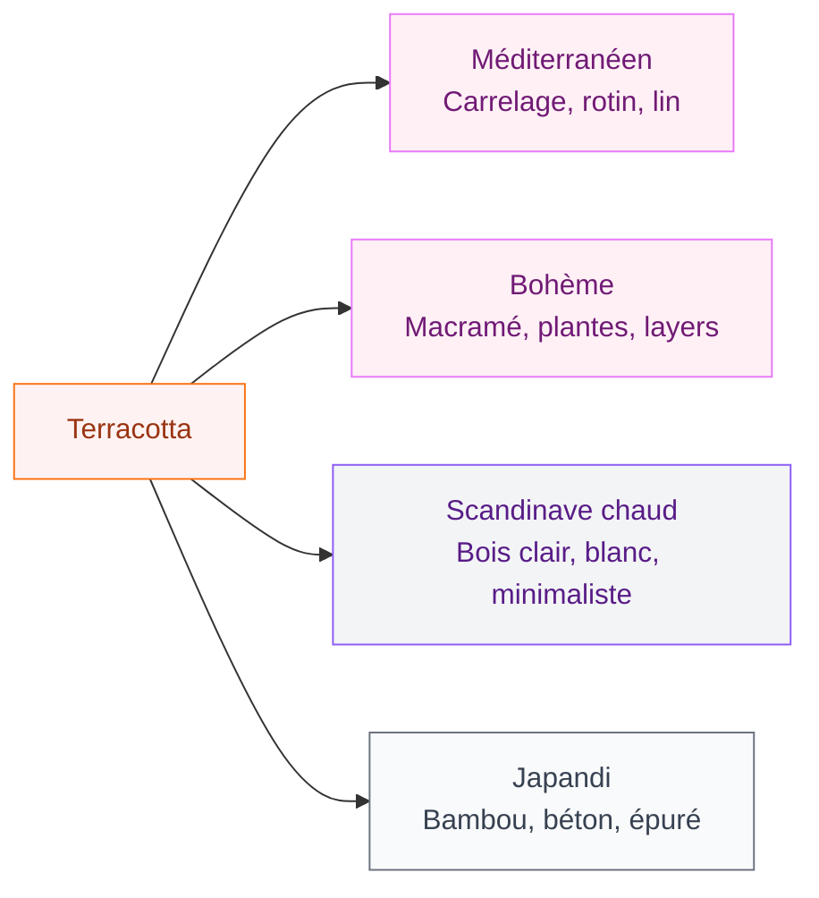

Le terracotta, c'est cette couleur terre cuite qui réchauffe une pièce en deux secondes. Ni vraiment orange, ni vraiment beige, ni vraiment marron - elle se situe quelque part entre tout ça et c'est précisément ce qui la rend si séduisante pour une chambre. Si tu cherches à créer un cocon douillet, une ambiance méditerranéenne ou simplement à sortir du blanc cassé omniprésent, tu es au bon endroit.

Voilà ce qu'on va voir ensemble : comment choisir la bonne nuance, comment la marier avec d'autres couleurs, et surtout comment l'intégrer dans ta chambre sans que ça fasse "pot en terre cuite de jardinerie."

## Le terracotta, c'est quoi exactement ?

Avant d'aller plus loin, on va poser les bases. Le terracotta (qui veut dire "terre cuite" en italien) regroupe toute une famille de teintes chaudes allant du brun-orangé au rose saumon. C'est une couleur très ancienne - on la retrouve dans l'architecture méditerranéenne, dans la poterie traditionnelle, dans les fresques romaines.

  

Dans ta chambre, elle va créer quelque chose de précis : une sensation d'enveloppement. Les teintes chaudes rapprochent les murs visuellement, ce qui dans une chambre crée un effet "refuge" très recherché. C'est l'effet cocon par excellence.

> [!TIP]
> Pour une chambre qui semble grande malgré le terracotta, choisis une nuance avec beaucoup de beige et de rose dedans (comme le "vieux rose terracotta") plutôt qu'une version orange-brique intense. Tu gardes la chaleur sans perdre la lumière.

Les nuances du spectre terracotta :
- **Terracotta doux** : beige rosé, presque abricot - idéal pour les chambres petites ou peu lumineuses
- **Terracotta classique** : la terre cuite typique, orange chaleureux - pour les chambres exposées sud ou est
- **Terracotta foncé** : brique profonde, presque bordeaux - à réserver aux grands espaces ou en accent

## Les associations de couleurs qui marchent vraiment

C'est là que beaucoup de gens se bloquent. Le terracotta est une couleur forte, et si tu la maries mal, tu vas finir avec une chambre qui ressemble à une orangeade. Voici les combinaisons qui fonctionnent.

  

**Terracotta + blanc crème ou lin** : le grand classique. Tu calmes l'intensité du terracotta avec une base neutre très douce. Literie en lin naturel, murs blancs cassés, quelques touches terracotta - c'est la combinaison la plus facile à réussir.

**Terracotta + vert sauge** : mon combo préféré. Ces deux teintes se retrouvent souvent dans la nature (pots en terre, plantes grasses) et elles fonctionnent parfaitement ensemble. Tu peux avoir des murs terracotta avec une plante en pot vert sauge, ou l'inverse.

**Terracotta + bleu canard ou bleu nuit** : ça peut surprendre mais ça marche vraiment. Le bleu froid vient équilibrer la chaleur du terracotta, et tu obtiens une chambre à la fois dynamique et posée. Parfait pour un style bohème ou ethnique.

**Terracotta + beige/sable** : la version monochrome. Tu crées une palette entièrement dans les tons chauds et terreux. Ambiance désert, minimaliste, très zen. Attention à varier les textures pour éviter la monotonie.

> [!WARNING]
> Évite l'association terracotta + jaune moutarde si tu ne suis pas un style très bohème affirmé. Les deux couleurs chaudes ensemble peuvent vite partir dans le côté "cuisine provençale des années 90". Si tu veux du jaune, préfère l'or très discret, en petit accessoire seulement.

## Où mettre le terracotta dans ta chambre ?

Tu n'es pas obligée de tout peindre. Le terracotta, ça s'intègre par touches - et parfois les touches suffisent largement.

  

### Un mur accent - la solution la plus simple

Peins un seul mur en terracotta (généralement celui derrière la tête de lit). Résultat immédiat, impact fort, et tu peux facilement changer d'avis si ça ne te convient pas. Tu commences par là avant de te lancer dans quelque chose de plus ambitieux.

La marque Dulux Valentine a une nuance qui s'appelle "Argile" qui est parfaite pour ça - c'est un terracotta doux, légèrement poudré, qui ne fait pas trop criard. En 2 litres tu couvres largement un mur de chambre standard, comptez 25-35€.

### La tête de lit peinte directement sur le mur

L'astuce déco maline que tout le monde adore en ce moment : tu peins la forme d'une tête de lit directement sur le mur terracotta (ou en terracotta sur un mur neutre). Un rectangle arrondi ou une arche, et hop - l'effet est bluffant pour quasiment zéro budget. Il te faut juste du ruban de masquage et deux heures de ton temps.

### Les textiles - le moyen le plus réversible

Si tu n'es pas prête à peindre ou si tu loues ton appartement, les textiles sont ta meilleure option. La Redoute, Maisons du Monde et H&M Home proposent tous des housses de couette, plaids et coussins dans les tons terracotta.

Mon conseil : commence par un plaid terracotta (H&M Home en propose autour de 29-39€) et deux coussins. Tu vois si ça te plaît dans ta chambre avant d'aller plus loin.

### Les accessoires et la céramique

Des vases en céramique terracotta sur une étagère, un pot pour ta plante, un photophore... Les accessoires dans cette teinte s'intègrent dans presque n'importe quelle chambre sans la dominer. C'est le moyen d'introduire la couleur avec un budget de 15-30€.

> [!NOTE]
> Le terracotta naturel (vraie poterie) et le terracotta peint ne donnent pas exactement la même teinte. La poterie a souvent plus de brun, la peinture peut tirer plus vers l'orange. Ce n'est pas un problème de les mixer - au contraire, ça crée une palette terracotta riche avec plusieurs nuances dans la même famille.

## Quel style déco choisir avec le terracotta ?

Le terracotta n'est pas une couleur de style unique - elle s'adapte à plusieurs univers selon comment tu la travailles.

  

**Style méditerranéen** : c'est le plus évident et le plus réussi. Tu associes le terracotta avec du carrelage blanc ou des motifs zellige, du rotin, du lin, des plantes méditerranéennes (figuier de barbarie, olivier). C'est soleil et vacances permanents.

**Style bohème** : le terracotta est une couleur de base dans le style boho. Tu peux aller sur plusieurs nuances et plusieurs textures - macramé, coussins en velours, plaid en laine, plantes partout. L'idée, c'est le joyeux désordre organisé.

**Scandinave chaud** : tu prends les bases du style scandinave (blanc, bois clair, épuré) et tu ajoutes le terracotta comme couleur accent. Le résultat est moins froid que le scandi pur et garde quand même la clarté et l'espace.

**Japandi** : la tendance du moment qui mélange japonais et scandinave. Le terracotta s'y intègre très bien en tant que couleur de terre, aux côtés du bambou, du béton ciré et des lignes épurées.

## Les matières qui s'associent bien avec le terracotta

La couleur c'est bien, mais c'est les matières qui font le volume et la richesse de la déco.

  

**Le lin et le coton naturel** : ils ont la même origine "brute" que le terracotta. Un ensemble de literie en lin dans un beige naturel avec un ou deux coussins terracotta - c'est direct, efficace, et jamais raté. Comptez 80-150€ chez AM.PM ou The Conran Shop pour un beau housse de couette en lin.

**Le rotin et l'osier** : une tête de lit en rotin, une corbeille en osier pour ranger les plaids, un miroir avec cadre en rotin... Ces matières naturelles partagent les tons chauds du terracotta et s'y associent sans effort.

**La céramique mate** : les vases, bols, carafe en céramique mate dans les tons terracotta ou dans les beiges/blancs cassés. Ikea propose des pièces très correctes à 3-12€ qui rentrent parfaitement dans ce style.

**Le bois foncé** : si tu as des meubles en bois foncé (noyer, wengé, chêne teinté), le terracotta les met en valeur. Le contraste chaud-chaud fonctionne parce que ce sont deux tons de la même famille.

**Le velours** : un coussin ou un plaid en velours terracotta, c'est luxueux et doux à la fois. Zara Home fait de très beaux velours dans cette gamme de couleurs (autour de 25-45€ le coussin).

> [!TIP]
> Tu veux un effet "chambre de boutique hôtel" à petit budget ? Mix velours terracotta + lin naturel + céramique blanche mate. Trois matières, une couleur dominante - c'est tout ce qu'il faut.

## Peinture terracotta : les meilleures marques et nuances

Si tu décides de te lancer dans la peinture, voilà une sélection de nuances concrètes que tu peux aller chercher demain chez Leroy Merlin ou en ligne.

**Dulux Valentine - "Argile chaude"** : un terracotta doux et poudré, parfait pour les chambres. Disponible en Créatis satinée. Comptez 35-40€ les 2,5L.

**Farrow & Ball - "Red Earth" (n°64)** : une teinte terracotta profonde, légèrement rustique. C'est du luxe (90€/2,5L) mais la qualité est incomparable et la couleur est vraiment belle une fois sur les murs.

**Leroy Merlin gamme Tollens - "Terre de Sienne"** : très accessible, autour de 25€/2,5L, parfait si tu veux tester sans investir.

**Little Greene - "Tuscan Red"** : une teinte terracotta briquée, très méditerranéenne. Milieu de gamme autour de 65€/2,5L.

> [!IMPORTANT]
> Avant de choisir ta nuance, achète toujours un petit pot de test (2-5€) et peins une grande surface (au moins 40x40 cm) sur le mur. La couleur va changer selon ta luminosité - une même teinte peut sembler très différente dans une chambre nord et dans une chambre sud. Laisse sécher complètement avant de juger.

## Sur le meme theme

- [déco pop chambre](/guide-pour-une-deco-pop-dans-la-chambre-a-coucher/)
- [chambre style jungle](/decorer-une-chambre-dans-un-style-jungle/)
- [déco chambre harry potter](/deco-chambre-harry-potter/)
- [chambre adulte à deux teintes](/les-meilleures-options-de-couleurs-pour-une-chambre-dadulte-a-deux-teintes/)

## Budget et priorités : par où commencer ?

Tu n'as pas à tout faire d'un coup. Voilà une stratégie par budget.

**Budget 50€** : un plaid terracotta (H&M Home, 29€) + deux coussins assortis (Ikea Gurli, 8€ pièce) + un vase en céramique (Ikea, 5€). Tu as déjà une chambre qui a changé de tête.

**Budget 150€** : ajoute un housse de couette en coton ou lin dans les teintes naturelles (La Redoute à 60-80€) + un pot de peinture test pour voir si tu passes à l'étape suivante.

**Budget 400€** : tu peux te lancer sur un mur peint + une ou deux pièces de qualité (coussin velours Zara Home, vase céramique artisanal, plaid en laine).

**Budget 800€ et plus** : c'est là que tu peux envisager des textiles de qualité (lin Libeco, couverture en mohair), un éclairage adapté (lampe à poser avec abat-jour en terre cuite) et potentiellement quelques pièces de mobilier.

L'éclairage, en parlant de ça, c'est souvent ce qui manque dans une chambre terracotta. Évite les spots LED blanc froid qui vont tuer toute la chaleur de la couleur. Préfère des ampoules à lumière chaude (2700K max) ou des lampes qui diffusent une lumière indirecte et dorée. Ça fait toute la différence.

Une chambre terracotta réussie, c'est une chambre qui te donne envie de t'y poser, de lire un livre, de te coucher tôt. C'est exactement la mission de cette couleur - créer un espace qui ressemble à un vrai repos plutôt qu'à une salle de passage. Et avec les bonnes nuances et les bonnes associations, tu peux y arriver quel que soit ton budget.

Pour aller plus loin dans l'aménagement de ta chambre, jette un oeil à notre article sur les [tendances déco chambre 2026](/decoration-de-la-chambre-a-coucher-2026-tendances-et-photos/) - le terracotta y figure en bonne place parmi les couleurs de l'année.
