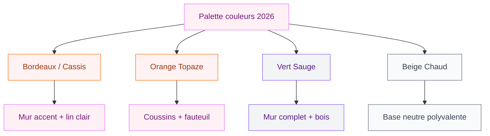
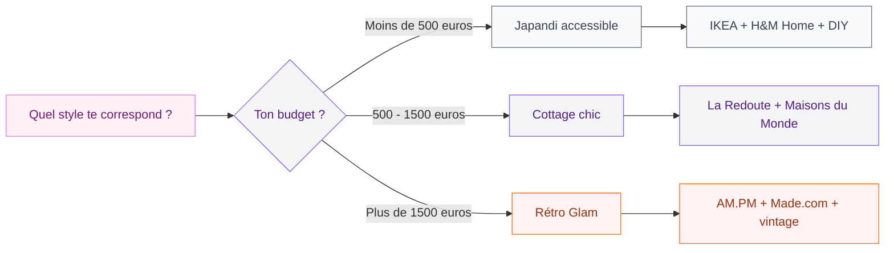

Tu cherches à donner un vrai coup de frais à ta chambre cette année ? Bonne nouvelle : 2026 est une année géniale pour se lancer. Les tendances déco chambre à coucher oscillent entre matières brutes ultra chaleureuses, palettes de couleurs qui osent enfin, et un retour au confort version cocon - sans tomber dans le kitch. Je t'ai préparé un tour complet de ce qui se fait de mieux en ce moment, avec des idées concrètes, des prix réels et mes coups de coeur perso.

## Les couleurs star de la chambre en 2026

Oublie le tout-blanc un peu clinique. En 2026, la chambre s'habille de teintes plus profondes, plus enveloppantes, et surtout plus personnelles.

  

### Bordeaux, cassis et prune : l'audace douce

Le bordeaux profond, que certaines marques appellent "Cassis", est LA couleur de l'année pour la chambre. C'est chaud, c'est enveloppant, et ça fonctionne aussi bien sur un mur entier qu'en touches (coussins, plaid, tête de lit). Chez Maisons du Monde, la parure de lit en lin lavé teinte cassis démarre à 79 euros. Chez La Redoute (collection AM.PM), tu trouves des draps housse en coloris prune à partir de 35 euros.

> [!TIP]
> Pour éviter l'effet "grotte", associe le bordeaux à des tons crème ou à du bois clair. Le contraste adoucit la profondeur de la couleur et garde la pièce lumineuse.

### Orange topaze et terracotta : la chaleur solaire

L'orange topaze fait une entrée remarquée dans les chambres 2026. Pas un orange criard, plutôt une teinte épicée, presque cuivrée. En accent sur des coussins ou un fauteuil d'appoint, ça transforme l'ambiance. IKEA propose sa housse de couette JORDTISTEL dans un coloris terracotta doux à 29,99 euros - parfait pour tester sans se ruiner.

### Vert sauge et vert olive : la nature apaisante

Le vert reste une valeur sûre, mais il évolue. En 2026, on quitte le vert émeraude un peu "too much" pour des verts plus sourds : sauge, olive, mousse. Si tu veux [une chambre vraiment apaisante](/couleurs-apaisantes-zen/), ces teintes-là sont tes meilleures alliées. Un mur en vert sauge (peinture Tollens "Feuille de Sauge", environ 38 euros le pot de 2,5L) change complètement l'énergie de la pièce.

## Les matières et textures à privilégier

La grande tendance de fond en 2026, c'est le retour aux matières naturelles. Et pas juste en décoration : dans le linge de lit, le mobilier, les accessoires - partout.

  

### Le lin lavé, toujours roi

Le lin lavé reste le textile numéro un pour la chambre. Il est beau froissé, il se patine avec le temps, et il respire (génial en été comme en hiver). La bonne nouvelle, c'est que les prix ont pas mal baissé ces dernières années. Chez H&M Home, un drap housse en lin démarre à 49,99 euros. Chez AM.PM (La Redoute), compte plutôt 70-90 euros pour une qualité supérieure.

### Le bois brut et la pierre naturelle

L'idée, c'est de ramener des éléments naturels dans la chambre : une table de chevet en chêne massif, un plateau en marbre pour poser tes bougies, ou même un mur en pierre de parement. IKEA a sorti la gamme HEMNES revisitée en bois de pin non traité (table de chevet à 69,99 euros) qui colle parfaitement à cette tendance.

> [!NOTE]
> Le bois brut non traité peut se tacher facilement. Une cire naturelle incolore (cire d'abeille par exemple) le protège sans dénaturer son aspect. Application en 10 minutes, à renouveler une fois par an.

### Le cannage et le rotin

Le cannage a envahi les têtes de lit, les portes de placard et même les lampes de chevet. C'est léger, ça apporte une texture intéressante, et ça s'intègre dans quasiment tous les styles. La tête de lit en cannage NATUR chez Maisons du Monde démarre à 199 euros en 160 cm. Chez Made.com, tu trouves des modèles plus design à partir de 250 euros.

### Le velours côtelé

Grosse tendance 2026 : le velours côtelé fait son retour, pas que sur les pantalons. On le retrouve en coussins, en couvre-lit et même en tête de lit capitonnée. La texture apporte une douceur incroyable et un côté rétro-chic très actuel. Zara Home propose des housses de coussin en velours côtelé à partir de 19,99 euros.

## Les motifs tendance : pois, rayures douces et géométrie

  

### Le pois, motif star de 2026

Surprise de l'année : le motif à pois s'impose sur le linge de lit. Noir sur fond blanc, blanc sur fond beige, parfois légèrement irrégulier - il remplace progressivement les rayures qui dominaient depuis quelques saisons. C'est graphique sans être agressif, et ça fonctionne avec à peu près tout.

### La géométrie douce

Les motifs géométriques restent présents, mais en version adoucie. On parle de formes arrondies, de lignes ondulées, de motifs abstraits qui rappellent presque de la peinture. L'idée, c'est d'apporter du rythme au linge de lit sans créer de surcharge visuelle. Si tu aimes [le design minimaliste en chambre](/chambre-moderne-design-minimaliste/), ces motifs discrets sont un bon compromis entre personnalité et sobriété.

## Les styles déco chambre qui cartonnent en 2026

  

### Le rétro glam

C'est le style qui combine bordeaux profond, textures raffinées (velours, laiton) et jeux de contrastes. L'idée : une chambre qui a du caractère, un côté boudoir moderne sans être surchargée. Le secret, c'est la maîtrise - deux ou trois pièces fortes (un miroir en laiton, une lampe en verre fumé, un plaid en velours) et le reste en teintes neutres.

> [!WARNING]
> Attention au piège du "trop" avec le style rétro glam. Limite-toi à 3 éléments statement maximum. Au-delà, tu passes du chic au kitsch en un rien de temps.

### Le cottage chic revisité

Le style cottage revient en force, mais dans une version plus épurée que le cottage anglais traditionnel. On garde les textiles douillets, les motifs floraux discrets et les matières naturelles, mais on enlève le superflu. C'est parfait si tu veux [une chambre cocooning](/amenager-chambre-cocooning/) sans l'aspect "maison de grand-mère".

Concrètement : un couvre-lit matelassé chez La Redoute (collection La Maison, 89 euros), des rideaux en lin écru, une lampe en céramique artisanale et voilà - ambiance cottage chic installée.

### Le japandi (toujours là, mais en mieux)

Le japandi - ce mix de minimalisme japonais et de chaleur scandinave - continue son chemin en 2026. La version actuelle est plus chaleureuse que les premières itérations : plus de textures, plus de bois, des couleurs un peu plus chaudes. Le lit MALM d'IKEA en placage chêne (à partir de 249 euros) avec du linge de lit en lin beige, c'est du japandi accessible et très réussi.

## L'éclairage : le détail qui change tout

La lumière, c'est probablement l'élément le plus sous-estimé en déco chambre. Et en 2026, les tendances éclairage vont dans le bon sens : plus de chaleur, plus de couches, moins de plafonnier unique et froid.

  

### La règle des 3 sources lumineuses

Mon conseil : installe minimum 3 sources de lumière dans ta chambre. Un plafonnier ou suspension pour l'éclairage général, des lampes de chevet pour la lecture, et un éclairage d'ambiance (guirlande, lampe à poser sur la commode, bandeau LED derrière la tête de lit). Cette superposition crée une vraie profondeur et te permet d'adapter l'ambiance selon le moment.

Les lampes de chevet en verre fumé ou en céramique sont très demandées cette année. Chez Maisons du Monde, la lampe ALICE en verre fumé coûte 49,99 euros. Chez IKEA, la lampe SYMFONISK (avec enceinte intégrée) est à 99 euros - pratique et design.

> [!TIP]
> Investis dans des ampoules à température réglable (type Philips Hue, à partir de 24,99 euros l'ampoule). Tu passes de 2700K (chaud, cosy) à 4000K (neutre, lecture) en un clic. Trust me, ça change absolument tout niveau ambiance.

## Déco naturelle et éco-responsable : la tendance de fond

Le souci grandissant pour la planète pousse à repenser la déco chambre. En 2026, ça se traduit par des choix concrets et pas juste par du greenwashing marketing.

### Des meubles durables plutôt que jetables

La tendance est claire : mieux vaut un meuble en bois massif qui dure 20 ans qu'un meuble en aggloméré qui gondole après 3 ans. Le coût initial est plus élevé, mais le rapport qualité-prix sur la durée est imbattable. La commode BJORKSNAS d'IKEA en bouleau massif (299 euros) est un bon exemple de pièce durable à prix accessible.

### Le linge de lit certifié

OEKO-TEX, GOTS, lin européen - les certifications comptent. Elles garantissent l'absence de substances nocives et un impact environnemental réduit. La marque française Blanc Cerise propose du linge en lin lavé certifié OEKO-TEX à partir de 55 euros le drap housse.

### La seconde main et le vintage

Chiner une table de chevet vintage, récupérer une vieille échelle en bois comme porte-serviettes, dénicher un miroir ancien sur Leboncoin - ça apporte une âme que le neuf n'a pas. Et c'est souvent moins cher. Budget moyen pour une belle table de chevet vintage : 40 à 80 euros sur les brocantes en ligne.

## Shopping list : ma sélection par budget

### Budget serré (moins de 300 euros)

- Parure de lit en lin lavé H&M Home : 79,99 euros
- 2 coussins velours côtelé Zara Home : 39,98 euros
- Lampe de chevet IKEA SYMFONISK : 99 euros
- Plaid en coton tissé La Redoute : 45 euros
- Plante verte en pot (monstera ou pilea) : 15-25 euros

**Total : environ 280 euros** pour un relooking complet de ta chambre.

### Budget confort (500 à 1000 euros)

Ajoute à la base précédente :
- Tête de lit en cannage Maisons du Monde : 199 euros
- Rideaux en lin sur mesure La Redoute : 89 euros la paire
- Tapis en jute ou laine IKEA LOBBAK : 129 euros

### Budget premium (1500 euros et plus)

Là, tu peux te faire plaisir avec des pièces fortes :
- Lit complet AM.PM en chêne massif : à partir de 799 euros
- Linge de lit Blanc Cerise en lin lavé : environ 200 euros le set complet
- Lampes design Made.com : 120-180 euros la paire

> [!IMPORTANT]
> Quelle que soit ton budget, commence toujours par le linge de lit. C'est l'élément qui a le plus d'impact visuel en chambre et c'est aussi le plus facile à changer. Un beau drap en lin sur un lit basique, ça fait déjà 80% du travail.

## 5 erreurs à éviter en déco chambre 2026

1. **Tout assortir parfaitement** - Les chambres trop coordonnées font catalogue. Mixe les époques, les textures, les sources. Un coussin vintage avec du linge moderne, c'est bien plus intéressant.

2. **Oublier le sol** - Un tapis change radicalement l'ambiance. Même un petit tapis de descente de lit en laine (à partir de 49 euros chez IKEA) apporte confort et chaleur.

3. **Négliger la tête de lit** - C'est le point focal de la chambre. Si tu n'as pas le budget pour une belle tête de lit, un mur peint dans une couleur forte derrière le lit fait le même effet.

4. **Surcharger les murs** - En 2026, la tendance est à la sélection. Un beau tableau ou une composition de 3 cadres, pas une galerie entière.

5. **Ignorer les textiles** - Si tu aimes les [ambiances ultra cosy](/salon-cocooning-hiver-ambiance-ultra-cosy/), pense à superposer les textiles : plaid sur le lit, coussins de différentes tailles, rideaux en matière naturelle. C'est le moyen le plus rapide de réchauffer une chambre.

## Sur le meme theme

- [chambre adulte à deux teintes](/guides/chambre/les-meilleures-options-de-couleurs-pour-une-chambre-dadulte-a-deux-teintes/)
- [feng shui chambre à coucher](/guides/chambre/le-feng-shui-dans-la-chambre-a-coucher/)
- [décorer sa chambre en location](/guides/chambre/decorer-chambre-coucher-location/)
- [déco pop chambre](/guides/chambre/guide-pour-une-deco-pop-dans-la-chambre-a-coucher/)
- [chambre style jungle](/guides/chambre/decorer-une-chambre-dans-un-style-jungle/)

## Questions fréquentes

### Quelle est la couleur tendance pour une chambre en 2026 ?

Le bordeaux profond (ou "cassis") est la couleur star de 2026 pour la chambre. Les verts sourds (sauge, olive) et l'orange topaze complètent la palette. L'idée générale est de s'éloigner du tout-blanc pour aller vers des teintes plus chaleureuses et enveloppantes.

### Quel budget prévoir pour redécorer sa chambre en 2026 ?

Avec 250 à 300 euros, tu peux déjà transformer l'ambiance de ta chambre (linge de lit, coussins, éclairage, quelques accessoires). Pour un relooking plus complet avec tête de lit et rideaux, prévois 500 à 1000 euros. Un aménagement premium avec mobilier en bois massif démarre autour de 1500 euros.

### Comment rendre sa chambre plus éco-responsable ?

Privilégier les matières naturelles (lin, coton bio, bois massif), choisir du linge certifié OEKO-TEX ou GOTS, et intégrer des pièces vintage ou de seconde main. Le plus efficace : acheter moins mais mieux, en misant sur des pièces durables plutôt que sur du mobilier jetable.

### Quels motifs choisir pour le linge de lit en 2026 ?

Le motif à pois est le grand gagnant de 2026, surtout en version noir sur blanc ou blanc sur beige. Les motifs géométriques doux (formes arrondies, lignes ondulées) restent aussi très actuels. L'idée est d'apporter du rythme sans surcharger visuellement la pièce.

### Le style japandi est-il encore tendance en 2026 ?

Oui, mais il évolue. La version 2026 du japandi est plus chaleureuse : plus de textures, de bois clair, et des couleurs légèrement plus saturées qu'avant. C'est un style durable qui s'adapte bien aux nouvelles tendances couleurs et matières.
