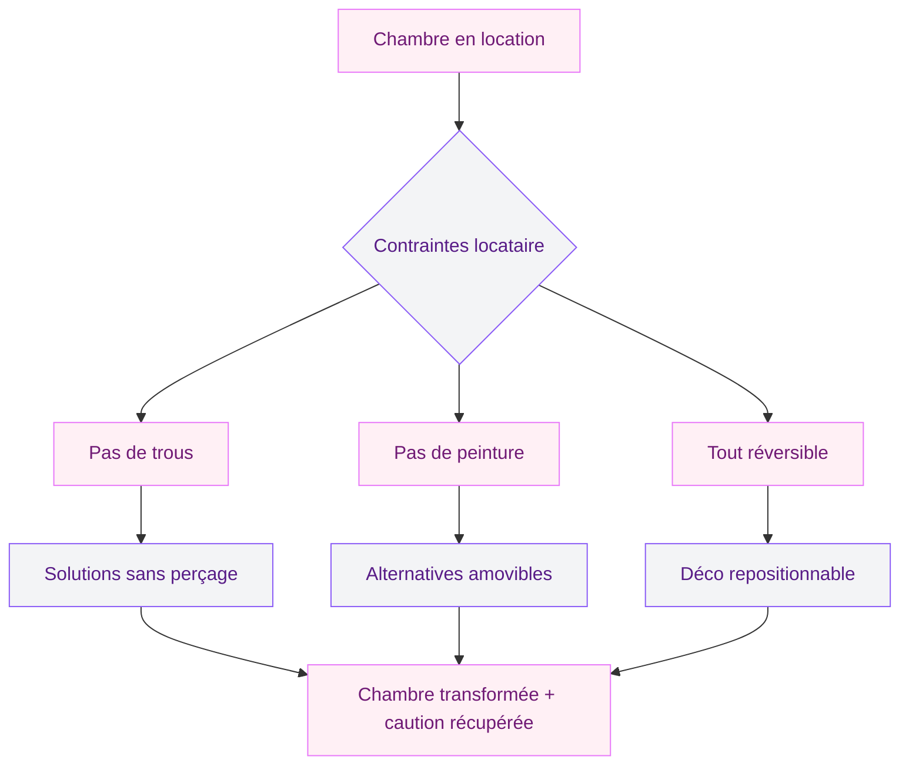
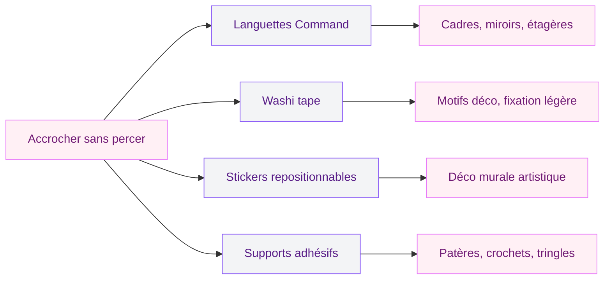

Quand j'ai emménagé dans mon premier appart en location, ma chambre avait des murs blanc sale, un lino grisâtre et zéro charme. Le proprio m'avait bien fait comprendre : "Pas de trou, pas de peinture, on rend tout comme c'est." J'ai passé trois mois à dormir dans cette ambiance déprimante avant de réaliser qu'il existait des dizaines de solutions réversibles pour tout changer.

Depuis, j'ai décoré cinq chambres en location. Chaque fois, j'ai récupéré ma caution intégralement. Et chaque fois, mes amis me demandaient si j'étais propriétaire. Tu veux le même résultat ? Voici mes 12 idées testées, avec des prix réels et des marques que tu connais.

## Pourquoi c'est possible (et plus simple que tu crois)

Le marché de la déco réversible a explosé ces dernières années. Les marques ont compris que 40 % des Français sont locataires et veulent quand même un intérieur qui leur ressemble. Résultat : des solutions sans perçage, sans colle forte, sans dégât - à des prix accessibles.

D'après les données de SeLoger, une transformation de chambre en location revient en moyenne à moins de 1 000 euros tout compris. Et avec mes astuces, tu peux descendre largement sous les 500 euros.

## 1. Le washi tape pour habiller tes murs

Le washi tape, c'est ce ruban adhésif décoratif venu du Japon qui se colle et se décolle sans laisser de trace. Tu peux créer des motifs géométriques, encadrer un mur accent, dessiner une fausse tête de lit ou souligner une ligne de meubles.

Mes préférés : les rouleaux chez Sostrene Grene (2-4 euros pièce) et les versions larges chez Amazon (lot de 12 rouleaux pour 10-15 euros). Le doré et le noir rendent très bien sur un mur blanc.

**Idée concrète** : trace un grand losange ou un rectangle au-dessus de ton lit avec du washi tape doré. Ca crée un faux cadre mural en cinq minutes, et ça se retire en dix secondes le jour du départ.

## 2. Les cimaises Command pour accrocher sans percer

Les languettes adhésives Command de 3M sont la meilleure invention pour les locataires. Elles tiennent jusqu'à 7 kg selon le modèle, se retirent sans abîmer le mur, et coûtent entre 5 et 12 euros le lot.

Tu peux accrocher des cadres, des miroirs légers, des petites étagères, des patères. J'utilise les "Command Strips" grandes tailles depuis des années et je n'ai jamais eu un seul accident.

> [!TIP]
> Nettoie le mur à l'alcool ménager avant de coller tes languettes Command. La graisse et la poussière réduisent l'adhérence de moitié. Et respecte bien le temps de pression (30 secondes minimum) avant d'accrocher quoi que ce soit.

## 3. Une tête de lit amovible qui change tout

La tête de lit, c'est la pièce centrale de ta chambre. En location, tu ne peux pas en visser une au mur - mais tu as plein d'alternatives.

**Option tissu suspendu** : une tringle à rideau posée en haut du mur (avec des supports adhésifs Command) et un beau tissu en lin ou en velours qui tombe derrière le lit. Budget : 15-30 euros chez IKEA ou Mondial Tissus.

**Option panneau posé** : un grand panneau de bois MDF recouvert de mousse et de tissu, simplement calé entre le lit et le mur. C'est la méthode que j'utilise chez moi - pas un seul trou, et le résultat fait pro. Budget : 25-50 euros en fournitures.

**Option macramé** : une grande suspension en macramé accrochée avec un crochet adhésif. Parfait pour un style boho chic qui apporte de la texture et de la chaleur. Chez Maisons du Monde ou sur Etsy, compte 20-40 euros.

## 4. Les textiles : ton levier déco le plus puissant

Les textiles sont le moyen le plus rapide de personnaliser une chambre. Aucun trou, aucun dégât, un effet immédiat. En location, c'est ton meilleur allié.

**Le linge de lit** donne le ton de la pièce. Un ensemble en lin lavé couleur naturelle ou en percale de coton blanc cassé transforme l'ambiance. IKEA propose la gamme DYTAG en lin mélangé à partir de 30 euros. La Redoute Interieurs vend des parures en percale à 35-45 euros en soldes.

**Les coussins** ajoutent du relief. Trois coussins dépareillés dans ta palette de couleurs (beige, blanc crème, terracotta ou vert olive), c'est la touche magazine. Chez Action : 3-8 euros pièce. Chez H&M Home : 8-15 euros.

**Un jeté de lit** posé en bout de lit ou sur un fauteuil apporte la couche finale. Le plaid INGABRITTA d'IKEA reste un classique à 15 euros.

Pour d'autres idées de transformation à petit prix, mon guide pour [décorer sa chambre avec peu d'argent](/guides/chambre/decorer-la-chambre-a-coucher-avec-peu-dargent/) détaille des astuces qui marchent aussi en location.

## 5. Un miroir pour agrandir et illuminer

Le miroir est le secret des petites chambres en location. Il double la lumière naturelle, agrandit visuellement l'espace et ajoute un vrai caractère déco.

**En appui contre le mur** : un grand miroir posé au sol, légèrement incliné contre le mur, ne demande aucune fixation. Les modèles LINDBYN chez IKEA (80x180 cm) tournent autour de 80 euros. Chez Action, tu trouves des miroirs plein pied à 15-25 euros.

**Accroché avec des languettes** : pour un miroir plus léger, les crochets adhésifs supportent jusqu'à 4-5 kg. Un miroir rond de 50 cm pèse rarement plus de 3 kg.

> [!NOTE]
> Place ton miroir face à une fenêtre ou à côté d'une source de lumière. Il va refléter et diffuser la clarté dans toute la pièce. Evite de le mettre face au lit - en feng shui comme en pratique, c'est moins reposant pour dormir.

## 6. Les plantes : du vert sans engagement

Les plantes transforment n'importe quel espace triste en coin vivant. Et elles ne laissent aucune trace sur les murs quand tu pars.

Les meilleures pour une chambre en location :
- **Pothos** : il pousse partout, même dans un coin sombre. Pose-le sur une étagère haute et laisse-le retomber. 5-8 euros en jardinerie.
- **Monstera deliciosa** : la star des intérieurs modernes. Elle adore la lumière indirecte. 15-25 euros en pot de 14 cm.
- **Sansevieria** : elle survit à tout, même à ton oubli d'arrosage pendant trois semaines. 6-10 euros chez IKEA.

Les cache-pots en osier (FLADIS chez IKEA, 13 euros) ou en papier kraft ajoutent une touche naturelle sans rien abîmer.

## 7. L'éclairage nomade pour créer l'ambiance

L'éclairage fait 50 % de l'atmosphère d'une chambre. En location, tu gardes le plafonnier du proprio (souvent moche), mais tu ajoutes des sources lumineuses mobiles qui changent tout.

**Guirlandes LED** : enroulées autour d'une tête de lit, posées sur une étagère ou accrochées au mur avec du washi tape. 3-8 euros chez Action ou IKEA.

**Lampes à piles ou rechargeables** : les lampes champignon rechargeables (15-25 euros sur Amazon) se posent partout sans fil. Parfaites sur une table de chevet ou une commode.

**Bougies LED** : l'ambiance sans le risque incendie. Un lot de 3 bougies pilier LED coûte 8-12 euros chez Action et l'effet est très réaliste avec les mèches qui vacillent.

> [!WARNING]
> Les guirlandes lumineuses fixées avec des punaises laissent des petits trous visibles à l'état des lieux. Utilise du washi tape ou des clips adhésifs transparents pour les accrocher sans laisser de trace.

## 8. Les étagères sans perçage

Ca existe, et ca change la donne. Les étagères adhésives Command de 3M supportent jusqu'à 3 kg par languette - assez pour des cadres et des petits objets.

**Les étagères sur pied** ou les bibliothèques en échelle sont une alternative parfaite. Chez IKEA, l'étagère LERBERG coûte 15 euros et offre quatre niveaux de rangement. Tu y poses des livres, une plante, une bougie.

## 9. Du papier peint amovible pour un mur accent

Le papier peint repositionnable est une vraie révolution pour les locataires. Il se colle comme un sticker géant, se décolle proprement, et les motifs sont de plus en plus beaux.

Sur des sites comme Declik Deko ou Pixers, tu trouves des lés autocollants à partir de 25 euros le mètre carré. Pour un mur accent de 6-8 m2, compte 150-200 euros - c'est un investissement, mais tu peux le réutiliser dans ton prochain appart.

Les styles qui marchent : motifs tropicaux pour un esprit boho, terrazzo pour un look moderne, faux bois clair pour un effet scandinave.

## 10. Les rideaux pour structurer l'espace

Les rideaux ne servent pas qu'aux fenêtres. En location, ils deviennent des outils de transformation spatiale.

**Devant un placard ouvert** : un rideau masque un dressing improvisé et ajoute de la texture à la pièce. Une tringle extensible (8-12 euros chez IKEA) se fixe sans percer entre les montants du placard.

**En séparation de zone** : dans un studio ou une grande chambre, un rideau suspendu au plafond (avec des crochets adhésifs costauds) délimite un coin nuit.

**Aux fenêtres** : remplace les rideaux basiques du proprio par des modèles en lin naturel qui filtrent la lumière. Tu remets les anciens le jour du départ. Chez IKEA, les rideaux AINA en lin coûtent 30 euros la paire.

## 11. La déco murale sans trous

Envie de cadres, d'affiches, de photos aux murs ? Pas besoin de percer.

**Les affiches encadrées** s'accrochent avec les languettes Command (lot de 8 pour 6-8 euros). Tu peux créer un vrai mur galerie au-dessus du lit ou du bureau.

**Les stickers muraux** haut de gamme (pas ceux pour enfants) imitent des motifs floraux, des formes abstraites ou des phrases en lettrage. Chez Lilipinso ou Declik Deko, compte 15-35 euros pour un set complet.

**Les cartes postales et photos** se fixent avec du masking tape coloré ou des pinces en bois collées au mur. Simple, beau, personnel.

Pour suivre les tendances actuelles et choisir un style cohérent, jette un oeil à mon guide sur les [tendances chambre 2026](/guides/chambre/decoration-de-la-chambre-a-coucher-2026-tendances-et-photos/).

## 12. Le tapis pour délimiter et réchauffer

Un tapis posé au sol ne demande aucune installation et change radicalement le ressenti d'une chambre. Il absorbe le bruit, réchauffe un sol froid (surtout en location avec du carrelage ou du lino), et crée une zone visuelle définie.

**Au pied du lit** : un tapis en jute ou en coton tressé (30-60 euros chez IKEA ou Maisons du Monde) apporte de la matière et un côté boho chic très actuel.

**Sous le bureau** : un petit tapis moelleux protège le sol et délimite l'espace travail du coin nuit.

Les couleurs neutres - beige, crème, gris clair - s'intègrent partout. Et tu emportes ton tapis dans ton prochain logement.

> [!TIP]
> Investis dans un antidérapant sous ton tapis (5-8 euros chez Leroy Merlin). Ca évite que le tapis glisse sur le lino ou le parquet, et ca protège le sol de ton propriétaire - double bénéfice pour ta caution.

## Récap budget : une chambre transformée sans toucher aux murs

| Poste | Budget estimé |
|-------|--------------|
| Textiles (linge, coussins, plaid) | 50-90 euros |
| Tête de lit amovible | 15-50 euros |
| Eclairage nomade | 15-35 euros |
| Miroir | 15-80 euros |
| Plantes et cache-pots | 15-35 euros |
| Déco murale (cadres, languettes) | 15-40 euros |
| Tapis | 30-60 euros |
| Washi tape et petits accessoires | 10-25 euros |
| **Total** | **165-415 euros** |

Tu n'as pas besoin de tout faire d'un coup. Commence par les textiles et l'éclairage - c'est ce qui change le plus l'ambiance pour le moins d'argent. Le reste, tu l'ajoutes au fil des mois.

Et si ta chambre manque de lumière naturelle, mon guide sur les [chambres sans fenêtre](/guides/chambre/chambre-sans-fenetre/) regorge d'astuces pour compenser le manque de clarté. Pour trouver ta palette idéale, consulte aussi mon article sur [les couleurs pour une chambre adulte à deux teintes](/guides/chambre/les-meilleures-options-de-couleurs-pour-une-chambre-dadulte-a-deux-teintes/).

## FAQ

### Est-ce que je peux vraiment décorer sans perdre ma caution ?

Oui, à condition de n'utiliser que des solutions réversibles. Les languettes Command, le washi tape, le papier peint repositionnable et les meubles posés au sol ne laissent aucune trace quand tu les retires correctement. La clé : prends des photos de l'état initial le jour de ton emménagement. Si un doute persiste, demande l'accord écrit de ton propriétaire avant de coller quoi que ce soit.

### Quelles sont les meilleures marques pour la déco réversible ?

Les languettes Command de 3M sont la référence pour accrocher sans percer. Pour le washi tape, Sostrene Grene et MT Masking Tape offrent le meilleur choix. Côté papier peint amovible, Pixers et Declik Deko proposent des motifs variés et une qualité repositionnable fiable. Et pour les textiles, IKEA, H&M Home et La Redoute Interieurs ont des gammes accessibles.

### Combien de temps tiennent les languettes adhésives Command ?

En conditions normales (mur propre, pas d'humidité excessive), elles tiennent plusieurs années sans problème. J'en ai qui sont en place depuis trois ans dans ma chambre. Le poids maximum indiqué sur l'emballage est fiable - ne le dépasse pas. Pour les retirer, tire bien la languette vers le bas en suivant les instructions, et le mur restera intact.

### Comment choisir un style déco en location ?

Le style boho chic et le style moderne épuré sont les deux options les plus faciles en location. Le boho mise sur les textiles, les plantes, le macramé et les matériaux naturels - tout ca se pose et se déplace. Le moderne mise sur les lignes épurées, les couleurs neutres et quelques pièces fortes. Dans les deux cas, privilégie des couleurs neutres (beige, blanc, gris) comme base, et ajoute une ou deux couleurs d'accent (terracotta, vert olive, bleu pétrole).

### Que faire si mon propriétaire refuse toute modification ?

La loi autorise les locataires à aménager leur logement tant que les modifications sont réversibles et n'altèrent pas le bien. Un tapis, des rideaux, des meubles posés au sol et des cadres sur languettes adhésives ne constituent pas des modifications du logement. Si ton propriétaire s'oppose même à ca, montre-lui que tout est réversible - et garde les emballages des produits pour le prouver le jour de l'état des lieux de sortie.
