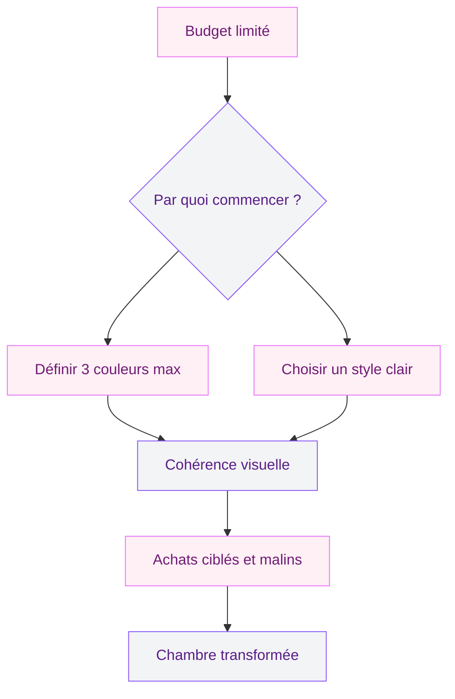
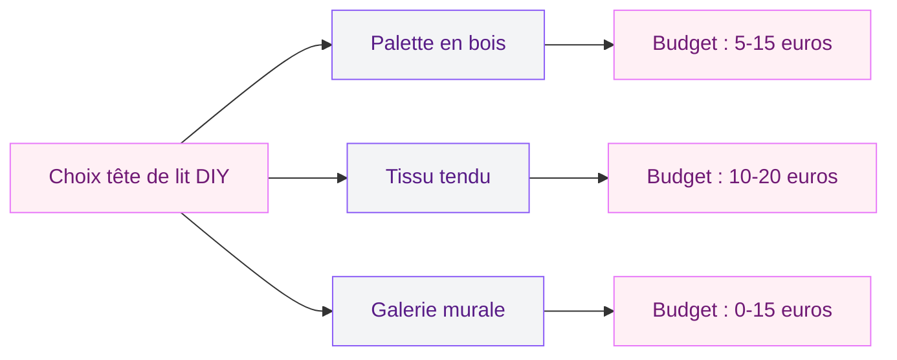
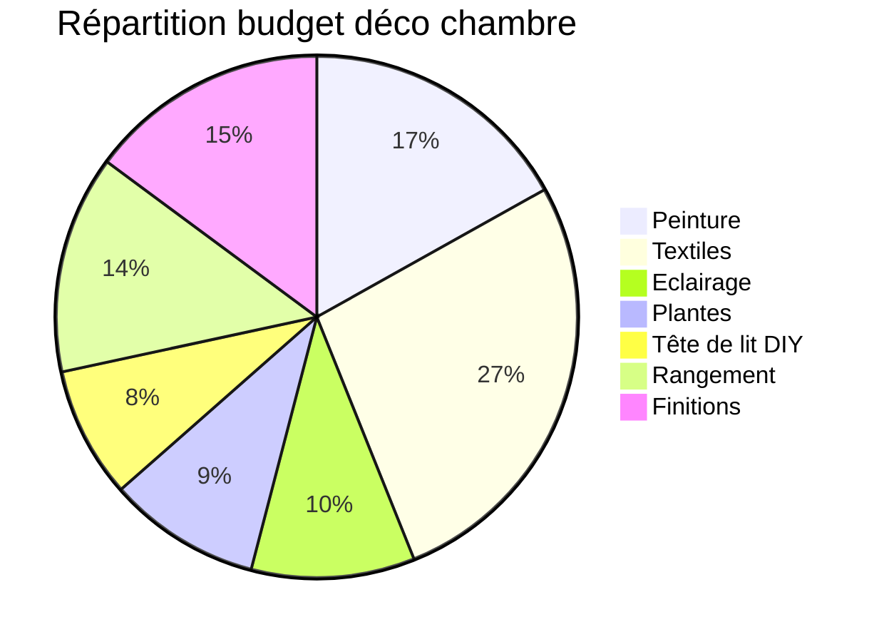

Tu rêves d'une chambre qui ressemble à quelque chose, mais ton compte en banque te rappelle à la réalité ? Je te comprends. J'ai vécu des années dans des chambres tristes parce que je pensais qu'il fallait un gros budget pour changer l'ambiance. En fait, pas du tout. Les transformations les plus bluffantes tenaient souvent à des détails pas chers - parfois même gratuits.

Voici huit astuces concrètes, avec des prix réels et des marques accessibles, pour que ta chambre devienne un vrai cocon sans exploser ta carte bleue.

## Le vrai secret d'une déco réussie à petit budget

Avant de foncer acheter quoi que ce soit, il faut comprendre un truc : ce n'est pas l'argent qui fait une belle chambre, c'est la cohérence. Un pot de peinture bien choisi à 25 euros fera plus d'effet qu'une commode Maisons du Monde à 400 euros posée dans une pièce où rien ne va ensemble.

La clé, c'est de choisir une direction et de s'y tenir. Trois couleurs maximum, un style clair, des matières qui se répondent. Avec ça, même des objets de récup donnent un résultat professionnel.

## Astuce 1 : un coup de peinture ciblé

C'est le meilleur rapport effort/résultat qui existe en déco. Tu n'as même pas besoin de peindre toute la pièce - un seul mur accent suffit à changer radicalement l'ambiance de ta chambre.

**Le mur derrière le lit**, c'est le plus logique. Il attire naturellement le regard quand tu entres dans la pièce, et il encadre ta tête de lit sans que tu aies besoin d'en acheter une.

Côté budget, voici ce que ça coûte pour un mur de 8 à 10 m2 :
- **Dulux Valentine** "Crème de couleur" : environ 25-30 euros le pot de 2,5 L, une couche suffit souvent
- **Tollens chez Castorama** : 20-28 euros le pot de 2,5 L selon la gamme
- **1825 chez Leroy Merlin** : 18-22 euros le pot, excellent rapport qualité-prix

Les couleurs qui marchent ? Vert sauge, bleu gris, rose poudré, terracotta doux. Ces teintes pardonnent les imperfections du mur et s'accordent avec à peu près tout. Pour approfondir, mon guide sur [les couleurs pour une chambre adulte à deux teintes](/guides/chambre/les-meilleures-options-de-couleurs-pour-une-chambre-dadulte-a-deux-teintes) te donnera plein d'idées.

> [!TIP]
> Avant d'acheter ton pot, demande un échantillon testeur (3-5 euros chez la plupart des enseignes). Applique-le directement sur le mur et observe-le à différentes heures de la journée. La lumière change tout.

## Astuce 2 : les textiles, ton arme secrète

Si tu devais investir dans un seul poste, c'est celui-là. Les textiles changent l'atmosphère en dix minutes, sans travaux et sans engagement.

**Le linge de lit d'abord.** Un beau drap en lin lavé ou en percale de coton donne immédiatement un air soigné. Mes bons plans :

- **IKEA gamme DYTAG** : housse de couette en lin mélangé à partir de 30 euros. Le tombé est très bien pour le prix.
- **La Redoute Interieurs** : collections en percale de coton souvent soldées autour de 35-45 euros le lot complet (housse + taies)
- **H&M Home** : des parures en coton lavé très correctes dès 25 euros

Ensuite, les coussins. Deux ou trois coussins dépareillés (mais dans ta palette de couleurs) posés devant tes oreillers, et ton lit ressemble à celui d'un magazine. Action et Primark en proposent entre 3 et 8 euros pièce.

Enfin, un plaid en bout de lit. C'est le détail qui fait "chambre d'hôtel" sans effort. Chez IKEA, le plaid INGABRITTA tourne autour de 15 euros et il est vraiment beau.

> [!NOTE]
> Les matières naturelles (lin, coton, laine) vieillissent mieux que le polyester. Elles se froissent un peu, oui, mais c'est ce froissé qui donne le côté "vécu" et chaleureux. Le polyester reste lisse mais attire les peluches et la statique.

## Astuce 3 : détourner ce que tu as déjà

Regarde autour de toi avant de foncer en magasin. Tu serais surprise de ce qu'on peut faire avec du mobilier existant et un peu de créativité.

**Ta vieille commode un peu moche ?** Un coup de peinture, des boutons neufs (2-5 euros les 6 chez Action ou Amazon), et c'est un autre meuble. La peinture pour meuble Rust-Oleum "Chalky finish" coûte environ 12 euros le pot de 750 mL - assez pour transformer un meuble complet sans poncer.

**Tes cadres dépareillés ?** Peins-les tous de la même couleur (blanc, noir ou doré) et regroupe-les en gallery wall. Effet garanti, coût quasi nul si tu as un fond de peinture qui traîne.

**Un escabeau en bois ?** Posé à côté du lit, il fait une table de chevet hyper tendance avec ses étagères naturelles pour poser un livre, un verre d'eau, une petite plante.

**De vieux bocaux ?** Nettoyés et garnis d'une guirlande lumineuse (3-5 euros chez Action), ils deviennent des lampes d'ambiance magnifiques.

## Astuce 4 : la lumière qui change tout

L'éclairage, c'est le truc le plus sous-estimé en déco chambre. Un plafonnier central qui crache une lumière blanche, c'est l'ambiance salle d'attente garantie. On va corriger ça sans gros travaux.

**Multiplie les sources lumineuses.** Au moins trois points de lumière : un éclairage principal (ton plafonnier), un éclairage de lecture (lampe de chevet), et un éclairage d'ambiance (guirlandes, bougies LED).

Budget malin pour l'éclairage :
- **Guirlande lumineuse LED** (Action, IKEA) : 3-8 euros. A enrouler autour d'une tête de lit, poser sur une étagère ou accrocher au mur.
- **Lampe de chevet basique** (IKEA LAMPAN) : 6 euros. Change l'ampoule pour une LED blanc chaud (2700K), et le rendu est très agréable.
- **Bandeau LED autocollant** : 8-15 euros pour 5 mètres chez Amazon. Collé derrière la tête de lit ou sous une étagère, il crée un halo indirect vraiment beau.

> [!TIP]
> Remplace toutes les ampoules de ta chambre par des LED blanc chaud (2700K). L'effet est immédiat : tout paraît plus doux, plus enveloppant. Un lot de 6 ampoules LED coûte autour de 8-12 euros.

## Astuce 5 : les plantes, du vivant pour zéro stress

Une ou deux plantes bien placées transforment n'importe quelle chambre. Elles apportent de la couleur, de la texture, et elles purifient l'air - tout ça pour quelques euros.

Les meilleures plantes pour une chambre :
- **Pothos** (lierre du diable) : quasi unkillable, il pousse même dans un coin sombre. 5-8 euros en jardinerie.
- **Sansevieria** (langue de belle-mère) : supporte l'oubli d'arrosage comme personne. 6-10 euros chez IKEA ou Truffaut.
- **Aloe vera** : joli, utile, et très facile. 4-7 euros en pot basique.

L'astuce pour que ça fasse encore mieux : regroupe tes plantes à différentes hauteurs. Une sur l'étagère, une au sol dans un cache-pot en osier, une petite sur la table de chevet. Et les cache-pots, tu n'as pas besoin de les acheter neufs - un panier en osier de brocante ou un sac en papier kraft roulé sur lui-même font très bien l'affaire.

## Astuce 6 : créer une tête de lit sans se ruiner

La tête de lit, c'est la pièce maîtresse visuelle de la chambre. Et bonne nouvelle : tu peux en fabriquer une pour trois fois rien.

**Option palette** : récupère une palette en bois (souvent gratuit devant les commerces ou sur Leboncoin), ponce-la légèrement, passe une couche de lasure ou de peinture, et fixe-la au mur derrière ton lit. Budget total : 5-15 euros de fournitures.

**Option tissu** : tends un coupon de tissu (5-10 euros le mètre chez Mondial Tissus) sur un cadre en tasseaux, ou suspends-le à une tringle fixée au-dessus du lit.

**Option galerie** : accroche une série de cadres ou cartes postales derrière le lit pour créer un mur-galerie qui fait office de tête de lit. Les impressions, tu les trouves gratuites sur Unsplash ou tu imprimes tes propres photos.

## Astuce 7 : le rangement visible comme déco

Le désordre, c'est l'ennemi numéro un d'une chambre qui a du style. Et le rangement, quand c'est bien fait, ça devient un élément déco à part entière.

**Les étagères ouvertes** sont tes meilleures alliées. Une planche en bois sur deux équerres (10-15 euros chez Leroy Merlin) crée un espace d'exposition. Poses-y deux-trois livres, une bougie, une petite plante - ni plus ni moins.

**Les paniers en osier ou en jute** cachent le bazar tout en étant jolis. Chez Action : 3-6 euros. Chez IKEA, la gamme FLADIS est un classique à 13 euros. Glisse-les sous le lit ou empile-les dans un coin.

**Les boîtes coordonnées** font aussi le job. Prends-les dans la même couleur pour garder la cohérence. Chez Flying Tiger, tu trouves des séries en carton kraft pour 2-5 euros pièce.

Si tu veux aller plus loin sur le rangement, j'ai un guide complet sur [comment ranger sa chambre](/guides/chambre/ranger-chambre) avec des méthodes durables qui marchent vraiment.

> [!WARNING]
> La tentation quand on a un petit budget, c'est de multiplier les petites bricoles déco. Résiste. Trop d'objets sur les étagères donne un effet fouillis qui annule tout l'effort. La règle : 3 objets maximum par zone d'exposition.

## Astuce 8 : les petits détails qui font la différence

Les finitions, c'est ce qui sépare une chambre "bof" d'une chambre où on a envie de rester. Et ces détails ne coûtent presque rien.

**Les poignées de meuble.** Changer les boutons d'une commode prend cinq minutes et transforme visuellement le meuble. Chez Leroy Merlin ou Amazon, tu trouves des lots de poignées en laiton ou céramique entre 8 et 15 euros les 6.

**Un miroir bien placé.** Il agrandit la pièce et reflète la lumière. Les brocantes et Emmaüs regorgent de miroirs anciens pour 5-20 euros. Accroche-le face à une source de lumière pour amplifier l'effet.

**Un tapis.** Poser les pieds sur un tapis doux en sortant du lit le matin, ça fait démarrer la journée autrement. Chez IKEA, le tapis TOFTLUND (fausse peau de mouton) coûte 9 euros et il est parfait à côté du lit.

## Récap : combien ça coûte au total ?

Budget réaliste pour transformer ta chambre :

| Poste | Budget estimé |
|-------|--------------|
| Peinture mur accent | 20-30 euros |
| Linge de lit neuf | 25-45 euros |
| Coussins (x3) | 9-24 euros |
| Plaid | 10-15 euros |
| Eclairage d'ambiance | 10-20 euros |
| Plantes (x2) | 10-18 euros |
| Tête de lit DIY | 5-20 euros |
| Rangement (paniers, étagère) | 15-25 euros |
| Petits détails (miroir, poignées, bougie) | 15-30 euros |
| **Total** | **119-227 euros** |

Pour 120 à 230 euros, tu peux avoir une chambre complètement différente. Et en ne gardant que les postes qui te parlent le plus, tu descends sous les 80 euros.

## Les erreurs à éviter quand on décore petit budget

**Acheter par impulsion** parce que "c'est pas cher." Un objet à 2 euros qui ne va avec rien, c'est 2 euros gaspillés et du bazar en plus. Avant chaque achat, pose-toi la question : "Avec quoi ça va dans ma chambre ?"

**Copier un intérieur Pinterest sans l'adapter.** Cette chambre bohème baigne dans la lumière naturelle d'un loft parisien. Si ta chambre fait 10 m2 avec une fenêtre au nord, le résultat sera très différent. Adapte les idées à ton espace réel.

**Oublier le désencombrement.** Décorer une chambre encombrée, c'est mettre du vernis sur un ongle cassé. Commence par vider et trier, comme je l'explique dans mon guide sur [le rangement de la chambre](/guides/chambre/ranger-chambre).

> [!IMPORTANT]
> Le meilleur investissement déco, c'est le tri. Sortir 20 objets qui traînent transforme ta chambre plus sûrement que d'en ajouter 5 neufs. Et ça ne coûte rien.

Si tu veux explorer d'autres styles pour ta chambre, jette un oeil à mon article sur [la déco terracotta en chambre](/guides/chambre/deco-terracotta-chambre) - c'est un style chaleureux qui fonctionne très bien avec un budget serré. Et pour les tendances plus globales, le guide des [tendances chambre 2026](/guides/chambre/decoration-de-la-chambre-a-coucher-2026-tendances-et-photos) t'aidera à repérer ce qui va durer.

## FAQ

### Quel budget minimum pour décorer une chambre ?

Avec 50 euros, tu peux déjà changer l'ambiance de ta chambre. Concentre-toi sur la peinture d'un mur accent (20-30 euros) et un jeu de housses de coussins neuves (10-20 euros). Ajoute quelques bougies et une plante, et l'effet est déjà là. Le reste, tu le fais avec ce que tu as déjà chez toi en réorganisant et en détournant.

### Comment faire une belle déco chambre sans rien acheter ?

Commence par désencombrer - retire tout ce qui n'a pas sa place. Réorganise tes meubles : parfois, juste déplacer le lit change la perspective de la pièce. Regroupe tes cadres en gallery wall, utilise des bocaux comme vases, et plie ton linge de lit façon hôtel. Un vieux miroir de famille peut devenir la pièce forte de ta chambre.

### Le DIY, c'est vraiment plus économique que d'acheter tout fait ?

Dans 90 % des cas, oui. Une tête de lit en palette revient à 5-15 euros contre 80-200 euros en magasin. Des cadres repeints coûtent le prix du pot de peinture (12 euros) quand les neufs chez Maisons du Monde sont à 15-30 euros pièce. Le seul investissement, c'est ton temps.

### Quelles couleurs choisir pour une chambre à petit budget ?

Les couleurs claires et douces sont les plus faciles à travailler. Blanc cassé, beige chaud, vert sauge, bleu grisé ou rose poudré - ces teintes se marient entre elles et s'accordent avec la plupart des meubles que tu as déjà. Evite les couleurs trop vives ou trop sombres qui demandent souvent deux couches de peinture.

### Où acheter de la déco chambre pas chère ?

Mes adresses préférées : **Action** pour les bougies, cadres, paniers et petits accessoires (1-8 euros). **IKEA** pour les textiles, plantes et solutions de rangement (5-30 euros). **Emmaüs et les brocantes** pour les miroirs, cadres anciens et petits meubles à relooker (3-20 euros). **La Redoute** en période de soldes pour le linge de lit. Et **Amazon** pour les guirlandes LED, bandeaux lumineux et lots de poignées de meuble.
