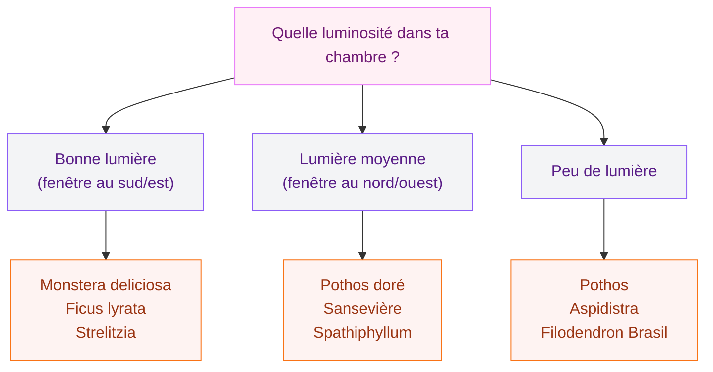
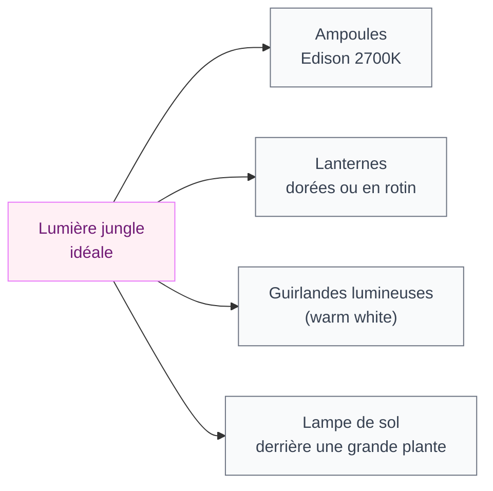

Tu rêves de te réveiller dans un cocon végétal, entouré de feuilles, de matières chaudes et d'une ambiance un peu sauvage ? La déco jungle, c'est exactement ça : une chambre qui respire, qui vit, qui te donne l'impression d'être ailleurs à chaque matin. Et contrairement à ce qu'on pourrait croire, pas besoin d'un budget pharaonique ni d'un appartement avec des plafonds de 3 mètres. Je vais te montrer comment créer cette atmosphère tropicale chez toi, étape par étape.

## Comprendre l'esprit jungle avant de commencer

Le style jungle, ce n'est pas juste mettre des plantes partout et espérer que ça ressemble à quelque chose. C'est une vraie direction déco qui joue sur plusieurs registres en même temps : la couleur, les matières, la lumière et bien sûr la végétation. L'objectif, c'est de recréer la sensation d'un espace luxuriant, dense mais apaisant, où la nature reprend ses droits.

  

Ce qui distingue la jungle de la simple "chambre avec des plantes", c'est la cohérence. Chaque élément parle le même langage : bois brut, rotin, lin, teintes de vert profondes, et une touche d'animal print pour le piquant. Ça forme un tout organique et chaleureux.

> [!NOTE]
> Le style jungle se décline en plusieurs variantes : jungle tropicale (chaude, colorée, plantes larges), jungle urbaine (plus graphique, noir et blanc), et jungle bohème (superposition de textiles, esprit vagabond). Choisis celle qui colle à ta personnalité.

## Les couleurs : la base de tout

  

### Les verts, évidemment

Le vert est la couleur reine de ce style, mais attention : pas n'importe lequel. On oublie le vert pomme et le vert menthe, trop froids et synthétiques. Les teintes qui fonctionnent vraiment :

- **Vert forêt** (type Farrow & Ball "Vert de Terre", autour de 18-20€ le litre) pour les murs principaux
- **Vert kaki** ou **vert olive** pour les textiles et accents
- **Vert émeraude** en touche sur les coussins ou une lampe

Chez Leroy Merlin, la gamme V33 propose des verts jungle très bien fichés entre 12 et 15€ le litre. Pour une chambre de 12m², compte deux litres en deux couches sur un mur accent.

### Les couleurs qui accompagnent le vert

Le vert seul, ça peut vite devenir étouffant. Il se marie parfaitement avec :

- Le **terracotta** pour réchauffer l'ensemble (d'ailleurs, si tu aimes ce jeu de couleurs, jette un oeil à notre article sur la [déco terracotta chambre](/deco-terracotta-chambre/))
- Le **beige chaud** et le **crème** pour les fonds neutres
- Le **noir mat** pour structurer et apporter du graphisme
- Les **tons ocre** et **moutarde** en petites touches

> [!TIP]
> Si tu n'oses pas peindre tous tes murs en vert, commence par un seul mur - idéalement le mur derrière le lit. Utilise les murs restants en blanc cassé ou beige très clair. L'effet est immédiat et tu peux toujours aller plus loin si tu veux.

## Le papier peint : la solution express pour une transformation radicale

Le papier peint jungle, c'est le raccourci magique. Une seule pose et tu as une ambiance complète. Les modèles qui carburent en ce moment :

  

**Papier peint à motifs botaniques** : grandes feuilles de monstera, fougères, palmiers. IKEA propose le "TYSKA BONDBÖNA" à 35€ les 10m², idéal pour un mur en panoramique. Pour du plus haut de gamme, Maisons du Monde a une collection jungle magnifique entre 40 et 65€ le rouleau.

**Papier peint panoramique** : format photo sur tout un mur, généralement de 90 à 200€ selon les dimensions. Papier peint Décor propose des forêts tropicales photorealistiques vraiment bluffantes.

**Le papier peint noir et blanc** façon gravure botanique : parfait pour la jungle urbaine, plus sobre, apporte du caractère sans écraser la pièce.

## Les plantes : l'âme de ta jungle

Sans plantes, il n'y a pas de jungle. Mais choisir les bonnes espèces change tout, surtout dans une chambre où la luminosité est souvent limitée.

  

**Mes coups de coeur pour la chambre jungle :**

- **Le monstera** : la plante emblématique du style. Un beau specimen chez Jardiland tourne autour de 20-40€ selon la taille. Ses grandes feuilles découpées font toute la déco à elles seules.
- **Le pothos** : impossible à tuer, il chute magnifiquement d'une étagère ou grimpe sur un treillis. Environ 8-12€ en jardinerie ou 5-6€ chez Lidl ou Aldi quand ils en ont.
- **La peperomia** : plante compacte parfaite pour une table de nuit. La [Peperomia Hope](/la-peperomia-hope/) est particulièrement facile à entretenir et a de petites feuilles rondes très mignonnes.
- **Le ficus lyrata** : le grand arbre statement de la décoration. Prévoir entre 40 et 120€ selon la taille. Exigeant sur la lumière mais spectaculaire.
- **Le strelitzia** : aka l'oiseau de paradis. Grandes feuilles banane, look ultra tropical. Environ 25-50€.

> [!WARNING]
> Dans une chambre, évite les plantes qui dégagent des pollens allergènes (certains lys, ficaires). Et attention aux plantes toxiques si tu as des animaux : le monstera, le pothos et le dracaena sont toxiques pour les chats et les chiens. Place-les en hauteur hors de portée.

**Combien de plantes ?** Pour une chambre de 12m², vise 5 à 8 plantes de tailles variées : 1 ou 2 grandes (sol), 2 à 3 moyennes (étagères, commode) et quelques petites (table de nuit, rebord de fenêtre). L'effet de masse crée l'ambiance.

## Les matières naturelles : le toucher compte autant que le visuel

  

### Le bois et le rotin

Le bois brut ou clair est la base de la jungle. Évite les meubles très laqués ou ultra modernes : ils cassent l'ambiance. Préfère :

- Le **bois massif naturel** ou les effets bois lavé, blanchi
- Le **rotin** : tête de lit, chaise, miroir avec cadre en rotin. La Redoute a une belle sélection de têtes de lit en rotin de 80 à 200€.
- Le **bambou** : plateaux, étagères, porte-savons, cintres. Accessoires entre 5 et 25€ chez Nature & Découvertes ou IKEA.

### Les textiles

Le linge joue un rôle énorme dans l'ambiance jungle. Les options qui claquent :

- **Housse de couette à motifs botaniques** : feuilles, palmiers, fleurs tropicales. Primark propose des housse jungle autour de 20-25€, Maisons du Monde entre 40 et 80€.
- **Coussins en couleurs profondes** : vert émeraude, terracotta, ocre, brun
- **Tapis en fibres naturelles** : jute, sisal, coco. Idéal sous le lit ou en centre de pièce. Comptez 30 à 80€ pour un 120x170cm chez IKEA (LOHALS) ou La Redoute.
- **Rideaux en lin naturel** : couleur chanvre, lin brut ou vert kaki. Évite le blanc pur qui casse la chaleur.

### Le macramé et les suspensions végétales

Les suspensions en macramé pour faire pendre tes plantes, les étagères en bois flottant, les paniers en osier pour cacher les cache-pots... Ces petits détails s'accumulent et créent une cohérence très forte. Budget : 5€ pour une suspension IKEA à 30€ pour un set de paniers en jonc.

## Les luminaires : l'éclairage change tout

Dans une chambre jungle, on bannit le néon blanc froid. On veut de la chaleur, des teintes ambrées, des effets doux.

Les ampoules Edison à filament sont tes meilleures alliées : elles donnent une lumière chaude et dorée qui sublime les plantes et les matières naturelles. IKEA en vend à partir de 3-4€ pièce.

Une lampe de sol placée derrière un grand monstera ou un strelitzia crée des ombres de feuilles sur le mur - effet garanti, les gens font toujours le tour avec leur téléphone pour photographier ça.

## Les motifs animaux et graphiques : la touche sauvage

Le style jungle, c'est aussi la faune. Pas besoin de couvrir ton lit de léopard (sauf si tu veux), mais quelques touches animal print bien dosées apportent ce petit quelque chose de vivant et de sensuel.

**Ce qui marche bien :**
- Un coussin zèbre ou léopard dans des tons neutres (blanc/noir ou terracotta)
- Un tableau ou une affiche représentant un oiseau tropical, un tigre, un flamant (avec un cadre en bois naturel)
- Un plaid à motifs graphiques inspirés de la savane

**Ce qui fait trop :**
- Tout le linge de lit en léopard
- Faux animaux empaillés ou déco "safari kitch"
- Mélanger trop de motifs animaux différents

> [!TIP]
> La règle des trois : dans ta chambre jungle, pas plus de trois types de motifs différents en même temps. Par exemple : grandes feuilles (papier peint), animal print (coussin), et géométrique naturel (tapis). Au-delà, c'est le chaos visuel.

## Mettre en scène : l'art de la superposition

Ce qui donne l'effet "wow" dans une chambre jungle, c'est la densité et la superposition. Pas de murs nus, pas de surfaces vides, mais tout ça avec de l'ordre.

**La tête de lit :**
Derrière le lit, crée une vraie composition : papier peint ou mur peint en vert foncé, branches séchées avec des guirlandes lumineuses, tableau botanique encadré. La [déco chambre Harry Potter](/deco-chambre-harry-potter/) use du même principe de scénographie dense et immersive - c'est inspirant même si l'univers est différent.

**Le coin "jungle corner" :**
Choisis un angle de ta chambre et densifie : 2-3 plantes de hauteurs variées, une lampe de sol, un panier en osier, une étagère murale avec des petites plantes et des livres. Ce coin devient le coeur vivant de ta pièce.

**Les étagères :**
Mélange plantes, livres à couverture colorée, petits objets naturels (pierres, coquillages, bouts de bois), quelques minuscules pots. Pas de symétrie parfaite : le désordre organisé donne l'impression que tout a poussé naturellement.

## Budget : combien ça coûte vraiment ?

Pour transformer une chambre standard en chambre jungle, voilà des budgets réalistes :

| Poste | Budget serré | Budget confort |
|---|---|---|
| Peinture (1 mur) | 15-20€ | 30-50€ |
| Papier peint (1 mur) | 30-50€ | 80-150€ |
| Plantes (5-8 pièces) | 40-70€ | 100-200€ |
| Textiles (couette, coussins, tapis) | 60-100€ | 150-300€ |
| Luminaires | 20-40€ | 60-120€ |
| Accessoires (paniers, cadres, rotin) | 30-50€ | 80-150€ |
| **Total** | **195-330€** | **500-970€** |

La bonne nouvelle : les plantes et les textiles s'achètent au fur et à mesure. Tu peux commencer avec juste la peinture et deux plantes, et densifier progressivement.

> [!IMPORTANT]
> Achète tes plantes en plusieurs fois plutôt que toutes d'un coup. Ça permet d'apprendre à connaître chaque espèce, de voir comment elles s'adaptent à ta chambre (luminosité réelle, humidité), et d'ajuster sans te retrouver avec 8 plantes mourantes en même temps.

## Les erreurs à éviter

**Trop de plantes de la même taille** : varier les hauteurs est aussi important que la quantité. Mix d'une grande plante au sol, des moyennes sur meubles et de petites en suspension.

**Vert partout de la même teinte** : le vert foncé des murs + le vert moyen des plantes + le vert kaki des textiles = profondeur et naturalisme. Un seul vert, c'est plat.

**Oublier les matières** : une chambre jungle avec des meubles en MDF blanc laqué perd 80% de son âme. Le bois, le rotin, le lin, c'est ce qui porte l'ambiance.

**Négliger le rangement** : la jungle luxuriante, oui, mais le bordel non. Prévois des corbeilles, des paniers, des étagères pour que tout ait sa place. Une chambre jungle bien rangée, c'est une forêt entretenue - pas un fourré.

## Pour aller plus loin

Si tu veux approfondir tes idées de déco chambre au-delà du style jungle, notre article sur les [tendances décoration chambre 2026](/decoration-de-la-chambre-a-coucher-2026-tendances-et-photos/) te donnera une vision plus large de ce qui se fait en ce moment.

La chambre jungle est un style vivant, au sens propre. Elle évolue avec tes plantes qui grandissent, avec les saisons, avec les nouvelles pièces que tu ajoutes. C'est ce qui en fait un style aussi attachant : ta chambre ne sera jamais tout à fait terminée, et c'est très bien comme ça.

---

## Sur le meme theme

- [déco pop chambre](/guide-pour-une-deco-pop-dans-la-chambre-a-coucher/)

## Questions fréquentes

**Quelles plantes pour une chambre jungle sans lumière ?**
Le pothos, le sansevière et le zamioculcas sont tes meilleurs alliés pour les chambres sombres. Ils survivent à presque tout et gardent un look tropical très satisfaisant.

**Le style jungle convient-il à une petite chambre ?**
Oui, à condition de ne pas surcharger. Dans une petite chambre (moins de 10m²), limite-toi à 3-4 plantes et mise tout sur un seul mur fort (papier peint ou peinture). Les autres surfaces restent légères pour ne pas étouffer l'espace.

**Comment entretenir une chambre jungle au quotidien ?**
10 minutes par semaine suffisent : vérifier l'humidité des terres, dépoussiérer les grandes feuilles avec un chiffon humide, retirer les feuilles mortes. Une fois par mois, un tour complet avec de l'engrais liquide pendant la période de croissance (avril à septembre).

**Peut-on faire style jungle avec un petit budget ?**
Absolument. Récupère des plantes chez des amis (bouturage gratuit !), shoppe les textiles à motifs végétaux chez Primark ou en soldes, et peins juste un mur au lieu de tout. L'effet est là pour moins de 100€ si tu joues bien tes cartes.
