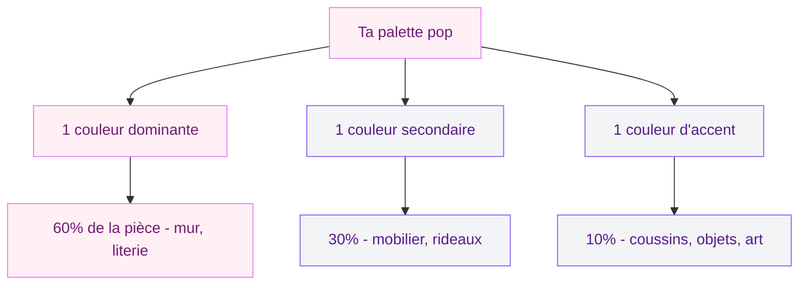
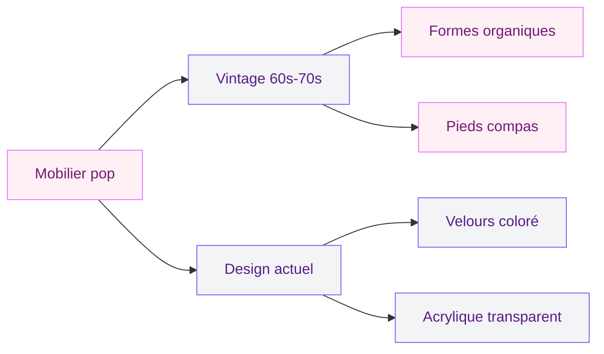
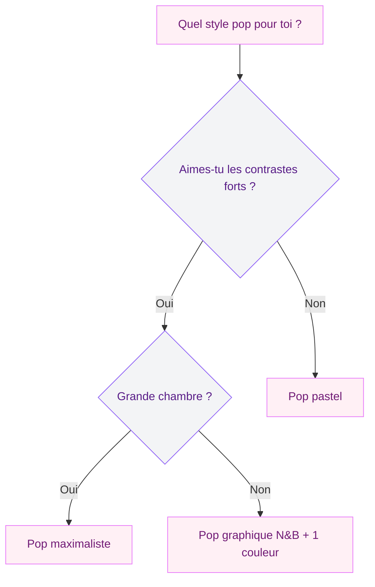

Tu en as marre du beige, du blanc cassé et du "ton sur ton neutre" ? Tu veux une chambre qui te met de bonne humeur dès le réveil, avec des couleurs franches, des motifs audacieux et une énergie qui te ressemble ? Bienvenue dans la déco pop. Ce style né du mouvement Pop Art des années 60 n'a jamais été aussi pertinent : en 2026, les palettes vives et les contrastes assumés font un retour en force dans les intérieurs.

Je vais te montrer comment créer une chambre pop qui a du caractère sans tomber dans le bazar multicolore. Couleurs, mobilier, murs, textiles, budget - on passe tout en revue.

## Le style pop, c'est quoi au juste ?

Le Pop Art, c'est Andy Warhol, Roy Lichtenstein, les boites de soupe Campbell's en couleurs flashy et les portraits de Marilyn Monroe en sérigraphie. Ce mouvement artistique des années 1960 a transformé la culture populaire en art. En déco, ça se traduit par des couleurs vives, des motifs graphiques, des contrastes forts et un côté joyeux qui refuse de se prendre au sérieux.

  

Mais attention : une chambre pop en 2026, ce n'est pas un musée rétro. C'est un mélange entre l'énergie du Pop Art et un côté contemporain, avec des matières actuelles et une vraie réflexion sur l'équilibre des teintes. L'idée, c'est de doser l'intensité pour que ta chambre reste un endroit où tu dors bien, pas une boite de nuit.

> [!NOTE]
> Le style pop fonctionne dans toutes les tailles de chambres. En petit espace, concentre les couleurs vives sur un mur et les accessoires. En grand espace, tu peux être plus généreuse sur les aplats de couleurs et le mobilier statement.

## La palette de couleurs : le coeur de ta chambre pop

C'est LA question centrale. En déco pop, la couleur n'est pas un détail - c'est le sujet principal.

  

### Les couleurs stars du style pop

- **Rose fuchsia** : la teinte signature du pop moderne. Pas un rose poudré, un vrai rose franc, joyeux et assumé
- **Jaune citron** : solaire, punchy, il apporte une énergie instantanée
- **Bleu électrique** : profond mais vif, il structure et dynamise
- **Rouge vermillon** : le classique Warhol, à utiliser en accent
- **Vert pomme** : frais et décalé, parfait en petites touches
- **Orange vif** : la couleur qui réchauffe tout (si tu aimes l'orange en déco, jette un oeil à notre guide sur les [couleurs compatibles avec l'orange](/couleurs-compatibles-avec-lorange-pour-les-murs-et-la-decoration/))

### Comment doser sans que ça devienne un arc-en-ciel

C'est là que beaucoup de gens se plantent. Le piège, c'est de vouloir mettre toutes les couleurs d'un coup et de finir avec une chambre qui donne le tournis. La règle d'or : **3 couleurs maximum**.

Concrètement, ça donne quoi ? Imaginons une chambre pop rose et bleu :

- **Dominante (60%)** : murs blanc pur ou gris très clair - oui, la base reste neutre pour laisser respirer les couleurs
- **Secondaire (30%)** : rose fuchsia sur la tête de lit, la housse de couette, les rideaux
- **Accent (10%)** : bleu électrique sur les coussins, un cadre, un vase

> [!TIP]
> Mon astuce perso : garde toujours tes murs en base neutre (blanc, gris perle, noir mat) et injecte la couleur par les textiles et la déco. C'est 100 fois plus simple à changer si tu te lasses, et ça revient bien moins cher qu'une repeinture.

## Les murs : la toile de fond de ta déco pop

  

### Option 1 : le mur accent en couleur franche

Un seul mur peint dans une couleur pop franche, de préférence le mur derrière le lit. Chez Leroy Merlin, un pot de 2,5L en rose fuchsia (gamme Luxens) coûte environ 28 euros. Pour un mur de 8 m², tu en as assez en deux couches. Le reste de la pièce reste en blanc ou gris clair pour créer le contraste.

### Option 2 : le papier peint pop graphique

C'est l'option qui transforme tout instantanément. Un papier peint à motifs géométriques colorés, à gros pois ou à bandes multicolores, posé sur un mur, ça ancre le style immédiatement. Chez Leroy Merlin, tu trouves des papiers peints graphiques pop entre 15 et 35 euros le rouleau. Pour un mur de 8 m², compte 3 rouleaux.

### Option 3 : la galerie de toiles pop art

Pas envie de toucher aux murs ? Crée un mur galerie avec des affiches et toiles pop art. Un ensemble de 3 à 5 impressions façon Warhol ou Lichtenstein, encadrées dans des cadres noirs ou blancs simples. Sur Etsy, tu trouves des sets de prints pop art entre 15 et 40 euros. Les cadres RIBBA chez IKEA font le job à 5 euros pièce.

> [!IMPORTANT]
> Pour un mur galerie réussi, choisis des oeuvres qui partagent la même palette de couleurs. Des impressions avec du rose, du bleu et du jaune vont créer une cohérence visuelle même si les sujets sont différents.

## Le mobilier : entre vintage et contemporain

Le style pop adore le mélange des époques. Meubles vintage des années 60-70 et pièces design actuelles cohabitent très bien.

  

### La tête de lit : la pièce star

En pop, la tête de lit est un vrai statement. Trois options qui marchent :

- **Tête de lit capitonnée en velours coloré** : rose, bleu roi ou jaune moutarde. Chez La Redoute (AM.PM), modèle Velto en velours à 299 euros. Chez IKEA, la structure IDANAS avec une housse colorée fait le travail pour 149 euros
- **Tête de lit DIY en panneaux colorés** : des panneaux de bois MDF peints en plusieurs couleurs pop, assemblés en patchwork. Budget : environ 50-80 euros de matériel
- **Pas de tête de lit classique** : un grand tableau pop art ou une fresque murale qui fait office de tête de lit

### Les meubles d'appoint

Cherche des formes arrondies et des couleurs vives. La chaise Tulip (ou ses reproductions) en rose ou jaune est un classique du pop. Chez Made.com, le fauteuil Lule en velours rose est à 349 euros. Si tu veux un budget plus doux, le fauteuil BUSKBO en rotin chez IKEA (99 euros) avec un coussin fuchsia fait très bien l'affaire.

Les tables de chevet en acrylique transparent ou en métal coloré ajoutent ce côté futuriste pop. Chez Maisons du Monde, tu trouves des tables de chevet en métal coloré autour de 89 euros.

## Les textiles : où la couleur prend vie

C'est dans les textiles que ta chambre pop va vraiment s'exprimer. Et c'est aussi le poste le plus facile à modifier si tu veux évoluer.

  

### La literie

Oublie les parures unies et sages. En pop, on ose :

- **Motifs géométriques** : triangles, cercles, lignes - IKEA propose la housse MÄVINN à motifs graphiques multicolores pour 24,99 euros
- **Blocs de couleurs** : une face rose, l'autre bleue. La Redoute a des parures bicolores à partir de 39 euros
- **Imprimés pop art** : des motifs façon BD, des lèvres, des yeux. Sur Redbubble, les housses de couette pop art démarrent à 65 euros

### Les coussins

C'est là que tu t'amuses le plus. Mélange les formes (rond, carré, rectangulaire) et les motifs (rayures, pois, unis). H&M Home propose des coussins colorés entre 9,99 et 19,99 euros. La règle : au moins 3 coussins dans des couleurs et motifs différents mais coordonnés.

### Les rideaux et tapis

Un tapis rond à motifs graphiques au pied du lit (Benuta, modèle Mara multicolore, 79 euros en 120 cm) et des rideaux en couleur franche ou à motifs - voilà ce qui donne de la profondeur à ta déco pop.

## L'éclairage : l'ambiance pop jusqu'au soir

L'éclairage en mode pop, c'est du fun. Les néons LED sont tes meilleurs alliés.

- **Néon LED décoratif** : un mot ou une forme en néon rose ou bleu sur le mur (entre 25 et 60 euros sur Amazon). "Dream", un coeur, une étoile - choisis ce qui te parle
- **Lampe de chevet colorée** : une lampe champignon en verre coloré (Zara Home, 49 euros) ou une lampe boule en papier de riz teinté
- **Guirlande lumineuse** : des boules en coton coloré le long de la tête de lit. La Case de Cousin Paul en propose à partir de 29 euros pour 20 boules

Si tu veux aller plus loin dans la réflexion sur l'éclairage et comment il change tout dans une pièce, notre article sur les [techniques d'éclairage pour sublimer ton intérieur](/eclairage-ambiance-techniques-sublimer/) te donnera plein d'idées complémentaires.

## Les accessoires et détails qui font la différence

### L'art mural

Le Pop Art, c'est l'art accessible par définition. Quelques idées :

- Reproductions Warhol ou Lichtenstein encadrées (sets de 3 sur Desenio à partir de 30 euros)
- Posters de films vintage en couleurs pop
- Horloge murale design colorée (Karlsson propose des modèles pop à partir de 35 euros)

### Les objets déco

- Vases en céramique colorée (H&M Home, entre 12 et 25 euros)
- Boites de rangement graphiques et colorées
- Miroir avec cadre coloré ou ondulé (le miroir "wavy" très tendance en ce moment, autour de 30 euros sur Amazon)

> [!WARNING]
> Le piège de la déco pop, c'est l'accumulation. Choisis tes accessoires avec soin : mieux vaut 5 objets bien choisis et bien placés que 20 bibelots qui encombrent. Si tu veux des astuces pour [bien ranger ta chambre](/ranger-chambre/) et garder ton style pop net, c'est par ici.

## 3 ambiances pop à copier

### Pop pastel - la version douce

Pour celles qui veulent du pop sans l'intensité maximale. Base blanche, touches de rose poudré, lavande et menthe. Mobilier blanc ou bois clair. Art mural aux couleurs douces. C'est une approche qui convient bien si tu cherches une atmosphère à la fois colorée et [propice au sommeil](/les-meilleures-options-de-couleurs-pour-une-chambre-dadulte-a-deux-teintes/).

### Pop graphique noir et blanc + une couleur

Base noir et blanc (murs blancs, mobilier noir, literie graphique noir et blanc) avec UNE seule couleur d'injection : rouge, jaune ou rose fuchsia. L'effet est saisissant et très maîtrisé. Parfait pour les petites chambres.

### Pop maximaliste - pour les audacieuses

Couleurs partout, motifs mixés, mobilier vintage coloré, néons, galerie murale. C'est le look "more is more" assumé. Réservé aux grandes chambres ou aux esprits libres qui s'en fichent des règles.

## Budget : combien ça coûte vraiment ?

Voici une estimation réaliste pour transformer une chambre standard en mode pop :

| Poste | Budget mini | Budget confort |
|-------|-------------|----------------|
| Peinture mur accent (8 m²) | 28 euros | 55 euros |
| Tête de lit colorée | 50 euros (DIY) | 299 euros |
| Literie pop | 25 euros | 80 euros |
| Coussins (x3-5) | 30 euros | 60 euros |
| Art mural / affiches | 15 euros | 80 euros |
| Éclairage déco | 25 euros | 80 euros |
| Accessoires | 20 euros | 60 euros |
| **Total** | **193 euros** | **714 euros** |

Tu vois : avec moins de 200 euros, tu peux déjà donner un sacré coup de pop à ta chambre. L'idée, c'est d'y aller progressivement - commence par la literie et l'art mural, puis ajoute au fil du temps.

## Sur le meme theme

- [chambre style jungle](/decorer-une-chambre-dans-un-style-jungle/)
- [déco terracotta chambre](/deco-terracotta-chambre/)

## FAQ

### La déco pop, c'est adapté à une chambre d'adulte ?

Absolument. Le style pop version adulte, c'est des couleurs maîtrisées sur un fond neutre, du mobilier design et des oeuvres d'art choisies. On est loin de la chambre d'ado couverte de posters. La clé, c'est la qualité des pièces et l'équilibre de la palette.

### Comment dormir dans une chambre aux couleurs vives ?

La lumière éteinte, tu ne vois plus les couleurs. Ce qui compte, c'est l'ambiance générale. Si tu es sensible, garde le plafond et 3 murs sur 4 en couleur douce (blanc, gris perle) et concentre les couleurs pop sur le mur derrière le lit - celui que tu ne regardes pas en t'endormant.

### Comment passer d'une déco pop à un autre style sans tout refaire ?

C'est le gros avantage de la stratégie "murs neutres + couleur par les textiles et accessoires". Tu changes ta housse de couette, tes coussins, tes cadres et ta lampe - et ta chambre change de style. Budget de transition : 100 à 200 euros maximum.
