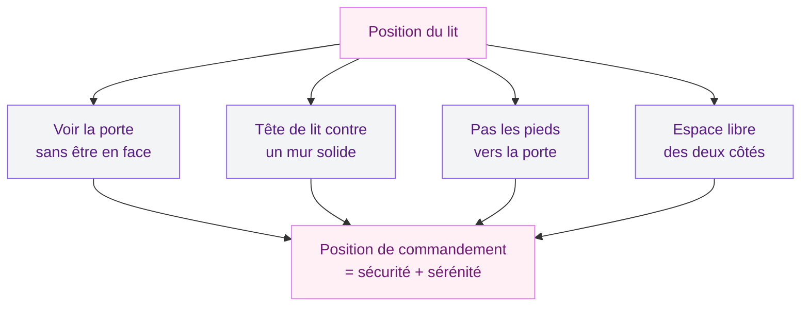

Tu dors mal, tu te réveilles fatiguée, et ta chambre te donne un sentiment bizarre - comme si l'air y circulait de travers ? Ce n'est peut-être pas qu'une impression. En feng shui, la chambre à coucher est la pièce la plus importante de la maison. C'est là que tu recharges tes batteries, que ton corps se régénère, que ton esprit se pose. Et si l'agencement de cette pièce bloque le flux d'énergie (le fameux Qi), ton sommeil en prend un coup.

Je m'intéresse au feng shui depuis plusieurs années - pas de manière mystique, plutôt pragmatique. Et honnêtement, certaines règles sont d'un bon sens redoutable. Position du lit, choix des couleurs, gestion du désordre : on va tout passer en revue, avec 9 règles concrètes que tu peux appliquer ce week-end.

## Qu'est-ce que le feng shui, en version courte ?

Le feng shui (littéralement "vent et eau") est un art chinois millénaire qui s'intéresse à la circulation de l'énergie dans un espace. L'idée de base : quand l'énergie circule bien dans une pièce, les gens qui y vivent se sentent mieux. Quand elle stagne ou file trop vite, c'est l'inconfort.

En pratique, le feng shui s'appuie sur quelques grands principes :

- **L'équilibre Yin/Yang** : la chambre doit être plutôt Yin (calme, douce, reposante) par opposition aux pièces Yang (salon, cuisine) qui sont actives
- **Les 5 éléments** : bois, feu, terre, métal, eau - chacun porte une qualité et une couleur
- **Le Qi** : l'énergie vitale qui doit circuler librement sans obstacle

Pas besoin d'y croire comme à une religion. Prends ce qui te parle, teste, et garde ce qui marche pour toi.

## Règle 1 : La position du lit, le point de départ de tout

C'est LA règle numéro un. En feng shui, le lit se place en "position de commandement" : tu dois pouvoir voir la porte d'entrée de la chambre depuis ton lit, sans être directement face à elle ni alignée avec.

Concrètement, ça veut dire :

- Le lit est placé en diagonale par rapport à la porte
- La tête de lit est contre un mur plein (pas sous une fenêtre, pas contre un mur qui donne sur la salle de bain)
- Tu ne dors pas les pieds pointés vers la porte (c'est ce qu'on appelle la "position du mort" en feng shui - pas très rassurant)

> [!TIP]
> Si tu ne peux pas bouger ton lit pour voir la porte, place un miroir qui te permet d'apercevoir l'entrée depuis ta position couchée. Ca règle le problème sans tout déménager.

L'orientation cardinale compte aussi : la tête de lit au nord ou à l'est est souvent recommandée. Le nord favorise un sommeil profond et réparateur. L'est aide les personnes qui ont du mal à se lever le matin - l'énergie du soleil levant y est associée.

## Règle 2 : Deux tables de chevet, toujours

Oui, même si tu dors seule. Deux tables de nuit symétriques de chaque côté du lit, c'est l'équilibre Yin/Yang en action. Ca crée une harmonie visuelle qui calme l'esprit et favorise le repos.

Les tables n'ont pas besoin d'être identiques - elles peuvent simplement se répondre en taille et en hauteur. L'idée, c'est la symétrie douce, pas la copie carbone.

En plus de l'aspect feng shui, c'est aussi très pratique. Un verre d'eau, un livre, une lampe : avoir un espace de chaque côté du lit, c'est du confort pur.

## Règle 3 : Les couleurs apaisantes, pas de compromis

La chambre feng shui appelle des couleurs Yin : douces, naturelles, enveloppantes. On parle de beige chaud, blanc cassé, rose poudré, vert sauge, bleu pâle, gris perle. Ce sont des teintes qui ralentissent le rythme cardiaque et facilitent l'endormissement.

Si tu aimes les [combinaisons de couleurs en chambre](/guides/chambre/les-meilleures-options-de-couleurs-pour-une-chambre-dadulte-a-deux-teintes), voilà les associations feng shui qui fonctionnent :

- **Beige + blanc cassé** : la base la plus apaisante, parfaite pour les chambres qui manquent de lumière
- **Vert sauge + lin** : une palette terre-nature qui s'accorde avec le bois clair
- **Rose poudré + gris perle** : doux et féminin sans être mièvre
- **Bleu lavande + blanc** : calme profond, idéal pour les insomnies

Les couleurs à éviter : le rouge vif (trop stimulant, trop Yang), le noir en grande quantité, l'orange saturé, le jaune citron. En petites touches via un coussin ou un objet, ça passe. En couleur de mur, c'est contre-productif pour le sommeil.

> [!WARNING]
> Attention au gris foncé utilisé seul sur tous les murs. Même si c'est tendance, en feng shui c'est associé à l'élément métal et à la tristesse quand il est trop présent. Préfère un gris chaud avec des sous-tons de beige.

## Règle 4 : Débarrasse-toi du désordre sous le lit

C'est la règle qui fait grincer des dents - parce que c'est l'endroit préféré de tout le monde pour cacher des trucs. Valises, cartons, vêtements hors saison : le dessous du lit devient souvent un dépotoir invisible.

En feng shui, l'énergie doit circuler autour de toi pendant que tu dors. Si le dessous du lit est encombré, le Qi stagne, et ça peut affecter la qualité de ton sommeil. Si tu as absolument besoin de cet espace de stockage, opte pour des articles liés au sommeil (draps de rechange, couvertures) plutôt que des dossiers de travail ou des objets chargés émotionnellement.

Et pour le reste de la chambre, le même principe s'applique : un espace rangé, c'est un esprit plus léger. Si tu veux aller plus loin sur ce sujet, j'ai écrit un guide complet sur [comment ranger ta chambre efficacement](/guides/chambre/ranger-chambre).

## Règle 5 : Les miroirs, à utiliser avec parcimonie

Les miroirs en feng shui, c'est un sujet qui divise. La règle de base : pas de miroir qui reflète le lit quand tu dors. L'explication traditionnelle parle d'énergie renvoyée vers le dormeur. En pratique, un miroir face au lit peut créer un sentiment de malaise inconscient, surtout quand tu te réveilles la nuit et que tu aperçois un mouvement dans l'obscurité.

Si tu as un grand miroir dans ta chambre (pour t'habiller, par exemple), place-le sur un mur latéral ou à l'intérieur d'une porte de placard. L'idéal, c'est de ne pas le voir depuis ta position couchée.

Un seul miroir dans la chambre, c'est suffisant. Plus que ça, l'énergie devient trop active pour un espace de repos.

## Règle 6 : Les matériaux naturels, tes meilleurs alliés

Le feng shui valorise les matières qui viennent de la nature : bois, lin, coton, bambou, laine, pierre. Ces matériaux ont une énergie calme et stable qui soutient le repos.

Pour ta chambre, ça se traduit par :

- **Le lit** : un cadre en bois massif plutôt qu'en métal (le métal conduit l'énergie trop rapidement)
- **Les draps** : coton bio, lin lavé ou percale de coton - les matières synthétiques perturbent la respiration de la peau et accumulent l'électricité statique
- **Le sol** : parquet, jonc de mer ou tapis en fibres naturelles
- **Les meubles** : bois clair (chêne, hêtre, bouleau) pour une ambiance apaisante

Si ta chambre est déjà meublée et que tu ne comptes pas tout changer, commence par les textiles. Remplacer des draps synthétiques par du lin lavé, poser un tapis en jute au pied du lit, ajouter des coussins en coton - ça fait une vraie différence sensorielle pour un budget raisonnable.

## Règle 7 : Pas d'écrans, pas d'électronique visible

C'est la règle la plus difficile à suivre en 2026, je sais. Mais le feng shui est catégorique : la chambre est un espace de repos et d'intimité, pas un bureau annexe ni un home cinéma.

Les écrans émettent une énergie Yang - active, stimulante. Ils perturbent le Qi de la chambre et la lumière bleue complique l'endormissement. Les études sur le sommeil le confirment : les personnes sans télé dans la chambre dorment en moyenne 30 minutes de plus par nuit.

Si tu ne peux pas sortir la télé, cache-la dans un meuble fermé. Pour le téléphone, un tiroir de table de chevet fait l'affaire - hors de vue, mais accessible pour l'alarme.

> [!NOTE]
> Un bon compromis : le radio-réveil vintage. Il te réveille sans te tenter avec des notifications, et il ajoute un objet rétro plutôt sympa sur ta table de nuit.

## Règle 8 : Un éclairage en couches, jamais un plafonnier seul

L'éclairage d'une chambre feng shui se pense en plusieurs niveaux. Un plafonnier unique qui envoie une lumière blanche et froide, c'est l'inverse de ce qu'on recherche ici.

L'idée, c'est de pouvoir moduler la lumière selon le moment :

- **Éclairage général** : un plafonnier avec variateur ou une suspension avec ampoule chaude (2700K maximum)
- **Éclairage d'ambiance** : des lampes de chevet avec abat-jour en tissu qui diffuse la lumière
- **Éclairage ponctuel** : une liseuse si tu lis au lit, orientable et discrète
- **Éclairage décoratif** : une guirlande lumineuse chaude ou des bougies (vraies ou LED)

Le soir, tu veux pouvoir baisser progressivement la lumière pour préparer ton corps au sommeil. C'est pour ça que le variateur est si important - il te permet de passer de 100 % en début de soirée à 20 % juste avant de te coucher.

Si tu veux creuser ce sujet, j'ai un guide sur les [tendances déco chambre 2026](/guides/chambre/decoration-de-la-chambre-a-coucher-2026-tendances-et-photos) qui aborde aussi la question de l'ambiance lumineuse.

## Règle 9 : Les plantes, oui mais pas trop

En feng shui, les plantes apportent l'énergie du bois - croissance, vitalité, fraîcheur. Dans une chambre, c'est bienvenu en petite quantité. Deux ou trois plantes, c'est parfait. Un mur végétal entier, c'est trop.

Les plantes recommandées pour la chambre :

- **Sansevière (langue de belle-mère)** : elle filtre l'air et libère de l'oxygène la nuit - une des rares plantes à faire ça
- **Aloe vera** : purifiante, demande peu d'entretien, énergie protectrice en feng shui
- **Lavande** : si tu as assez de lumière, son parfum favorise l'endormissement
- **Spathiphyllum** : filtre l'air, tolère l'ombre, feuilles douces et arrondies (énergie Yin)

Évite les plantes à feuilles pointues ou piquantes (cactus, yucca) qui projettent ce qu'on appelle des "flèches de Qi" - une énergie agressive. Et si une plante dépérit, remplace-la : une plante malade en feng shui porte une énergie de déclin.

> [!IMPORTANT]
> Place tes plantes loin du lit, idéalement dans un coin de la pièce ou sur une commode. Le surplus d'énergie bois trop proche du lit peut rendre le sommeil agité chez les personnes sensibles.

## Le feng shui en action : par où commencer ?

Si tu veux appliquer ces règles sans tout chambouler d'un coup, voici l'ordre que je te recommande :

1. **Ce week-end** : dégage le dessous du lit et fais un tri rapide de la chambre. C'est le geste qui a le plus d'impact immédiat.
2. **La semaine suivante** : repositionne ton lit selon la position de commandement si c'est possible.
3. **Progressivement** : remplace tes textiles par des matières naturelles, ajoute des lampes d'ambiance, retire les écrans.

Le feng shui n'est pas une science exacte, et tu n'es pas obligée de suivre chaque règle à la lettre. Si un principe te parle, applique-le. Si un autre te semble trop contraignant, laisse-le de côté. Ta chambre doit rester un lieu de plaisir, pas une liste de consignes.

Pour continuer à transformer ta chambre, jette un oeil à mon article sur la [déco terracotta en chambre](/guides/chambre/deco-terracotta-chambre) - une palette de couleurs chaudes qui se marie très bien avec les principes feng shui.

## FAQ

### Est-ce que le feng shui fonctionne vraiment pour mieux dormir ?

Il n'y a pas d'étude scientifique qui valide le feng shui en tant que tel. Mais beaucoup de ses principes recoupent ce que la science du sommeil recommande : chambre fraîche, sombre, désencombrée, sans écrans, avec des matériaux respirants. Beaucoup de personnes constatent une amélioration après avoir réorganisé leur chambre. Le plus simple, c'est de tester pendant deux semaines et de voir par toi-même.

### Dans quelle direction orienter la tête de lit ?

En feng shui classique, le nord est la direction la plus apaisante pour dormir - elle favorise un sommeil profond et récupérateur. L'est convient aux personnes qui veulent se lever plus facilement le matin. Le sud est déconseillé car il est associé à l'énergie du feu, trop active. L'ouest est neutre, acceptable si les autres orientations ne sont pas possibles dans ta configuration.

### Peut-on mettre un bureau dans une chambre feng shui ?

C'est déconseillé car le bureau porte une énergie Yang (activité, concentration, stress) qui entre en conflit avec l'énergie Yin de la chambre. Si tu n'as pas le choix, sépare visuellement l'espace bureau de l'espace nuit avec un paravent, un rideau ou une étagère basse. Et range ton bureau chaque soir - un bureau en désordre visible depuis le lit, c'est l'assurance de ruminer au lieu de t'endormir.

### Est-ce que les couleurs sombres sont interdites en feng shui ?

Pas interdites, mais à utiliser avec mesure. Un mur d'accent en bleu nuit derrière la tête de lit, ça peut fonctionner si le reste de la chambre reste clair. Le noir en grande quantité est en revanche déconseillé car il absorbe la lumière et l'énergie. L'idée en feng shui, c'est toujours l'équilibre : une dominante claire avec des touches plus profondes pour la profondeur.

### Combien de temps faut-il pour ressentir les effets du feng shui ?

La plupart des gens qui ont réorganisé leur chambre rapportent un changement dès la première nuit - souvent lié au simple fait d'avoir désencombré et nettoyé. Les effets plus profonds (meilleur sommeil, sensation de calme en entrant dans la chambre) s'installent en général sur deux à quatre semaines, le temps que tu t'habitues au nouvel agencement et que l'énergie de la pièce se stabilise.
