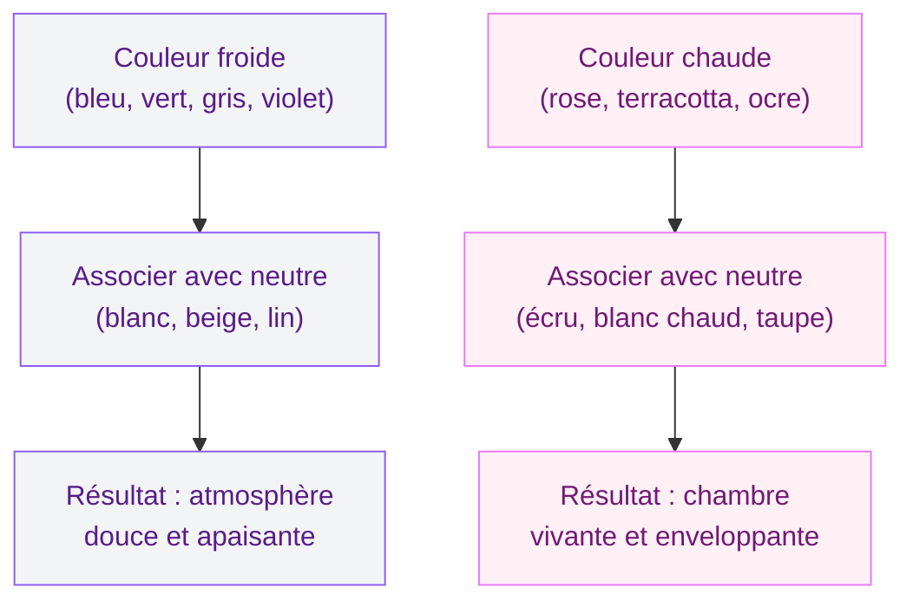
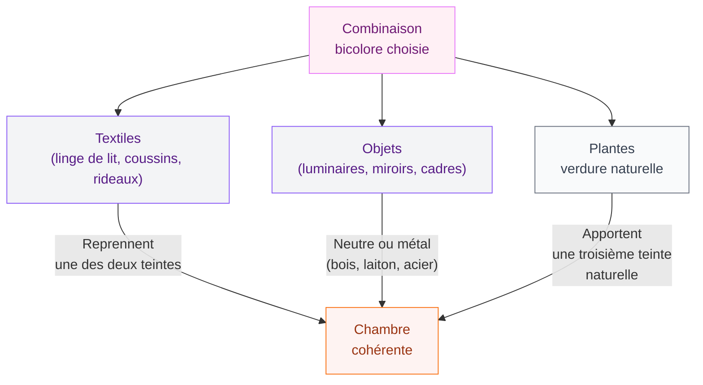

Peindre sa chambre en deux couleurs, c'est l'une des idées les plus séduisantes en déco - et pourtant l'une des plus risquées si on saute à pieds joints sans réfléchir. J'ai vu des chambres où les deux teintes se battaient à mort sur les murs, et d'autres où la combinaison créait quelque chose de vraiment beau, chaleureux, à la fois vivant et reposant.

Ce guide, je l'ai écrit pour toi si tu veux te lancer dans la peinture bicolore sans faire d'erreur. On va voir les combinaisons qui fonctionnent vraiment, les règles d'équilibre à garder en tête, et les marques avec lesquelles tu peux acheter en confiance - avec des prix concrets.

## Pourquoi choisir deux couleurs plutôt qu'une ?

Une chambre monochrome, c'est propre. Mais deux couleurs bien choisies, ça donne de la profondeur. Tu peux définir des zones, créer un mur accent derrière le lit, séparer la partie nuit de la partie lecture ou habillage.

  

L'autre avantage, c'est le dynamisme. Une seule couleur peut vite paraître plate, surtout dans les petits espaces. Deux teintes permettent de jouer avec les volumes : une couleur sombre sur un mur plafond habille une chambre en hauteur, tandis qu'une teinte claire sur les autres murs l'ouvre.

Et puis soyons honnêtes : une chambre entièrement repeinte en bleu pétrole, c'est beau sur Pinterest mais ça peut virer au cauchemar dans la vraie vie. Combiner avec du blanc cassé ou du lin, c'est plus facile à vivre sur la durée.

> [!TIP]
> La règle du 60/30 est ton amie : 60 % de la couleur dominante (souvent la plus claire), 30 % de la couleur secondaire, 10 % pour les accents déco. Ça évite l'effet trop chargé.

## Les grandes familles de combinaisons bicolores

  

### Couleur froide + neutre clair : l'indétrônable

C'est la combinaison la plus simple à réussir et la plus reposante pour une chambre adulte. On parle de bleu, vert, gris ou violet associés à du blanc, du beige ou du lin.

**Bleu nuit + blanc cassé** : classique indémodable. Le bleu nuit (type "Soir" de Dulux Valentine, aux alentours de 35-40 euros le pot de 2,5 L) sur le mur derrière le lit, blanc cassé partout ailleurs. Résultat : chambre chic, apaisante, qui fait penser aux intérieurs scandinaves.

**Vert sauge + blanc ou crème** : tendance forte depuis quelques années et pour de bonnes raisons. Le vert sauge est une couleur qui respire. Chez Leroy Merlin, la peinture Tollens "Sauge" tourne autour de 28-32 euros le 2,5 L. Avec un plafond blanc et des linges de lit en coton naturel, c'est une chambre bohème sans effort.

**Gris perle + blanc pur** : pour une chambre minimaliste et épurée. C'est la combinaison la plus safe, celle qui passe avec tout type de mobilier. Les gris Farrow & Ball (type "Purbeck Stone") sont vraiment beaux mais chers - environ 60 euros le litre. Pour un budget plus accessible, Ressource propose des gris de qualité autour de 30-35 euros le litre.

### Couleur chaude + neutre chaud : la chambre cocooning

Les couleurs chaudes - rose, terracotta, ocre jaune, rouge brique - demandent plus de prudence en chambre adulte. Elles dynamisent et réchauffent l'espace, mais trop présentes, elles peuvent rendre le sommeil difficile.

La clé, c'est de les associer à un neutre chaud, jamais froid. Pas de blanc pur avec du terracotta - ça crée un contraste trop brutal. Préfère du blanc cassé, du lin, du sable.

**Terracotta + écru ou beige** : une des combinaisons les plus réussies en ce moment pour une chambre adulte avec caractère. Si tu veux en savoir plus sur comment intégrer cette palette dans ta déco, j'ai un guide complet sur la [déco terracotta pour la chambre](/deco-terracotta-chambre/) qui développe tout ça.

**Rose poudré + blanc cassé** : chambre adulte romantique et lumineuse. Le rose poudré de Dulux Valentine (gamme "Nuancier Inspiration", teinte "Pivoine douce") est autour de 38 euros le 2,5 L. Attention à choisir un rose vraiment dépigmenté, pas un rose vif qui ferait trop "chambre d'enfant".

**Ocre + lin** : pour une chambre avec des influences méditerranéennes ou nordiques. L'ocre doit rester discret - un seul mur maximum, les autres en lin ou beige très clair.

> [!WARNING]
> Le rouge est une couleur à manipuler avec précaution en chambre. Quelques coussins ou un plaid rouge, c'est possible. Mais un mur rouge entier peut stimuler trop fortement et perturber la qualité du sommeil. Réserve-le pour le séjour ou le bureau.

### Le camaïeu : deux teintes de la même couleur

Moins évident mais vraiment efficace : choisir deux tons de la même couleur pour une chambre avec une vraie cohérence. Par exemple, un bleu poudré et un bleu marine. Ou un vert amande et un vert anglais.

L'avantage du camaïeu, c'est qu'il n'y a presque pas de risque de "clash". Les deux teintes se répondent naturellement. C'est une bonne option si tu démarres et que tu veux un résultat garanti.

**Comment l'appliquer** : la teinte la plus foncée sur le mur accent (derrière le lit ou face à la fenêtre), la teinte la plus claire sur les autres murs. Ce jeu de clair-obscur agrandit visuellement la pièce et lui donne de la sophistication.

## Comment répartir les deux couleurs sur les murs ?

C'est là que beaucoup de gens se perdent. Avoir deux belles couleurs ne suffit pas - encore faut-il savoir où les mettre.

  

**Option 1 - Le mur accent classique** : trois murs dans la couleur dominante claire, un mur (derrière le tête de lit) dans la couleur secondaire plus forte. Simple et efficace.

**Option 2 - La séparation horizontale** : peindre la partie basse des murs dans une couleur (souvent la plus foncée) et la partie haute dans la couleur plus claire. La ligne de séparation se place généralement à 1,20 m ou 1,50 m de hauteur. Pour un rendu net, utilise du ruban de masquage de qualité (type Frog Tape).

**Option 3 - Le plafond coloré** : une tendance qui monte. Tu garde les murs dans la couleur neutre et tu peins le plafond dans la couleur accent. Ca crée un "cocon" au-dessus du lit très cosy. Ça demande un peu de courage mais le résultat surprend vraiment.

**Option 4 - Une niche ou une alcôve** : si ta chambre a une niche architecturale ou un renfoncement derrière le lit, c'est l'endroit idéal pour glisser ta deuxième couleur sans engager tout un mur.

> [!NOTE]
> Pour une petite chambre, évite les deux couleurs foncées en même temps. Garde au moins une teinte claire pour préserver la luminosité. Une chambre de moins de 12 m² avec deux teintes sombres peut vite sembler oppressante.

## Les marques et gammes de peinture à connaître

  

### Pour un budget serré (sous 30 euros le 2,5 L)

**Dulux Valentine Crème de Couleur** : l'une des meilleures entrées de gamme du marché. Bonne couvrante, nuancier large, on la trouve chez Leroy Merlin et Castorama. Prévoir 25-28 euros le pot de 2,5 L.

**Tollens (Leroy Merlin)** : gamme maison avec un nuancier honnête. Qualité correcte pour une peinture murale standard. Autour de 22-28 euros le 2,5 L selon les références.

### Pour un milieu de gamme (30-50 euros le 2,5 L)

**Farrow & Ball** : chers mais la qualité de la pigmentation est vraiment là. Les couleurs sont profondes, les finitions "Moderne Emulsion" ou "Estate Emulsion" ont un rendu mat velouté. Compte environ 55-65 euros le litre. C'est cher, mais pour un seul mur accent, ça vaut l'investissement.

**Peinture Luxens** : la gamme de Leroy Merlin positionnée en milieu-haut de gamme. Les pigments sont plus riches que la gamme Tollens, le rendu mat est vraiment beau. Autour de 32-38 euros le 2,5 L. Si tu cherches à approfondir le sujet des peintures Luxens, j'ai un article dédié sur [la peinture Luxens et ses meilleures teintes](/peinture-luxens/).

**Zingana (Castorama)** : bon rapport qualité-prix, palette de couleurs bien pensée. Environ 30-35 euros le 2,5 L.

### Pour un résultat haut de gamme (au-dessus de 50 euros le 2,5 L)

**Ressource** : marque française avec des couleurs vraiment sophistiquées. Les teintes sont profondes, les noms évocateurs. Pour une chambre adulte bicolore haut de gamme, c'est l'une des meilleures options. Compte 40-50 euros le litre.

**Little Greene** : marque anglaise comparable à Farrow & Ball dans l'esprit, avec quelques couleurs qu'on ne trouve nulle part ailleurs. Les "Portland Stone" et "Gauze" sont des neutres chauds de référence.

> [!TIP]
> Avant d'acheter, commande toujours des échantillons (souvent 5-10 euros les petits pots). Applique-les sur un carton blanc et observe la couleur à différentes heures - matin, midi, soir. La même peinture peut sembler bleue le matin et virer au vert en soirée selon l'exposition de ta chambre.

## Les associations à tester selon ton style

  

### Style scandinave

Blanc pur + gris clair ou bleu poudré. Mobilier en bois naturel. C'est le classique Scandi qui ne se démode pas. Pour les couleurs, pense aux gammes "Nordic" de Dulux Valentine ou aux tons "Stone" de Little Greene.

### Style bohème

Vert sauge + blanc cassé, ou ocre + lin. Beaucoup de textures (macramé, rotin, linge de lit brodé). Les couleurs naturelles et organiques sont le coeur de ce style.

### Style cosy/hygge

Deux teintes chaudes et enveloppantes : taupe foncé + beige, ou bordeaux doux + blanc crème. L'objectif est que la chambre ressemble à un refuge. Pour aller plus loin sur les tendances déco chambre, jette un oeil à notre article sur la [décoration de chambre à coucher 2026](/decoration-de-la-chambre-a-coucher-2026-tendances-et-photos/).

### Style contemporain

Contraste fort mais sobre : anthracite + blanc, ou marine + gris très clair. Les lignes sont nettes, les meubles épurés. Ce style supporte bien les combinaisons "audacieuses" parce que tout le reste de la pièce est simple.

## Et les couleurs complémentaires dans les accessoires ?

Une fois tes deux couleurs murales choisies, il reste à habiller la chambre. La règle simple : les accessoires reprennent l'une ou l'autre des deux couleurs, ou jouent avec un ton neutre complémentaire.

Par exemple, pour une chambre bleu nuit + blanc cassé : des coussins en bleu marine (plus foncé) et des draps en coton blanc. Un ou deux accents en laiton ou en naturel (bois, osier) pour réchauffer l'ensemble.

Si tu travailles avec des couleurs chaudes comme l'orange ou le terracotta, tu peux explorer les associations de teintes avec [notre guide sur les couleurs compatibles avec l'orange en déco](/couleurs-compatibles-avec-lorange-pour-les-murs-et-la-decoration/) pour trouver des idées d'accents qui vont avec.

> [!IMPORTANT]
> N'oublie pas la teinte du sol et des boiseries quand tu choisis tes deux couleurs. Un parquet en chêne clair ou foncé ne s'accommode pas des mêmes teintes. Prends toujours en photo ton sol et tes menuiseries avant de faire tes essais de couleur.

## Sur le meme theme

- [feng shui chambre à coucher](/le-feng-shui-dans-la-chambre-a-coucher/)

## Avant de te lancer : les questions à te poser

**Mon orientation lumineuse ?** Une chambre plein nord a besoin de couleurs chaudes ou de neutres clairs pour ne pas devenir froide. Une chambre plein sud peut absorber des teintes plus profondes sans que la pièce paraisse sombre.

**Mon mobilier reste en place ?** Si tu as un lit en bois foncé et une commode anthracite, il vaut mieux éviter les teintes trop sombres sur les murs. Tu risques un effet très lourd.

**Quel niveau de contraste je veux ?** Fort contraste (bleu marine + blanc pur) : marqué et graphique. Faible contraste (beige rosé + beige sablé) : doux et enveloppant. Les deux fonctionnent, c'est juste une question de ce que tu veux ressentir dans ta chambre.

Avec tout ça, tu as de quoi faire des choix éclairés. La peinture bicolore n'est pas une science exacte - c'est aussi un peu d'instinct, et surtout des tests. Les échantillons sur carton, les photos à différentes heures du jour, et la question simple "est-ce que je me sens bien dans cet espace ?" - c'est ça qui fait la différence.

---

## Questions fréquentes

**Quelle règle de proportion pour deux couleurs en chambre ?**
La règle la plus utilisée est le 60/30 : 60 % de couleur dominante (en général la plus claire), 30 % de couleur secondaire (souvent sur un seul mur), et 10 % pour les accents dans les accessoires. Cette répartition crée un équilibre sans que les deux teintes se neutralisent.

**Faut-il peindre le plafond dans l'une des deux couleurs ou en blanc ?**
Pour la plupart des chambres adultes, le plafond en blanc ou blanc cassé reste la valeur sure. Il agrandit visuellement la pièce et fait respirer les deux couleurs murales. Le plafond coloré peut fonctionner (surtout avec la couleur la plus claire), mais ca demande un peu plus d'expérience pour que le résultat soit réussi.

**Quelle finition choisir pour une chambre bicolore ?**
La finition mate est la plus recommandée pour les murs d'une chambre adulte : elle absorbe la lumière, masque mieux les imperfections et donne un rendu sophistiqué. Evite le brillant en grande surface - il met en valeur les défauts du support et peut peser visuellement.

**Peut-on associer deux couleurs chaudes dans une chambre adulte ?**
Oui, mais avec retenue. Deux couleurs chaudes (comme terracotta + ocre) fonctionnent si au moins l'une d'elles est très désaturée. Si les deux sont très vives ou intenses, l'espace peut devenir fatigant. L'une doit clairement jouer le rôle de neutre par rapport à l'autre.

**Quelle combinaison pour une chambre à coucher petite (moins de 12 m²) ?**
Privilégie les combinaisons où la couleur claire domine largement : 70 à 80 % de teinte claire, un seul mur dans une teinte plus soutenue. Les neutres chauds (blanc cassé, lin, beige poudré) sont tes alliés pour préserver la luminosité et l'impression d'espace.
