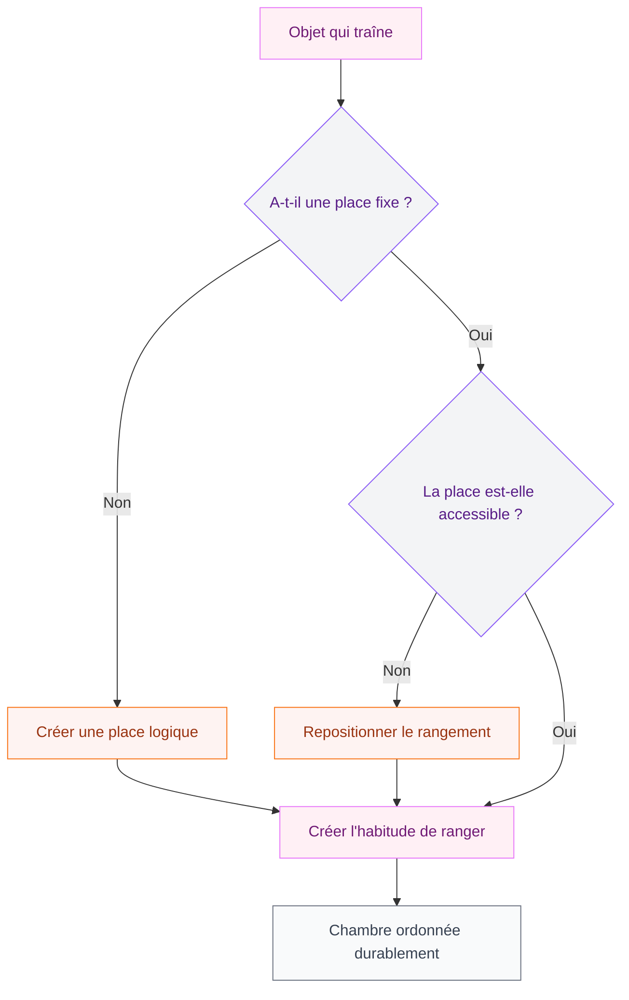

Ta chambre ressemble à un champ de bataille dès le lundi matin, alors que tu avais tout rangé le week-end ? Tu n'es pas seule dans cette situation. Le problème vient rarement du manque de motivation - il vient surtout d'une organisation qui ne correspond pas à tes habitudes réelles. Je vais te montrer comment changer ça.

## Pourquoi ta chambre se désorganise si vite

Avant de sortir les boîtes de rangement, il faut comprendre ce qui se passe vraiment. La chambre accumule le désordre pour des raisons précises : trop d'affaires par rapport à l'espace disponible, des rangements mal placés par rapport à tes gestes quotidiens, ou des objets sans "maison" attitrée.

La chaise sur laquelle tu empiles des vêtements en rentrant du travail ? C'est une question de flux, pas de paresse. Tu poses là parce qu'il n'y a pas d'endroit pratique entre la porte et l'armoire. On va régler ça.

## Etape 1 : faire le vide avant de ranger

C'est l'étape que tout le monde saute, et c'est l'erreur numéro un. Si tu ranges des choses dont tu n'as pas besoin, tu crées juste une version plus organisée du chaos.

**La règle des 12 mois** : si tu n'as pas touché à un vêtement ou un objet depuis un an, il part. Pas de "peut-être un jour" - cette pensée remplit les armoires pour rien.

Prévois une bonne heure et vide vraiment ton armoire, tes tiroirs, les dessous de lit. Sépare en trois tas :
- Garde
- Donne (associations, vide-greniers, Vinted)
- Jette (vêtements abîmés, objets cassés)

> [!TIP]
> Pour les vêtements "peut-être", retourne les cintres dans ton armoire. Dans six mois, tout ce qui est encore à l'envers part. Cette technique concrète t'évite de te poser la question deux fois.

## Etape 2 : cartographier ton espace

Maintenant que tu as moins d'affaires, tu vas réfléchir à la logique de placement. Pas besoin de dessiner un plan, juste de penser à tes trajets habituels dans la chambre.

**Les zones à identifier :**

- Zone lit : livres, lampe, téléphone, écouteurs - tout ce que tu utilises au lit
- Zone habillage : vêtements portés souvent, miroir, accessoires du quotidien
- Zone bureau (si tu en as un) : matériel de travail, chargeurs, stylos
- Zone stockage : vêtements hors-saison, valises, affaires peu utilisées

Chaque zone doit avoir ses propres rangements à portée de main. Si tu dois traverser la pièce pour ranger quelque chose que tu utilises tous les jours, ça ne marchera jamais.

> [!NOTE]
> La règle des 30 secondes : si ranger un objet te prend plus de 30 secondes, tu ne le rangeras pas. Simplifie l'accès à tous tes rangements fréquents.

## Etape 3 : choisir les bons rangements

Là on entre dans le concret. Voici les solutions qui fonctionnent vraiment, avec des prix réels.

### Pour l'armoire et les vêtements

Les cintres uniformes changent tout. Un mélange de cintres en fil métallique, en bois et en velours crée visuellement du bruit. Avec des cintres en velours fins comme les **Cintres Joy Mangano** (environ 25€ les 30 chez Leroy Merlin ou Amazon), tu doubles la capacité de ta penderie et les vêtements ne glissent plus.

Pour les pulls et les jeans, les organiseurs de tiroir **SKUBB d'IKEA** (2,99€ l'unité) sont imbattables. Ils divisent les grands tiroirs en cases et tout reste visible d'un coup d'oeil.

Les boîtes à chaussures transparentes empilables, comme celles de la marque **Zeller** (environ 3-4€ la boîte chez Casa ou Action), te permettent de voir tes paires sans tout sortir.

### Pour le dessous de lit

C'est souvent une zone morte. Les bacs plats avec roulettes, comme les **SOCKERBIT d'IKEA** (7,99€), ou des sacs de rangement sous vide pour les vêtements hors-saison (**Spacesaver**, environ 15€ les 6 sur Amazon) libèrent de l'espace sans encombrer.

### Pour les petits objets

Sur ta table de nuit, évite l'accumulation avec un plateau ou une pochette. Les petites coupelles en céramique (5-10€ en boutique déco) servent de point de dépôt fixe pour les bagues, boucles d'oreilles, montre.

## Etape 4 : les habitudes qui maintiennent l'ordre

C'est la partie la plus sous-estimée. Tu peux avoir le meilleur système de rangement du monde, sans habitudes il sera désorganisé en une semaine.

**Le reset du soir (5 minutes)** : chaque soir avant de dormir, tu remets chaque objet à sa place. Pas de grande session de ménage, juste 5 minutes de mise à zéro. Ce geste petit mais régulier empêche l'accumulation.

**La règle "un entre, un sort"** : chaque fois que tu achètes un nouveau vêtement, un ancien part. Ça paraît strict mais c'est ce qui empêche la saturation progressive.

**Le dimanche express** : 15-20 minutes le dimanche pour vérifier l'ensemble de la chambre. Chaussures pas remises en boîte, vêtements traînant sur la chaise, surface du bureau encombrée - tu règles tout d'un coup en moins de 20 minutes.

> [!WARNING]
> Evite les sessions de "grand rangement" mensuel. Plus l'intervalle est long, plus la tâche devient décourageante. La fréquence courte (quotidienne ou hebdomadaire) rend le rangement indolore.

## Les pièges classiques à éviter

**Trop de rangements ouverts** : les étagères ouvertes ont besoin d'être entretenues visuellement en permanence. Si tu n'es pas à l'aise avec ça, préfère les rangements fermés. Un tiroir plein invisible stresse moins qu'une étagère encombrée en vue.

**Vouloir tout optimiser en une journée** : tu peux très bien changer ton système de rangement par zones, sur plusieurs week-ends. Commencer par l'armoire, puis les tiroirs, puis le bureau. C'est plus durable qu'un grand projet qui épuise et décourage.

**Copier une organisation Instagram** : ces chambres sont soit vides soit mises en scène pour la photo. Une chambre vivable c'est une chambre adaptée à TON mode de vie, pas à une esthétique parfaite. Si tu vis avec un chat, des livres partout et des collections de quelque chose, ton organisation doit intégrer ça.

**Acheter des rangements avant de faire le tri** : c'est l'erreur classique. On achète des boîtes, des étagères, des organiseurs... et on range plus d'objets inutiles. Toujours trier d'abord, acheter ensuite.

## Idées de rangement malins selon la configuration de ta chambre

### Petite chambre (moins de 12m2)

La verticalité est ta meilleure amie. Les étagères hautes jusqu'au plafond, les tiroirs sous le lit, les portes d'armoire équipées de rangements (poches, barres supplémentaires) : tu utilises chaque centimètre.

La table de nuit peut être remplacée par une étagère murale flottante si l'espace est vraiment serré. Une planche de 40cm vissée au mur prend moins de place qu'un meuble et fait le même travail.

Les crochets Shaker vissés sur le mur (style **Umbra**, environ 15-25€ la rangée chez Habitat ou Maisons du Monde) permettent de suspendre sacs, vêtements du lendemain, accessoires - sans meuble supplémentaire.

> [!TIP]
> Dans une petite chambre, pense aussi à la déco qui s'intègre dans le rangement. Des paniers en osier sur des étagères ouvertes, c'est beau ET fonctionnel. Jette un oeil à nos idées de [décoration terracotta pour chambre](/guides/chambre/deco-terracotta-chambre/) qui combinent esthétique et organisation.

### Grande chambre (plus de 15m2)

Le risque c'est l'effet "vide" avec des poches de désordre. Structure l'espace avec des zones claires. Un tapis délimite la zone lit, un autre la zone travail si tu en as une.

Evite de remplir l'espace juste pour le remplir - une grande chambre bien organisée avec peu de meubles est plus reposante qu'une chambre surchargée.

## Ranger et décorer : les deux vont ensemble

Le rangement n'est pas incompatible avec une belle déco. Un espace ordonné met en valeur tes choix décoratifs au lieu de les noyer dans le désordre ambiant.

Si tu réfléchis à renouveler le style de ta chambre en même temps que son organisation, les [tendances déco chambre 2026](/guides/chambre/decoration-de-la-chambre-a-coucher-2026-tendances-et-photos/) donnent de belles idées pour des espaces à la fois esthétiques et pratiques. Et si tu as un sol en parquet avec quelques taches, voici comment t'en occuper : [réparer un parquet taché](/guides/decoration/parquet-tache/) sans tout démonter.

Pour les chambres avec une vraie personnalité, l'organisation peut s'adapter à des univers très spécifiques - comme une [chambre Harry Potter](/guides/chambre/deco-chambre-harry-potter/) où le rangement fait partie du décor.

## Par où commencer concrètement ?

Si tout ça te semble beaucoup, voici un plan d'action sur trois week-ends :

**Week-end 1** : tri et désencombrement. Vide armoire, tiroirs, dessous de lit. Donne ou jette ce dont tu n'as plus besoin.

**Week-end 2** : organisation et achats ciblés. Identifie les zones, achète uniquement les rangements qui manquent vraiment, mets en place le système.

**Week-end 3** : ajustements. Après deux semaines de test, tu verras ce qui fonctionne et ce qui cloche. Repositionne, simplifie.

Ranger sa chambre n'est pas une corvée à faire une fois pour toutes - c'est un système à construire une fois et à maintenir par petits gestes quotidiens. Une fois le bon système en place, le désordre ne revient plus vraiment, parce que tout a une place et que ranger prend moins de 30 secondes par objet.

---

## Sur le meme theme

- [chambre sans fenêtre](/guides/chambre/chambre-sans-fenetre/)

## Questions fréquentes

**Combien de temps faut-il pour ranger une chambre complètement désorganisée ?**

Compte une journée complète pour le grand tri initial (5-8 heures avec les pauses). Le montage et l'installation des rangements prennent une demi-journée supplémentaire. Ensuite, les resets quotidiens de 5 minutes suffisent à maintenir le résultat.

**Quels rangements acheter en priorité ?**

Commence par les cintres uniformes pour l'armoire (25€ pour 30 cintres) et des organiseurs de tiroirs (15-20€ pour équiper deux ou trois tiroirs). Ce sont les investissements qui changent le plus la perception de l'espace pour le moins cher.

**Comment ne pas rechuter dans le désordre ?**

La clé c'est la règle du "un entre, un sort" pour les vêtements, et le reset de 5 minutes chaque soir. Ces deux habitudes, prises ensemble, empêchent l'accumulation progressive qui finit par tout déborder.

**Est-ce qu'il faut absolument faire la méthode KonMari pour bien ranger ?**

Non. La méthode KonMari (ranger par catégorie en une fois) est efficace mais exigeante. Si tu préfères y aller zone par zone sur plusieurs week-ends, c'est tout aussi bien et souvent plus durable pour les profils qui n'aiment pas les grands projets.

**Que faire quand on a peu de rangements dans sa chambre ?**

Exploite la verticalité avec des étagères murales, utilise l'espace sous le lit, et ajoute des crochets sur les portes. Ce sont les trois solutions les plus efficaces sans changer de meubles.
