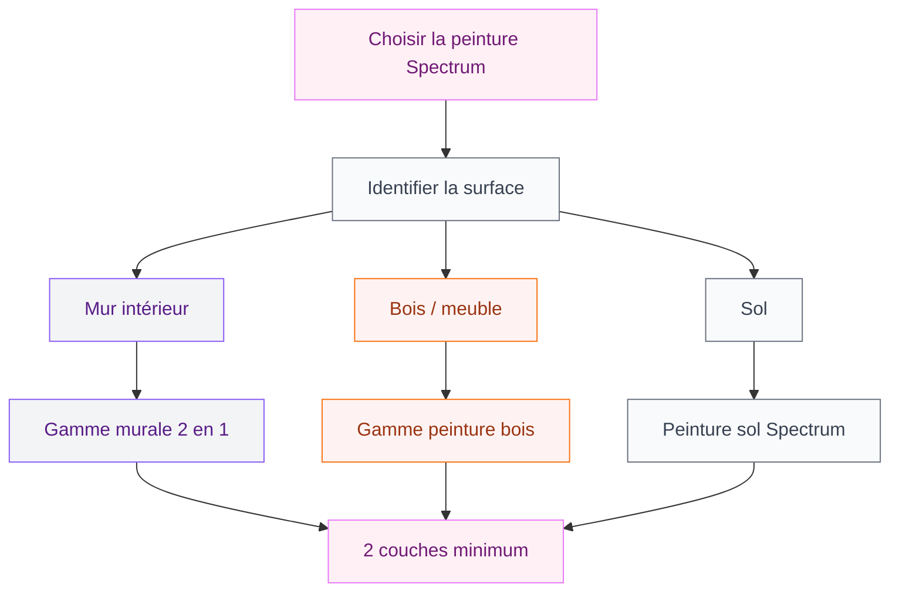
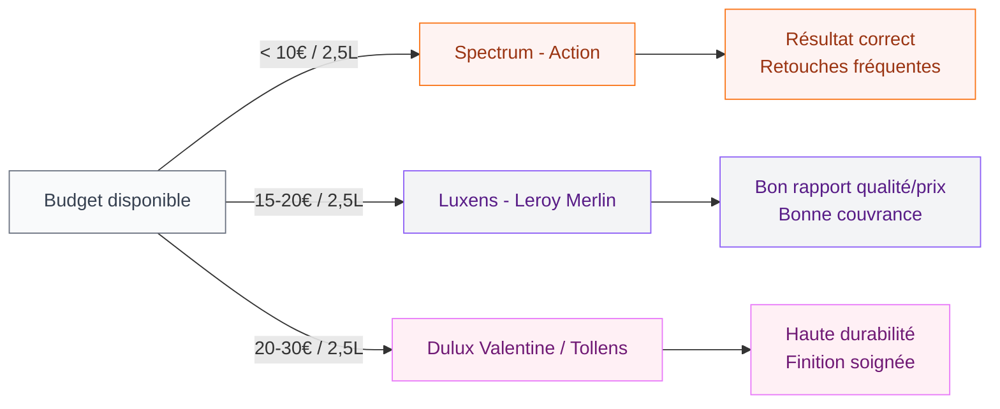

# Avis peinture Spectrum : ce que j'ai vraiment pensé après plusieurs mois

On la trouve à 4-5 euros le pot chez Action, avec un nuancier coloré bien rangé sur les étagères. La peinture Spectrum, c'est la marque propre d'Action pour tout ce qui touche à la peinture et à la déco. Et franchement, quand on la voit à ce prix, on se demande si c'est vraiment utilisable ou si c'est juste bon pour décevoir.

Je l'ai testée dans deux pièces différentes - un couloir et une chambre d'amis - et je t'explique ici tout ce que j'ai observé, sans te noyer dans du blabla marketing. Des vrais retours, avec les bons et les moins bons points, pour que tu puisses décider si Spectrum est faite pour toi ou pas.

## Spectrum, c'est quoi exactement ?

Spectrum est la gamme de peinture en marque propre d'Action, la chaîne de discount connue pour ses prix bas. L'enseigne propose cette gamme depuis plusieurs années, et elle couvre pas mal de besoins : peinture murale intérieure, peinture bois, laque, peinture sol... Il y a plus de 100 références dans la gamme, entre les différentes couleurs, finitions et formats.

  

Les prix sont clairement le premier argument : un pot de peinture murale blanche de 2,5 litres tourne autour de 4 à 7 euros selon les promotions. Pour des petits travaux ou un budget serré, ça saute aux yeux. La gamme "2 en 1 Masque-taches" est particulièrement populaire - elle promet de cacher les petites imperfections en une seule couche.

> [!NOTE]
> Spectrum n'est pas disponible à la commande sur un site dédié - tu l'achètes uniquement en magasin Action ou sur le site de l'enseigne. Le choix de couleurs varie selon les stocks en rayon.

## Ce que j'ai testé : la peinture murale intérieure

J'ai commencé avec la peinture murale blanche "2 en 1 Masque-taches" pour repeindre un couloir d'environ 12 m2. Le mur était propre, légèrement abîmé par quelques petits coups. L'idée : tester si la promesse "masque-taches" tenait vraiment.

  

**La consistance** : elle est assez liquide comparée à une peinture comme la [Luxens de Leroy Merlin](/peinture-luxens/). Ca éclabousse davantage au rouleau, alors mets bien tes bâches. Sur le côté positif, elle s'étale facilement et monte vite.

**Le pouvoir couvrant** : deux couches ont été nécessaires pour un résultat propre. La première couche laissait bien voir la couleur d'avant, même sur un mur blanc. Ce n'est pas surprenant à ce prix, mais si tu espères t'en tirer en une couche sur un mur foncé, oublie. Les petits coups sur le mur ? Pas vraiment masqués malgré la promesse de l'étiquette. Il aurait fallu boucher avant de peindre.

**Le temps de séchage** : environ 2 heures entre deux couches, comme indiqué sur l'emballage. Ca tient.

**L'odeur** : relativement discrète pour une peinture en phase aqueuse. Pas désagréable, une bonne aération suffit.

## Les couleurs disponibles : bon point pour le nuancier

C'est là que Spectrum surprend agréablement. Le nuancier propose plusieurs dizaines de teintes, du blanc cassé au bleu canard en passant par des verts sauge, des roses poudré, des griges tendance. C'est bien pensé pour suivre les couleurs populaires en déco sans devoir commander sur internet.

  

> [!TIP]
> Les teintes "taupe clair" et "gris cendre" de la gamme Spectrum s'associent très bien avec des meubles blancs ou naturels. Si tu hésites sur une couleur pour un salon ou une chambre, commence par les neutres chauds - ils pardonnent mieux les erreurs.

Cela dit, le nuancier n'est pas fixe : selon les semaines et les magasins, certaines teintes ne sont plus disponibles ou arrivent en rupture. Si tu as un projet de plusieurs pièces à réaliser, achète tous tes pots d'un coup pour éviter les variations de teinte entre deux lots.

Pour aller plus loin sur les associations de couleurs avec ces teintes neutres, jette un oeil à notre article sur les [couleurs compatibles avec l'orange pour les murs et la décoration](/couleurs-compatibles-avec-lorange-pour-les-murs-et-la-decoration/) - les mêmes logiques s'appliquent.

## Et la peinture bois Spectrum, ça donne quoi ?

J'ai aussi testé la peinture bois sur un meuble de jardin en bois peint. La finition satin proposée sur ce format est correcte, avec un rendu lisse si tu prépares bien la surface.

  

**Ce qui fonctionne** : sur du bois déjà peint et légèrement poncé, le résultat est propre. L'adhérence est correcte, et après plusieurs mois en extérieur couvert (une terrasse abritée), le meuble n'a pas pelé.

**Ce qui fonctionne moins** : sur du bois brut ou poreux, l'accroche est moins bonne. Une sous-couche s'impose avant pour éviter les décollements.

> [!WARNING]
> Pour les surfaces bois en extérieur exposé à la pluie et aux UV directs, Spectrum n'est pas adaptée sur le long terme. Les retours d'utilisateurs pointent des cloques et une dégradation assez rapide dès la première année. Préfère une lasure ou une peinture extérieure spécialisée dans ce cas.

## Spectrum vs les autres marques budget : où elle se place

Pour comparer honnêtement, j'ai aussi utilisé de la peinture Dulux Valentine (gamme entrée de gamme en grande surface à 15-18 euros/pot de 2,5L) et de la [Luxens de Leroy Merlin](/peinture-luxens/) dans d'autres pièces.

  

En résumé :

- **Spectrum** (4-7 euros) : acceptable pour des petits travaux, des pièces secondaires ou des murs en bon état. Nécessite souvent 2-3 couches.
- **Luxens Leroy Merlin** (12-18 euros) : meilleur pouvoir couvrant, teintes plus stables, durabilité supérieure.
- **Dulux Valentine / Tollens** (20-35 euros) : finitions professionnelles, longue durée de vie, résistance aux lavages.

Si tu veux peindre une petite pièce sans dépenser beaucoup, Spectrum peut faire l'affaire. Si tu rénoves des pièces à vivre où la peinture va prendre des coups quotidiens, monte un peu en gamme.

## Durabilité : ce que j'ai observé après 8 mois

Le couloir repeint avec Spectrum a maintenant 8 mois. Voilà ce que j'observe :

- Les murs propres (sans frottement répété) sont encore corrects, avec un blanc légèrement jauni dans les coins proches des fenêtres.
- Là où les bras ou les vêtements frottent régulièrement, la peinture a commencé à griser et à perdre en éclat.
- Un coup de porte accidentel a laissé une marque légère - la peinture résiste moyennement aux chocs.
- J'ai essayé de nettoyer une tache avec une éponge humide : la peinture s'est légèrement altérée à cet endroit.

> [!CAUTION]
> La gamme Spectrum n'est pas conçue pour les pièces très sollicitées comme les halls d'entrée, les couloirs à fort passage ou les cuisines. Pour ces espaces, une peinture "lessivable" ou "anti-traces" d'une marque plus technique sera bien plus résistante sur la durée.

Pour comparaison, la chambre d'amis (peu fréquentée) repeinte avec Spectrum est encore très propre après 8 mois - pas de dégradation visible. Donc le contexte d'utilisation change tout.

## Astuces pour que le résultat soit au top avec Spectrum

Si tu décides de tester la peinture Spectrum, voilà ce qui fait vraiment la différence :

**Prépare bien ta surface.** C'est encore plus important qu'avec une peinture premium. Nettoie, bouche les trous avec de l'enduit, ponce les zones abîmées. Une surface propre compense une partie du manque de pouvoir couvrant.

**Applique 3 couches fines plutôt que 2 épaisses.** Avec une peinture très liquide, les couches épaisses coulent. Des couches fines et bien lissées donnent un résultat plus propre et plus solide.

**Mélange bien le pot avant chaque couche.** Les pigments se déposent au fond assez vite avec les peintures peu chères. Un mauvais mélange donne des zones plus pâles ou plus foncées.

**Utilise un bon rouleau.** Spectrum vend aussi des accessoires peinture à prix bas, mais investis dans un rouleau de qualité moyenne (8-12 euros chez Leroy Merlin ou Brico Dépôt) - ça change vraiment le rendu final.

> [!TIP]
> Si tu veux donner du caractère à tes murs avec un budget serré, Spectrum est un bon choix pour des effets décoratifs simples comme un pan de mur coloré dans une chambre. Combine une teinte Spectrum vive avec un revêtement naturel sur un mur adjacent pour un look moderne sans budget explosé. Pour d'autres idées de surfaces à peindre, notre guide sur [comment peindre le lino](/peindre-lino/) donne de bonnes pistes pour les petits budgets déco.

## Pour quel type de projet choisir Spectrum ?

Après plusieurs mois de tests et d'utilisation, j'ai une opinion claire :

**Spectrum convient bien pour :**
- Les pièces peu fréquentées (chambre d'amis, débarras, bureau peu utilisé)
- Les petits travaux de rafraîchissement sur des murs en bon état
- Les projets créatifs avec beaucoup de couleurs différentes (on peut tester des teintes sans se ruiner)
- Les locataires qui veulent rendre un appartement propre avant de partir sans investir énorme
- Les meubles et objets de déco intérieure non exposés aux frottements

**Spectrum convient moins pour :**
- Les pièces à fort passage (couloirs, entrées, cuisines)
- Les surfaces très abîmées ou irrégulières
- Les murs à nettoyer régulièrement
- L'extérieur (sauf terrasse couverte et protégée)
- Les finitions très soignées dans des pièces représentatives

Si tu envisages des travaux plus importants comme [créer un enduit sur un mur intérieur](/crepir-un-mur-interieur/), il vaut mieux investir dans une peinture de finition plus résistante pour protéger ton travail sur la durée.

## Mon verdict final

La peinture Spectrum, c'est exactement ce qu'on attend d'une peinture à 5 euros : pas parfaite, pas durable comme une peinture premium, mais tout à fait utilisable dans les bons contextes. Elle tient ses promesses de base (elle couvre, elle sèche, elle donne de la couleur), mais demande un peu plus de préparation et de couches qu'une peinture plus chère.

Ce qui m'a vraiment plu : le nuancier, les prix accessibles pour tester des couleurs, et la disponibilité dans de nombreuses villes. Ce qui m'a moins plu : la résistance aux frottements et le pouvoir couvrant limité en une seule couche.

Si tu cherches la meilleure peinture qualité/prix pour une grande pièce à vivre, regarde plutôt du côté de la [Luxens de Leroy Merlin](/peinture-luxens/) - le surcoût par rapport à Spectrum se justifie facilement. Mais pour un projet ponctuel, une pièce secondaire ou un budget vraiment serré, Spectrum fait le job.

---

## Sur le meme theme

- [couleurs d'intérieur 2026](/couleurs-dinterieur-de-mur-et-de-peinture-a-la-mode-2026/)

## Questions fréquentes sur la peinture Spectrum

**La peinture Spectrum est-elle lessivable ?**
Non, les gammes standard de Spectrum ne sont pas conçues pour le lavage répété. Un passage d'éponge humide peut altérer la surface. Pour les espaces qui nécessitent un entretien régulier, préfère une peinture lessivable.

**Combien de couches faut-il avec Spectrum ?**
Deux couches minimum sur un mur blanc ou légèrement teinté. Trois couches si tu peins sur une couleur foncée ou si tu veux un blanc très couvrant. La première couche sert à poser la base, les suivantes à égaliser.

**Peut-on utiliser Spectrum en extérieur ?**
La gamme murale intérieure n'est pas adaptée à l'extérieur. La peinture bois peut convenir pour des surfaces protégées (terrasse couverte, mobilier à l'abri). Pour une exposition directe aux intempéries, utilise une peinture extérieure spécialisée.

**La peinture Spectrum est-elle disponible en ligne ?**
Elle est disponible sur le site Action.com, mais les stocks sont limités et le choix de couleurs peut varier. Pour avoir accès à l'ensemble du nuancier, il vaut mieux se rendre en magasin.

**Quelle est la durée de vie d'une peinture Spectrum ?**
Dans une pièce peu sollicitée, elle peut tenir 3 à 4 ans sans retouche. Dans un espace à fort passage, compte 1 à 2 ans avant des signes de vieillissement visibles.
