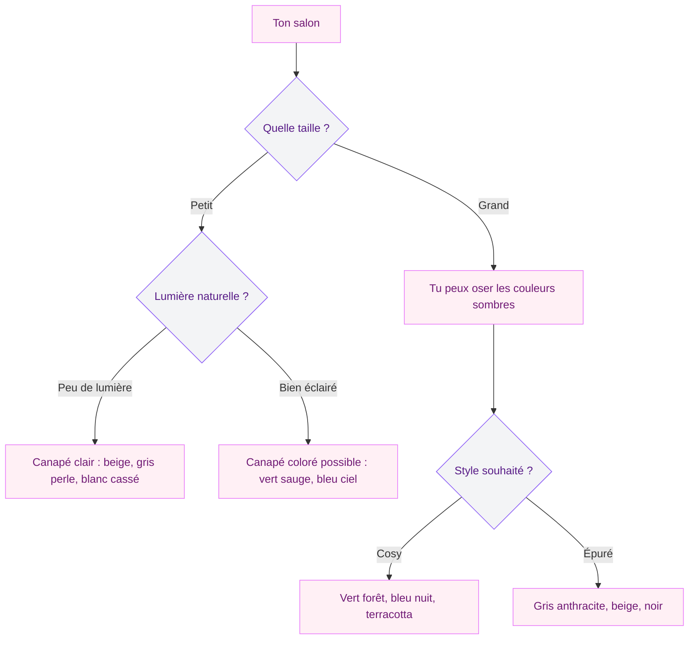
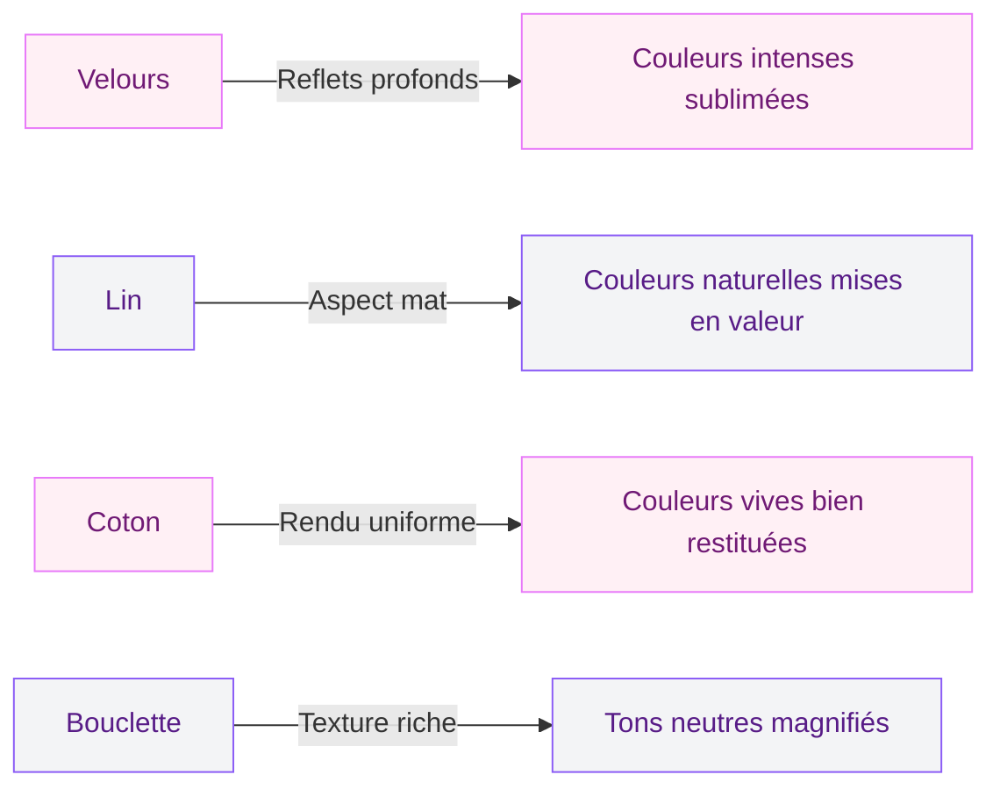

Le canapé, c'est le roi du salon. C'est lui qui donne le ton, qui attire l'oeil en premier et qui définit l'ambiance de la pièce. Et pourtant, quand vient le moment de choisir sa couleur, c'est souvent la panique. Trop neutre ? Trop risqué ? Est-ce que ce vert sauge va finir par te lasser au bout de six mois ?

Je comprends. Un canapé, c'est un investissement - entre 500 et 3000 euros selon les modèles. On n'a pas envie de se planter. Alors voilà mon approche pour trouver LA couleur qui te correspond, sans regrets et sans prise de tête.

## Pourquoi la couleur du canapé compte autant

Dans un salon, le canapé occupe en général entre 30 et 50 % du champ visuel. C'est le plus gros meuble de la pièce, celui autour duquel tout s'organise. Sa couleur va donc influencer énormément l'atmosphère générale.

  

Un canapé beige dans un salon blanc, c'est doux et lumineux. Le même salon avec un canapé vert forêt, c'est complètement différent - plus affirmé, plus cosy, plus "refuge". Et un canapé jaune moutarde ? On bascule dans quelque chose d'énergique et de joyeux.

La couleur du canapé interagit aussi avec tout le reste : la peinture des murs, le sol, les rideaux, les coussins, le tapis. C'est une décision qui se prend en contexte, pas de manière isolée.

> [!NOTE]
> Un canapé de qualité dure entre 10 et 15 ans. Choisis une couleur qui te plaît aujourd'hui mais qui te plaira aussi dans 5 ans. Les teintes neutres et les couleurs "nature" (vert, terracotta, bleu profond) vieillissent mieux que les couleurs très vives ou très mode.

## Les grandes familles de couleurs pour un canapé

  

### Le beige et le lin : la valeur sûre

C'est le choix le plus populaire, et pour une bonne raison. Un canapé beige ou couleur lin s'intègre à peu près partout, se marie avec toutes les couleurs de murs et permet de changer facilement de déco autour sans avoir à tout repenser.

**Les + :** polyvalent, lumineux, agrandit visuellement l'espace, facile à accessoiriser.
**Les - :** salissant (surtout avec des enfants ou un chat), peut sembler un peu fade sans les bons accessoires.

**Mes références :**
- IKEA KIVIK en housse Hillared beige : à partir de 599 euros, un best-seller pour les petits budgets
- Made.com Scott, 3 places en lin naturel : autour de 899 euros, des lignes élégantes
- AM.PM Nelia en lin lavé : 1 290 euros, le rapport qualité-style parfait
- Maisons du Monde Clic-clac Julian beige : 329 euros pour un studio

> [!TIP]
> Tu veux un canapé clair mais tu as peur des taches ? Privilégie les tissus déhoussables et lavables en machine. La housse KIVIK d'IKEA passe en machine à 40 degrés - un vrai plus au quotidien.

### Le gris : classique mais pas ennuyeux

Le gris a été la couleur star des canapés pendant des années. Il reste une option solide, à condition de bien choisir la nuance. Le gris froid et métallique, c'est daté. Le gris chaud, charbon ou anthracite, c'est toujours élégant.

**Les + :** cache mieux les taches qu'un beige, ambiance contemporaine, se marie bien avec les métaux (laiton, noir mat).
**Les - :** peut rendre un salon un peu froid si la pièce manque de lumière naturelle.

**Mes références :**
- IKEA FRIHETEN convertible gris foncé : 549 euros, parfait pour les petits espaces
- La Redoute Intérieurs Coton lin gris perle : 799 euros, texture agréable
- Habitat Posada gris anthracite : 1 099 euros, design affiné

Pour réchauffer un canapé gris, ajoute des coussins en couleurs chaudes - terracotta, moutarde, rouille - et un plaid en laine écru. Le contraste chaud/froid fonctionne à chaque fois.

### Le vert : la tendance forte de 2026

Le vert est partout cette année. Vert sauge, vert olive, vert forêt, vert d'eau - il y en a pour tous les goûts. Et sur un canapé, il apporte une fraîcheur naturelle qui transforme un salon.

**Les + :** tendance sans être éphémère (le vert revient chaque année sous différentes formes), apaisant, se marie au bois naturel.
**Les - :** attention à la nuance exacte - un vert mal choisi peut tirer vers le kaki terne.

**Mes références :**
- Bobochic Lena velours vert sauge : 649 euros, le coup de coeur du moment
- IKEA SODERHAMN housse vert olive : 399 euros pour la housse seule
- Made.com Orson velours vert forêt : 999 euros, ultra élégant
- Maisons du Monde Canapé Roma vert amande : 549 euros

Le vert sauge en particulier s'associe à merveille avec des murs blancs chauds, du bois clair et des touches de laiton. Si tu veux aller plus loin dans les associations, jette un oeil à mon guide sur les [couleurs tendance 2026 pour les murs](/couleurs-dinterieur-de-mur-et-de-peinture-a-la-mode-2026/) - le vert y tient une belle place.

### Le bleu : du doux au dramatique

Le bleu offre un spectre large. Un bleu pastel ou bleu ciel donne un côté frais et aérien. Un bleu nuit ou bleu canard, c'est du caractère à l'état pur.

**Les + :** couleur froide qui apaise, grande variété de nuances, se combine bien avec le blanc, le bois et les tons chauds.
**Les - :** le bleu roi ou électrique peut vite fatiguer dans un salon. Mieux vaut le garder pour des touches d'accent.

**Mes références :**
- IKEA EKTORP housse bleu clair : à partir de 249 euros la housse
- La Redoute Intérieurs Couvent velours bleu nuit : 1 199 euros, une pièce forte
- Bobochic Maja velours bleu canard : 729 euros, le bon compromis
- Habitat Porto bleu marine : 899 euros

> [!WARNING]
> Le velours bleu est magnifique mais il marque facilement (traces de doigts, reflets différents selon le sens du poil). Si tu as des enfants en bas âge ou des animaux, opte pour un tissu tissé plutôt que du velours lisse.

### Le terracotta et les tons chauds : le caractère

Le terracotta, le cognac, le brique, le rouille - ces teintes sont revenues en force et elles donnent immédiatement du caractère à un salon. Un canapé terracotta, c'est comme un coucher de soleil permanent dans ta pièce.

**Les + :** chaleureux, original sans être criard, se marie très bien avec le beige, le blanc cassé et le vert.
**Les - :** couleur affirmée qui domine la pièce, difficile à intégrer si tu changes souvent de déco.

**Mes références :**
- Maisons du Monde Roma terracotta : 549 euros
- Made.com Tubby velours rouille : 649 euros
- AM.PM Nelia en lin teinte terracotta : 1 490 euros, somptueux

Si le terracotta t'attire, regarde aussi les [associations avec l'orange en déco](/couleurs-compatibles-avec-lorange-pour-les-murs-et-la-decoration/) - beaucoup de palettes fonctionnent pareil.

## Comment choisir selon ta pièce

La couleur idéale dépend aussi de ton espace. Voici un arbre de décision simple pour t'orienter.

  

### Petit salon (moins de 15 m2)

Dans un petit espace, le canapé mange une bonne partie de la surface visuelle. Privilégie des couleurs claires ou moyennes : beige, gris clair, vert d'eau, bleu pastel. Ces teintes reflètent la lumière et donnent une impression d'ouverture.

Si tu tiens à une couleur soutenue, choisis un modèle compact (2 places) et équilibre avec des murs clairs et un tapis clair aussi. L'idée, c'est que la couleur forte reste une touche, pas une masse écrasante.

### Grand salon (plus de 25 m2)

Là, tu as de la place pour oser. Un canapé d'angle en velours vert forêt ou bleu nuit va créer un point focal puissant sans étouffer la pièce. Les couleurs profondes fonctionnent particulièrement bien dans les grands espaces parce qu'elles "ancrent" le mobilier et évitent l'effet "salle d'attente".

### Salon ouvert sur la cuisine

C'est le cas de figure le plus courant en 2026. Le canapé doit dialoguer avec les couleurs de la cuisine - plan de travail, façades, électroménager. Si ta cuisine est blanche et bois, pratiquement tout passe. Si elle est déjà colorée (bleu, vert, terracotta), reste sur un canapé neutre pour éviter la cacophonie visuelle.

## Les matières et leur impact sur la couleur

Un même coloris rend complètement différent selon la matière. C'est un point qu'on oublie trop souvent.

  

**Le velours** absorbe et reflète la lumière de manière inégale, ce qui donne de la profondeur à la couleur. Un bleu nuit en velours a un côté presque bijou. Un beige en velours prend des reflets dorés. C'est LA matière pour sublimer les teintes foncées.

**Le lin** a un rendu plus mat, plus brut. Il adoucit les couleurs et leur donne un côté "washed", décontracté. Un vert sauge en lin, c'est plus doux et plus organique que le même vert en coton. Le lin est la matière tendance de 2026, portée par AM.PM ou Caravane.

**La bouclette** (ou boucle) est la grande tendance texture du moment. Sa surface texturée capte la lumière de manière diffuse, pour un rendu moelleux. Elle est superbe dans les tons neutres : écru, crème, beige chaud, gris doux. Chez IKEA, la gamme en bouclette tourne autour de 699-999 euros selon la taille.

**Le cuir** mérite un mot à part. Un canapé en cuir cognac, c'est un classique qui traverse les décennies. Mais attention : le cuir change de couleur avec le temps (il fonce en général), et les canapés en cuir bon marché peuvent virer vers un aspect plastique peu flatteur. Budget minimum pour un cuir correct : 1 200 euros environ.

## Les associations canapé + murs qui marchent à tous les coups

Voici mes combinaisons préférées, testées et approuvées :

  

**Canapé beige + murs vert sauge** : doux, naturel, apaisant. Ajoute du bois clair et du rotin pour compléter.

**Canapé vert forêt + murs blancs chauds** : le canapé devient la star du salon. Accessoirise avec des coussins moutarde et un plaid en laine écru.

**Canapé bleu nuit + murs gris perle** : élégant, contemporain, un peu dramatique. Du laiton et du marbre blanc pour les accessoires.

**Canapé gris anthracite + murs terracotta** : le contraste chaud/froid fonctionne à la perfection. Un tapis berbère écru pour adoucir.

**Canapé terracotta + murs beige sable** : chaleur méditerranéenne garantie. Du bois foncé et des plantes vertes pour équilibrer.

Pour aller plus loin dans les palettes murales, mon article sur les [couleurs qui donnent de la profondeur à une pièce](/des-couleurs-pour-donner-de-la-profondeur-a-un-mur-ou-a-une-piece/) te donnera plein d'idées complémentaires.

> [!IMPORTANT]
> Teste toujours la couleur du canapé en magasin ou avec un échantillon de tissu chez toi. Les écrans d'ordinateur déforment les teintes - un "vert sauge" sur Instagram peut être un "vert kaki" dans la réalité. Demande systématiquement des échantillons gratuits (la plupart des marques en proposent).

## Les erreurs les plus courantes

**Acheter un canapé blanc immaculé avec des enfants.** Trust me, c'est un combat perdu d'avance. Même avec un traitement anti-taches, un canapé blanc dans une maison avec des petits, ça devient gris en six mois. Si tu veux du clair, prends du beige ou du grège - ça pardonne beaucoup plus.

**Choisir une couleur "tendance" sans la tester chez soi.** Le rose blush était partout en 2022. Trois ans plus tard, beaucoup de canapés roses sont en vente sur Leboncoin. Pose-toi la question : est-ce que cette couleur me plaît vraiment, ou est-ce que je la vois juste partout ?

**Ignorer la couleur du sol.** Un canapé marron sur un parquet foncé, c'est... beaucoup de marron. Vérifie que la couleur du canapé contraste suffisamment avec ton sol pour créer de la lisibilité visuelle.

**Oublier les coussins et le plaid.** Un canapé vert tout seul, ça peut sembler un peu brutal. Avec 3-4 coussins bien choisis (écru, moutarde, imprimé végétal) et un joli plaid, il prend vie instantanément. Budget coussins : 15-35 euros pièce chez H&M Home ou Zara Home.

## Mon conseil final

Si tu hésites entre deux couleurs, pose-toi cette question : "De laquelle je me lasserai le moins vite ?" En général, les couleurs naturelles et moyennement saturées (vert sauge, bleu grisé, beige chaud, terracotta doux) vieillissent mieux que les teintes très vives ou très à la mode.

Et rappelle-toi : un canapé, ça se change moins facilement qu'un mur de peinture. Si tu veux jouer la sécurité sur le canapé, tu peux toujours compenser avec des murs plus audacieux. C'est ma stratégie préférée : canapé neutre + murs avec du caractère. Comme ça, le jour où tu veux changer d'ambiance, tu reprends juste la peinture.

Si tu cherches de l'inspiration pour les murs justement, mon guide sur les [couleurs pour la salle à manger](/couleurs-pour-la-salle-a-manger-a-peindre-et-a-decorer/) te montrera comment peinture et mobilier peuvent raconter la même histoire.

## Sur le meme theme

- [chaise de salon](/chaise-salon/)

## FAQ

### Quelle est la couleur de canapé la plus facile à vivre ?

Le beige chaud ou le gris moyen. Ces deux teintes se marient avec pratiquement tous les styles de déco, cachent raisonnablement bien les taches et ne se démodent pas. Si tu veux un canapé qui dure 10 ans sans te lasser, c'est vers là que je te dirigerais.

### Un canapé coloré, c'est risqué ?

Pas du tout, à condition de bien l'entourer. Un canapé vert ou bleu dans un salon aux murs neutres, c'est superbe. Le risque, c'est de multiplier les couleurs fortes partout - canapé coloré + murs colorés + tapis à motifs = migraine visuelle. Garde un élément fort et équilibre le reste.

### Comment savoir si la couleur va aller avec mon salon ?

Demande des échantillons de tissu (gratuits chez la plupart des marques) et place-les chez toi, à côté de tes murs, de ton sol et de tes meubles. Regarde-les le matin, l'après-midi et le soir. La lumière artificielle change la perception des couleurs.

### Vert sauge ou vert forêt pour un canapé en 2026 ?

Le vert sauge est plus facile à intégrer - il va avec tout, c'est un "vert neutre" en quelque sorte. Le vert forêt a plus de caractère mais demande un salon lumineux et des associations bien pensées (bois clair, blanc, laiton). Mon avis : vert sauge si tu débutes, vert forêt si tu aimes les ambiances affirmées.
