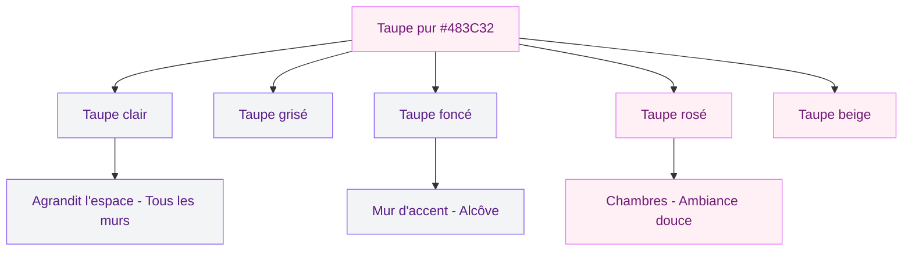
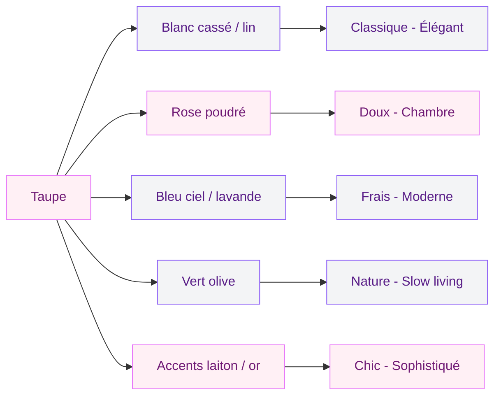
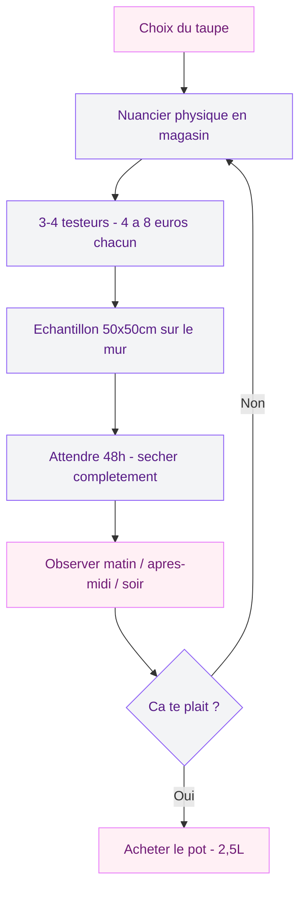

Le taupe, c'est cette couleur que tu ne sais jamais trop comment décrire. "C'est du gris, non ? Ou du marron ?" Un peu les deux en fait. Et c'est justement ce qui en fait une teinte aussi polyvalente - elle refuse de rentrer dans une case, et du coup elle s'adapte à tout. Si tu cherches une couleur qui fonctionne dans n'importe quelle pièce, avec n'importe quel style, sans jamais fatiguer l'oeil, le taupe est probablement ta meilleure option. Et je ne dis pas ça à la légère.

## Le taupe, c'est quoi au juste ?

Le mot vient directement du français - "la taupe", l'animal. On a nommé la couleur d'après la fourrure gris-brun de ce petit mammifère souterrain. En code hex, le taupe de référence c'est le #483C32 : un brun moyen tirant sur le gris, ni chaud ni froid, pile entre les deux.

  

Ce qui rend le taupe si intéressant en déco, c'est cette ambiguité. Le cerveau perçoit à la fois la chaleur du brun et la neutralité du gris. Résultat : une couleur qui réchauffe une pièce froide mais qui n'écrase jamais un espace lumineux. Le taupe joue les deux camps, et il le fait bien.

En pratique, le taupe pur est assez rare. Ce qu'on appelle "taupe" dans les nuanciers des magasins couvre en réalité un spectre large de teintes. Chez Leroy Merlin, Castorama ou les marques comme Seigneurie, Tollens ou Dulux Valentine, tu trouveras des dizaines de variantes classées sous cette appellation.

> [!NOTE]
> Le taupe se distingue du greige (gris + beige) par sa composante brune plus marquée. Le greige est plus froid et plus gris, le taupe tire davantage vers la terre. Pour choisir entre les deux, regarde la lumière de ta pièce : lumière froide (nord) = taupe, lumière chaude (sud) = greige.

## Les grandes nuances de taupe

Avant de te lancer, il faut comprendre que tous les taupes ne se valent pas. Voici les cinq grandes familles que tu vas croiser.

  

**Le taupe clair** - C'est la version la plus douce, presque beige avec un soupçon de gris. Idéal pour les murs d'une pièce entière sans risquer l'effet caverne. Il agrandit visuellement l'espace et laisse passer la lumière. Chez Tollens, cherche la teinte "Poudre de riz" ; chez Dulux Valentine, "Brun cachemire clair".

**Le taupe grisé** - Plus froid, plus minéral. C'est celui qui se rapproche le plus du gris tout en gardant une touche de chaleur. Parfait pour un intérieur scandinave ou contemporain. La référence "Gris Poivre" chez Luxens (Leroy Merlin) autour de 25-35 euros le pot de 2,5L est un bon point de départ.

**Le taupe foncé** - Intense et profond, presque chocolat. Il donne du caractère à un mur d'accent mais il faut l'utiliser avec modération. Sur les quatre murs d'une petite pièce, ça devient vite étouffant. Réserve-le à un pan de mur, une alcôve ou un plafond haut.

**Le taupe rosé** - La version la plus douce et la plus féminine. Un brun avec des sous-tons roses qui crée une atmosphère très enveloppante. Chez Farrow & Ball, la teinte "Dead Salmon" (oui, le nom est bizarre, mais la couleur est magnifique) est un taupe rosé parfait, autour de 85 euros le pot de 2,5L.

**Le taupe beige** - Le plus chaud de la famille, celui qui tire le plus vers le brun doré. Il fonctionne bien dans les pièces orientées nord parce qu'il compense le manque de lumière chaude naturelle.

## Les meilleures associations avec le taupe

Le taupe est un caméléon. Selon ce que tu mets à côté, il peut paraître chaud ou froid, moderne ou classique, cosy ou épuré. Voici les combinaisons qui marchent à tous les coups.

  

### Taupe + blanc cassé : l'élégance tranquille

C'est l'association la plus sûre et la plus lumineuse. Un mur taupe avec des boiseries, un plafond et des meubles en blanc cassé (pas blanc pur, trop froid), c'est la recette d'un intérieur apaisant et élégant. C'est la combinaison préférée des décorateurs d'intérieur pour les appartements haussmanniens.

Pour les murs blancs, évite le blanc titane froid. Choisis un blanc légèrement teinté - "Blanc Lin" ou "Blanc Ivoire" chez Seigneurie (pot de 2,5L entre 30 et 50 euros). La différence est subtile mais le résultat est bien plus harmonieux.

### Taupe + rose poudré : la douceur absolue

Mon combo préféré pour une chambre. Le taupe apporte l'ancrage et le rose poudré la douceur. Ça ne fait jamais "bonbonnière" parce que le taupe est suffisamment terreux pour tempérer le rose. Pense à des coussins en velours rose blush sur un canapé taupe, ou un mur taupe rosé avec des draps en lin rose pâle.

Pour les textiles, Maisons du Monde propose des coussins velours rose poudré entre 12 et 25 euros. AM.PM fait aussi de très belles housses de couette en lin dans ces tons-là, autour de 90-140 euros la housse.

### Taupe + bleu ciel ou lavande : le contraste doux

Le bleu apporte de la fraîcheur au taupe sans le refroidir complètement. Un taupe chaud avec des touches de bleu ciel - un fauteuil, des coussins, un vase - ça crée un équilibre très agréable. La version lavande fonctionne aussi, en plus originale et plus tendance.

Si tu aimes les palettes couleur de cette saison, tu retrouveras le bleu et le taupe parmi les associations plébiscitées dans mon guide sur les [couleurs tendance 2026 pour les murs et la peinture](/couleurs-dinterieur-de-mur-et-de-peinture-a-la-mode-2026/).

### Taupe + vert olive : la palette nature

Le vert olive et le taupe, c'est la nature qui entre chez toi. Les deux couleurs partagent des sous-tons terreux qui les rendent naturellement compatibles. Ajoute du rotin, du bois brut et des plantes vertes - tu obtiens un intérieur slow living très réussi.

### Taupe + accents laiton ou dorés : le côté chic

Le taupe est une toile de fond parfaite pour les métaux chauds. Des poignées en laiton brossé, un miroir cerclé d'or, une suspension en métal doré - ces petits accents réchauffent le taupe et lui donnent une dimension plus luxueuse. Chez Zara Home, tu trouves des accessoires déco en laiton entre 15 et 60 euros.

> [!TIP]
> Règle pratique pour doser les accents métalliques : maximum 3 objets dorés ou laiton par pièce. Au-delà, l'effet "trop chargé" guette. Un luminaire, un miroir et un objet déco - c'est le bon ratio.

## Le taupe pièce par pièce

  

### Le salon : la pièce idéale pour le taupe

Le salon est l'endroit où le taupe donne le meilleur de lui-même. Un mur taupe derrière le canapé, les autres en blanc cassé ou lin - c'est une valeur sûre. Si tu veux aller plus loin, tu peux peindre l'ensemble des murs en taupe clair et jouer avec des textiles plus soutenu pour la profondeur.

Pour un salon de 20m2, compte environ 80-110 euros de peinture (2 pots de 2,5L en qualité moyenne type Luxens ou Dulux Valentine). Ajoute 15-25 euros pour un bon rouleau et du ruban de masquage.

Un canapé en lin naturel ou en velours gris clair sur fond taupe, c'est canon. Et si tu hésites sur la couleur de ton canapé, j'ai écrit un guide complet pour [choisir la couleur de son canapé](/couleur-canape-choisir/) qui peut t'aider.

> [!WARNING]
> Le taupe foncé au salon absorbe beaucoup de lumière. Si ta pièce est orientée nord ou a peu de fenêtres, reste sur un taupe clair ou limite le taupe foncé à un seul mur. Sinon, compense avec un bon éclairage : des lampes à 3000K (blanc chaud) posées à différentes hauteurs.

### La chambre : cocooning sans effort

Le taupe en chambre, c'est le cocooning garanti. Cette couleur enveloppe sans oppresser. Un mur derrière la tête de lit en taupe moyen, le reste en blanc chaud - tu crées une bulle de sérénité.

Pour les draps, privilégie le lin lavé en blanc, crème ou rose poudré. Les marques comme La Redoute Intérieurs (housse de couette lin lavé à partir de 70 euros) ou IKEA (gamme DYTAG en lin mélangé autour de 35 euros) proposent de bons rapports qualité-prix.

Côté mobilier, le bois de chêne clair ou le noyer s'accordent parfaitement avec le taupe. Évite le bois blanc laqué qui crée un contraste trop dur.

### La cuisine : le taupe contemporain

Le taupe en cuisine remplace avantageusement le gris pur qui a dominé les cuisines ces dix dernières années. Des façades taupe avec un plan de travail en chêne ou en marbre blanc, c'est une cuisine élégante sans en faire trop. Pour un relooking sans tout changer, repeins tes façades avec une peinture V33 "Rénovation Cuisine" (environ 35 euros le pot de 0,75L, suffisant pour 8 à 10m2).

### La salle de bain : douceur et chaleur

Le taupe adoucit l'atmosphère souvent froide du carrelage blanc. Un mur en taupe rosé avec des serviettes lin et des accessoires en bois, ça transforme la pièce. Choisis une peinture spéciale pièces humides - Tollens ou Dulux Valentine proposent des formules anti-moisissures entre 35 et 55 euros le pot de 2L.

## Les 3 erreurs classiques avec le taupe

**Confondre taupe et gris.** Un gris froid à la place d'un taupe donne un résultat austère au lieu de chaleureux. Teste toujours un échantillon en lumière naturelle.

  

**Tout peindre en taupe foncé.** Quatre murs en taupe soutenu dans 12m2, ça fait cage. Garde un plafond blanc et au moins deux murs plus clairs.

**Trop de noir avec du taupe.** Un peu de noir (cadres, luminaires fins) c'est graphique. Trop de noir, c'est terne. Préfère le laiton ou le bois foncé pour les contrastes.

> [!IMPORTANT]
> Le taupe change énormément selon l'éclairage. Une même teinte peut paraître rosée le matin (lumière froide), presque brune l'après-midi (lumière chaude) et grise le soir (lumière artificielle). Avant de peindre, applique un échantillon de 30x30cm et observe-le à trois moments différents de la journée. Ça t'évitera les mauvaises surprises.

## Comment choisir le bon taupe en magasin

Les écrans affichent les couleurs différemment de la réalité. Ma méthode en 4 étapes :

1. **Repère 3 à 4 teintes** dans le nuancier physique du magasin. Chez Leroy Merlin et Castorama, les nuanciers sont en libre service au rayon peinture.
2. **Achète des testeurs** - petits pots de 75mL entre 4 et 8 euros chez Dulux Valentine, Luxens ou Tollens.
3. **Peins un carré de 50x50cm** sur ton mur (la couleur change selon l'orientation).
4. **Attends 48h** - le taupe fonce en séchant. La couleur humide n'est pas la couleur finale.

Pour creuser le sujet des couleurs qui donnent de la profondeur à un espace, mon article sur les [couleurs pour donner de la profondeur a un mur](/des-couleurs-pour-donner-de-la-profondeur-a-un-mur-ou-a-une-piece/) te sera utile.

## Le taupe selon ton style déco

Le taupe s'adapte à tous les registres. En version scandinave, choisis un taupe clair avec du mobilier en bouleau et des textiles en lin blanc - le taupe remplace le gris pâle classique en apportant plus de chaleur. En version classique, un taupe moyen avec des moulures blanches et un parquet à chevrons, c'est l'alternative moderne au beige haussmannien. L'association avec l'orange en accent apporte une énergie inattendue - tu trouveras des idées dans mon guide sur les [couleurs compatibles avec l'orange](/couleurs-compatibles-avec-lorange-pour-les-murs-et-la-decoration/).

En version minimaliste, le taupe grisé avec des lignes épurées et du laiton fonctionne à merveille. Et en version bohème, le taupe en toile de fond calme le jeu face aux textiles colorés (kilim, macramé) sans étouffer l'ensemble.

Si tu n'es pas sûre de toi, commence petit : un plaid et deux coussins taupe sur ton canapé (30-60 euros), puis un vase en céramique. Si ça te plaît, passe à un mur d'accent un weekend. Le taupe est consensuel, les chances de regretter sont faibles. Et si ça ne te convient pas, ça se repeint en une demi-journée.

---

## Sur le meme theme

- [couleurs qui se marient avec le violet](/quelles-sont-les-couleurs-qui-se-marient-bien-avec-le-violet-en-decoration/)

## FAQ - Couleur taupe en décoration

**Le taupe est-il une couleur chaude ou froide ?**
Le taupe est une couleur neutre qui se situe entre les deux. Il contient des pigments bruns (chauds) et gris (froids), ce qui lui donne cette capacité unique de s'adapter à son environnement. Un taupe rosé sera perçu comme chaud, un taupe grisé comme plus froid. C'est cette dualité qui le rend si polyvalent en déco.

**Quelle est la différence entre taupe et greige ?**
Le greige est un mélange de gris et de beige, plutôt froid et minéral. Le taupe est un mélange de gris et de brun, plus terreux et plus chaud. En magasin, le greige tire vers le gris clair, le taupe tire vers le brun doux. Les deux sont neutres mais l'ambiance créée est différente - le greige fait plus urbain, le taupe plus cosy.

**Le taupe convient-il à une petite pièce ?**
Oui, à condition de choisir un taupe clair. Les versions claires agrandissent visuellement l'espace, comme le ferait un beige. En revanche, les taupes foncés rétrécissent la pièce. Pour un studio ou une petite chambre, opte pour un taupe très clair sur tous les murs avec un plafond blanc pour préserver la hauteur.

**Quelles couleurs de rideaux associer avec des murs taupe ?**
Blanc cassé ou lin naturel pour un look lumineux et frais. Rose poudré pour une touche douce. Bleu ciel ou vert sauge pour un contraste subtil. Évite les rideaux taupe sur murs taupe - le résultat manque de contraste et la pièce paraît plate.

**Combien coûte un pot de peinture taupe de qualité ?**
Les prix varient selon les marques. Entrée de gamme : Luxens (Leroy Merlin) entre 25 et 35 euros le pot de 2,5L. Milieu de gamme : Dulux Valentine ou Tollens entre 40 et 55 euros. Premium : Farrow & Ball ou Ressource entre 75 et 100 euros le pot de 2,5L. Pour un mur de 10m2, un pot de 2,5L suffit en deux couches.
