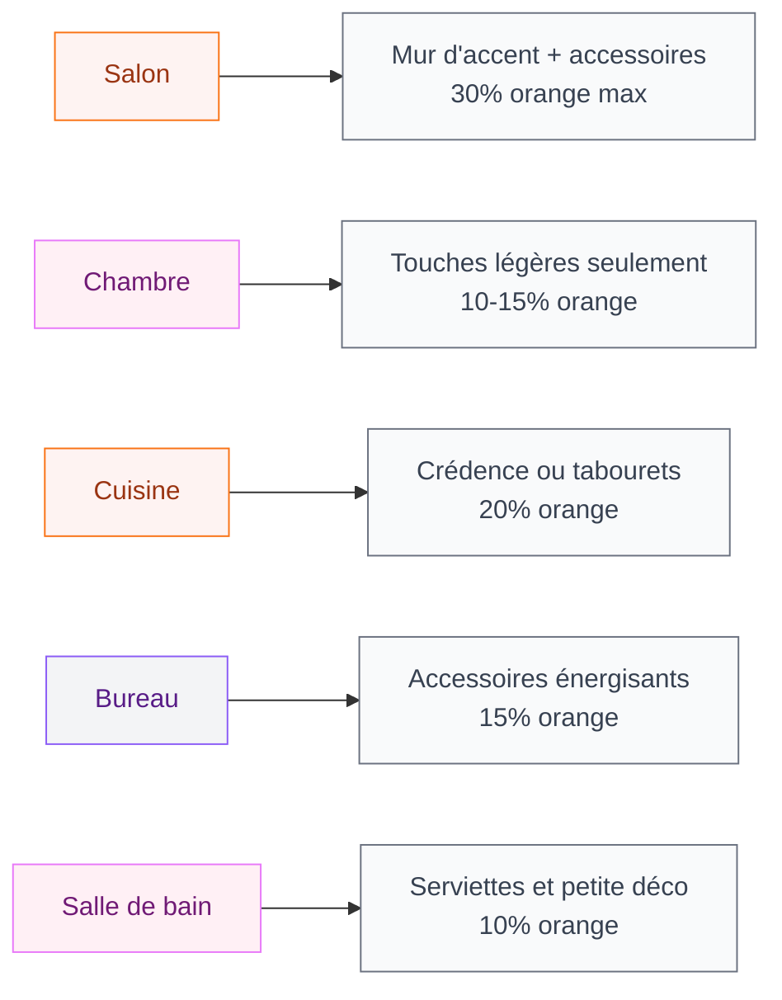

# Couleurs compatibles avec l'orange : comment créer des associations qui claquent

L'orange en déco, c'est un peu comme le piment en cuisine : bien dosé, ça transforme tout. Mal associé, ça pique les yeux. Si tu viens de craquer pour un mur orange, un canapé couleur mandarine ou des accessoires terracotta, tu te poses probablement LA question : quelles couleurs vont avec ?

Bonne nouvelle : l'orange est bien plus facile à associer qu'on ne le croit. Que tu veuilles un intérieur moderne et graphique ou une ambiance douce et chaleureuse, il existe des combinaisons testées et approuvées qui fonctionnent à tous les coups.

Je te donne ici mes palettes préférées, avec des références de peinture et des pièces concrètes pour chaque association. On y va ?

## Comprendre l'orange : une couleur plus riche qu'il n'y paraît

Avant de foncer en magasin, il faut savoir que "orange" recouvre une grande famille de nuances. Un orange vif type Hermès, un orange brûlé tirant vers le rouille, un pêche clair ou un terracotta profond - ce ne sont pas du tout les mêmes teintes, et elles ne s'associent pas aux mêmes couleurs.

<div class="my-8">
  
</div>


Voici les grandes catégories :

- **Orange vif** : énergique, solaire, parfait en touche d'accent
- **Terracotta / orange brûlé** : chaud, terreux, très tendance en 2026
- **Pêche / abricot** : doux, lumineux, idéal pour les murs entiers
- **Mandarine** : entre le vif et le doux, polyvalent

> [!TIP]
> Avant de peindre un mur entier, achète un pot d'essai (Dulux Valentine en propose à 6,90 euros le testeur). Applique deux couches sur un carton A3 et déplace-le dans la pièce à différentes heures. La lumière naturelle change complètement la perception d'une teinte orange.

## Les 6 meilleures combinaisons avec l'orange


<div class="my-8">
  
</div>

### Orange + bleu canard : le duo star

C'est LA combinaison complémentaire par excellence. Sur le cercle chromatique, le bleu se trouve en face de l'orange - ils se renforcent mutuellement et créent un contraste saisissant.

**Pourquoi ça marche :** le bleu canard refroidit l'énergie de l'orange et apporte de la profondeur. L'ensemble est à la fois dynamique et équilibré.

**En pratique :**
- Murs orange pêche clair (Farrow & Ball "Orangery" no 70, environ 52 euros/L) + canapé bleu canard (IKEA KIVIK housse Tallmyra bleu, 199 euros)
- Mur d'accent bleu canard foncé + coussins et plaids orange sur un canapé neutre
- Accessoires : vases en céramique bleu canard sur une étagère avec des bougies orange

**Pièces idéales :** salon, bureau, chambre d'ado

### Orange + gris : l'élégance contemporaine

Le gris est le meilleur ami des couleurs chaudes. Il sert de base neutre qui laisse l'orange briller sans compétition. C'est l'association la plus simple à réussir, même quand on débute en déco.

**Pourquoi ça marche :** le gris absorbe l'intensité de l'orange et donne un rendu moderne, presque architectural. Plus le gris est clair, plus l'ambiance sera douce. Plus il est foncé, plus le contraste sera marqué.

**En pratique :**
- Murs gris perle (Dulux Valentine "Gris tendance", 29,90 euros/2,5L) + mobilier orange en touche (fauteuil d'appoint Maisons du Monde "Vintage" orange, 349 euros)
- Sol béton ciré gris + tapis orange terracotta
- Cuisine grise avec crédence en carreaux orange

> [!NOTE]
> La règle des 60-30-10 fonctionne super bien ici : 60% de gris (murs, sol), 30% de blanc ou beige (mobilier principal), 10% d'orange (accessoires, coussins, art mural). Résultat garanti.

**Pièces idéales :** salon, cuisine, entrée

### Orange + vert sauge : la connexion nature

Cette combinaison est partout en 2026, et pour de bonnes raisons. Le vert sauge et l'orange terracotta évoquent les paysages méditerranéens, les marchés d'épices, la terre et les plantes. C'est organique et apaisant.

**Pourquoi ça marche :** vert et orange sont des couleurs analogues tirant vers les tons chauds de la nature. Elles cohabitent sans se faire concurrence.

**En pratique :**
- Murs vert sauge (Leroy Merlin peinture Luxens "Sauge" à 24,90 euros/2,5L) + textiles orange : coussins, rideaux en lin
- Canapé vert olive + plaids terracotta + plantes vertes (la vraie verdure amplifie l'effet)
- Salle de bain : carrelage vert d'eau + serviettes et accessoires orange pêche

Si tu cherches d'autres teintes apaisantes pour équilibrer ton intérieur, jette un oeil à notre guide sur les [couleurs apaisantes et zen](/couleurs-apaisantes-zen/) - ça complète très bien une palette orange.

**Pièces idéales :** chambre, salon, salle de bain

### Orange + blanc : la fraîcheur lumineuse

Simple, efficace, lumineux. Le blanc est la valeur sûre pour n'importe quelle nuance d'orange. Il purifie la palette et empêche la pièce de paraître trop chargée.

**Pourquoi ça marche :** le blanc réfléchit la lumière et met en valeur la chaleur de l'orange par contraste. C'est la combinaison la plus facile à vivre au quotidien.

**En pratique :**
- Murs blancs (le classique Dulux Valentine "Blanc parfait") + un seul mur d'accent orange mandarine
- Mobilier blanc laqué + accessoires orange vif pour un style scandinave punchy
- Cuisine blanche avec tabourets de bar orange (les JANINGE d'IKEA à 45 euros sont parfaits)

**Pièces idéales :** toutes les pièces, surtout celles qui manquent de luminosité

### Orange + noir : l'audace graphique

Cette association, c'est du caractère à l'état pur. Le noir structure l'espace et donne à l'orange une allure presque luxueuse. Attention, ça demande un peu de doigté pour ne pas créer une ambiance trop oppressante.

**Pourquoi ça marche :** le noir apporte du contraste maximal et un côté contemporain assez fort. L'orange tempère ce que le noir peut avoir de froid.

**En pratique :**
- Mobilier noir mat + coussins et plaids orange vif + murs blancs ou beige pour équilibrer
- Cadres noirs avec des affiches aux tons orange sur un mur clair
- Salle à manger : table noire, chaises noires, suspension orange (La Redoute, suspension dôme colorée à partir de 79 euros)

> [!WARNING]
> Avec le duo orange + noir, limite l'orange à 15-20% de la surface visible. Trop d'orange avec du noir peut virer Halloween. Garde toujours une base neutre (blanc, beige, bois clair) pour aérer l'ensemble.

**Pièces idéales :** bureau, salon, chambre d'ado

### Orange + beige et tons naturels : la douceur terracotta

Pour celles et ceux qui veulent de l'orange sans prise de risque, la palette terre est idéale. Beige, crème, sable, bois naturel - tout ce qui évoque les matières brutes se marie avec l'orange en créant une atmosphère cocooning.

**En pratique :**
- Murs beige chaud + textiles terracotta + mobilier en bois de chêne ou noyer
- Tapis jute naturel + coussins en lin orange brûlé
- Salon complet dans les tons neutres avec des touches de terracotta par les accessoires

Si cette ambiance chaleureuse et naturelle te parle, tu retrouveras plein d'idées dans notre article sur la [décoration salon naturel chic](/decoration-salon-naturel-chic/) et aussi dans les [tendances déco 2026](/tendances-deco-2026/) où le terracotta est très présent.

**Pièces idéales :** salon, chambre, toute la maison

## Visualiser les associations : le cercle chromatique de l'orange

```mermaid
graph TD
    A["ORANGE"] --> B["Bleu canard"]
    A --> C["Gris"]
    A --> D["Vert sauge"]
    A --> E["Blanc"]
    A --> F["Noir"]
    A --> G["Beige / Naturel"]
    B --> H["Complémentaire - contraste fort"]
    C --> I["Neutre - élégance moderne"]
    D --> J["Analogue - douceur nature"]
    E --> K["Neutre - fraîcheur"]
    F --> L["Contraste - audace graphique"]
    G --> M["Camaïeu - cocooning"]

<div class="my-8">
  
</div>


    style A fill:#FEF3F2,stroke:#F97316,color:#9A3412
    style B fill:#FFF0F5,stroke:#E879F9,color:#701A75
    style C fill:#F9FAFB,stroke:#6B7280,color:#374151
    style D fill:#FFF0F5,stroke:#E879F9,color:#701A75
    style E fill:#F9FAFB,stroke:#6B7280,color:#374151
    style F fill:#F3F4F6,stroke:#8B5CF6,color:#581C87
    style G fill:#FEF3F2,stroke:#F97316,color:#9A3412
    style H fill:#F3F4F6,stroke:#8B5CF6,color:#581C87
    style I fill:#F9FAFB,stroke:#6B7280,color:#374151
    style J fill:#FFF0F5,stroke:#E879F9,color:#701A75
    style K fill:#F9FAFB,stroke:#6B7280,color:#374151
    style L fill:#F3F4F6,stroke:#8B5CF6,color:#581C87
    style M fill:#FEF3F2,stroke:#F97316,color:#9A3412
```

## Comment doser l'orange selon la pièce

L'orange ne se déploie pas de la même façon partout. Voici un guide rapide pour ne pas te planter :

<div class="my-8">
  
</div>




Dans le salon, l'orange peut prendre plus de place. Un mur entier peint en terracotta, un grand canapé mandarine, un tapis généreux - ça fonctionne parce que c'est une pièce de vie où l'énergie est bienvenue.

En chambre, en revanche, vas-y mollo. L'orange est stimulant, c'est son super-pouvoir mais aussi sa limite dans un espace de repos. Préfère des nuances pêche ou abricot très clair pour les murs, et réserve l'orange plus soutenu aux coussins ou à un plaid.

Pour la cuisine, c'est le terrain de jeu idéal de l'orange. Cette couleur ouvre l'appétit (les marques de fast-food le savent bien). Une crédence en carreaux orange, des tabourets colorés, même des petits appareils électro - ça donne immédiatement une atmosphère conviviale.

> [!IMPORTANT]
> La luminosité de la pièce change tout. Un orange qui paraît doux dans un showroom bien éclairé peut devenir écrasant dans un salon sombre orienté nord. Teste toujours in situ, à différentes heures de la journée.

## Accessoires et textiles : l'orange en touches stratégiques

Pas envie de repeindre ? Les accessoires sont le moyen le plus simple (et le moins cher) d'intégrer l'orange dans ta déco.

<div class="my-8">
  
</div>


**Coussins et plaids :** c'est le point d'entrée classique. Deux ou trois coussins orange sur un canapé gris ou beige, ça suffit à transformer l'espace. Chez H&M Home, tu trouves des housses en lin orange brûlé à partir de 12,99 euros. Chez Zara Home, les plaids en coton gaufré orange pêche tournent autour de 39,99 euros.

**Rideaux et voilages :** un voilage orange clair filtre la lumière naturelle et donne un ton chaud à toute la pièce. Effet garanti, surtout dans les espaces orientés nord qui manquent de chaleur.

**Vases et objets déco :** un grand vase en céramique orange sur une étagère, un plateau décoratif, des bougies - ces petites touches construisent la palette sans engagement. Si tu veux apprendre à bien [habiller tes murs avec style](/deco-murale-idees-habiller-murs-style/), ça vaut le coup de combiner cadres et objets dans les mêmes tons.

**Tapis :** un tapis terracotta ou orange brûlé peut devenir la pièce centrale du salon. Chez Maisons du Monde, le tapis tissé "Essaouira" en jute et coton terracotta démarre à 149 euros en 160x230 cm.

> [!TIP]
> Mon astuce préférée pour utiliser l'orange sans risque : la méthode du "triangle". Place trois éléments orange dans la pièce, en formant un triangle visuel. Par exemple : un coussin sur le canapé, un vase sur l'étagère en face, et une bougie sur la table basse. Ça crée une harmonie naturelle et l'oeil circule dans tout l'espace.

## Les références peinture à retenir

Voici mes teintes orange préférées, testées et approuvées, pour les murs et les boiseries :

| Marque | Référence | Nuance | Prix moyen | Idéal pour |
|--------|-----------|--------|------------|------------|
| Farrow & Ball | Orangery no 70 | Orange pêche doux | 52 euros/L | Mur d'accent salon ou chambre |
| Dulux Valentine | Ocre orange | Orange chaud moyen | 32 euros/2,5L | Pièce de vie lumineuse |
| Tollens | Terracotta T2050-4 | Terracotta profond | 38 euros/2,5L | Salon, entrée |
| Leroy Merlin Luxens | Mandarine | Orange vif | 24,90 euros/2,5L | Touche ponctuelle, bureau |
| Little Greene | Orange Aurora | Orange foncé élégant | 62 euros/L | Boiseries, accent haut de gamme |

Pour les couleurs d'accompagnement (gris, bleu canard, vert sauge), les gammes Dulux Valentine et Luxens chez Leroy Merlin offrent un bon rapport qualité-prix, entre 20 et 35 euros le pot de 2,5L.

## Les associations à éviter

Tout ne va pas avec l'orange. Voici les combinaisons qui coincent :

- **Orange + rose bonbon** : trop de couleurs chaudes saturées ensemble, ça devient fatigant pour l'oeil
- **Orange vif + rouge vif** : en théorie les couleurs analogues marchent, mais deux teintes très intenses côte à côte créent une compétition visuelle
- **Orange + marron foncé sans neutre** : ça peut vite faire "années 70" version pas chic. Ajoute toujours du blanc ou du beige clair pour aérer
- **Trop d'orange partout** : même la plus belle teinte devient envahissante si elle couvre plus de 40% de la pièce


## Sur le meme theme

- [couleurs ocres pour les murs et la décoration](/guides/couleurs/couleurs-ocres-pour-les-murs-et-la-decoration/)
- [couleur taupe](/guides/couleurs/couleur-taupe/)
- [couleurs qui se marient avec le violet](/guides/couleurs/quelles-sont-les-couleurs-qui-se-marient-bien-avec-le-violet-en-decoration/)
- [couleurs pour donner de la profondeur](/guides/couleurs/des-couleurs-pour-donner-de-la-profondeur-a-un-mur-ou-a-une-piece/)
- [couleurs pour la salle à manger](/guides/couleurs/couleurs-pour-la-salle-a-manger-a-peindre-et-a-decorer/)

## FAQ

**Quelle est la couleur complémentaire de l'orange ?**
Le bleu est la couleur complémentaire directe de l'orange sur le cercle chromatique. En décoration intérieure, le bleu canard et le bleu pétrole fonctionnent particulièrement bien pour créer un contraste élégant et équilibré avec n'importe quelle nuance d'orange.

**L'orange convient-il pour une chambre ?**
Oui, mais en choisissant les bonnes nuances. Évite l'orange vif sur les murs (trop stimulant pour le sommeil) et préfère des teintes douces comme le pêche, l'abricot ou le terracotta clair. Réserve l'orange plus soutenu aux accessoires : coussins, plaid, lampe de chevet.

**Comment intégrer l'orange dans un intérieur moderne ?**
La clé, c'est le dosage et les couleurs d'accompagnement. Un intérieur moderne combine l'orange avec des tons neutres (gris, blanc, noir) et des lignes épurées. Privilégie le mobilier aux formes simples et limite l'orange à des touches stratégiques : un fauteuil d'appoint, une oeuvre murale, des accessoires bien placés. Le style [bohème chic](/salon-boheme-deco-chic-coloree/) intègre aussi très bien l'orange avec des couleurs vives et des textures variées.

**Terracotta et orange, c'est la même chose ?**
Pas tout à fait. Le terracotta est une nuance d'orange tirant vers le brun et le rouge brique, inspirée de l'argile cuite. Il est plus sourd et terreux que l'orange classique. En déco, le terracotta est souvent plus facile à vivre que l'orange vif car il se rapproche des couleurs naturelles et s'associe bien avec à peu près tout.
