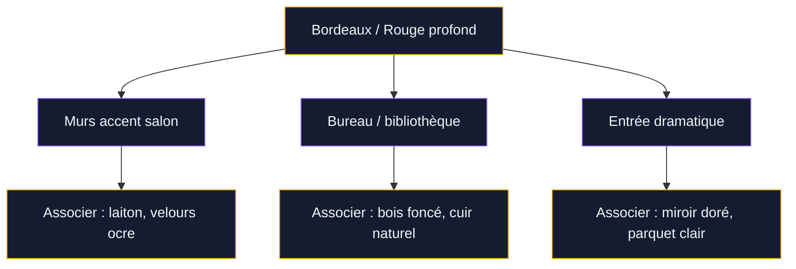
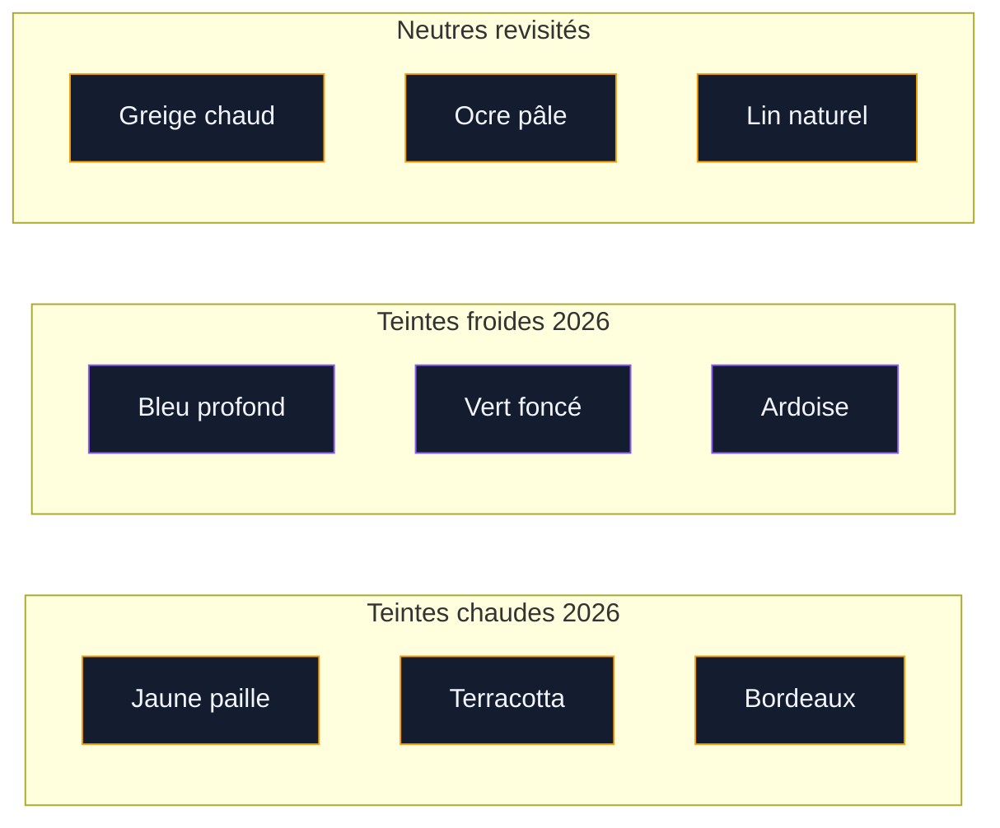

Si tu regardes les tendances déco de ces dernières années, tu vois quelque chose d'intéressant se dessiner : la couleur revient en force. Finis les intérieurs tout blancs, uniformes et sans âme. En 2026, les murs ont quelque chose à dire. Les designers, les marques de peinture et les décorateurs s'accordent tous sur un point : cette année, on ose les teintes affirmées, les accords inattendus, les palettes qui créent une vraie atmosphère.

Mais entre le vert bouteille, le bleu nuit, le terracotta et le jaune paille, difficile de savoir par où commencer. Alors voilà un tour complet des couleurs de mur et de peinture les plus tendance en 2026, avec des conseils concrets pour les utiliser chez toi.

## Pourquoi 2026 marque un tournant pour la couleur en déco

Pendant des années, le blanc cassé et le gris clair ont régné en maîtres. C'était pratique, reposant, vendeur aussi. Mais quelque chose a changé après les années de confinement et de cocooning intensif : les gens ont envie que leur intérieur leur ressemble vraiment, qu'il soit chaleureux, enveloppant, singulier.

  

Les designers décrivent les intérieurs 2026 comme "plus incarnés". La couleur ne sert plus juste à habiller un mur - elle devient un outil pour créer une émotion, une ambiance. Un bleu profond dans une chambre, c'est une promesse de calme. Un bordeaux dans un salon, c'est une invitation à la convivialité. Un vert sauge dans une cuisine, c'est un ancrage dans la nature.

> [!NOTE]
> Les grands fabricants de peinture (Benjamin Moore, Farrow & Ball, Little Greene) publient chaque année leurs "couleurs de l'année". En 2026, plusieurs ont choisi des teintes sombres et profondes, signe que la tendance est solide et pas juste un effet de mode.

## Le bleu profond : la star incontestée de 2026

C'est la grande couleur de cette année. Le bleu profond - dans ses nuances ardoise, marine, minérale ou quasi-noir - s'impose partout. Il s'inspire des océans, du ciel nocturne, des minéraux anciens.

  

Ce n'est pas le bleu vif et cartoonesque des années 80. C'est un bleu adulte, sophistiqué, qui absorbe la lumière et donne une présence très particulière à un mur.

**Teintes de référence :**
- "Hague Blue" de Farrow & Ball (environ 75 €/litre) : le bleu nuit par excellence, très foncé, presque noir en lumière artificielle
- "Navy Night" de Little Greene (autour de 65 €/litre) : plus chaud, avec une pointe de violet
- "Naval" de Sherwin-Williams : un bleu marine intemporel, très polyvalent

**Comment l'utiliser ?** Le bleu profond fonctionne très bien sur un mur accent dans un salon ou une chambre. Il aime être associé au laiton vieilli, au bois naturel et au lin beige. Si tu veux aller plus loin, peins les quatre murs d'une petite pièce - l'effet cocon est saisissant.

> [!TIP]
> Dans une chambre peinte en bleu profond, une literie en lin blanc crème ou en coton lavé crée un contraste magnifique. Évite le blanc pur - trop froid, trop brutal.

## Le vert : des nuances pour tous les goûts

Le vert n'est plus une nouveauté, mais il mûrit. En 2026, il se décline dans plusieurs registres qui méritent chacun qu'on s'y attarde.

  

**Le vert sauge** reste populaire parce qu'il est facile à vivre. C'est un vert grisé, désaturé, qui s'associe à tout. Il va avec le bois blond, le blanc chaud, le cuivre, le terracotta. Farrow & Ball "Mizzle" ou Ressource "Bruyère" (autour de 55-65 €/litre) sont des valeurs sûres.

**Le vert foncé** prend de l'ampleur cette année. Bouteille, chasseur, forêt : ces verts intenses transforment n'importe quelle pièce en refuge élégant. Benjamin Moore le signale comme tendance majeure 2026. Compte entre 40 et 70 € le litre selon la marque.

**Le vert kaki** ou vert olive est la grosse surprise de cette année. Chloé Nègre, décoratrice, le décrit comme "une teinte qui chauffe sans agresser". Il s'associe très bien au marron glacé et au bleu lavande. Chez Tollens, la gamme "Végétal" propose de belles options dans ces tons.

Pour compléter ta palette verte, regarde aussi ce que font les [couleurs ocres pour les murs](/couleurs-ocres-pour-les-murs-et-la-decoration/) - elles se marient très bien avec les verts chauds.

## Les rouges et bordeaux : la chaleur qui s'impose

C'est peut-être la tendance la plus audacieuse de 2026 : les rouges profonds, les bordeaux, les prunes reviennent avec une belle assurance. Ces teintes, longtemps boudées parce que jugées trop théâtrales, trouvent aujourd'hui leur place dans des intérieurs modernes et équilibrés.

  

Le bordeaux en particulier est cité par de nombreux décorateurs comme la couleur coup de coeur de cette année. Il apporte une chaleur enveloppante, un côté bibliothèque anglaise ou bistro parisien qu'on adore revisiter avec des meubles contemporains.

**Teintes à explorer :**
- "Rectory Red" de Farrow & Ball : un rouge brique très élégant, entre 75 et 85 €/litre
- "Brinjal" de Farrow & Ball : un prune-bordeaux très profond
- "Rouge de Falun" de Ressource : un rouge terrien, inspiré des maisons scandinaves

> [!WARNING]
> Les rouges et bordeaux peuvent absorber beaucoup de lumière. Dans une pièce déjà sombre, teste d'abord sur un pan de mur ou utilise-les uniquement sur un mur accent. Un bordeaux dans une pièce lumineuse orientée sud sera splendide - dans un couloir nord sans fenêtre, il peut vite devenir oppressant.

## Les neutres revisités : le beige n'est plus banal

Le beige n'est pas mort, il a juste muri. En 2026, les neutres sont plus complexes, plus travaillés, plus chauds. On parle de "greige" (gris + beige), d'ocre pâle, de blanc cassé au lait.

  

Ce qui change, c'est la profondeur de ces teintes. Le blanc pur immaculé recule au profit de blancs crémeux, presque beurre, parfois légèrement rosés ou légèrement verts. La marque Ressource propose une gamme de blancs très large qui illustre bien cette nuance : "Blanc 1900", "Lait", "Coquille d'oeuf" sont tous différents dans un espace, même s'ils semblent proches sur une carte couleur.

Les ocres clairs et les sables chauds font aussi leur retour dans les pièces de vie. Ils donnent une luminosité douce, solaire, sans l'agressivité d'un jaune saturé. C'est une bonne façon d'apporter de la chaleur sans prendre de risques.

## Le jaune paille et le jaune beurre : solaires sans agresser

C'est une vraie tendance 2026 que de nombreux décorateurs confirment : le jaune revient, mais dans des nuances douces et désaturées. Pas le jaune citron des années 90, ni le curry des années 2000. Un jaune paille, un jaune beurre frais, un jaune légèrement grisé.

"Le jaune paille ou le jaune beurre frais sont de bonnes idées pour rendre un intérieur solaire", explique la décoratrice Chloé Nègre. Ces teintes fonctionnent très bien dans des cuisines, des salles à manger ou des espaces de travail où on veut de l'énergie sans trop d'intensité.

Chez Tollens ou V33, tu trouves des jaunes doux autour de 20-35 €/litre pour les grandes surfaces.

## Comment construire une palette cohérente pour ton intérieur

Choisir une couleur de mur ne se fait pas en isolation. Elle interagit avec tes meubles, ton sol, ta lumière naturelle et l'ambiance générale que tu veux créer. Voici quelques règles pratiques.

**Règle du 60-30-10 :** 60 % de couleur dominante (murs et grands meubles), 30 % de couleur secondaire (canapé, rideaux, tapis), 10 % d'accents (coussins, vases, luminaires).

**Teste avant de te lancer :** Les fabricants comme Farrow & Ball, Little Greene ou Ressource proposent des échantillons à moins de 5 €. Peins une surface d'au moins 50 x 50 cm et observe-la à différentes heures - la même couleur change radicalement entre 8h du matin et 18h en soirée.

**Attention aux finitions :** Mat, velours, satin - chaque finition modifie la perception de la couleur. Le mat absorbe la lumière et adoucit les teintes foncées. Pour les couleurs sombres, le velours est souvent le meilleur compromis.

Si tu te demandes comment créer de la profondeur avec les couleurs plutôt que de les poser à plat, l'article sur les [couleurs profondeur mur](/des-couleurs-pour-donner-de-la-profondeur-a-un-mur-ou-a-une-piece/) donne des techniques très concrètes.

> [!IMPORTANT]
> Ne choisis jamais une couleur de peinture uniquement d'après ce que tu vois sur un écran ou dans un catalogue imprimé. Les conditions d'impression et la lumière de ton écran faussent les perceptions. L'échantillon peint sur ton propre mur, dans ta propre lumière, est le seul test valable.

## Pièce par pièce : quelle couleur pour quel espace

### Le salon

C'est la pièce où tu vas recevoir, te détendre, passer du temps. Les couleurs qui marchent le mieux en 2026 pour les salons sont le bleu profond (sur un mur accent ou en totalité si la pièce est lumineuse), le vert foncé et le bordeaux pour les ambiances chaleureuses. Pour les salons plus clairs, un greige chaud ou un ocre pâle donnent une base très agréable.

Pour plus d'inspiration sur les associations spécifiques au salon, l'article [couleurs du salon 2026](/couleurs-du-salon-2026-palettes-de-murs-et-de-decors/) détaille les palettes complètes avec meubles et accessoires.

### La chambre

La chambre demande des couleurs qui favorisent le repos. Le bleu marine ou ardoise, le vert sauge, le prune très désaturé sont de bonnes pistes. Si tu veux quelque chose de plus lumineux, un blanc beurre ou un lin naturel reste très élégant.

### La cuisine

La cuisine supporte bien les couleurs franches parce qu'on y passe du temps actif. Le vert foncé sur les façades ou sur un mur, le jaune paille pour une ambiance solaire, le terracotta pour un côté méditerranéen - tout fonctionne si c'est cohérent avec tes meubles et ton sol.

### L'entrée

L'entrée est souvent petite et sombre, ce qui décourage beaucoup de gens d'y mettre de la couleur. C'est pourtant un espace idéal pour tester une teinte audacieuse - un bordeaux profond, un bleu nuit, un vert bouteille. Le passage est rapide, l'effet est fort.

## Les marques de peinture à connaître en 2026

**Farrow & Ball** (60-85 €/litre) : les teintes les plus photographiées en déco haut de gamme. Pigments de qualité, finitions impeccables, palette restreinte mais très bien curatée. "Hague Blue", "Brinjal", "Railings" sont des valeurs sûres.

**Little Greene** (50-70 €/litre) : qualité équivalente à F&B avec une palette légèrement plus large et des teintes historiques très intéressantes. Bonne couverture en deux couches.

**Ressource** (40-60 €/litre) : la marque française de référence, très bien distribuée. Palette vaste, couleurs de tendance chaque saison. Bon rapport qualité-prix pour les grandes surfaces.

**Tollens** (25-40 €/litre) : accessible en grande surface de bricolage, propose des gammes tendance à prix abordables. La collection "Nuancier Nature" couvre bien les teintes 2026.

**V33 / Dulux Valentine** (20-35 €/litre) : pour les budgets serrés, ces marques offrent une bonne tenue avec une palette correcte. Moins de profondeur dans les teintes que les marques premium, mais parfaitement honorables.

Si tu veux un avis détaillé sur une marque spécifique, l'[avis peinture spectrum](/avis-peinture-spectrum/) donne un regard objectif sur les performances des produits.

## Finitions et textures : l'autre tendance 2026

En 2026, la couleur seule ne suffit plus - les finitions texturées font une vraie percée. Les effets "beton ciré", les enduits à la chaux, les peintures à la craie : tous ajoutent une dimension tactile et visuelle que la peinture lisse ne peut pas reproduire.

Ces finitions fonctionnent particulièrement bien avec les teintes profondes. Un bleu nuit en enduit à la chaux a une présence que n'aura jamais un bleu nuit en peinture acrylique brillante. La texture diffuse la lumière différemment et crée des variations subtiles qui font vivre le mur.

Ce n'est pas nécessairement plus cher - un enduit à la chaux en kit autour de 30-50 € le m2 tout compris - mais ça demande plus de technique à l'application.

> [!TIP]
> Si tu veux l'effet texture sans prendre de risques techniques, commence par une peinture "effet velours" ou "effet craie" - des produits standards qui imitent la texture sans l'application complexe d'un vrai enduit. Ressource et Little Greene en proposent dans leur catalogue.

## Sur le meme theme

- [couleurs pour la salle à manger](/couleurs-pour-la-salle-a-manger-a-peindre-et-a-decorer/)

## FAQ

**Quelle est la couleur de mur la plus tendance en 2026 ?**
Le bleu profond (marine, ardoise, minéral) est cité comme la teinte dominante de 2026 par la plupart des sources spécialisées. Le vert foncé et le bordeaux sont les autres grandes tendances de l'année.

**Est-ce que le beige est démodé en 2026 ?**
Non, mais il évolue. Les beiges chauds, les greige et les blancs crémeux restent très utilisés - c'est le beige froid et terne des années 2010 qui recule au profit de neutres plus chaleureux et plus travaillés.

**Combien coûte une peinture de qualité pour les murs ?**
Compte entre 20 et 35 €/litre pour une bonne peinture grande surface (V33, Tollens), 40 à 60 €/litre pour du milieu de gamme premium (Ressource, Dulux Valentine Créations) et 65 à 85 €/litre pour le haut de gamme (Farrow & Ball, Little Greene).

**Comment choisir entre mat et satin pour une couleur foncée ?**
Le mat ou le velours sont généralement préférables pour les couleurs foncées : ils évitent les reflets qui peuvent donner un aspect plastique, et ils cachent mieux les imperfections du mur. Le satin peut être utilisé si la pièce manque de lumière et que tu veux amplifier les reflets naturels.

**Peut-on utiliser une couleur foncée dans une petite pièce ?**
Oui, et c'est souvent une excellente idée. Une petite pièce peinte entièrement en couleur foncée crée un effet cocon très enveloppant. C'est particulièrement beau dans une chambre, une salle de bain ou un bureau. La clé est d'avoir un éclairage artificiel bien pensé pour compenser l'absorption de lumière.

**Quelle couleur pour donner de la profondeur à un mur ?**
Les bleus profonds, les verts foncés et les gris anthracite sont les meilleurs pour créer une impression de profondeur. Les teintes chaudes comme le bordeaux ou le terracotta foncé donnent plutôt une impression de rapprochement et d'enveloppement.
