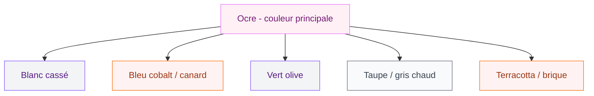
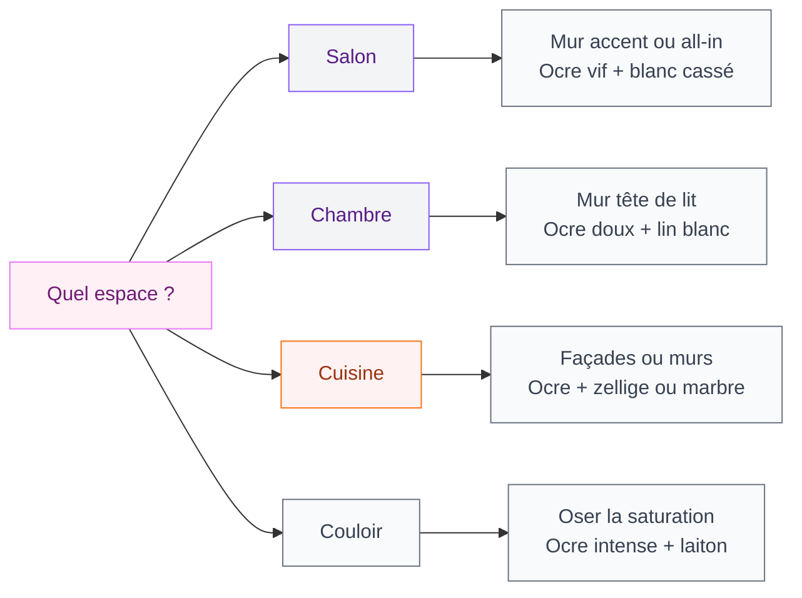

L'ocre, c'est cette couleur qui fait qu'on entre dans une pièce et qu'on se sent tout de suite bien. Pas besoin d'analyser pourquoi - c'est viscéral. Cette teinte terreuse qu'on retrouve dans les maisons provençales, les rues de Marrakech ou les murs du Luberon, elle ramène quelque chose de profondément rassurant. Et la bonne nouvelle : pas besoin de partir en vacances pour en profiter. Tu peux l'inviter chez toi, et je vais t'expliquer exactement comment.

## L'ocre, c'est quoi exactement ?

Avant de foncer acheter des pots de peinture, petit récap utile. L'ocre est une couleur naturelle obtenue à partir d'une argile riche en oxyde de fer. C'est pour ça qu'elle existe depuis la préhistoire - les premières peintures rupestres utilisaient déjà ces pigments. Ce qui lui donne ce côté "ancrée dans la matière" qu'on ressent instinctivement.

  

Dans la palette, l'ocre se situe entre le jaune et l'orange, avec des reflets brunâtres selon la teinte. Le code hex de référence c'est #CC7722 - une sorte de marron doré, warm et terreux.

Il existe plusieurs grandes familles :

- **L'ocre jaune** : lumineux, solaire, proche du safran. C'est la version la plus douce, idéale pour les espaces qui manquent de lumière.
- **L'ocre rouge** : plus intense, presque brique. Elle apporte du caractère et beaucoup d'énergie.
- **La terre brûlée** : entre l'ocre et le rouille, très tendance ces dernières années dans la mouvance terracotta.
- **Le beige mastic** : version désaturée de l'ocre, parfaite pour ceux qui veulent la chaleur sans l'intensité.

> [!NOTE]
> L'ocre rouge et la terracotta sont proches mais pas identiques. La terracotta tire davantage vers le rouge brique, l'ocre rouge reste plus lumineux et plus chaud. Pour tout savoir sur la déco terracotta en chambre, j'ai écrit un article dédié : [déco terracotta pour la chambre](/guides/chambre/deco-terracotta-chambre/).

## Avec quoi associer l'ocre sur tes murs ?

C'est LA question. L'ocre est puissante - trop d'ocre partout et l'effet peut devenir étouffant. Le secret, c'est le dosage et les associations.

  

### Ocre + blanc cassé : la combinaison canon

C'est ma combinaison chouchoute. Un mur ocre jaune avec des menuiseries blanc cassé, un plafond crème et des meubles bois clair - ça fait exactement l'effet d'une maison de vacances dans le sud. Chaud, lumineux, jamais agressif.

Le blanc pur (très froid, tendance bleue) casse un peu trop avec l'ocre. Préfère un blanc un poil cassé, type "blanc lin" ou "blanc ivoire".

### Ocre + bleu : le contraste who works

C'est la combinaison complémentaire classique. Le bleu cobalt ou le bleu canard face à un ocre jaune, ça crée un contraste dynamique très graphique. Version plus douce : un bleu poudre avec une ocre désaturée. Version plus audacieuse : bleu nuit et ocre vif, style art déco.

Pour un salon dont les couleurs restent tendance en 2026, ce duo ocre/bleu profond fait partie des palettes les plus demandées en ce moment - tu peux retrouver plein d'autres idées dans mon article sur les [couleurs du salon 2026](/guides/decoration/couleurs-du-salon-2026-palettes-de-murs-et-de-decors/).

### Ocre + vert olive : la palette naturelle

Vert olive ou vert kaki avec de l'ocre, c'est la combo nature/terrain qui marche du tonnerre. Ça évoque les paysages méditerranéens, les herbes aromatiques, les oliviers. Ajoute du lin brut et du bois non traité - c'est la déco slow living dans toute sa splendeur.

### Ocre + taupe/gris : version sophistiquée

Si tu veux l'ocre mais dans un registre plus urbain, plus contemporain, l'association avec un gris taupe ou un gris moyen fonctionne très bien. Le taupe équilibre la chaleur de l'ocre en apportant une note plus sérieuse. C'est une palette très utilisée dans les appartements haussmanniens rénovés.

> [!TIP]
> Tu peux jouer avec des ocres dans différentes saturations dans une même pièce : un mur principal très saturé, des coussins dans une ocre plus poudrée, un vase en ocre red intense. Ça crée de la profondeur sans que ça parte dans tous les sens.

## Comment utiliser l'ocre dans chaque pièce ?

  

### Le salon : le mur d'accent vs tout peindre

En salon, deux approches possibles.

**L'approche douce** : un seul mur ocre (le mur derrière le canapé ou le mur TV), les autres en blanc cassé ou beige. C'est la méthode "je teste sans risque". Tu peux commencer par ça et voir si tu veux aller plus loin.

**L'approche all-in** : tout en ocre. Ça fonctionne si la pièce est bien éclairée (lumière naturelle ou très bonne lumière artificielle) et si tu équilibres avec des éléments clairs et légers - un canapé en lin naturel, un tapis blanc crème, des rideaux fluides en blanc. Sinon ça peut faire cave.

Budget peinture sol-plafond pour 20m2 : compte environ 80-120€ pour une peinture velours mat de qualité (Ressource, Farrow & Ball, ou la gamme Dulux Valentine à 45-60€ le pot chez Castorama).

### La chambre : cocooning garanti

L'ocre est peut-être la couleur idéale pour la chambre. Elle crée une bulle chaleureuse, favorise la détente, et si tu l'associes avec des draps en lin blanche et du bois foncé, le résultat est cinématographique.

Pour la chambre, je conseille de ne pas monter trop haut en saturation. Un ocre "doux", presque ambré clair, sera plus reposant qu'un ocre vif. Pense à des teintes comme "Fez" chez Farrow & Ball, "Sable du désert" chez Tollens, ou "Tournesol séché" dans la gamme Ripolin.

> [!TIP]
> Pour une chambre petite, évite de peindre les 4 murs. Un seul mur derrière la tête de lit en ocre chaud avec le reste en blanc ou crème - c'est suffisant pour avoir l'effet cocooning sans réduire visuellement l'espace.

### La cuisine : le retour de la couleur

Les cuisines blanches ou grises ont régné pendant 15 ans. On en a un peu fait le tour. L'ocre en cuisine, c'est le grand retour de la personnalité. Tu peux l'appliquer sur les murs au-dessus du crédence, sur les façades des placards, ou même juste en accent sur un îlot central.

Associe avec du marbre blanc ou du carrelage métro blanc : classique mais efficace. Avec du zellige vert émeraude : plus audacieux mais wow. Avec du bois de chêne : très chalet moderne.

### La salle de bain : oui si tu gères bien l'humidité

L'ocre dans une salle de bain, c'est magnifique. Mais utilise obligatoirement une peinture spéciale pièces humides ou une peinture satinée/brillante - jamais de mat en salle de bain. Budget : les peintures satinée spéciale salle de bain, c'est un peu plus cher, entre 55 et 90€ le pot selon les marques.

### Le couloir : l'endroit parfait pour oser

Le couloir est souvent l'endroit qu'on néglige. Pourtant c'est la première impression quand on entre chez toi. Un couloir ocre avec quelques cadres en laiton et un miroir arrondi, ça pose une ambiance dès le seuil. Et comme c'est une petite surface, tu peux oser une ocre plus saturée sans risque.

## L'ocre dans les accessoires et le mobilier

Tu ne veux pas (encore) peindre tes murs ? L'ocre marche très bien en doses plus légères.

  

**Les textiles** : coussins, plaids, rideaux. C'est le moyen le plus accessible d'introduire l'ocre. Un coussin ocre 45x45cm en velours, c'est 25-45€ chez H&M Home ou Zara Home. Un plaid ocre tissé, c'est 39-79€ chez La Redoute.

**La céramique et la poterie** : vases, bols, cache-pots en ocre ou terre cuite vernissée. C'est le budget le plus flexible - de 8€ chez Ikea (gamme GLADELIG) jusqu'à des pièces d'artisans à 80-150€.

**Le mobilier peint** : une commode chinée repeinte en ocre, ça peut être super. Utilise une peinture chalk paint type Annie Sloan (38€ le pot de 500ml) ou les gammes moins chères type Rust-Oleum disponibles chez Leroy Merlin à 20€ environ.

**Les cadres et accessoires métalliques** : le laiton brossé s'associe à merveille avec l'ocre. Poignées de placard en laiton, lampe à pied en laiton, miroir bordé de laiton - tout ça renforce l'ambiance chaleureuse de l'ocre.

> [!WARNING]
> Évite le métal doré trop brillant avec l'ocre - ça peut faire un peu tape-à-l'oeil. Le laiton brossé (mat) ou le bronze sont bien plus harmonieux. La différence de prix est faible mais le rendu est vraiment différent.

## Les 3 erreurs classiques avec l'ocre

**Erreur 1 : choisir une ocre trop jaune fluo.** Certaines teintes étiquetées "ocre" sont en fait des jaunes assez agressifs. Teste toujours un échantillon sur ton mur avant d'acheter tout le pot. La couleur change énormément selon la lumière de ta pièce.

  

**Erreur 2 : associer avec du marron foncé.** Ocre + marron chocolat, ça fait souvent "années 70" dans le mauvais sens. Si tu veux du bois foncé, assure-toi que les autres éléments de la pièce restent clairs.

**Erreur 3 : tout faire ocre sans lumière.** Une pièce qui manque de lumière naturelle va devenir sombre avec de l'ocre. Dans ce cas, reste sur des ocres très désaturées, presque beige, ou limite-toi à un seul mur.

> [!IMPORTANT]
> Avant toute peinture murale, fais le test de l'échantillon : peins une surface de 30x30cm et observe-la à différents moments de la journée - matin, après-midi, soirée avec lumière artificielle. L'ocre peut paraître très différente selon l'heure et le type d'ampoules.

## L'ocre et les tendances 2026

L'ocre est une couleur qui ne se "démode" pas vraiment - elle a 40 000 ans d'histoire, elle peut bien tenir encore quelques saisons. Mais en 2026, ce qu'on voit beaucoup c'est l'ocre associé à des matériaux naturels bruts : enduit à la chaux, béton ciré, paille tressée, rotin non teint.

C'est le mouvement "matière première" qui pousse l'ocre vers un territoire encore plus naturel. Moins paint-over-everything, plus texture et profondeur. Si tu associes une peinture ocre avec un mur en enduit brut ou des panneaux de liège, c'est la version la plus contemporaine de cette couleur.

L'orange étant une couleur complémentaire de l'ocre, les deux travaillent d'ailleurs souvent ensemble dans les palettes actuelles - pour creuser ce sujet, mon article sur les [couleurs compatibles avec l'orange pour les murs](/guides/couleurs/couleurs-compatibles-avec-lorange-pour-les-murs-et-la-decoration/) te donnera beaucoup d'idées supplémentaires.

## Par où commencer concrètement ?

Si tu es complètement nouvelle avec l'ocre, voici ma stratégie :

1. **Étape 1 - Test textiles** : achète 2 coussins ocre et un plaid. Vois si tu te sens bien avec cette couleur chez toi.
2. **Étape 2 - Petit meuble ou accessoire** : un vase, une lampe, un cache-pot. Observe l'harmonie.
3. **Étape 3 - Échantillon peinture** : si les étapes 1 et 2 te plaisent, commande 3-4 échantillons de peinture ocre chez différents fabricants et colle-les sur ton mur.
4. **Étape 4 - Lance-toi** : un mur, un weekend, et tu verras.

Ce qui est bien avec l'ocre, c'est que même si tu changes d'avis, ça se repeint. Rien n'est irréversible. Et franchement, la plupart des gens qui "essaient" l'ocre finissent par l'adorer.

---

## Sur le meme theme

- [couleurs qui se marient avec le violet](/guides/couleurs/quelles-sont-les-couleurs-qui-se-marient-bien-avec-le-violet-en-decoration/)
- [couleurs pour donner de la profondeur](/guides/couleurs/des-couleurs-pour-donner-de-la-profondeur-a-un-mur-ou-a-une-piece/)

## FAQ - Couleurs ocres pour les murs

**L'ocre est-elle une couleur tendance ou démodée ?**
L'ocre est une couleur intemporelle. Elle était tendance dans les années 70, oubliée dans les années 90-2000, et elle est très populaire depuis le début des années 2020. En 2026, elle s'inscrit dans le mouvement des couleurs naturelles et terreuses qui continuent d'être plébiscitées.

**Quelle nuance d'ocre choisir pour un appartement peu lumineux ?**
Pour une pièce peu éclairée, oriente-toi vers un ocre très désaturé, presque beige - des teintes comme "Sable chaud" ou "Écorce claire". Évite les ocres vives et saturées qui absorberaient encore plus la lumière.

**Peut-on associer ocre et noir ?**
Oui, le noir apporte une touche graphique et contemporaine qui fonctionne bien avec l'ocre. Utilise-le avec parcimonie (cadres, poignées, lampe) plutôt qu'en grande surface pour éviter un résultat trop lourd.

**Combien coûte un pot de peinture ocre de qualité ?**
Compte entre 40€ et 90€ le pot de 2,5L selon les marques. Dulux Valentine et Tollens sont autour de 40-55€. Les marques premium comme Ressource ou Farrow & Ball montent à 75-100€ mais offrent une qualité de pigmentation supérieure.

**L'ocre est-elle adaptée à une chambre d'enfant ?**
Tout à fait. Un ocre doux et lumineux (presque jaune paille) crée une chambre gaie sans agresser. Associé avec du blanc et du bois naturel, c'est une alternative très agréable aux chambres toutes pastel.
