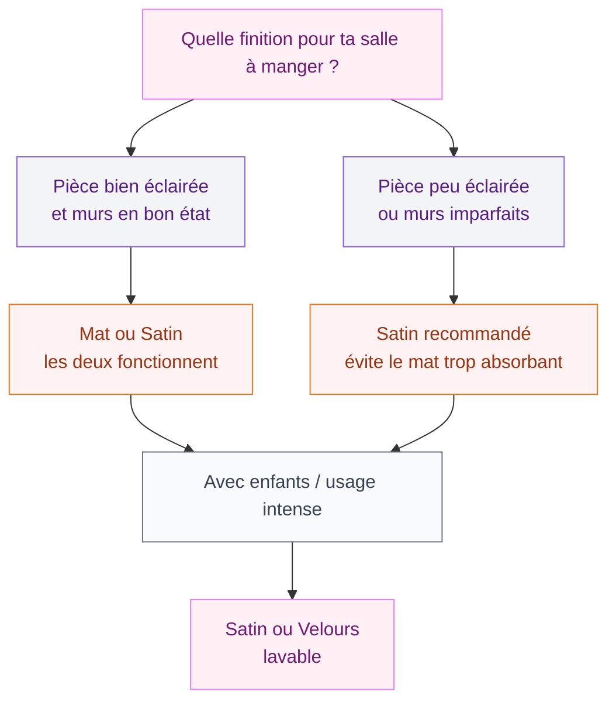
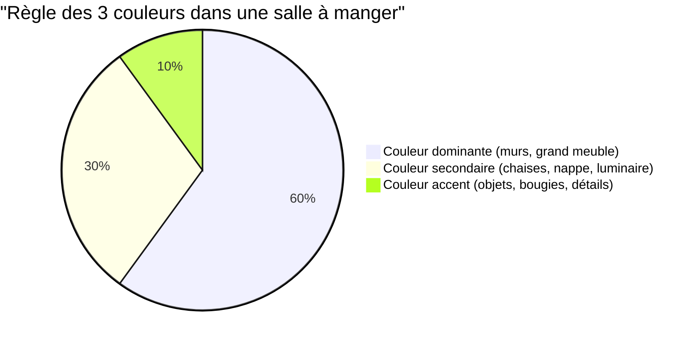

La salle à manger, c'est la pièce qu'on a souvent tendance à oublier. On passe du temps dans le salon, on chouchoute la cuisine, et la salle à manger reste avec ses quatre murs blancs un peu fades. Pourtant, c'est ici que se passent les repas en famille, les dîners entre amis, les fêtes. Elle mérite autant d'attention que le reste. Et bonne nouvelle : la couleur est ton meilleur allié pour la transformer complètement, même avec un budget réduit.

## Pourquoi la couleur change tout dans une salle à manger

Une salle à manger n'a pas toujours beaucoup de mobilier. Une table, des chaises, parfois un buffet. C'est précisément pour ça que la peinture joue un rôle aussi fort ici - les murs sont bien plus visibles que dans une pièce encombrée de meubles.

  

La couleur va définir l'ambiance de tes repas. Littéralement. Des murs chaleureux invitent à s'attarder, à prolonger la conversation. Des tons froids et lumineux donnent envie d'un petit-déj efficace avant de filer au travail. Ce n'est pas du tout la même chose.

Autre point à garder en tête : la lumière naturelle de ta salle à manger. Est-ce qu'elle regarde vers le nord ? Le sud ? Est-ce qu'elle est ouverte sur le salon ou complètement fermée ? Tout ça va influencer ton choix final.

> [!TIP]
> Avant d'acheter ta peinture, teste toujours un échantillon sur au moins 30 x 30 cm et observe-le à différents moments de la journée - le matin, à midi et le soir avec la lumière artificielle. La même couleur peut sembler complètement différente selon l'éclairage.

## Les grands styles de couleurs : lequel te correspond ?

  

### Les tons neutres : blanc, gris, taupe

C'est la valeur sûre. Et non, ce n'est pas synonyme d'ennuyeux - tout dépend de comment tu les utilises.

Le blanc cassé ou le blanc pur donnent une impression de propreté et de lumière. C'est idéal si ta salle à manger est petite ou peu éclairée, ou si tu veux un fond neutre pour laisser parler ta table en bois brut, tes chaises colorées ou ton luminaire graphique.

Le gris, lui, c'est plus sophistiqué. Un gris clair perlé pour une atmosphère douce et apaisante, un gris anthracite pour quelque chose de plus affirrmé. Attention avec le gris froid dans les pièces peu lumineuses - ça peut vite devenir déprimant. Préfère les gris chauds, avec des nuances beige ou rose.

Le taupe est peut-être le plus malin des trois. Chaud, polyvalent, il s'adapte à presque tous les styles de mobilier. C'est une couleur rassurante qui donne du caractère sans prendre de risques.

Pour des références concrètes : la gamme Nordique de Dulux Valentine tourne autour des 35-45 euros le pot de 2,5L, les gris chaleureux d'Astral aussi. Si tu veux tester avant d'investir, Tollens propose des échantillons à moins de 5 euros.

### Les tons profonds et chaleureux

Là, on entre dans une autre dimension. Vert foncé, bleu canard, terracotta, bordeaux, vert mousse... Ces couleurs transforment une salle à manger en cocon ultra accueillant.

L'effet "tableau" est garanti : imagine des murs vert anglais sombre, une table en chêne clair, des luminaires en laiton. C'est la combinaison qui fait le plus de bruit sur les réseaux déco en ce moment, et pour de bonnes raisons.

Le bleu canard (ce bleu-vert profond) est particulièrement polyvalent. Il crée une ambiance raffinée sans être guindée, fonctionne aussi bien avec du blanc qu'avec du bois naturel. Benjamin Moore le propose dans sa gamme de couleurs historiques, autour de 50-60 euros le litre - c'est un investissement mais la qualité est au rendez-vous.

Le terracotta et les oranges terreux connaissent eux aussi un vrai retour en grâce. Ils apportent une chaleur méditerranéenne très conviviale. Parfait si tu aimes recevoir et que tu veux une ambiance festive naturellement.

> [!WARNING]
> Les couleurs très foncées absorbent la lumière. Dans une salle à manger sans beaucoup de fenêtres, teste absolument un échantillon avant de te lancer. Une couleur magnifique sur un blog peut devenir étouffante chez toi si la pièce manque d'éclairage naturel.

### Les tons naturels et apaisants

La tendance de 2026, c'est le retour au calme. Après des années de couleurs tranchées, beaucoup reviennent à des teintes inspirées de la nature : vert sauge, beige sable, rose argile, bleu ciel délavé.

Ces couleurs sont ce qu'on appelle des "non-couleurs" - elles ont du caractère sans s'imposer. Elles créent une atmosphère sereine où il fait bon manger sans se presser. C'est la tendance que j'ai beaucoup vu décryptée sur les comptes déco scandinaves, et elle arrive fort en France maintenant.

Le vert sauge en particulier est partout. Sur les portes de cuisine, les boiseries, les murs des salles à manger. Si tu cherches quelque chose de la couleur du moment qui ne se démodera pas dans deux ans, c'est lui.

Leroy Merlin propose une belle gamme dans ces tons naturels avec leur peinture Multi-Supports, autour de 30-40 euros le pot de 2,5L. Pour quelque chose de plus qualitatif, regarde du côté de [la peinture Luxens](/peinture-luxens/) qui offre d'excellentes finitions mates dans ces teintes tendance.

## Quelle finition choisir : mat, satin ou brillant ?

La finition change l'aspect final autant que la couleur elle-même.

  

**Mat** : c'est la finition la plus "déco" en ce moment. Elle absorbe la lumière, cache les imperfections des murs, et donne un rendu très élégant. Le seul bémol : moins facile à nettoyer. Pour une salle à manger où tu reçois souvent et où il y a des enfants, réfléchis-y à deux fois.

**Satin** : le compromis parfait. Il a un léger lustre qui donne de la profondeur à la couleur tout en étant bien plus lavable que le mat. Ma recommandation pour la plupart des salles à manger.

**Brillant** : très peu utilisé sur les murs, sauf en version très légère (qu'on appelle "coquille d'oeuf"). Ça peut être intéressant si tu veux un effet graphique assumé, mais en général on le réserve aux boiseries et aux portes.

## Combiner les couleurs : les astuces qui fonctionnent vraiment

Peindre toute la salle à manger d'une seule couleur, c'est bien. Mais jouer avec les combinaisons, c'est mieux.

  

### Le mur accent

Une seule couleur forte sur le mur "focal" - celui que tu vois en entrant, ou celui derrière le buffet - et les autres en blanc ou en ton neutre. C'est l'approche la plus facile et la plus impactante. Tu peux oser une couleur que tu n'aurais jamais mise partout, et l'effet est spectaculaire.

### Les deux tiers / un tiers

Peindre les deux tiers inférieurs du mur (souvent séparés par une corniche ou une baguette de finition) dans une couleur foncée, et le tiers supérieur en blanc ou en ton pâle. C'est un classique qui ne vieillit pas. Ça donne une impression de hauteur tout en créant de la chaleur en bas.

### La couleur en continu sur toute la pièce

Si tu oses une couleur forte partout, elle doit être parfaitement choisie et bien éclairée. Mais quand ça marche, l'effet est incroyable. Un vert bottle partout avec un plafond blanc, c'est magique.

> [!NOTE]
> Pour harmoniser ta salle à manger avec le reste de ta maison, regarde comment les tendances 2026 traitent les espaces ouverts : [palettes de couleurs pour le salon 2026](/couleurs-du-salon-2026-palettes-de-murs-et-de-decors/) te donnera des clés pour créer une cohérence visuelle entre les pièces.

### La règle des trois couleurs

Dans une palette à trois couleurs, travaille toujours avec une dominante (60%), une secondaire (30%) et une touche d'accent (10%). Par exemple : murs beige sable (60%), mobilier bois foncé (30%), détails noirs ou dorés (10%). C'est un principe que les décorateurs utilisent systématiquement.

## Les erreurs à éviter

**Choisir sa couleur sur un écran.** Les couleurs sur les sites et les applis sont systématiquement déformées. Va dans un magasin, prends des échantillons papier, observe-les chez toi.

  

**Peindre sans préparer.** Un mur mal préparé, c'est une peinture qui cloque ou qui ne tient pas. Dépoussiérage, rebouchage des trous, impression si nécessaire - ça prend du temps mais ça change tout.

**Ignorer le mobilier existant.** Si tu as une table en chêne clair et des chaises en tissu gris, tu ne peux pas partir dans du rouge bordeaux sans adapter l'ensemble. La couleur des murs doit dialoguer avec ce que tu as déjà.

**Oublier les boiseries.** Plinthes, portes, encadrements de fenêtres - si tu laisses tout en blanc avec des murs foncés, ça peut faire bizarre. Soit tu peins les boiseries dans un ton un peu plus clair que tes murs, soit tu les gardes en blanc pur avec un contraste assumé.

> [!CAUTION]
> Évite de te fier aux "collections tendance" des grandes surfaces qui changent chaque saison. Une couleur de mur, ça dure plusieurs années. Choisis quelque chose que tu aimes vraiment, pas ce qui est juste à la mode au moment où tu repeins.

## Quelle couleur selon la taille de ta salle à manger ?

**Petite salle à manger (moins de 10m2) :** Clair ne veut pas forcément dire mieux. Un blanc trop pur peut paraître clinique. Préfère un blanc chaud, un crème, ou ose une seule couleur forte sur un mur - ça donne du caractère sans écraser. Les miroirs et les fenêtres bien dégagées sont tes alliées.

**Salle à manger moyenne (10-15m2) :** Tu as de la marge pour expérimenter. Les tons saturés et profonds fonctionnent bien ici, surtout si tu as un bon éclairage. C'est le format idéal pour le mur accent ou la combinaison deux tiers / un tiers.

**Grande salle à manger (plus de 15m2) :** Les grandes pièces peuvent sembler froides ou impersonnelles avec des couleurs trop claires. N'hésite pas à aller vers des tons plus chauds et enveloppants. Tu peux aussi casser l'espace avec des bandes de couleurs différentes pour créer des zones distinctes si la pièce est très ouverte.

Si tu envisages de repeindre et que tu n'es pas sûre de quelle marque choisir, les [avis sur la peinture Spectrum](/avis-peinture-spectrum/) peuvent t'aider à évaluer les options disponibles en magasin avant de te décider.

## Mon plan d'action concret

Pour te lancer sans stress :

1. **Identifie ton style** : cosy et enveloppant, lumineux et frais, naturel et serein ?
2. **Regarde ta lumière naturelle** : exposition, nombre de fenêtres, hauteur sous plafond
3. **Prends 3 à 5 échantillons** dans les tons qui te plaisent (comptez 3-5 euros chacun)
4. **Observe-les chez toi** pendant 2-3 jours, à différentes heures
5. **Commande ta peinture** en satin pour une finition pratique et élégante
6. **Prépare bien ton mur** avant de peindre (c'est là que tout se joue)

La salle à manger que tu as envie d'avoir - celle où les gens s'attardent, où l'ambiance est parfaite pour un dîner - elle commence par un bon choix de couleur. Alors prends le temps, teste des échantillons, et fais confiance à ton instinct. Tu connais mieux que quiconque ce qui va te faire plaisir tous les jours.

> [!IMPORTANT]
> Un dernier conseil avant de te lancer : calcule bien la surface à peindre (longueur x hauteur des murs, moins les ouvertures) et ajoute 10% pour les retouches. Rien de plus frustrant que de se retrouver à court de peinture avec un mur à moitié fini - et souvent, le réassort exact n'est pas disponible en magasin.

## Sur le meme theme

- [couleurs ocres pour les murs et la décoration](/couleurs-ocres-pour-les-murs-et-la-decoration/)
- [couleurs qui se marient avec le violet](/quelles-sont-les-couleurs-qui-se-marient-bien-avec-le-violet-en-decoration/)

## FAQ

**Quelle couleur est la plus tendance pour une salle à manger en 2026 ?**
Le vert sauge, le vert anglais profond et les tons terracotta sont les plus présents en 2026. Les couleurs naturelles et organiques dominent, avec un retour aux teintes inspirées de la terre et de la végétation.

**Faut-il peindre tous les murs de la même couleur dans une salle à manger ?**
Pas forcément. Un seul mur accent dans une couleur forte avec les autres en ton neutre est souvent plus dynamique et plus facile à vivre. C'est aussi moins engageant si tu n'es pas sûr de ton choix.

**Quelle finition de peinture choisir pour une salle à manger ?**
Le satin est le meilleur compromis : il a un beau rendu visuel, donne de la profondeur à la couleur, et reste lavable. Le mat est plus élégant mais moins pratique, surtout avec des enfants ou si tu reçois beaucoup.

**Comment choisir une couleur de salle à manger quand on a peu de lumière naturelle ?**
Évite les tons trop sombres et les blancs froids. Préfère les beiges chauds, les crèmes, les gris rosés, ou ose une couleur chaude (terracotta, ocre) qui compensera le manque de lumière avec sa chaleur propre. L'éclairage artificiel bien choisi aidera aussi beaucoup.

**Peut-on peindre sa salle à manger en bleu ?**
Oui, tout à fait. Le bleu canard ou le bleu nuit sont très actuels et créent une ambiance sophistiquée. Pour une salle à manger sans beaucoup de lumière, préfère un bleu moyen ou clair plutôt qu'un bleu marine très profond.
