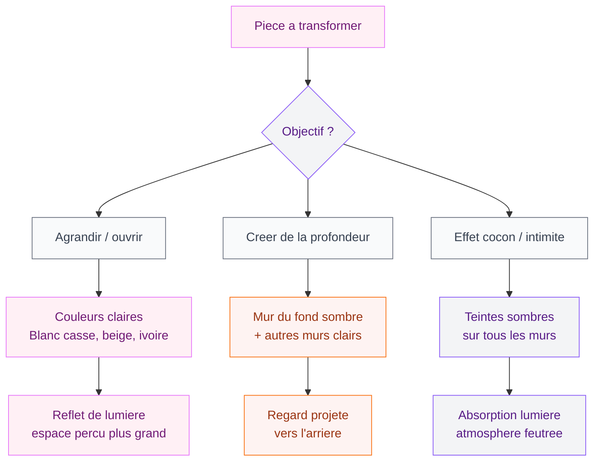
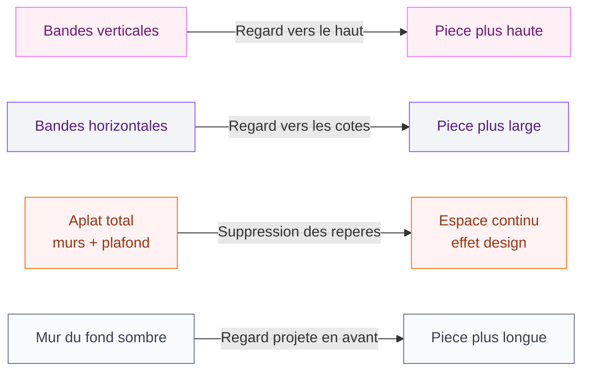

Tu as une pièce qui te semble plate, sans relief, un peu "meh" ? Ou un couloir trop long, un salon trop carré, une chambre qui ne ressemble à rien malgré tous tes efforts en matière de mobilier ? La solution ne vient pas toujours des meubles ou des accessoires. Souvent, c'est une question de couleur. Et plus précisément, une question de profondeur.

Jouer avec les teintes pour modifier la perception d'un espace, c'est un principe que les architectes d'intérieur utilisent depuis toujours - et franchement, ça marche. Laisse-moi te montrer comment ça fonctionne et comment tu peux l'appliquer chez toi, même sans budget colossal.

## Pourquoi la couleur change la perception de l'espace

Avant de te donner les recettes, parlons vite du mécanisme. Notre cerveau interprète la profondeur en se basant sur des indices visuels : la taille des objets, la lumière, et... la couleur. Les teintes sombres absorbent la lumière et "reculent" visuellement, tandis que les claires réfléchissent et "avancent".

  

C'est pour ça qu'un mur peint en bleu marine paraît plus loin qu'il ne l'est vraiment. Et qu'un mur blanc semble tout près de toi. En jouant avec ce principe, tu peux littéralement remodeler ta pièce sans toucher à un seul mur porteur.

> [!NOTE]
> La perception de la profondeur est aussi liée à la lumière naturelle de ta pièce. Un mur sombre dans une pièce bien éclairée donnera un effet feutré agréable. Dans une pièce sombre, il peut vite devenir oppressant. Teste toujours avec un échantillon avant de te lancer.

## Teintes sombres : l'effet enveloppant

Le mur du fond peint en couleur sombre, c'est l'astuce numéro un pour donner de la profondeur. Le regard se projette vers l'arrière, la pièce semble plus longue qu'elle ne l'est.

  

Ça marche particulièrement bien dans :
- Un salon court ou carré (peindre le mur en face de l'entrée)
- Une chambre dont le lit est positionné face à un mur nu
- Un couloir où tu veux créer un point de focalisation

Les couleurs qui donnent le meilleur effet de profondeur ? Les grands classiques : bleu marine, vert forêt, anthracite, terracotta profond, aubergine. Ce sont des teintes qui ont du corps, qui "tirent" le regard.

> [!TIP]
> Tu peux trouver d'excellentes références de couleurs profondes chez Tollens, Farrow & Ball ou chez Leroy Merlin avec leur gamme Tollens en pot de 0,5L autour de 12-15 euros. Idéal pour tester un mur d'accentuation sans trop investir.

### Combiner sombre et clair : la règle des contrastes

Le secret, c'est de ne pas peindre toute la pièce en sombre. Le contraste est ce qui crée la profondeur, pas la couleur seule. Donc :

- Mur du fond sombre + trois autres murs clairs = illusion d'allongement
- Plafond peint dans la même teinte que les murs = espace cocon, très enveloppant
- Mur d'accentuation sombre isolé = point focal fort, profondeur marquée

Pour les associations, tu peux regarder du côté des [palettes tendance 2026 pour les murs et la décoration du salon](/couleurs-du-salon-2026-palettes-de-murs-et-de-decors/) - il y a de belles idées de combinaisons sombres/claires déjà testées.

## Couleurs claires : élargir et faire respirer

À l'opposé du spectre, les couleurs claires font "avancer" les surfaces. Elles agrandissent visuellement l'espace et maximisent la luminosité.

  

Le blanc et ses déclinaisons (blanc cassé, beige très clair, ivoire, lin pâle) sont les champions de l'espace. Mais attention : le blanc pur peut vite être froid et clinique. Je te conseille plutôt des blancs cassés ou des beiges très lumineux qui gardent la chaleur.

Quelques options intéressantes :
- **Blanc héritage Farrow & Ball** (teinte chaude, jamais trop froide)
- **Beige crème Dulux Valentine** - autour de 25€ le litre, très polyvalent
- **Ivoire doux Les Peintures du Nord** - parfait pour les pièces sans beaucoup de lumière

## Les techniques visuelles par type de pièce

  

### Pièce trop carrée

Le problème des pièces carrées, c'est qu'elles manquent de dynamisme. Le regard ne sait pas où aller.

La solution ? Casser la symétrie avec la couleur. Peins un seul mur dans une teinte plus profonde que les autres. Ça crée un axe visuel, un sens de lecture dans la pièce. Tout d'un coup, ça ne ressemble plus à une boîte.

Pour une pièce carrée classique d'environ 12-15m2, je te conseille un vert sauge profond (genre "Mizzle" chez Farrow & Ball ou son équivalent chez Zolpan) sur le mur face à l'entrée. Tu gardes les trois autres murs en beige très clair. Résultat : la pièce semble rectangulaire et bien plus intéressante.

### Couloir trop long

À l'inverse, un couloir trop étroit et trop long peut être écrasant. Pour "raccourcir" visuellement, peins le mur du fond dans une couleur chaude et saturée - terracotta, rouge brique, ocre profond. Le mur semble venir vers toi, ce qui réduit l'effet tunnel.

> [!WARNING]
> Évite les couleurs froides (bleu, vert pâle, gris) dans les couloirs étroits sans lumière naturelle. Elles accentuent le côté froid et tunnel. Réserve-les aux espaces clairs et bien éclairés.

### Chambre sans caractère

Dans une chambre, la profondeur se joue souvent sur le mur de tête de lit. C'est la première chose qu'on voit en entrant, et ça donne le ton de toute la pièce.

Un beau bleu canard (Benjamin Moore "Teal Ocean" ou Ressource "Bleu Céladon profond"), un vert bouteille ou un anthracite chaud sur ce seul mur : ça crée une vraie personnalité sans alourdir l'espace. Les autres murs restent clairs, et l'équilibre est parfait.

Pour la salle à manger, les approches sont similaires - si tu veux creuser la question, regarde aussi nos conseils sur les [couleurs pour la salle à manger](/couleurs-pour-la-salle-a-manger-a-peindre-et-a-decorer/) où les palettes sont déjà sélectionnées pour l'effet profondeur.

## Jouer avec les bandes et les aplats

  

### Les bandes verticales

Tu veux que ta pièce semble plus haute ? Les bandes verticales sont ta meilleure amie. Alterner une couleur foncée et une couleur claire sur un mur (ou sur les quatre murs) tire le regard vers le haut et allonge visuellement la hauteur.

Pour que ça reste élégant et pas tape-à-l'oeil : choisis deux teintes de la même famille (par exemple un blanc cassé et un gris très clair), et des bandes larges - minimum 30-40cm. Les bandes étroites font plutôt papier peint vintage des années 80, et c'est rarement l'effet recherché.

### Les bandes horizontales

Inverse : les bandes horizontales élargissent une pièce étroite. Même principe avec les couleurs. Combine des teintes proches pour un résultat doux et sophistiqué.

### L'aplat total : murs et plafond dans la même couleur

Ça, c'est la technique la plus audacieuse et la plus efficace pour les petites pièces. Quand tu peins murs ET plafond dans la même couleur, tu supprimes les repères visuels habituels. La pièce paraît continue, sans limite claire. Et paradoxalement, ça la fait sembler plus grande.

Idéal pour les petites salles de bain, les dressings, les coins bureau. Ça donne un effet très design, très intentionnel.

## Les couleurs contrastées pour délimiter les zones

Dans un espace ouvert (salon-cuisine, pièce à vivre polyvalente), la couleur devient un outil de délimitation. Tu peux créer des "zones" sans poser une seule cloison.

Par exemple :
- Zone repas : mur peint en teinte chaude (caramel, terracotta pâle)
- Zone salon : mur en teinte fraîche (bleu gris, vert sauge)
- Cuisine : reste en neutre clair pour la praticité

Le contraste entre les zones crée une perception de profondeur et de volume. Chaque espace a sa propre identité, et l'ensemble paraît plus grand qu'il ne l'est.

> [!TIP]
> Pour les espaces ouverts, teste des peintures comme la gamme Spectrum chez Leroy Merlin - [l'avis sur la peinture Spectrum](/avis-peinture-spectrum/) montre que le rapport qualité-prix est très bon pour ce type de projets où tu as besoin de plusieurs couleurs différentes sans te ruiner.

## Erreurs courantes à éviter

### Peindre toutes les surfaces de la même couleur sombre

Ça peut être très bien (l'aplat total dont on parlait), mais ça peut aussi virer au cave. La règle : si tu veux un espace sombre, assure-toi d'avoir des sources de lumière suffisantes (lampadaires, spots, bougies). Sans lumière, le sombre devient oppressant.

### Négliger le plafond

Le plafond est souvent la surface oubliée. Pourtant, il joue énormément sur la perception de la hauteur. Un plafond blanc standard dans une pièce aux murs sombres crée une rupture visuelle qui peut paraître étrange. Essaie de l'harmoniser : soit dans une version plus claire de ta couleur murale, soit dans un blanc chaud cohérent avec ta palette.

### Choisir une couleur sans tester

Je sais que ça fait basique comme conseil, mais c'est la source numéro un des regrets en déco. Une couleur sur un écran ou dans un catalogue ne ressemble jamais exactement à ce qu'elle donne sur ton mur, dans ta lumière. Achète toujours un petit pot de test (les marques en proposent à 3-5 euros), peins un carré de 50x50cm, et observe-le à différents moments de la journée.

> [!IMPORTANT]
> La lumière change tout. Une teinte qui te semblait parfaite en milieu de journée peut virer au violet ou au marron le soir sous éclairage artificiel. Teste toujours ton échantillon le matin, l'après-midi ET le soir avec ta lumière habituelle.

## Le bon matériel pour un résultat propre

Une belle couleur profonde mérite une pose soignée. Quelques points pratiques :

- **Pour les teintes sombres** : utilise une peinture mate ou velours. Le satin met en évidence les imperfections du mur, et sur les sombres ça se voit tout de suite.
- **Nombre de couches** : les couleurs profondes demandent souvent 2 à 3 couches. Prévois ton budget en conséquence.
- **Pinceau vs rouleau** : un rouleau mohair ou velours court donne un fini plus régulier sur les grandes surfaces. Le pinceau pour les angles et les finitions.
- **Masquage** : investis dans du ruban de masquage de qualité (Tesa ou 3M). Sur les couleurs sombres, la moindre bavure se voit. Ce n'est pas le moment d'économiser 3 euros.

## Ce qu'il faut retenir

Donner de la profondeur à un mur ou une pièce, c'est accessible à tous et ça ne demande pas un budget énorme. L'outil de base, c'est la compréhension de comment les couleurs influencent notre perception.

Les teintes sombres reculent et créent de la profondeur. Les claires avancent et ouvrent l'espace. Le contraste entre les deux, bien dosé, transforme complètement une pièce plate en espace avec du caractère.

Mon conseil si tu hésites encore : commence par un seul mur d'accentuation. Un mur du fond dans une teinte profonde, les autres en clair. C'est la modification la plus impactante pour le moins de risque. Et une fois que tu auras vu le résultat, tu comprendras pourquoi les professionnels ne jurent que par cette technique.

---

## Sur le meme theme

- [couleurs ocres pour les murs et la décoration](/couleurs-ocres-pour-les-murs-et-la-decoration/)
- [couleurs compatibles avec l'orange](/couleurs-compatibles-avec-lorange-pour-les-murs-et-la-decoration/)

## Questions fréquentes

**Quelle couleur choisir pour donner de la profondeur à un petit salon ?**

Pour un petit salon, opte pour le mur en face de l'entrée peint dans une teinte profonde : bleu marine, vert forêt ou anthracite. Garde les trois autres murs dans une teinte claire comme le blanc cassé ou le beige. Ce contraste projette le regard vers l'arrière et crée une illusion d'allongement très efficace.

**Est-ce que les couleurs sombres rapetissent vraiment une pièce ?**

Pas systématiquement. Tout dépend de la façon dont tu les utilises. Un seul mur sombre dans une pièce éclairée crée de la profondeur sans écraser l'espace. C'est quand on peint tous les murs en sombre sans suffisamment de lumière que l'effet cave apparaît. La clé, c'est le dosage et l'éclairage.

**Quelle finition choisir pour un mur sombre ?**

La finition mate ou velours est la plus adaptée pour les couleurs profondes. Elle absorbe la lumière de manière régulière et cache mieux les imperfections du mur. Le satin ou le brillant met trop en évidence les défauts de surface, surtout visible sur les teintes foncées.

**Peut-on peindre le plafond dans une couleur sombre ?**

Oui, et c'est une technique très efficace pour créer un effet cocon dans une chambre ou un salon. Peindre le plafond dans la même teinte que les murs (ou dans une version plus sombre) supprime les repères visuels habituels et crée une atmosphère très enveloppante. Idéal pour les espaces à vivre où tu veux de l'intimité.

**Combien de murs peindre en couleur pour créer de la profondeur ?**

Un seul mur suffit dans la plupart des cas. Le "mur accent" ou "mur d'accentuation" est la solution la plus efficace et la plus simple : un mur sombre, trois murs clairs. Tu obtiens l'effet de profondeur sans alourdir l'ensemble de la pièce.
