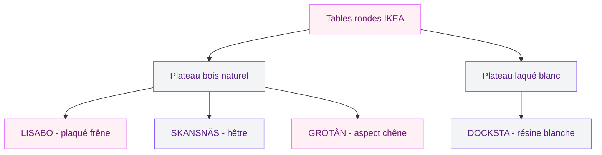
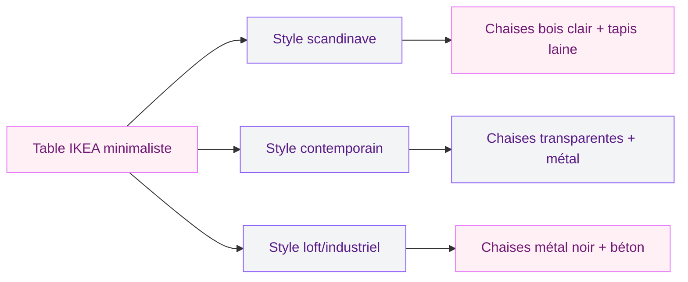
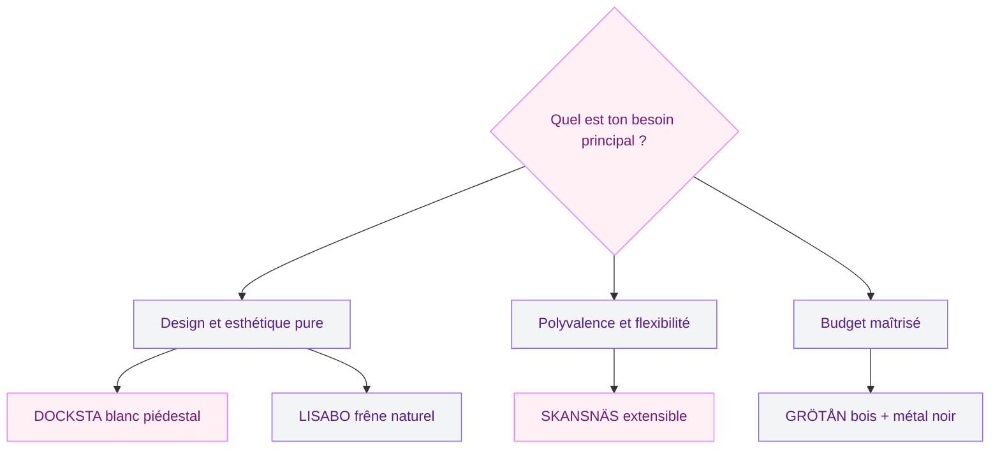

Il y a des pièces de mobilier qui font l'unanimité dès qu'on les voit en magasin. La table ronde minimaliste IKEA en deux couleurs - noir ou blanc - est clairement de celles-là. Sobre, bien proportionnée, avec ce petit quelque chose qui rend la salle à manger tout de suite plus sympa. Si tu te demandes laquelle choisir, comment l'intégrer chez toi, et ce qu'elle vaut vraiment au quotidien, je t'explique tout.

J'ai creusé le sujet à fond parce que j'entends souvent la même question dans les groupes déco : "IKEA ou une autre marque pour ma table ?" Alors voilà mon avis honnête, modèle par modèle.

## Pourquoi le minimalisme à deux tons fonctionne si bien

Le principe du design minimaliste, c'est de ne rien mettre de plus que ce qui est nécessaire. Une table ronde en deux couleurs - noir et blanc - joue exactement là-dessus. Pas de bois aux teintes complexes à assortir, pas de détails qui vieillissent mal. Juste une forme claire et deux options chromatiques qui s'adaptent à 90 % des intérieurs.

  

Le blanc apporte de la légèreté visuelle. Il agrandit une pièce, reflète la lumière, donne un côté aérien. Le noir, lui, ancre le mobilier dans l'espace, crée du contraste et pose une touche graphique forte. Ces deux couleurs ne se démodent pas, et c'est bien là leur force. Tu achètes une table aujourd'hui, tu peux déménager dans cinq ans avec un canapé totalement différent - ça marchera encore.

La forme ronde a aussi un avantage social souvent sous-estimé : sans angle ni bout "VIP", tout le monde est à égalité autour de la table, et les conversations y sont plus naturelles qu'autour d'une table rectangulaire.

IKEA a bien compris ce filon minimaliste, et ses modèles actuels en deux couleurs sont parmi les meilleures ventes de la marque. Voyons lesquels méritent vraiment ton attention.

## Les modèles phares : LISABO, DOCKSTA, SKANSNÄS, GRÖTÅN

  

### LISABO - le chouchou du design scandinave

La LISABO, c'est probablement la table IKEA dont on voit le plus de photos sur les comptes Instagram déco français. Et ce n'est pas un hasard.

Elle mesure 105 cm de diamètre - idéale pour 4 personnes, à l'aise pour 5. Son plateau en plaqué frêne lui donne un aspect bois chaleureux, naturel, sans être "rustique". Ce qui la distingue vraiment, c'est la forme de ses pieds : inclinés vers l'extérieur, ils donnent une allure légèrement rétro-scandinave très agréable. On est à 100 % dans le design minimaliste sans que ce soit froid.

Prix : autour de 199 euros. Pour ce que c'est, c'est très bien positionné.

> [!TIP]
> La LISABO se marie parfaitement avec des chaises STEFAN (bois naturel) ou TOBIAS (transparent). Si tu veux aller vers le noir, les chaises IKEA KALLARP ou ÄLVSTA en métal noir sont un combo redoutable.

### DOCKSTA - l'icône blanche au piédestal unique

La DOCKSTA, c'est une autre histoire. Ici, pas de quatre pieds mais un piédestal central unique - une base monopode blanche sur plateau blanc, 103 cm de diamètre. L'effet est saisissant : elle semble flotter. Et surtout, sans pieds dans les coins, tu as beaucoup plus de liberté pour placer tes chaises, y compris des chaises avec accoudoirs.

Le blanc mat de la DOCKSTA est d'une cohérence visuelle parfaite. Rien ne dépasse, tout est lisse, épuré. Elle est en fibre de verre et résine, ce qui la rend plus lourde que ce qu'on imagine (24 kg), mais aussi très solide.

Prix : environ 299 euros. Un peu plus cher que les autres, justifié par la fabrication et le design.

> [!WARNING]
> La DOCKSTA n'est pas extensible. Si tu reçois régulièrement plus de 5 personnes, réfléchis bien avant de l'acheter - la forme et la base ronde ne laissent aucune marge.

### SKANSNÄS - quand minimaliste rime avec extensible

Si tu te dis "j'aime le minimalisme mais j'ai besoin de place pour les repas de famille", la SKANSNÄS est ta réponse. Elle commence à 115 cm fermée et s'étend jusqu'à 170 cm - ce qui la fait passer de table pour 4 à table pour 6-8 personnes.

Son plateau en hêtre brun lui donne une touche chaleureuse dans la lignée du style scandinave moderne. Les pieds effilés, légèrement biseautés, sont typiques du mobilier nordique. La SKANSNÄS est un meuble pensé pour la vraie vie : compact au quotidien, généreux quand on en a besoin.

Prix : environ 399 euros. C'est le plus cher de la gamme, mais pour une table extensible de cette qualité, le rapport reste très bon.

### GRÖTÅN - le contraste bois et métal noir

La GRÖTÅN, c'est la plus récente et elle adopte un parti pris différent : plateau en bois naturel clair (aspect chêne), pieds en métal thermolaqué noir mat. Résultat : un contraste marqué, élégant, qui colle parfaitement à l'intérieur moderne actuel où l'on mélange matières et couleurs de façon maîtrisée.

Elle mesure environ 105 cm de diamètre et accueille 4 personnes confortablement. Le métal noir de ses pieds est traité par thermolaquage, ce qui signifie une finition résistante aux rayures légères et aux chocs du quotidien.

Prix : autour de 179 euros. Le meilleur rapport qualité/prix de la sélection si tu veux le style contemporain bois + métal.

## Matériaux et durabilité : ce qu'on ne te dit pas toujours

Acheter un meuble IKEA, c'est souvent synonyme de "à voir dans quelques années". Alors soyons honnêtes sur les matériaux.

  

Le plaqué frêne de la LISABO et le hêtre de la SKANSNÄS sont de vrais bois en surface - pas du papier imprimé. Ils supportent mieux les petits chocs et se ré-huilent plus facilement si tu veux les entretenir sur le long terme. La DOCKSTA en résine blanche est quasiment indestructible mais impossible à réparer si elle se fend (ce qui est rare).

La finition thermolaquée des pieds métal de la GRÖTÅN tient très bien - bien mieux que la peinture classique. Un avantage concret pour un meuble du quotidien.

> [!NOTE]
> Si tu choisis une table en bois naturel (LISABO ou SKANSNÄS), applique une huile pour bois naturel tous les 12-18 mois. Ca prend 20 minutes et ca change vraiment la durée de vie de la surface.

## Comment intégrer ta table dans la pièce : idées concrètes

Choisir la table, c'est bien. Savoir comment la mettre en valeur dans ton intérieur, c'est mieux. Voici quelques combinaisons qui marchent vraiment.

  

### Le duo bois + blanc : chaleureux et aérien

Une table LISABO (bois naturel) avec des chaises blanches, un tapis crème, et un plafonnier en laiton mat au-dessus - c'est la combinaison la plus polyvalente. Elle fonctionne dans un appartement haussmannien autant que dans un intérieur contemporain.

Pour les murs, du blanc cassé ou un beige poudré. Tu évites la froideur tout en gardant la légèreté du design minimaliste.

### Le contraste noir et blanc absolu

Une DOCKSTA blanche avec des chaises noires et un sol en béton ciré ou en carrelage sombre - c'est graphique, net, efficace. Ce style convivialité se retrouve beaucoup dans les lofts et appartements avec verrière.

Si tu as une cuisine ouverte, ce contraste noir/blanc fait le lien entre les deux espaces sans que ce soit trop marqué.

### Le scandinave chaleureux avec la GRÖTÅN

La GRÖTÅN bois/métal noir avec des chaises en paille naturelle ou rotin, un tapis jute, et des plantes vertes sur une étagère - tu es dans le registre "nature moderne" très tendance en ce moment. Les pieds métal noir ancrent le meuble sans l'alourdir, et le bois clair reste lumineux.

Pour en savoir plus sur comment jouer avec les matières et les textures dans un espace de vie, jette un oeil à [ce guide sur les couleurs apaisantes et les ambiances zen](https://www.cristallina.fr/guides/couleurs-apaisantes-zen) - il y a de vraies pistes pour associer les tons naturels.

## Sur le meme theme

- [plateau multifonction ikea](/guides/shopping/cohue-chez-ikea-avec-ce-plateau-multifonction-de-la-saison/)
- [étagère murale ikea](/guides/shopping/ikea-frappe-fort-avec-cette-etagere-design-et-tres-pratique-qui-saccroche-au-mur-tres-facilement/)
- [changer les portes d'une cuisine ikea faktum](/guides/cuisine/changer-portes-cuisines-ikea-faktum/)
- [chambre adulte à deux teintes](/guides/chambre/les-meilleures-options-de-couleurs-pour-une-chambre-dadulte-a-deux-teintes/)
- [canapé ikea 2 places](/guides/decoration/ikea-frappe-fort-avec-son-nouveau-canape-2-places-parfait-pour-les-petits-salons/)

  

## La question de la convivialité : ronde contre rectangulaire

On revient souvent sur ce point dans les choix de salle à manger. Une table rectangulaire optimise la place assise sur un espace donné. Mais une table ronde, même avec un diamètre plus petit, crée une ambiance plus chaleureuse et plus égalitaire.

En pratique : pour un quotidien à 2-4 personnes, une table ronde de 100-105 cm est amplement suffisante. Tu peux y travailler, manger, jouer à des jeux de société. Pour les occasions où tu reçois plus, la SKANSNÄS extensible est la réponse la plus intelligente.

> [!TIP]
> Pour optimiser la place en cuisine ou salle à manger compacte, essaie de placer ta table ronde dans un angle - ça libère la circulation dans la pièce tout en gardant une sensation d'espace. Un diamètre de 90-100 cm passe très bien dans 9-10 m2.

Si tu as un petit espace et que tu réfléchis à l'optimisation globale de ta pièce, cet article sur [l'aménagement des petits espaces avec des astuces concrètes](https://www.cristallina.fr/agrandir-petit-espace-astuces) t'aidera à voir plus large.

## Entretien au quotidien : ce qui change selon le modèle

On a souvent peur d'abîmer une belle table. Voici les bons réflexes par matériau.

**Plateau bois naturel (LISABO, SKANSNÄS, GRÖTÅN)** : essuyage rapide après chaque repas avec un chiffon légèrement humide. Pas de produits agressifs, pas de nettoyants multi-surfaces. Pour les taches légères, un peu de savon de Marseille dilué suffit. Evite de laisser des verres mouillés poser sans dessous-de-verre.

**Plateau laqué blanc (DOCKSTA)** : très simple - un chiffon humide suffit pour 99 % des taches. Le laqué supporte même un peu de liquide vaisselle pour les taches grasses. Attention aux abrasifs - même doux - qui peuvent ternir la surface brillante.

**Pieds métal thermolaqué (GRÖTÅN)** : un chiffon sec ou légèrement humide. Le thermolaquage est résistant mais sensible aux rayures par friction répétée. Pose des patins en feutrine sous les pieds pour protéger ton sol et éviter les vibrations.

> [!WARNING]
> Pour les tables en bois naturel IKEA, évite les nappes en plastique ou PVC posées directement sur le plateau - elles piègent l'humidité et peuvent laisser des auréoles permanentes. Préfère une nappe en tissu ou un set de table.

## Où trouver les modèles et quelle extension prévoir

Tous ces modèles sont disponibles en magasin IKEA et sur le site ikea.com avec livraison à domicile. Le plus simple reste le magasin pour voir les finitions en vrai - les photos en ligne donnent une idée, mais la vraie couleur du bois naturel (surtout le frêne de la LISABO) se juge mieux en direct.

Pour la SKANSNÄS extensible, IKEA propose une rallonge incluse dans le prix. Pas besoin d'acheter de pièce supplémentaire - c'est intégré dans le mécanisme de la table.

Le modèle NACKANÄS, parfois cité dans les listes, est une alternative plus récente avec un plateau en stratifié effet bois. Il est souvent moins cher (autour de 129 euros) mais la finition est moins noble - à réserver si ton budget est serré.

Si tu cherches à compléter ta table avec des chaises qui s'intègrent bien dans un décor minimaliste, consulte [ce guide sur le mobilier scandinave et les bases du design nordique](https://www.cristallina.fr/mobilier-scandinave-design-nordique) - il y a des conseils précis pour constituer un ensemble cohérent.

## Mon verdict : quelle table choisir selon ton profil

**Tu habites seul(e) ou en couple** et tu reçois peu : DOCKSTA ou LISABO. Design fort, encombrement minimal, entretien facile.

**Tu as des enfants ou tu reçois régulièrement** : SKANSNÄS sans hésiter. La possibilité de l'étendre change vraiment la donne au quotidien.

**Tu adores le contraste bois/noir** et tu as un budget autour de 180 euros : GRÖTÅN. C'est la table du moment, très recherchée, et elle tient très bien ses promesses.

**Tu as un tout petit budget** (moins de 130 euros) : regarde du côté de la NACKANÄS ou des modèles MELLTORP (rectangulaire) si la ronde n'est pas absolument nécessaire.

Avant d'acheter, vérifie la disponibilité en stock en ligne - certains modèles comme la LISABO partent vite et peuvent être indisponibles plusieurs semaines en magasin. La commande en ligne avec livraison en point relais est souvent une alternative pratique pour économiser sur les frais de port.

## En résumé

La table ronde minimaliste IKEA en deux couleurs - qu'elle soit en bois naturel ou en blanc laqué - reste l'un des meilleurs achats déco pour le rapport qualité/prix et la versatilité. Les modèles LISABO, DOCKSTA, SKANSNÄS et GRÖTÅN couvrent quasiment tous les besoins : du studio étudiant au grand appartement avec réceptions régulières.

Ce qui les unit, c'est cette capacité à disparaître dans le décor tout en le structurant. Une table qui ne se fait pas remarquer pour de mauvaises raisons, c'est déjà une belle réussite. Et quand elle crée en plus une vraie convivialité autour d'elle - des repas qui s'étirent, des discussions qui trainent - c'est que le design fait vraiment son travail.

Si tu cherches d'autres idées pour créer une ambiance cohérente dans ta salle à manger, le guide sur la [décoration de salle à manger conviviale](https://www.cristallina.fr/salle-manger-conviviale-decoration-chaleureuse) t'apportera des pistes complémentaires, du choix du luminaire aux couleurs de murs qui font toute la différence.
