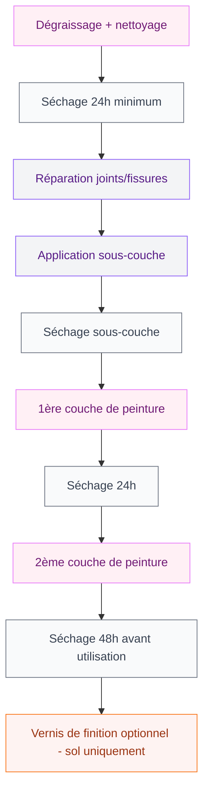
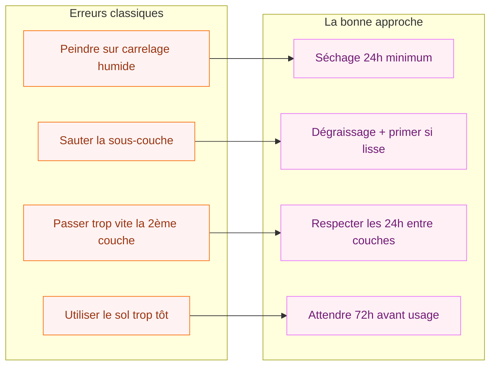

Tu regardes ton carrelage des années 90 et tu te dis que tu ne peux plus le voir en peinture ? Bonne nouvelle : tu peux littéralement le mettre en peinture. La peinture sur carrelage, c'est la technique qui permet de transformer complètement une salle de bain ou une cuisine moche sans sortir le marteau-piqueur. Un week-end, quelques dizaines d'euros, et hop - nouveau départ.

Je vais te donner la méthode exacte pour que ça tienne, parce que oui, mal fait, ça cloque au bout de trois mois. Bien fait, ça peut durer cinq à dix ans.

## Pourquoi peindre son carrelage plutôt que le changer ?

La réponse courte : le coût et le temps. Remplacer du carrelage, ça implique de la casse, des gravats, un carreleur pro si on ne veut pas louper les joints, et une facture qui grimpe vite à plusieurs milliers d'euros. Sans compter que tu vis dans un chantier pendant une semaine.

La peinture sur carrelage, c'est une journée de prep plus une journée d'application. Budget : entre 50 et 150 euros selon la surface et la qualité de la peinture choisie.

> [!NOTE]
> La peinture sur carrelage convient très bien aux murs (salle de bain, cuisine, couloir). Pour les sols, c'est possible mais ça demande une peinture spécifique très résistante et un vernis de protection en plus. On en parle plus bas.

L'autre avantage, c'est la réversibilité partielle. Si dans deux ans tu veux vraiment changer le carrelage, la peinture ne complique pas les travaux. Et si tu loues ton appartement, c'est un bon moyen de moderniser sans engager des frais de rénovation lourds.

## Quelle peinture choisir ?

C'est LA question. Pas n'importe quelle peinture ne tient sur du carrelage, qui est une surface lisse, non poreuse et souvent exposée à l'humidité.

**La peinture époxy, c'est la référence.** Elle se présente en deux composants (la peinture + le durcisseur) qu'on mélange juste avant d'appliquer. Une fois polymérisée, elle forme un film extrêmement dur et résistant à l'eau, aux produits ménagers, et aux chocs. C'est ce qu'on utilise dans les cuisines pros et les hôpitaux.

Marques accessibles : Bondex Relook Carrelage (Castorama, autour de 40-50 euros le kit pour 2m2), V33 Rénovation Carrelage (Leroy Merlin, même gamme de prix), Peinture carrelage Ripolin.

**La peinture acrylique spéciale carrelage** existe aussi, moins chère et sans odeur forte. Elle tient bien sur les murs mais moins en sol. Si tu peins juste les murs de ta douche ou ta crédence cuisine, c'est une option valable.

> [!TIP]
> Achète toujours un peu plus que la surface calculée. En général, un kit 2 composants couvre 2 à 3m2 par couche selon la porosité du carrelage et ta technique d'application. Mieux vaut finir avec du surplus qu'être à court au milieu d'un mur.

Pour la couleur, reste sur des tons qui pardonnent : blanc cassé, gris clair, sage green, terracotta doux. Les couleurs très sombres montrent plus les imperfections et les traces de calcaire après.

## La préparation : l'étape qui fait tout

80% de la réussite, c'est la préparation. J'insiste. Une peinture qui cloque ou qui s'écaille deux mois après, c'est presque toujours un problème de prep, pas de peinture.

### Nettoyage en profondeur

Commence par un dégraissage complet. Utilise de l'acétone (en pharmacie ou grande surface de bricolage) ou un dégraissant spécifique. Même si le carrelage te semble propre, la graisse, le calcaire et le savon forment un film invisible qui empêche l'adhésion.

Insiste sur les joints. C'est là que la saleté s'accumule et que la peinture accroche le moins bien. Une vieille brosse à dents avec du vinaigre blanc fait des miracles pour les joints calcaires.

Rince abondamment et laisse sécher minimum 24h. Le carrelage doit être parfaitement sec avant d'appliquer quoi que ce soit.

### Réparation des joints et fissures

Si tu as des joints abîmés, ébrèchés ou des fissures, répare-les avant de peindre. Du mortier de rejointement ou du mastic sanitaire font le travail. Attends le séchage complet.

### La sous-couche d'accrochage

Pour la peinture époxy deux composants, la sous-couche n'est pas toujours obligatoire - vérifie les instructions du fabricant. Mais pour les surfaces lisses ou très anciennes, une couche d'accrochage (primer) améliore vraiment la durabilité.

Pour les peintures acryliques carrelage, la sous-couche est souvent incluse dans le kit.

## L'application : technique et patience

### Le matériel

- Rouleau mousse courte (5mm) pour les grandes surfaces
- Pinceau plat pour les angles et les bords
- Ruban de masquage de qualité (Tesa ou 3M, pas le bas de gamme qui lâche)
- Gants en latex
- Lunettes de protection si tu utilises de l'époxy
- Ventilation : ouvre les fenêtres. L'époxy sent fort.

### Première couche

Mélange les deux composants de la peinture époxy exactement selon les proportions indiquées. Une fois mélangés, tu as une durée de vie limitée (pot life) - généralement 2 à 4h selon les marques. Ne mélange que ce que tu peux appliquer dans ce délai.

Applique en mouvements croisés (horizontal puis vertical) pour une couverture uniforme. N'essaie pas de couvrir parfaitement en une seule passe - c'est normal que le carrelage d'origine soit encore visible après la première couche.

Retire le ruban de masquage juste après l'application, avant le séchage complet.

> [!WARNING]
> Avec l'époxy, ne reviens pas sur les zones déjà peintes pour "corriger". Ça fait des traces et des surépaisseurs. Avance couche par couche et accepte les imperfections de la première passe.

### Deuxième couche

Attends minimum 24h selon la température ambiante (plus il fait froid, plus c'est long). La surface doit être sèche au toucher et ne plus coller.

Applique la deuxième couche dans le même sens que la première. C'est cette couche qui donne la couleur finale et couvre les imperfections.

Pour les murs, deux couches suffisent généralement. Pour les sols, trois couches sont recommandées.

### Séchage et durcissement

C'est là où beaucoup font des erreurs. La peinture est sèche au toucher en quelques heures, mais le durcissement complet de l'époxy prend 48 à 72h. Avant ça, le revêtement reste vulnérable.

Attends au moins 48h avant de remettre des objets sur un plan de travail peint, et 72h avant de marcher sur un sol, même en chaussettes.

Si tu as envie de voir le résultat rapidement, c'est le bon moment pour te faire un thé et regarder [comment bien choisir une peinture murale de qualité pour le reste de ta pièce](/guides/couleurs/peinture-luxens/).

## Sol ou mur : les différences importantes

### Peinture carrelage mural

C'est la plus simple. Les contraintes sont limitées : pas de frottement, pas de chocs, juste l'humidité et les projections (cuisine, douche). Une bonne peinture époxy ou acrylique carrelage en deux couches tient très bien.

La salle de bain, c'est le terrain de jeu idéal. Un carrelage années 80 marron-beige, deux couches de blanc ou de vert sauge, et ça ressemble à une salle de bain de magazine.

> [!TIP]
> Si tu peins le carrelage de ta douche, attends une semaine complète avant de l'utiliser - et évite les jets d'eau directs sur les zones fraîchement peintes les deux premières semaines. La vapeur et l'eau chaude sont les ennemis de la peinture fraîche.

### Peinture carrelage de sol

C'est plus exigeant. Le carrelage de sol subit des frottements constants, des chocs, et souvent l'eau. Voilà les règles pour que ça tienne :

1. Choisir obligatoirement une peinture époxy sol (plus épaisse et plus dure que la version mur)
2. Appliquer trois couches minimum
3. Terminer par un vernis polyuréthane ou époxy de protection - c'est lui qui subit les frottements
4. Renouveler le vernis tous les deux-trois ans selon le passage

Pour les couloirs et les cuisines, le vernis est indispensable. Pour une chambre avec peu de passage, on peut s'en passer mais c'est un risque.

Si tu veux d'autres idées de rénovation de sol à budget limité, j'ai aussi un article sur [peindre un lino pour lui donner une seconde vie](/guides/decoration/peindre-lino/).

## Les erreurs courantes et comment les éviter

**Peindre sur du carrelage fissuré en profondeur.** La peinture va masquer mais pas réparer. Si les fissures bougent (dilatation thermique), la peinture craquera au même endroit. Répare d'abord, peins ensuite.

**Choisir une couleur très sombre.** Les joints sont souvent plus clairs que les carreaux, et la peinture ne les couvre pas parfaitement. Sur une couleur claire, l'irrégularité des joints se voit peu. Sur du noir ou du marine, ça ressort.

**Ne pas ventiler.** L'époxy dégage des solvants. Fenêtre ouverte, masque si besoin, et évite de faire les travaux si la température dépasse 30 degrés - la peinture sèche trop vite et fait des traces.

## Le résultat : combien de temps ça tient ?

Avec une bonne préparation et une peinture époxy de qualité, tu peux compter sur :

- 5 à 10 ans sur les murs de salle de bain avec un entretien normal
- 3 à 5 ans sur un sol avec renouvellement du vernis tous les 2-3 ans
- 8 à 12 ans sur une crédence cuisine peu soumise aux impacts

L'entretien est simple : évite les produits abrasifs et les éponges grattantes. Un nettoyant multi-surfaces doux suffit. Et si un jour tu veux changer de couleur, une légère préparation et tu repasses une couche.

Pour aller plus loin dans la rénovation de ta déco avec les bonnes couleurs, tu peux jeter un oeil à notre [comparatif des meilleures gammes de peinture murale](/guides/couleurs/avis-peinture-spectrum/) - les critères de choix sont souvent les mêmes.

> [!IMPORTANT]
> Si ton carrelage est carré et en bon état structurel, la peinture est une excellente solution. Si le carrelage se décolle, présente des fissures traversantes ou est posé sur un support humide, la peinture sera une solution provisoire au mieux. Dans ce cas, mieux vaut traiter le problème de fond.

## Ce qu'il faut retenir

La peinture sur carrelage, c'est une rénovation DIY accessible, à condition de respecter les étapes dans l'ordre. La préparation reste la clé : un carrelage propre, sec et dégraissé sur lequel une peinture époxy de qualité va adhérer parfaitement.

Budget réaliste : 50 à 100 euros pour une salle de bain standard (5 à 8m2 de murs), matériel inclus. Temps : un premier week-end pour le nettoyage et la sous-couche, un deuxième weekend pour les couches de peinture si tu veux prendre le temps, ou tout en un week-end chargé.

Le rapport effort-résultat est imbattable pour ce type de rénovation. Et franchement, transformer un carrelage marron moche en un beau mur blanc mat ou vert amande, ça donne envie de passer plus de temps dans sa salle de bain. Ce n'est pas rien.

---

## Sur le meme theme

- [peinture pour carrelage cuisine](/guides/cuisine/peinture-pour-carrelage-cuisine/)
- [peinture carrelage extérieur terrasse](/guides/exterieur/peinture-pour-carrelage-exterieur-terrasse/)

## Questions fréquentes

**La peinture sur carrelage tient-elle dans une douche ?**
Oui, avec de la peinture époxy et une préparation soigneuse. Évite les jets directs les deux premières semaines et attends une semaine complète avant la première utilisation.

**Peut-on peindre par-dessus une ancienne peinture carrelage ?**
Oui, si l'ancienne couche est stable (pas de cloques, bien adhérente). Dégraisse, ponce légèrement pour accrocher, et applique ta nouvelle peinture. Si l'ancienne peinture se décolle, retire-la complètement avant de recommencer.

**Quel rouleau choisir pour peindre du carrelage ?**
Un rouleau mousse courte (5mm) donne le meilleur résultat : surface lisse sans traces de poils et bonne pénétration dans les angles des carreaux. Évite les rouleaux laine qui laissent des fibres dans la peinture.

**Combien de couches faut-il pour peindre un carrelage ?**
Deux couches pour les murs, trois couches pour les sols. Toujours laisser 24h de séchage entre chaque couche.

**Peut-on peindre les joints du carrelage ?**
Oui, la peinture couvre les joints. Mais si tes joints sont noirs ou très abîmés, tu peux les teindre en blanc avec un stylo à joints avant d'appliquer la peinture - le résultat sera plus net.
