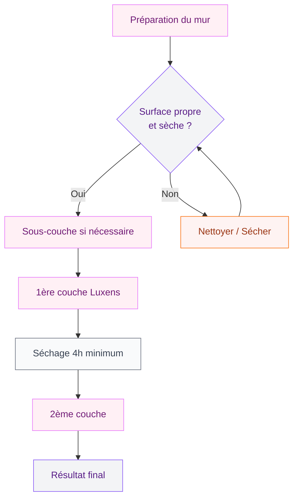

# Peinture Luxens : avis honnête, gammes et conseils pour bien la choisir

Tu as repéré la peinture Luxens en rayon chez Leroy Merlin et tu te demandes si elle vaut le coup ? C'est la marque distributeur du géant du bricolage, et elle attire beaucoup de monde avec ses prix doux et son nuancier généreux. Mais entre les promesses de l'étiquette et le rendu sur tes murs, il y a parfois un monde. Je te donne mon avis sans filtre, avec tous les détails sur les gammes, les prix, l'application et la durabilité.

Que tu sois en pleine rénovation ou que tu veuilles juste rafraîchir une pièce, ce guide va t'aider à faire un choix éclairé - sans mauvaise surprise au moment de sortir le rouleau.

## Luxens, c'est quoi exactement ?

Luxens est la marque propre de Leroy Merlin pour la peinture intérieur et extérieur. Elle n'est vendue nulle part ailleurs, ce qui explique pourquoi tu ne la trouveras pas en grande surface classique ni en magasin de peinture indépendant.

  

La gamme couvre à peu près tous les besoins : murs, plafonds, boiseries, façades, sols. Avec plusieurs niveaux de finitions (mat, satin, velours, brillant), le choix est large. Le positionnement prix se situe clairement dans l'entrée et le milieu de gamme, ce qui en fait un concurrent direct des lignes "accessibles" de V33, Dulux Valentine ou Tollens.

> [!NOTE]
> Luxens est fabriquée en France par des sous-traitants qui produisent aussi pour des marques plus haut de gamme. La qualité de base est donc correcte, même si les formulations diffèrent.

## Les gammes Luxens : comment s'y retrouver

C'est là où ça se complique un peu, parce que Leroy Merlin a créé plusieurs sous-gammes dans l'univers Luxens. Voici les principales que tu croiseras en rayon.

  

### Luxens "classique" (premier prix)

C'est l'entrée de gamme. Tu la repères à son pot blanc basique. Elle fait le job pour un plafond ou une pièce de passage qu'on veut rafraîchir sans se ruiner. Le prix tourne autour de 15 à 20 euros le pot de 2,5 L, soit environ 6 à 8 euros le litre.

Le rendu est correct en deux couches, mais l'opacité en une seule passe laisse à désirer sur les couleurs foncées. Le temps de séchage est rapide - compte 30 minutes au toucher et 4 heures entre deux couches dans de bonnes conditions.

### Luxens "couleurs intérieures"

C'est le coeur de gamme, celui que la plupart des bricoleurs choisissent. Le nuancier propose plus de 50 couleurs pré-mélangées, plus la possibilité de faire teinter en magasin parmi des centaines de références.

Prix : entre 25 et 35 euros pour 2,5 L selon la finition. C'est là que le rapport qualité-prix devient intéressant. L'application est facile, le pouvoir couvrant meilleur que sur la gamme basique, et la tenue dans le temps est honnête pour des pièces à usage normal.

### Luxens "cuisine et bains"

Formulée pour résister à l'humidité, cette gamme est pensée pour les environnements humides. Elle contient des agents anti-moisissures et offre une meilleure résistance aux projections d'eau et à la condensation.

Compte environ 30 à 40 euros les 2,5 L. Le séchage est un peu plus long (1 heure au toucher), mais la résistance aux conditions humides justifie le surcoût. Si tu refais ta [salle de bain](/salle-de-bain-cosy/), c'est cette gamme qu'il te faut.

> [!TIP]
> Pour les pièces humides, applique toujours une sous-couche adaptée avant la peinture Luxens cuisine et bains. Ça améliore la tenue et évite les problèmes d'accroche sur les surfaces lisses comme le carrelage.

### Luxens "boiseries et portes"

Finition laquée ou satinée, cette gamme est conçue pour les supports bois et les menuiseries. Elle offre une bonne résistance aux chocs et aux frottements - important pour des portes ou des plinthes qui prennent des coups au quotidien.

## Comparatif prix : Luxens face à la concurrence

C'est souvent la question numéro un. Comment Luxens se positionne par rapport aux autres marques ? Voici un comparatif sur un pot de 2,5 L en finition satinée, couleur blanche :

  

À l'usage, Luxens couleurs intérieures rivalise avec V33 Rénovation en termes de rendu et de facilité d'application. L'écart de 5 euros par pot n'est pas toujours justifié, surtout si tu peins plusieurs pièces. Sur un projet de salon complet (environ 40 m² de surfaces murales), la différence peut atteindre 30 à 50 euros rien qu'en peinture.

Dulux Valentine et Tollens restent au-dessus en termes d'opacité pure et de durabilité longue durée. Mais pour un usage domestique standard, Luxens remplit son rôle sans problème.

> [!WARNING]
> Attention aux promotions "lot de 3 pots" chez Leroy Merlin. Vérifie toujours la date de fabrication. Un pot stocké trop longtemps peut avoir une consistance modifiée et un rendu inégal après application.

## Application : mes conseils pour un résultat pro

La peinture Luxens est pensée pour les bricoleurs, pas pour les professionnels. Ça veut dire qu'elle pardonne pas mal d'erreurs, mais il y a quand même des règles à respecter si tu veux un beau rendu.

  

### Préparation des surfaces

C'est la clé d'une peinture réussie, quelle que soit la marque. Avant d'ouvrir ton pot de Luxens :

- **Dépoussière** tes murs avec une brosse ou un aspirateur
- **Rebouche** les trous et fissures avec un enduit adapté
- **Ponce** légèrement les surfaces lisses pour améliorer l'accroche
- **Dégraisse** les zones proches de la cuisine ou exposées à la graisse
- **Applique une sous-couche** si tu passes d'une couleur foncée à une couleur claire

### Conditions idéales

Le séchage et la tenue de la peinture Luxens dépendent beaucoup des conditions dans la pièce. Pour une application réussie :

- Température entre 15 et 25 degrés
- Humidité inférieure à 70%
- Bonne ventilation (fenêtre entrouverte)
- Pas de courant d'air direct sur les surfaces fraîches

### Technique d'application

Utilise un rouleau à poils moyens (10-12 mm) pour les surfaces murales. Charge bien ton rouleau, essore-le sur la grille, puis applique en croisant les passes : d'abord verticalement, puis horizontalement, et finis par un lissage vertical de haut en bas.

Pour les angles et les recoins, un pinceau à réchampir de 50 mm fait l'affaire. Commence toujours par les angles avant de remplir les surfaces au rouleau - ça évite les traces de reprise.

Le nettoyage des outils se fait à l'eau (la gamme Luxens est en phase aqueuse), ce qui simplifie bien les choses. Rince tes rouleaux et pinceaux immédiatement après usage pour qu'ils restent en bon état.

## Durabilité et résistance : ce que ça donne sur le long terme

C'est là que l'expérience des consommateurs diverge le plus. En conditions normales (salon, chambre, couloir), la peinture Luxens tient bien 3 à 5 ans sans retouche visible. La résistance aux taches est correcte en finition satinée - un coup d'éponge humide suffit pour la plupart des traces.

  

Par contre, dans les pièces à forte humidité mal ventilées, plusieurs clients rapportent des problèmes de cloquage ou de décollement après 12 à 18 mois. La gamme "cuisine et bains" s'en sort mieux, mais elle n'est pas miraculeuse si la ventilation est insuffisante.

Pour les boiseries, la tenue aux chocs est moyenne. Si tu as des enfants ou des animaux, prévois une retouche tous les 2-3 ans sur les zones de passage. Les peintures Tollens ou V33 Rénovation sont plus résistantes sur ce point précis.

> [!IMPORTANT]
> La durabilité de ta peinture dépend à 50% de la préparation. Une sous-couche adaptée et des surfaces bien poncées font plus de différence que le choix entre une marque à 30 euros et une à 50 euros.

## Couleurs tendance : que choisir dans le nuancier Luxens

Le nuancier Luxens est plutôt généreux. Tu y trouveras les grands classiques (blanc cassé, gris perle, taupe) mais aussi des teintes plus affirmées. Si tu cherches de l'inspiration pour tes [couleurs apaisantes](/couleurs-apaisantes-zen/), voici les références qui fonctionnent bien :

- **Blanc lin** : un blanc chaud légèrement crème, parfait pour agrandir une pièce
- **Gris galet** : un gris moyen ni trop froid ni trop chaud, très polyvalent
- **Bleu fjord** : un bleu-gris doux, idéal pour une chambre
- **Vert sauge** : la star de 2026, il passe partout
- **Terracotta doux** : chaleureux sans être écrasant

La finition change beaucoup le rendu d'une même teinte. Le mat absorbe la lumière et donne un aspect cocon, le satin réfléchit davantage et facilite l'entretien. Pour un [salon naturel et chic](/decoration-salon-naturel-chic/), le velours est un bon compromis entre les deux.

## Les points forts et les limites - bilan honnête

Après avoir testé plusieurs gammes Luxens sur différents projets de décoration, voici mon bilan :

**Ce qui marche bien :**
- Prix accessibles, surtout sur les volumes importants
- Séchage rapide (30 min au toucher)
- Facilité d'application, même pour les débutants
- Nuancier large avec la teinture en magasin
- Nettoyage à l'eau, pas de solvant
- Peu d'odeur à l'application

**Ce qui pourrait être mieux :**
- Opacité limitée en une couche sur les teintes foncées
- Résistance moyenne dans les pièces très humides
- Durabilité inférieure aux marques premium sur les boiseries
- Qualité variable selon les lots (vérifie toujours la date)

Pour un projet de [déco murale](/deco-murale-idees-habiller-murs-style/) sur des surfaces standard, Luxens est un choix malin qui permet d'économiser sans trop sacrifier la qualité. Pour des finitions haut de gamme ou des conditions d'usage exigeantes, monte en gamme vers Tollens ou Dulux Valentine.

## Conseils d'achat et erreurs à éviter

Avant de foncer en magasin, quelques conseils pratiques :

**Calcule bien tes quantités.** Un litre de Luxens couvre environ 10 à 12 m² en une couche. Pour deux couches sur un mur de 15 m², il te faut donc environ 3 litres. Achète toujours 10% de plus pour les retouches - ça évite de courir au magasin pour un demi-litre.

**Achète tous tes pots en même temps.** Les lots peuvent varier légèrement en teinte. Si tu mélanges des pots de lots différents, tu risques de voir des écarts de couleurs une fois le mur sec.

**Teste avant de t'engager.** Leroy Merlin propose des testeurs à 3-5 euros. Applique-les sur un carton blanc et observe le rendu à différents moments de la journée, avec la lumière naturelle et artificielle. Une couleur peut changer du tout au tout selon l'éclairage - et si tu veux approfondir ce sujet, jette un oeil à mon guide sur l'[éclairage et les ambiances](/eclairage-ambiance-techniques-sublimer/).

**Ne saute pas la sous-couche.** Sur du placo neuf, sur une surface déjà peinte en foncé, ou sur du bois brut, la sous-couche est ta meilleure alliée. Elle améliore l'accroche, l'opacité et la tenue. Luxens propose sa propre sous-couche universelle à environ 20 euros les 2,5 L.

> [!TIP]
> Mon astuce gain de temps : utilise un bac à peinture avec grille intégrée plutôt qu'un seau classique. Tu charges et essores ton rouleau en un seul geste, et ça réduit les coulures. Le modèle Luxens "Confort" à environ 8 euros fait très bien le boulot.

## Sur le meme theme

- [avis peinture spectrum](/guides/couleurs/avis-peinture-spectrum/)
- [couleurs ocres pour les murs et la décoration](/guides/couleurs/couleurs-ocres-pour-les-murs-et-la-decoration/)
- [couleurs qui se marient avec le violet](/guides/couleurs/quelles-sont-les-couleurs-qui-se-marient-bien-avec-le-violet-en-decoration/)
- [couleurs d'intérieur 2026](/guides/couleurs/couleurs-dinterieur-de-mur-et-de-peinture-a-la-mode-2026/)
- [couleurs pour la salle à manger](/guides/couleurs/couleurs-pour-la-salle-a-manger-a-peindre-et-a-decorer/)

## FAQ sur la peinture Luxens

### Est-ce que la peinture Luxens est de bonne qualité ?

Oui, pour son positionnement prix. La gamme "couleurs intérieures" offre un bon rapport qualité-prix avec une application facile et un rendu satisfaisant en deux couches. Elle ne rivalise pas avec les peintures professionnelles type Tollens Idrotop ou Sikkens, mais pour un usage domestique classique, la satisfaction est au rendez-vous.

### Combien de couches faut-il avec la peinture Luxens ?

Deux couches minimum pour un résultat optimal, trois couches si tu couvres une couleur foncée avec une teinte claire. Le temps de séchage entre deux couches est de 4 heures dans des conditions normales (température autour de 20 degrés, humidité modérée).

### La peinture Luxens est-elle adaptée aux pièces humides ?

La gamme standard n'est pas recommandée pour les pièces humides. Choisis la gamme "cuisine et bains" qui intègre un traitement anti-humidité et anti-moisissures. Et assure-toi que ta pièce est correctement ventilée - aucune peinture ne résistera longtemps dans une salle de bain sans VMC.

### Peut-on utiliser la peinture Luxens sur tous les supports ?

La peinture Luxens est compatible avec la plupart des surfaces intérieures : plâtre, placo, ciment, bois (avec sous-couche). Elle n'est pas adaptée aux surfaces métalliques ni aux sols sans préparation spécifique. Pour le carrelage mural, il existe une version spéciale avec une accroche renforcée.
