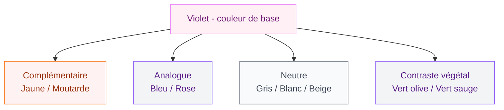
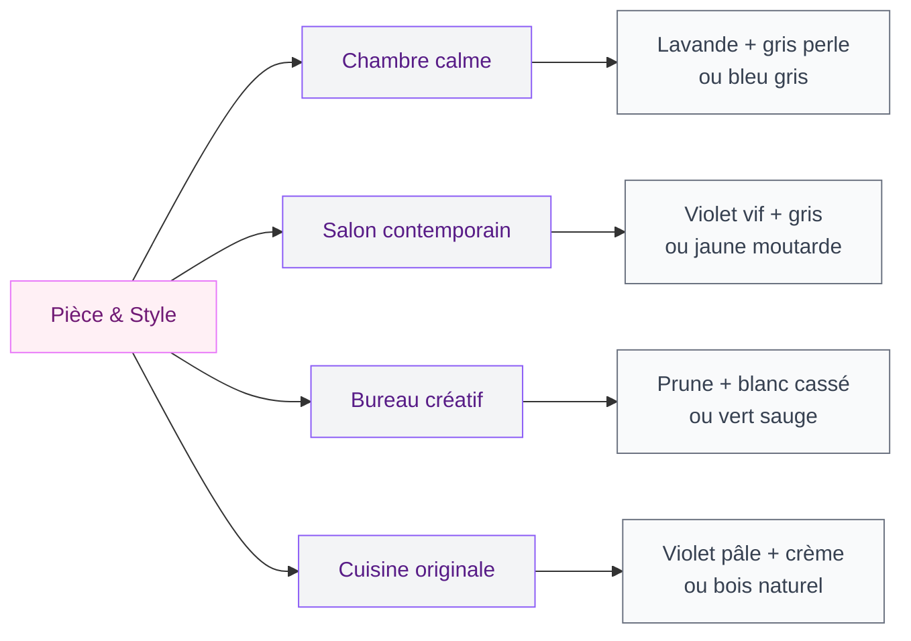

Le violet, c'est une de ces couleurs qui font peur au moment d'acheter le pot de peinture. Trop flashy ? Trop sombre ? Difficile à marier ? Je t'entends. Et pourtant, quand tu sais avec quoi l'associer, le violet devient l'une des teintes les plus belles et les plus polyvalentes qu'on puisse choisir pour une pièce. Voici mon guide complet pour que tu n'aies plus jamais à douter.

## Pourquoi le violet marche (vraiment bien) en déco

Avant de parler de ses partenaires de couleur, parlons deux secondes de ce que le violet apporte à un intérieur. C'est une couleur à la fois apaisante et créatrice d'ambiance. Les études sur la psychologie des couleurs le montrent : le violet favorise le calme et stimule la créativité. C'est pour ça qu'on le retrouve souvent dans les chambres adultes, les bureaux à la maison et les salons où on veut une vraie identité visuelle.

  

Le secret avec le violet, c'est de ne pas avoir peur de lui. La règle d'or : maximum deux couleurs vives associées, et toujours une base neutre pour respirer. Tu choisis un mur violet, et tu construis tout le reste autour.

> [!NOTE]
> Le violet existe en dizaines de nuances : lavande, prune, aubergine, lilas, mauve... Chaque nuance ne se marie pas avec les mêmes couleurs. Un violet pâle (lavande) accepte des associations très différentes d'un violet saturé ou d'un aubergine profond. Garde ça en tête quand tu lis les combos ci-dessous.

## La couleur complémentaire du violet : le jaune

Sur le cercle chromatique, la couleur directement opposée au violet, c'est le jaune. Résultat : les deux couleurs se "boostent" mutuellement et créent un contraste dynamique qui accroche l'oeil sans agresser.

  

Mais attention, "le jaune" c'est large. Voici comment ça marche selon la nuance de violet :

- **Violet saturé + jaune moutarde** : combo audacieux, très contemporain. On pense à un salon avec un mur violet profond, un canapé en lin naturel et des coussins jaune moutarde. Le H&M Home propose d'ailleurs des coussins en ce coloris entre 15 et 25 euros, idéal pour tester sans s'engager.
- **Lavande + jaune doré** : plus doux, presque romantique. Parfait pour une chambre.
- **Aubergine + jaune pâle** : association sophistiquée qui fonctionne très bien avec du bois clair.

> [!TIP]
> Si tu hésites à te lancer avec le jaune direct, commence par des accessoires. Un vase jaune moutarde sur une étagère dans une pièce où il y a déjà du violet (dans un coussin, un tableau), ça te donnera une idée du rendu avant d'investir.

## Le gris : le meilleur ami du violet

Si tu veux jouer la carte élégante et moderne, le gris est ton allié numéro un avec le violet. Pourquoi ? Parce que le gris est neutre mais pas plat. Il laisse respirer le violet tout en lui donnant une base solide.

  

La combinaison gris perle + violet lavande, c'est ce qu'on appelle un "safe bet" : ça marche dans un salon, une chambre, un couloir. Tu peux aller chercher ce genre de palette dans les collections Zara Home ou La Redoute, qui proposent souvent des ensembles coordonnés autour de ces teintes.

Quelques variantes qui fonctionnent :

- **Gris clair + violet pâle** : ambiance épurée, presque scandinave
- **Gris anthracite + violet vif** : contraste puissant, très graphique, parfait pour un bureau
- **Gris chaud (avec des sous-tons beiges) + prune** : rendu cocooning et raffiné

> [!TIP]
> Pour un salon qui marie le violet et le gris, regarde du côté des [palettes tendance pour les murs et la déco](/couleurs-du-salon-2026-palettes-de-murs-et-de-decors/) - tu y trouveras des combinaisons testées avec les proportions exactes à respecter.

## Le blanc et le crème : pour diluer et équilibrer

Le blanc est le partenaire le plus "facile" du violet. Il dilue l'intensité de la teinte et empêche la pièce de peser. C'est la combinaison classique qu'on voit souvent dans les décos provençales ou nordiques.

  

Mais attention au blanc pur avec les violets sombres : ça peut faire "chambre d'hôpital" si tu ne mets pas assez de textiles et de chaleur. Le crème ou le blanc cassé fonctionnent souvent mieux avec les violets intenses (prune, aubergine).

Le blanc marche mieux comme couleur dominante avec le violet en accent, plutôt que l'inverse. Exemple : des murs blancs, un canapé violet, des coussins blancs et une couverture prune. La pièce reste légère mais le violet donne le ton.

## L'orange : l'association qu'on n'ose pas assez

L'orange, voisin du jaune sur le cercle chromatique, partage avec lui cette capacité à vibrer aux côtés du violet. Mais l'orange apporte en plus une chaleur et une énergie que le jaune n'a pas forcément.

  

La palette violet + orange + matériaux naturels (rotin, bois clair), c'est une de mes combos préférées pour un salon chaleureux. Ikea a d'ailleurs des accessoires en rotin entre 20 et 80 euros qui se marient parfaitement avec cette gamme de couleurs.

Le dosage est clé : l'orange ne doit pas dépasser 15-20% de la surface visuelle totale. On l'intègre dans des coussins, un plaid, un tableau, pas dans un mur entier (sauf si tu sais vraiment ce que tu fais !).

## Le vert olive et le vert sauge : la combinaison nature

Le vert olive ou le vert sauge avec du violet - spécialement un violet aux sous-tons bleus - c'est une association qui sent bon la nature et le contemporain. On est sur quelque chose d'organique, de terreux, qui fonctionne très bien dans des intérieurs avec beaucoup de plantes et de matériaux naturels.

Cette combo est très dans l'air du temps. On la retrouve beaucoup dans les intérieurs "biophiliques" (qui intègrent la nature dans la déco). Si tu veux une chambre apaisante et originale, un mur violet lavande avec des textiles vert sauge, ça donne un résultat très sensoriel.

Le vert sauge et le violet partagent tous les deux des sous-tons "froids". C'est ce qui fait que ça marche si bien : les deux couleurs sont dans la même famille de température, même si elles sont très différentes visuellement. Cette cohérence dans les sous-tons, c'est le secret de beaucoup d'associations réussies.

## Le bleu : partenaires de famille

Le violet est né du mariage du rouge et du bleu. Logiquement, il s'entend bien avec son "cousin" le bleu. On parle ici d'une harmonie analogue - des couleurs voisines sur le cercle chromatique qui créent une ambiance douce et fluide.

Quelques associations concrètes :

- **Violet lavande + bleu marine** : rendu très élégant, presque classique
- **Violet vif + bleu électrique** : audacieux, énergique, à réserver à des petites surfaces
- **Prune + bleu gris** : sophistiqué, idéal pour une [chambre adulte avec deux couleurs dominantes](/les-meilleures-options-de-couleurs-pour-une-chambre-dadulte-a-deux-teintes/)

Le bleu profond (midnight blue, bleu pétrole) avec un violet chaud est une de mes associations favorites pour les chambres. C'est reposant sans être ennuyeux.

## Le rose et le mauve : harmonies douces

Le rose (surtout le rose poudre ou le rose nude) avec le violet, c'est l'association la plus facile et la plus féminine. On joue sur des tons très proches qui créent une atmosphère douce et enveloppante.

Cette palette marche particulièrement bien dans les chambres et les salons cosy. Un mur parme, un canapé rose poudre, des coussins lilas... C'est harmonieux parce que toutes les teintes sont dans la même gamme chromatique.

Le mauve, c'est précisément à la frontière entre le rose et le violet. Il joue très bien son rôle de "pont" entre les deux. Si tu trouves la combinaison rose/violet trop monochrome, tu peux ajouter une touche de blanc cassé ou de beige lin pour diversifier.

## Les matériaux qui amplifient le violet

La couleur seule ne fait pas tout. Les matériaux et les textures amplifient ou adoucissent l'effet du violet :

- **Velours violet** : somptueux, dramatique - parfait pour un canapé ou une tête de lit
- **Lin naturel** : adoucit le violet, l'ancre dans quelque chose de chaleureux
- **Laiton/doré** : métallise la palette et lui donne un côté luxueux
- **Bois clair (chêne, frêne)** : équilibre et réchauffe les violets froids
- **Béton/gris** : donne un côté urbain et contemporain aux violets vifs

Si tu cherches des peintures de qualité pour tester ces associations, tu peux regarder les retours sur la [gamme Spectrum](/avis-peinture-spectrum/) qui propose des violets très bien formulés avec une bonne couvrance.

> [!WARNING]
> Avec le violet, évite le marron chocolat et le rouge vif en grandes surfaces. Ces associations ont tendance à "salir" le violet et à créer un rendu lourd et peu lisible. Garde-les pour des tout petits accents si tu veux vraiment les utiliser.

## Comment doser le violet selon la pièce

La proportion est souvent plus importante que le choix de la couleur associée. Voici une grille simple :

**La règle 60-30-10** appliquée au violet :
- **60% neutre** : blanc, gris, crème - les murs, les grands meubles
- **30% secondaire** : ta couleur d'association (jaune, vert, bleu...)
- **10% violet** : dans les accessoires, coussins, déco, ou 1 mur seulement

Ou l'inverse si tu veux vraiment du violet dominant :
- **60% violet** : murs ou canapé
- **30% neutre** : sols, grand meuble, rideaux
- **10% complémentaire** : touches de jaune ou orange en accessoires

> [!IMPORTANT]
> Un mur violet dans une petite pièce, ça peut très bien fonctionner si le reste de la pièce est clair et la lumière suffisante. L'erreur classique, c'est de mettre du violet partout (murs + canapé + rideaux) dans une pièce peu éclairée. Résultat garanti : une pièce qui écrase. Dose toujours.

## Ma palette recommandée pour commencer

Si tu pars de zéro et que tu veux une palette sûre à 100%, voici ce que je te suggère :

**Palette n1 - Doux et contemporain :**
Mur(s) lavande + mobilier gris perle + accents blanc cassé + touches de vieux rose

**Palette n2 - Chaud et audacieux :**
1 mur violet foncé + reste des murs gris clair + accents jaune moutarde + bois naturel

**Palette n3 - Nature et sensoriel :**
1 mur violet aux sous-tons bleus + textiles vert sauge + bois clair + laiton

Ces trois palettes fonctionnent dans un salon comme dans une chambre. Elles sont suffisamment polyvalentes pour s'adapter à des styles très différents selon les meubles que tu as déjà.

Trust me : le violet, une fois qu'on sait le marier, c'est une couleur dont on ne peut plus se passer. Il donne une vraie personnalité à un intérieur, sans tomber dans le quelconque. Et avec les bonnes associations, il fait tout - cool, élégant, chaleureux, créatif. À toi de choisir ta version préférée !

---

## Sur le meme theme

- [couleurs ocres pour les murs et la décoration](/couleurs-ocres-pour-les-murs-et-la-decoration/)
- [couleurs compatibles avec l'orange](/couleurs-compatibles-avec-lorange-pour-les-murs-et-la-decoration/)

## Questions fréquentes

**Quelle couleur mettre avec du violet dans un salon ?**
Le gris perle, le blanc cassé et le jaune moutarde sont les associations les plus réussies pour un salon. Le gris crée une ambiance moderne et équilibrée, le jaune moutarde apporte du dynamisme. Pars d'un mur violet et construis autour avec des neutres.

**Le violet et le vert, ça marche ensemble ?**
Oui, le vert olive et le vert sauge se marient très bien avec le violet, surtout avec les nuances de violet aux sous-tons bleus. C'est une association contemporaine et "nature" qui fonctionne particulièrement bien dans les chambres.

**Peut-on associer le violet et le bleu ?**
Tout à fait. Le violet et le bleu sont des couleurs analogues (voisines sur le cercle chromatique), ce qui crée une harmonie naturelle. Le bleu marine avec le violet lavande, ou le bleu pétrole avec la prune, sont deux combos qui fonctionnent très bien.

**Quelle est la couleur complémentaire du violet ?**
Le jaune est la couleur directement complémentaire du violet sur le cercle chromatique. Ils se renforcent mutuellement et créent un contraste très dynamique. Le jaune moutarde est souvent préféré au jaune pur pour un rendu plus sophistiqué.

**Comment utiliser le violet sans que ça fasse trop ?**
Applique la règle 60-30-10 : 60% de neutres (blanc, gris), 30% de ta couleur d'association, 10% de violet en accents. Ou limite le violet à un seul mur et habille le reste de la pièce en clair.
