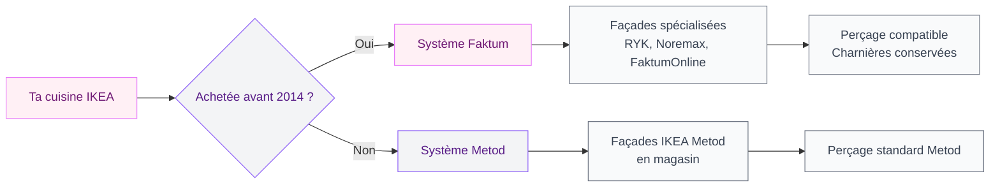
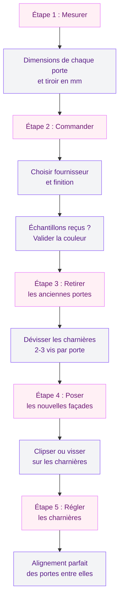

Ta cuisine IKEA Faktum a 10, 12, peut-être 15 ans. Les caissons tiennent encore la route - ils sont solides, bien fixés, bien alignés. Mais les portes, elles, racontent une autre histoire : une couleur passée, des charnières fatiguées, un style qui date du milieu des années 2000. Tu te demandes si tu dois tout arracher et recommencer à zéro. La bonne nouvelle, c'est que non. Tu peux garder tes caissons Faktum et simplement changer les façades. C'est plus rapide, plus économique, et le résultat peut être bluffant.

Le hic, c'est qu'IKEA a arrêté la gamme Faktum en 2013. Depuis, c'est Metod qui a pris le relais - et les deux systèmes ne sont pas compatibles. Pas les mêmes dimensions, pas les mêmes perçages pour les charnières. Impossible de coller une porte Metod sur un caisson Faktum. Mais plusieurs marques spécialisées se sont engouffrées dans la brèche, et c'est exactement de ca qu'on va parler.

## Faktum vs Metod : comprendre la différence

Avant de commander quoi que ce soit, il faut être sure de ce que tu as chez toi. C'est la première étape, et aussi la plus importante - se tromper ici, c'est recevoir des portes inutilisables.

**Comment savoir si tu as une cuisine Faktum ?**

- Ta cuisine IKEA a été achetée avant 2014
- Les caissons ont une profondeur de 56 cm (Metod fait 60 cm)
- Les charnières sont fixées avec deux vis, en retrait par rapport au bord
- L'étiquette à l'intérieur du caisson mentionne "Faktum"

**Pourquoi Metod ne marche pas sur Faktum ?**

IKEA a complètement revu son système de cuisine en passant de Faktum à Metod. Les entraxes de charnières sont différents, les épaisseurs des panneaux changent, et les perçages ne tombent pas aux mêmes endroits. Résultat : une porte Metod vissée sur un caisson Faktum, ca ne s'aligne pas, ca ferme mal, et au bout de quelques semaines les charnières lâchent.

> [!WARNING]
> Ne commande jamais des façades Metod pour des caissons Faktum. Les dimensions et les perçages sont incompatibles. Vérifie toujours ton système avant d'acheter.

## Les fournisseurs spécialisés Faktum : qui fait quoi

Depuis l'arrêt du Faktum chez IKEA, un petit écosystème de fabricants s'est développé pour proposer des façades compatibles. Voici les acteurs que j'ai repérés, avec leurs particularités et leurs gammes de prix.

### RYK Home

C'est le fournisseur que je recommande en premier. RYK Home propose des façades sur mesure, pensées pour les caissons Faktum. Leur gros avantage : tu conserves tes caissons ET tes charnières d'origine. Les portes arrivent pré-percées, prêtes à poser. Ils proposent aussi des échantillons gratuits ou à petit prix pour que tu puisses vérifier la couleur et la texture avant de passer commande.

**Prix indicatifs RYK Home :**
- Porte standard 40x70 cm : entre 40 et 75 euros selon le modèle
- Porte haute 40x92 cm : entre 55 et 95 euros
- Panneau de tiroir : entre 20 et 45 euros
- Cuisine complète (10 à 15 façades) : entre 500 et 1 200 euros

Ils livrent en France, avec un délai de 2 à 4 semaines selon les finitions.

### FaktumOnline

Comme le nom l'indique, c'est 100% dédié au Faktum. FaktumOnline vend des portes premium pré-percées pour les charnières IKEA Faktum, en plusieurs finitions : mat, brillant, bois, couleurs tendance. Leur catalogue est moins large que RYK, mais la qualité des finitions est au rendez-vous.

**Prix indicatifs FaktumOnline :**
- Porte standard : entre 45 et 85 euros
- Cuisine complète : entre 600 et 1 500 euros

### Noremax

Noremax est un acteur scandinave qui travaille le remplacement de façades IKEA depuis longtemps. Ils couvrent Faktum et Metod, avec un catalogue très large en termes de couleurs et textures. Leur service inclut un configurateur en ligne pour planifier ta commande pièce par pièce.

**Prix indicatifs Noremax :**
- Porte standard : entre 50 et 90 euros
- Options de personnalisation (couleurs RAL, motifs) : supplément de 10 à 20%

### The Kitchen Door Company

Basé au Royaume-Uni, The Kitchen Door Company propose aussi des façades pour Faktum. Si tu cherches un style très britannique (Shaker, cottage, bois peint), c'est une bonne option. Attention aux frais de livraison vers la France et aux éventuels frais de douane post-Brexit.

> [!TIP]
> Commande toujours un ou deux échantillons avant de valider ta commande complète. RYK Home et Noremax proposent ce service. Un échantillon te permet de vérifier la couleur réelle, la texture et l'épaisseur chez toi, à ta lumière.

## Quel budget prévoir ?

Le budget dépend évidemment de la taille de ta cuisine et du fournisseur choisi. Voici un récapitulatif pour une cuisine classique en L avec 12 à 15 façades (portes + tiroirs).

| Poste | Budget bas | Budget moyen | Budget haut |
|-------|-----------|-------------|------------|
| Façades seules (12-15 pièces) | 500 euros | 900 euros | 1 500 euros |
| Poignées neuves (lot) | 30 euros | 60 euros | 120 euros |
| Charnières de remplacement | 0 euros (réutilisation) | 40 euros | 80 euros |
| Outils et visserie | 0 euros (déjà équipée) | 15 euros | 30 euros |
| **Total** | **530 euros** | **1 015 euros** | **1 730 euros** |

Compare ca avec le prix d'une cuisine neuve complète (caissons + façades + plan de travail) qui démarre à 3 000-4 000 euros chez IKEA et monte vite au-delà de 6 000 euros chez les cuisinistes classiques. Le remplacement de façades seul, c'est 3 à 5 fois moins cher qu'un changement complet.

> [!NOTE]
> Si tes charnières Faktum fonctionnent encore bien (ouverture fluide, pas de jeu), tu peux les conserver. RYK Home et FaktumOnline vendent des portes percées pour les charnières d'origine. Tu économises 40 à 80 euros et du temps de montage.

## Comment remplacer les façades : les étapes

Le remplacement est à la portée de toute personne capable de tenir un tournevis. Pas besoin de plombier, pas besoin de retirer le plan de travail, pas besoin de toucher à l'électroménager. Voici le processus, étape par étape.

### 1. Mesurer et identifier tes façades

Ouvre chaque caisson et note les dimensions exactes de chaque porte et tiroir. Largeur et hauteur, en millimètres. Note aussi le nombre de charnières par porte (deux ou trois selon la taille). Prends des photos de l'intérieur du caisson et des charnières - ca sera utile pour la commande.

### 2. Commander les nouvelles façades

Rends-toi sur le site du fournisseur choisi. La plupart proposent un configurateur où tu entres les dimensions de chaque façade. Profite de cette étape pour choisir un style qui te plait : mat, satiné, effet bois, couleur unie. Et commande un ou deux échantillons si c'est proposé.

### 3. Retirer les anciennes portes

C'est la partie la plus simple. Ouvre la porte en grand, repère la vis de fixation sur la charnière (côté caisson), et dévisse. Chaque porte est tenue par deux ou trois charnières. Garde les vis et les charnières à portée si tu comptes les réutiliser.

### 4. Poser les nouvelles façades

Si tu réutilises les charnières existantes, il suffit de clipser la nouvelle porte sur les mêmes charnières. Si les portes sont livrées avec de nouvelles charnières, retire les anciennes et fixe les nouvelles dans les perçages existants du caisson. Dans les deux cas, ca prend 2 à 5 minutes par porte.

### 5. Régler les charnières pour un alignement parfait

C'est l'étape qui fait la différence entre "ca a l'air bricolé" et "on dirait une cuisine neuve". Les charnières Blum (qu'on retrouve souvent sur les Faktum) ont trois vis de réglage :

- **Vis de profondeur** : rapproche ou éloigne la porte du caisson
- **Vis de hauteur** : monte ou descend la porte de quelques millimètres
- **Vis latérale** : décale la porte à gauche ou à droite

Prends le temps de régler chaque porte pour que les espaces entre les façades soient réguliers. Un écart de 2-3 mm uniforme sur toute la longueur, c'est le standard.

## Quel style choisir pour tes nouvelles façades ?

Puisque tu changes les portes, autant en profiter pour donner un vrai coup de frais à l'ambiance de ta cuisine. Voici les tendances qui marchent bien en 2026 et qui s'adaptent aux caissons Faktum.

### Le mat texturé

Les façades mates avec un léger grain (effet lin, effet ciment, effet bois brossé) sont partout cette année. Elles ne marquent pas les traces de doigts - un vrai plus en cuisine - et donnent un rendu contemporain sans être froid. Chez RYK Home, les finitions mates démarrent autour de 45 euros la porte standard.

### Le vert sauge et les teintes terreuses

Si tu veux de la couleur sans te lasser, le vert sauge, le terracotta doux et le bleu gris sont des valeurs sures en 2026. Ces teintes se marient bien avec un plan de travail en bois et des poignées dorées ou noires. Pour plus d'inspiration sur les palettes de couleurs en cuisine, regarde notre guide sur les [couleurs de cuisine tendance 2026](/guides/cuisine/couleurs-de-cuisine-2026/).

### Le Shaker revisité

Le style Shaker (portes à cadre et panneau plat) revient en force, surtout en version épurée sans moulures excessives. C'est un classique qui vieillit bien et qui s'adapte à beaucoup de décos, du rustique moderne au scandinave. FaktumOnline propose plusieurs modèles de type Shaker.

> [!TIP]
> Profite du changement de façades pour moderniser aussi les poignées. Des poignées noires mates ou dorées brossées sur des portes claires, ca transforme immédiatement l'ambiance. Compte 3 à 8 euros par poignée chez des marques comme Furnipart ou chez Brico Dépôt.

## Ne pas oublier : les petits détails qui comptent

Quand tu remplaces les façades, pense aussi aux éléments qu'on oublie souvent :

**Les plinthes** : si tu changes de couleur de portes, les plinthes d'origine risquent de jurer. La plupart des fournisseurs de façades proposent des plinthes assorties. Budget : 15 à 40 euros pour un kit de plinthes en 2-3 mètres.

**Les panneaux latéraux** : les côtés visibles des caissons en bout de rangée. Un panneau de finition dans la même teinte que les nouvelles portes donne un résultat beaucoup plus propre. Chez RYK, un panneau latéral coute entre 30 et 60 euros.

**Les poignées** : si tu passes d'un style classique à du sans-poignée, vérifie que les anciens trous de perçage seront cachés par les nouvelles façades. Sinon, un peu de mastic bois et un coup de peinture peuvent faire l'affaire.

**L'éclairage** : tant que tu as les portes démontées, c'est le moment idéal pour ajouter un bandeau LED sous les meubles hauts. Ca ne coute que 15-30 euros et ca change complètement l'ambiance le soir.

## Et si tu en profitais pour revoir l'aménagement ?

Le changement de façades peut être le point de départ d'une petite transformation plus large. Si tes caissons Faktum sont en bon état, tu peux aussi :

- **Réorganiser tes rangements intérieurs** avec des séparateurs, tiroirs internes et accessoires. On en parle en détail dans notre guide sur l'[organisation des armoires de cuisine](/guides/cuisine/organisation-armoire-cuisine/).
- **Revoir la disposition générale** si tu rêves d'une ouverture sur le salon. Les caissons Faktum peuvent rester en place pendant que tu fais abattre une cloison - les façades neuves arriveront après. Jette un oeil aux possibilités de la [cuisine américaine en 2026](/guides/cuisine/cuisine-americaine-2026-dessins-et-modeles/) pour des idées de configuration.

> [!IMPORTANT]
> Avant de toucher à un mur porteur pour ouvrir ta cuisine, fais toujours intervenir un bureau d'études structure. Un mur porteur mal géré, c'est un risque réel pour la sécurité de ton logement.

## FAQ

### Est-ce que les portes IKEA Metod sont compatibles avec les caissons Faktum ?

Non. Les deux systèmes ont des dimensions et des perçages différents. Les portes Metod ne s'adaptent pas aux caissons Faktum sans modifications importantes. Il faut passer par des fournisseurs spécialisés comme RYK Home, FaktumOnline ou Noremax qui fabriquent des façades sur mesure pour le système Faktum.

### Combien coute le remplacement des façades d'une cuisine Faktum complète ?

Pour une cuisine standard de 12 à 15 façades (portes et tiroirs), compte entre 500 et 1 500 euros pour les façades seules. Avec les poignées et éventuellement des charnières neuves, le budget total se situe entre 530 et 1 730 euros - soit 3 à 5 fois moins qu'une cuisine neuve complète.

### Faut-il changer les charnières en même temps que les portes ?

Pas forcément. Si tes charnières Faktum d'origine fonctionnent encore bien (ouverture fluide, fermeture correcte, pas de jeu excessif), tu peux les conserver. Les fournisseurs spécialisés comme RYK Home proposent des portes pré-percées pour les charnières d'origine. Mais si certaines charnières grincent ou ferment mal, c'est le bon moment pour les remplacer (3 à 6 euros par charnière).

### Comment savoir si ma cuisine est bien une Faktum et pas une Metod ?

Regarde l'étiquette à l'intérieur de tes caissons - elle indique le nom du système. La Faktum a été vendue par IKEA entre 1996 et 2013 environ. Les caissons Faktum font 56 cm de profondeur (contre 60 cm pour Metod). En cas de doute, mesure la profondeur du caisson et prends en photo les charnières pour les montrer au fournisseur avant de commander.

### Combien de temps faut-il pour remplacer toutes les portes d'une cuisine Faktum ?

Pour une cuisine de taille moyenne (12 à 15 portes et tiroirs), compte une demi-journée à une journée complète. Le démontage des anciennes portes prend 30 à 45 minutes. La pose des nouvelles façades, 1 à 2 heures. Le réglage des charnières pour un alignement parfait, 1 à 2 heures de plus. Pas besoin de compétences particulières, un tournevis cruciforme et un peu de patience suffisent.
