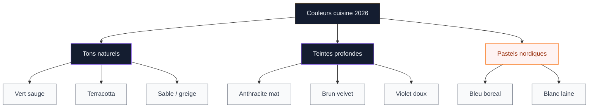
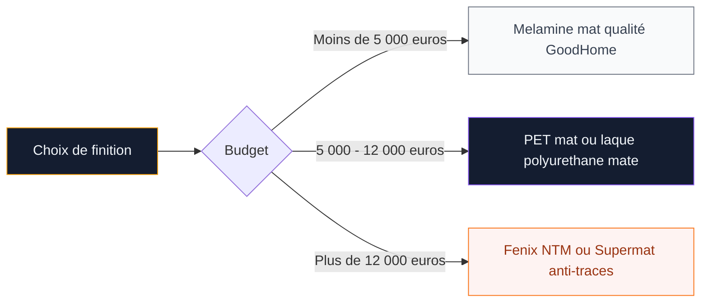
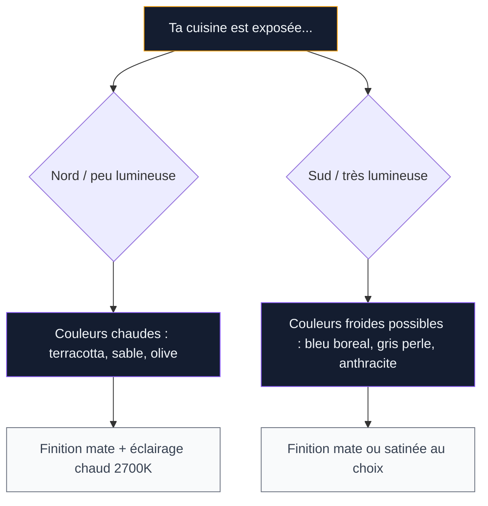

Tu sens que ta cuisine blanche commence à te lasser ? Ou tu es en plein projet et tu te demandes quelle couleur choisir pour ne pas te tromper ? Bonne question - parce qu'en 2026, les palettes ont vraiment changé. On est loin du gris anthracite partout ou du blanc immaculé qui a dominé pendant 10 ans. Cette année, la tendance est aux tons naturels, aux teintes profondes et aux associations bicolores qui donnent du caractère sans sacrifier la luminosité.

Je t'explique les couleurs qui marquent l'année, comment les associer, et surtout quelles erreurs ne pas faire.

## Les 6 couleurs phares de 2026

  

### Le vert sauge : la valeur sûre

Le vert sauge reste le roi incontesté des cuisines en 2026. Cette teinte grisée et douce s'adapte à tous les styles - du contemporain au campagne chic - et elle ne fatigue pas, même au bout de 5 ans. Chez Cuisinella, les facades vert sauge mat sont en top 3 des ventes depuis deux ans. Schmidt le propose dans sa collection Arcos à partir de 6 500 euros pour une cuisine en L.

Ce qui fonctionne si bien avec le sauge, c'est sa polyvalence. Il va avec le bois clair, le laiton, le marbre blanc, le noir mat. C'est la couleur "joker" qui pardonne presque tout. Si tu veux approfondir cette teinte, regarde aussi notre guide sur la [cuisine verte et bois](/la-cuisine-verte-et-bois-une-teinte-elegante-et-moderne/) qui détaille toutes les nuances possibles.

### Le terracotta : la chaleur méditerranéenne

Le terracotta s'est installé en cuisine et il ne compte pas partir. Ce brun-orangé terreux évoque la terre cuite, les marchés du sud, les cuisines italiennes de nos grands-mères - mais en version modernisée. Pronorm et Veneta Cucine ont chacun sorti des gammes complètes dans cette teinte pour 2026.

Le truc avec le terracotta : il faut le doser. Sur toutes les facades, ça peut virer au "restaurant mexicain". Sur les meubles bas ou en ilot central avec du blanc cassé en haut, c'est exactement la bonne dose.

### L'anthracite mat : l'élégance brute

L'anthracite n'est pas du noir - il est plus doux, plus chaud, avec des nuances bleutées ou brunes selon la lumière. En finition mate, il donne un rendu sensoriel presque velouté au toucher. Rhinov le classe parmi ses trois couleurs les plus demandées pour les projets cuisine 2026.

Budget : chez Leroy Merlin, les facades anthracite mat GoodHome Stevia tournent autour de 45 euros la facade 60x80 cm. Chez Mobalpa, comptez 9 000 a 14 000 euros pour une cuisine complete dans cette teinte.

> [!TIP]
> L'anthracite mat montre les traces de doigts comme aucune autre couleur. Choisis une finition "soft touch" anti-traces (Fenix NTM ou Supermat) si tu ne veux pas passer ta vie à essuyer. Chez Schmidt, cette finition est disponible à +15% du prix standard.

### Le bleu boréal : la fraicheur nordique

Voici la surprise de 2026. Un bleu très pâle, presque glacé, qui évoque les matins froids et la lumière scandinave. Marie Claire Maison l'a baptisé "tendance boréale" et ça résume bien l'ambiance : des pastels doux, beaucoup de lumière naturelle, des matériaux bruts.

Ce bleu pâle fonctionne particulièrement bien dans les cuisines exposées sud ou ouest, où la lumière chaude du soleil vient tempérer son côté froid. Associé à du bois miel et du laiton, le résultat est apaisant et très actuel.

### Le blanc laine et le sable : les neutres réinventés

Le blanc pur, c'est terminé. En 2026, les neutres ont chaud : blanc laine, sable, greige (ce mélange gris-beige qui va avec tout). Pantone a d'ailleurs choisi Cloud Dancer - un blanc crémeux très doux - comme couleur de l'année.

Ces neutres chauds remplacent le blanc froid des années 2010-2020 et apportent une douceur que le blanc classique n'avait pas. En peinture murale, V33 propose son "Blanc Laine" à 28 euros les 2,5 litres, et Dulux Valentine a sorti toute une gamme "Sable & Grège" autour de 35 euros.

### Les violets doux et bruns profonds : les outsiders

Plus confidentiels mais présents chez les marques haut de gamme, les violets éteints (lavande fumée, prune douce) et les bruns profonds (chocolat, moka) font leur entrée en cuisine. Veneta Cucine a montré des modèles brun velvet lors du Salon de Milan, et le rendu avec du marbre veiné et du cuivre est saisissant. Des choix audacieux qui méritent un essai en échantillon.

## Les associations bicolores qui marchent

Oublie la cuisine monochrome. En 2026, le bicolore est partout - et c'est ce qui donne de la personnalité à une pièce. Voici les duos testés et approuvés.

  

**Crème + vert sauge** : Le duo le plus demandé de l'année selon Cuisinella. Le crème en meubles hauts, le sauge en bas. Résultat lumineux, chaleureux, jamais ennuyeux. Si tu veux aussi explorer d'autres combinaisons vertes, jette un oeil a la [cuisine olive](/cuisine-olive/) qui joue dans un registre similaire mais plus chaud.

**Blanc cassé + terracotta** : L'association méditerranéenne par excellence. Le blanc cassé calme le côté intense du terracotta et le résultat évoque la Toscane sans effort. Budget pour des facades bicolores chez Ikea (HAVSTORP blanc + Kallarp terracotta) : 3 500-5 500 euros pour une cuisine de 8 m².

**Gris perle + bois miel** : Pas vraiment bicolore au sens strict, mais cette association de facades gris perle avec un plan de travail et des étagères en chêne miel est une des plus photographiées du moment. Le bois casse la froideur du gris et donne un ancrage naturel.

**Anthracite + blanc laine** : Le contraste fort mais maîtrisé. Le bas en anthracite, le haut en blanc laine, et un plan en quartz clair. Très contemporain, très propre, et ça agrandit les cuisines en créant une rupture visuelle entre les deux niveaux.

> [!NOTE]
> Pour réussir un bicolore, la règle est simple : 60% de la couleur claire, 40% de la couleur foncée. Ça maintient la luminosité tout en créant du contraste. Si tu inverses les proportions, ta cuisine risque de paraître plus petite et plus sombre.

## Les finitions mates : pourquoi tout le monde les veut

Si tu regardes les catalogues 2026 de Schmidt, Mobalpa, Pronorm ou Cuisinella, tu vas remarquer un truc : le laqué brillant a presque disparu. Les finitions mates dominent tout, et il y a de bonnes raisons à ça.

  

Une facade mate absorbe la lumière au lieu de la refléter, ce qui donne un rendu plus doux et plus sensoriel. Quand tu passes la main sur une facade en Fenix NTM (le matériau anti-traces utilisé par beaucoup de cuisinistes haut de gamme), tu sens une surface presque soyeuse. C'est devenu un argument de vente à part entière.

L'autre avantage : les finitions mates masquent mieux les petites rayures et les traces du quotidien. Avec des enfants ou un usage intensif, c'est un vrai plus.

Côté prix, le mat coûte en général le même prix que le brillant chez les grandes enseignes. Chez Schmidt, la difference entre mat et brillant est nulle sur les gammes standard. Chez Nobilia, comptez un supplément de 5 à 10% pour les finitions Supermat.

> [!WARNING]
> Certaines finitions mates bon marché (mélaminé mat basique) marquent très vite et sont difficiles à nettoyer. Si tu choisis du mat, investis dans une finition de qualité type Fenix, Supermat ou PET mat. La difference de prix (environ 20-30% de plus) se récupère sur la durée de vie.

## Comment choisir la bonne couleur pour ta cuisine

Toutes ces tendances c'est bien joli, mais comment savoir ce qui marchera chez toi ? Voici les critères concrets à vérifier.

  

**L'exposition lumineuse** : Une cuisine exposée nord reçoit une lumière froide et bleutée. Les couleurs chaudes (terracotta, sable, vert olive) compensent et réchauffent l'espace. A l'inverse, une cuisine plein sud baignée de soleil peut accueillir des teintes plus froides (bleu boréal, gris perle, anthracite) sans devenir triste.

**La taille de la pièce** : Dans une [petite cuisine](/petites-cuisines-modernes-2026-designs-et-modeles/), les couleurs claires restent plus sûres en dominante - blanc laine, sable, vert sauge clair. Les couleurs profondes fonctionnent en accent (ilot, meubles bas) mais pas partout. Dans une grande cuisine ouverte, tu as plus de liberté.

**L'ouverture sur les autres pièces** : Si ta cuisine donne sur le salon, les couleurs doivent dialoguer. Un anthracite en cuisine avec un salon tout beige, ça crée une rupture brutale. Pense à une transition douce. Notre guide sur les [couleurs d'intérieur à la mode 2026](/couleurs-dinterieur-de-mur-et-de-peinture-a-la-mode-2026/) t'aidera à construire une palette cohérente pour tout ton intérieur.

**Ton style de vie** : Tu cuisines tous les jours et tu as des enfants ? Les couleurs claires et les finitions mates anti-traces seront tes alliées. Tu reçois beaucoup et ta cuisine est aussi ton espace de vie ? Les couleurs affirmées donnent du caractère et tes invités s'en souviendront.

> [!TIP]
> Avant de choisir, commande des échantillons de peinture (Farrow & Ball en envoie gratuitement) et colle-les au mur de ta cuisine pendant 3-4 jours. Observe-les le matin, à midi et le soir sous lumière artificielle. La même couleur peut rendre totalement différent selon l'heure.

## Comment intégrer les couleurs tendance sans tout refaire

Pas besoin de changer ta cuisine pour suivre les tendances. Voici des options par palier de budget.

  

**Moins de 200 euros - les accessoires** : Change tes poignées pour du laiton brossé (8-15 euros pièce), ajoute un tapis dans les tons terracotta (Ikea, 30-50 euros), remplace tes torchons. Les accessoires colorés changent l'ambiance plus vite qu'on ne le pense.

**200 à 1 000 euros - la peinture** : Peins un pan de mur en vert sauge ou en bleu boréal. Si tes facades sont en bois ou MDF, peins-les avec une peinture spéciale meuble (V33 Rénovation Meubles, 35 euros le litre). Compte 2-3 jours de travail et 200-400 euros pour un résultat bluffant.

**1 000 à 5 000 euros - les facades** : Chez Ikea, changer uniquement les facades sans toucher aux caissons coûte entre 1 500 et 4 000 euros selon la taille. Des marques comme Plykea ou Reform proposent des facades design compatibles Ikea avec des teintes 2026 à partir de 2 000 euros.

**Plus de 5 000 euros - la refonte** : Si tu repars de zéro, c'est le moment de choisir une palette bicolore tendance et des finitions mates. Les cuisinistes comme Schmidt proposent des simulations 3D gratuites pour tester les couleurs avant de s'engager.

## Les erreurs couleur les plus courantes

**Suivre la tendance sans tester chez soi** : Une couleur vue sur Instagram dans un loft parisien avec 3 mètres sous plafond ne rendra pas pareil dans ta cuisine de 7 m² côté cour. Teste toujours in situ.

**Oublier la crédence et le plan de travail** : Les facades ne font pas tout. Si tu mets du vert sauge sur des facades avec une crédence orange des années 90 et un plan de travail en stratifié imitation granit, l'effet sera raté. Pense à la palette complète.

**Trop de couleurs à la fois** : Deux couleurs principales + un accent métallique (laiton, noir, cuivre), c'est le maximum. Au-delà, ta cuisine ressemblera à un échantillonnier et rien ne ressortira.

**Négliger le sol** : Le carrelage ou le parquet de ta cuisine fait partie de la palette. Un sol en carrelage gris froid avec des facades terracotta chaudes, ça va se battre visuellement. Assure-toi que tout joue dans le même registre de température.

> [!IMPORTANT]
> Si tu hésites entre plusieurs couleurs et que tu n'arrives pas à te décider, choisis la plus neutre. Un vert sauge clair ou un sable chaud te lasseront moins vite qu'un terracotta intense ou un bleu profond. Tu pourras toujours ajouter de la couleur forte par les accessoires.

## Ce qu'on retient

2026 marque un tournant pour les couleurs en cuisine. Le blanc froid et le gris neutre cèdent la place à des teintes plus vivantes et plus personnelles. Le vert sauge, le terracotta, l'anthracite mat et le bleu boréal définissent l'année, avec des neutres chauds comme le sable et le blanc laine en toile de fond.

La bonne nouvelle : tu n'as pas besoin de tout changer pour en profiter. Des poignées en laiton, un mur repeint, un accessoire bien choisi - ça suffit pour ancrer ta cuisine dans l'air du temps. Et si tu te lances dans une refonte complète, les associations bicolores et les finitions mates sont le duo gagnant pour une cuisine qui vieillit bien.

---

## Sur le meme theme

- [changer les portes d'une cuisine ikea faktum](/changer-portes-cuisines-ikea-faktum/)

## FAQ

**Quelle est la couleur de cuisine la plus tendance en 2026 ?**
Le vert sauge reste la couleur la plus demandée, suivi du terracotta et de l'anthracite mat. Les neutres chauds (blanc laine, sable, greige) dominent aussi comme base de fond pour les cuisines bicolores.

**Le terracotta en cuisine, c'est durable ou ça va se démoder ?**
Le terracotta est ancré dans une tendance longue vers les tons naturels et terreux. Il est utilisé en architecture et en décoration depuis des siècles. Contrairement à un bleu Klein ou un jaune citron, il ne choquera pas dans 5 ou 10 ans - surtout si tu l'associes à des matériaux intemporels comme le bois et la pierre.

**Peut-on mettre des couleurs foncées dans une petite cuisine ?**
Oui, mais en les dosant. Garde les couleurs foncées (anthracite, brun profond) pour les meubles bas ou l'ilot, et utilise des teintes claires en haut et sur les murs. Un bon éclairage sous les meubles hauts est aussi indispensable pour compenser l'absorption de lumière.

**Quel budget pour changer la couleur de sa cuisine existante ?**
Avec de la peinture spéciale meuble et de nouvelles poignées, compte 200 à 500 euros en DIY. Pour remplacer les facades Ikea par des facades design colorées (Plykea, Reform), le budget démarre à 1 500 euros. Une cuisine complète neuve chez un cuisiniste commence autour de 5 000 euros chez Leroy Merlin et 8 000 euros chez Schmidt ou Mobalpa.
