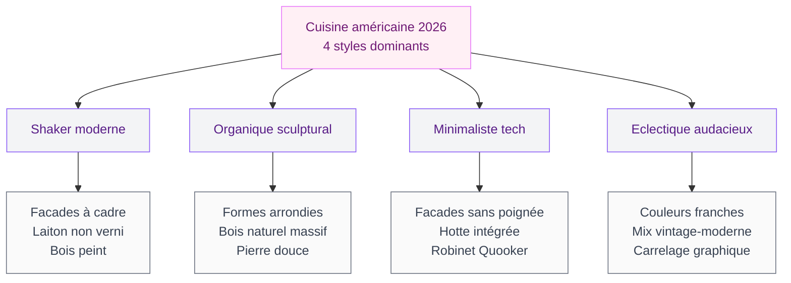
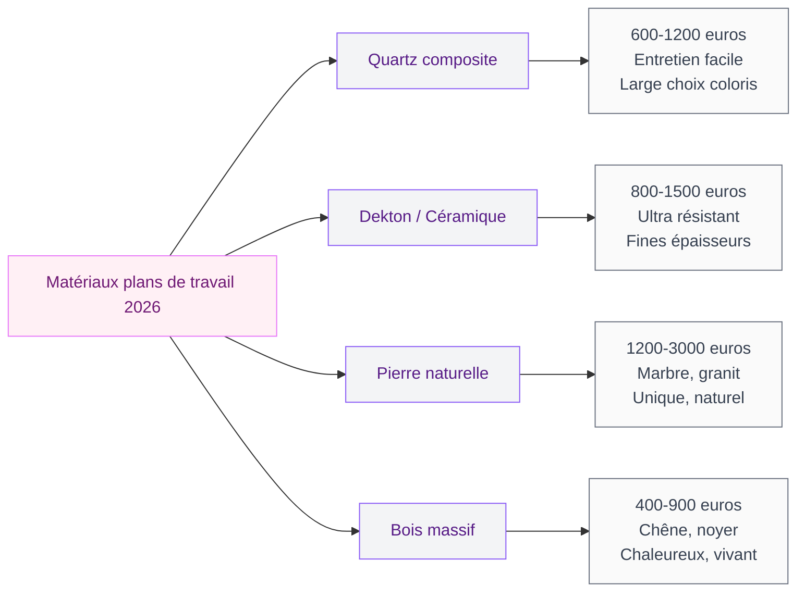
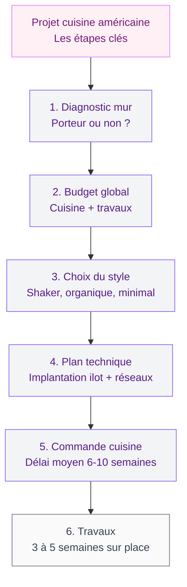

La cuisine américaine, c'est cette pièce ouverte où on cuisine, mange, discute et reçoit dans un seul espace. En France, on la connaît surtout pour son comptoir bar et son ouverture sur le salon. Mais en 2026, le concept a évolué. Les formes arrondies remplacent les angles droits. Les matériaux naturels reprennent le dessus sur le laqué brillant. La technologie s'intègre de manière invisible, sans transformer ta cuisine en vaisseau spatial.

Je vais te montrer les modèles qui se démarquent cette année, les matériaux à privilégier, et les astuces concrètes pour créer une cuisine américaine qui te ressemble - avec des prix et des marques accessibles.

## Ce qui définit la cuisine américaine en 2026

### L'ouverture repensée

Le principe de base reste le même : un espace cuisine qui communique directement avec le salon, sans cloison. Ce qui change, c'est la manière de gérer cette transition. En 2026, on ne se contente plus d'abattre un mur et de poser un comptoir en stratifié. La séparation se fait avec des éléments architecturaux pensés : un ilot sculptural, une verrière en verre rainuré, une banquette intégrée qui sert de frontière douce entre les deux zones.

Le verre rainuré (ou reeded glass), c'est la grosse tendance du moment. Ce vitrage cannelé laisse passer la lumière tout en créant un filtre visuel. Tu gardes la luminosité de l'open space mais tu masques le désordre de la cuisine quand tu n'as pas envie de le montrer. AD Magazine le cite comme un des retours les plus marquants de l'année en déco intérieure.

> [!TIP]
> Une verrière en verre rainuré fixe (sans ouverture) coûte entre 400 et 900 euros chez les artisans locaux pour un module de 100x150 cm. C'est beaucoup moins cher qu'une verrière coulissante et l'effet visuel est identique.

### Les 4 styles de cuisines américaines qui dominent

Le marché 2026 se structure autour de quatre directions claires, chacune avec ses matériaux, ses couleurs et son ambiance.

**Le Shaker moderne** reste une valeur sûre. Ce style anglo-saxon avec ses façades à cadre simple revient en force en 2026. La différence avec le Shaker classique ? Les poignées. On troque les boutons ronds pour des tirettes en laiton non verni qui vont patiner avec le temps. Plank Hardware a popularisé ce look "lived-in brass" que reprennent maintenant Cuisinella et Ikea dans leurs gammes moyennes.

**L'organique sculptural**, c'est la direction la plus spectaculaire. Louise Verlaine, architecte d'intérieur très suivie en France, résume la tendance : "En 2026, on veut des cuisines qui ressemblent à des meubles d'ébéniste, pas à des rangées de caissons." Cela se traduit par des ilots aux angles arrondis, des façades en bois massif (noyer, chêne fumé), et des plans de travail en pierre aux bords adoucis.

**Le minimaliste tech** mise sur l'intégration invisible. La hotte est encastrée dans le plan de cuisson. Le robinet est un Quooker ou équivalent (eau bouillante, filtrée, gazeuse en un seul point). Les prises sont escamotables, les LED intégrées aux meubles. On ne voit que les matériaux, jamais la technologie.

**L'éclectique audacieux** casse toutes les règles. Ce style mélange un carrelage zellige turquoise avec des meubles en bois sombre et un plan de travail en terrazzo rose. House Beautiful le classe parmi les 12 tendances de l'année avec le terme "color-drenching" : une couleur forte appliquée sur les murs, les meubles et le plafond pour un effet enveloppant. Le résultat est saisissant quand c'est bien dosé.

## L'ilot central : le coeur de la cuisine américaine 2026

L'ilot n'est plus un simple plan de travail au milieu de la pièce. En 2026, c'est le centre de gravité de la cuisine américaine. Il concentre la cuisson, la préparation, les repas rapides et parfois un coin bureau d'appoint.

### Les formes qui changent tout

Le rectangle classique cède du terrain aux formes organiques. Les ilots avec un pan arrondi, une excroissance en virgule pour le coin repas, ou une forme de haricot gagnent les showrooms. Chez Santos, le modèle "Minos" propose un retour courbe qui crée un espace repas enveloppant. Chez Veneta Cucine, la collection 2026 inclut des modules arrondis combinables en formes libres.

> [!NOTE]
> Un ilot aux angles arrondis coûte en moyenne 15 à 25% de plus qu'un modèle rectangulaire standard. L'écart vient surtout du plan de travail, qui doit être taillé sur mesure. Compte 600 a 1200 euros de plus pour un plateau en quartz ou en Dekton avec découpe arrondie.

Si tu veux aller plus loin sur le sujet des ilots, le guide complet sur les [cuisines avec ilot 2026](/guides/cuisine/cuisines-avec-ilot-2026-designs-et-tendances/) détaille toutes les configurations possibles selon ta surface.

### Dimensions et implantation

Pour qu'un ilot fonctionne dans une cuisine américaine, il faut respecter ces distances minimales :

- **Passage autour de l'ilot** : 90 cm minimum (idéal : 110 cm pour ouvrir le four sans gêner)
- **Surface minimale de la pièce** : 15 m² pour un ilot standard, 12 m² pour un ilot compact
- **Hauteur du plan de travail** : 90 cm (standard) ou 110 cm si tu veux un bar surélevé
- **Longueur de l'ilot** : 120 cm minimum pour être fonctionnel, 180 à 240 cm pour intégrer cuisson et repas

## Les matériaux qui définissent 2026

### Le bois massif en facades

Le bois revient en vedette, mais pas le bois plaqué des années 2000. En 2026, la tendance est au bois massif : chêne fumé, noyer américain, frêne huilé. Les façades en bois véritable apportent une chaleur que le mélaminé n'arrive pas à reproduire.

C'est un investissement. Une cuisine complète avec façades en chêne massif démarre à 12 000 euros chez un fabricant comme Schmidt ou Mobalpa. Pour un budget plus serré, le placage bois sur panneaux MDF est une alternative valable : l'aspect est proche, le prix chute de 30 à 40%.

> [!WARNING]
> Le bois massif en cuisine demande un entretien régulier. Huile tous les 12 à 18 mois pour les plans de travail, cire pour les facades. Si tu n'es pas prête à entretenir, le placage chêne sur MDF est plus raisonnable et dure 15 ans sans problème.

### Le laiton non verni : la quincaillerie qui vieillit bien

C'est le détail qui change tout sans exploser le budget. Les poignées et tirettes en laiton brut (non laqué, non verni) développent une patine naturelle au fil des mois. Le laiton neuf est brillant et doré ; après 6 mois d'utilisation, il prend une teinte plus chaude, plus mate, avec des variations qui racontent l'usage.

Plank Hardware propose des tirettes en laiton brut à partir de 18 euros pièce. Pour une cuisine complète (12 à 16 poignées), compte 220 à 300 euros - un upgrade au résultat disproportionné par rapport à son coût.

### La pierre et le quartz sculptés

Les plans de travail en pierre naturelle (marbre, granit, quartzite) ou en quartz composite restent la référence. La nouveauté 2026 : les bords travaillés. Au lieu du chant droit classique, les designers proposent des profils adoucis, biseautés ou arrondis qui rappellent la pierre taillée à la main.

## La technologie intégrée : visible nulle part, utile partout

### Les robinets multifonction

Le Quooker, ce robinet qui délivre de l'eau bouillante instantanée, s'est imposé dans les cuisines haut de gamme. En 2026, les alternatives se multiplient et les prix baissent. Le Grohe Red 2 démarre à 900 euros (contre 1 200 euros pour le Quooker Flex). Le principe : un seul robinet pour l'eau froide, chaude, bouillante et parfois filtrée ou gazeuse. Plus besoin de bouilloire, de carafe filtrante ni de machine à eau gazeuse.

Dans une cuisine américaine, c'est un vrai gain de place sur le plan de travail et un détail qui impressionne quand tu reçois.

### La hotte intégrée au plan

La hotte classique suspendue au plafond, c'est fini dans les cuisines américaines ouvertes de 2026 : elle bloque la vue entre cuisine et salon. Les hottes intégrées au plan de cuisson (downdraft) ou les hottes de plafond ultra-plates sont devenues la norme.

Chez Bora, le système intégré au plan de cuisson démarre à 3 500 euros (plan + hotte). Chez Elica, les versions plafond sont plus accessibles, autour de 1 200 euros. Le gros avantage : aucun obstacle visuel, la communication reste fluide entre les deux espaces.

> [!TIP]
> Si tu rénoves et que tu ne veux pas investir dans une hotte Bora, une alternative maline : la hotte tiroir (télescopique) intégrée dans un meuble haut juste au-dessus du plan. Invisible quand elle est rangée, efficace quand tu cuisines. Prix : 300 a 600 euros chez Bosch ou Neff.

## Couleurs et ambiances : ce qui marche en cuisine américaine

### Les palettes qui durent

En cuisine américaine, le choix de couleur est encore plus important que dans une cuisine fermée, parce que les teintes dialoguent avec celles du salon. Les palettes qui fonctionnent le mieux en 2026 :

- **Bicolore naturel** : facades basses en vert sauge ou bleu Boston + meubles hauts en bois clair ou blanc cassé. C'est le combo le plus demandé chez les cuisinistes cette année.
- **Monochrome chaud** : tout en bois naturel (chêne, noyer) avec des touches de laiton et un plan de travail en pierre claire. Sobre, élégant, intemporel.
- **Color-drenching** : une seule couleur forte (terracotta, bleu nuit, vert forêt) appliquée partout - façades, murs, plafond. Audacieux, mais le résultat dans un espace ouvert est spectaculaire.

Pour creuser les associations de teintes, le guide sur les [couleurs de cuisine 2026](/guides/cuisine/couleurs-de-cuisine-2026/) t'aidera à choisir la palette la plus adaptée à ta configuration.

### Le comptoir bar : comment le rendre beau et pratique

Le comptoir bar reste l'emblème de la cuisine américaine. En 2026, deux approches se dégagent : le comptoir intégré à l'ilot (un côté surélevé de 20 cm pour créer un bar avec tabourets) et la table haute adossée (une table en bois massif fixée perpendiculairement au plan de travail).

Les tabourets ont évolué. Exit le métal chromé des années 2010. Place aux assises en bois courbé, en rotin tressé ou en tissu bouclé sur structure métal noir. Chez Drawer, les tabourets de bar design démarrent à 150 euros pièce. Chez Maisons du Monde, les modèles rotin et métal sont entre 80 et 120 euros.

## Budget et planning : combien prévoir pour ta cuisine américaine

Le budget d'une cuisine américaine dépend surtout des travaux d'ouverture (abattre un mur porteur coûte entre 2 000 et 5 000 euros, étude structure incluse). Pour la cuisine elle-même, voici les fourchettes réalistes en 2026 :

| Gamme | Prix cuisine équipée | Electro inclus | Marques type |
|-------|---------------------|----------------|--------------|
| Entrée de gamme | 4 000 - 7 000 euros | Non | Ikea, Brico Dépôt, Lapeyre |
| Milieu de gamme | 8 000 - 15 000 euros | Partiel | Cuisinella, Schmidt, Mobalpa |
| Haut de gamme | 16 000 - 35 000 euros | Oui | SieMatic, Bulthaup, Poggenpohl |

Ajoute 1 500 à 3 000 euros pour l'électroménager si ce n'est pas inclus (four, plaque, lave-vaisselle, hotte). Pour un Quooker ou équivalent, compte 900 à 1 500 euros en plus.

Pour des idées d'agencement sur les [cuisines modernes 2026](/guides/cuisine/cuisines-modernes-2026-designs-modeles/), tu trouveras des inspirations complémentaires qui se marient bien avec le concept de cuisine américaine.

## Sur le meme theme

- [changer les portes d'une cuisine ikea faktum](/guides/cuisine/changer-portes-cuisines-ikea-faktum/)
- [cuisine haut de gamme en seine-et-marne](/guides/cuisine/cuisine-haut-gamme-77-ai-concept/)

## FAQ

### Est-ce qu'une cuisine américaine convient à un appartement de moins de 40 m² ?

Oui, et c'est même souvent la meilleure option. En supprimant la cloison entre cuisine et salon, tu gagnes de la luminosité et une impression d'espace. La condition : prévoir un ilot compact ou un comptoir bar plutôt qu'un grand ilot. Dans un 35 m², un ilot de 120 x 60 cm suffit largement pour préparer et manger à deux.

### Faut-il un architecte pour ouvrir la cuisine sur le salon ?

Si le mur est porteur, oui. Un architecte ou un bureau d'études structure devra valider la faisabilité et dimensionner l'IPN (poutre métallique de soutien). Coût de l'étude : 500 à 1 500 euros. Si c'est une simple cloison de doublage, un bon artisan plaquiste peut faire le travail sans étude, pour 800 à 2 000 euros selon la surface.

### Comment éviter les odeurs de cuisine dans le salon ?

C'est la question numéro un quand on parle de cuisine américaine. Trois solutions qui marchent : une hotte puissante (minimum 600 m3/h pour un espace ouvert de 40 m²), une VMC double flux bien dimensionnée, et des matériaux qui n'absorbent pas les odeurs (évite les rideaux en tissu épais juste à côté de la zone de cuisson). Le verre rainuré en séparation partielle aide aussi à canaliser les fumées vers la hotte.

### Quel ilot choisir pour une cuisine américaine en L ?

La configuration en L est idéale pour placer un ilot en face de l'angle, parallèle au mur le plus long. Privilégie un ilot de 160 à 200 cm de long avec le côté bar orienté vers le salon. Si ta pièce fait moins de 15 m², opte pour un ilot mobile sur roulettes que tu peux décaler quand tu reçois du monde.

### Le style Shaker, c'est ringard ou tendance en 2026 ?

Le Shaker est tout sauf dépassé. C'est un des 4 styles clés de l'année selon Plank Hardware et plusieurs médias déco anglo-saxons. La version 2026 se distingue par ses poignées en laiton brut (qui patine), ses teintes sourdes (vert olive, bleu ardoise, gris pierre) et ses plans de travail en bois massif ou en pierre naturelle. C'est le style qui vieillit le mieux et qui ne te lassera pas dans 10 ans.
