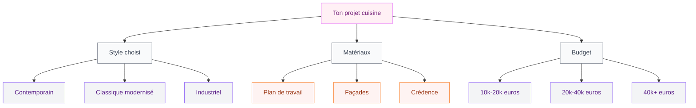

Tu habites en Seine-et-Marne et tu rêves d'une cuisine qui ne ressemble pas à celle du catalogue standard ? AI Concept 77 est l'une des enseignes spécialisées dans la conception de cuisines sur mesure haut de gamme dans le département 77. Dans cet article, je t'explique ce que propose ce type de cuisiniste local, comment se déroule un projet, quels matériaux et finitions tu peux attendre, et ce que ça coûte vraiment.

## Pourquoi choisir un cuisiniste haut de gamme local

Avant de parler d'AI Concept 77 spécifiquement, je veux qu'on aborde un point qui fait toute la différence : travailler avec un cuisiniste local haut de gamme plutôt qu'une grande enseigne nationale.

Les grandes surfaces spécialisées (Ikea, Conforama, Schmidt en franchise standardisée) ont leur place, surtout pour les petits budgets. Mais quand ton projet dépasse 10 000 - 15 000 euros, que tu as une configuration atypique, ou que tu veux quelque chose de vraiment personnel, le cuisiniste indépendant local prend tout son sens.

Un cuisiniste local comme AI Concept 77 :
- Visite ton domicile pour mesurer et comprendre tes usages réels
- S'adapte aux contraintes architecturales (murs en biais, plafond bas, poutres apparentes)
- Peut sourcer des matériaux moins standards
- Assure le suivi de chantier de A à Z

> [!TIP]
> Pour un projet de cuisine à plus de 12 000 euros, demande toujours au moins deux devis : un chez un cuisiniste local et un chez une grande enseigne nationale. La différence de prestations et de qualité des matériaux te parlera d'elle-même.

## Ce que propose AI Concept 77

AI Concept 77 se positionne sur la conception et l'installation de cuisines haut de gamme en Seine-et-Marne. L'offre tourne autour de plusieurs axes principaux.

### La conception sur mesure

Le point de départ, c'est toujours une visite chez toi. Le concepteur mesure l'espace, prend note de tes habitudes (tu cuisines beaucoup ? tu as besoin de rangements spéciaux ? tu reçois souvent ?), et discute de ton style.

Ensuite vient la phase de conception 3D. Tu visualises ta future cuisine avant de signer quoi que ce soit. C'est là que tu peux jouer avec les couleurs, les matières, la disposition des éléments. La plupart des cuisinistes haut de gamme utilisent des logiciels de rendu réaliste - c'est utile pour ne pas avoir de mauvaises surprises.

### Les styles proposés

Sans parler spécifiquement d'un catalogue figé, les cuisinistes haut de gamme en Seine-et-Marne proposent généralement plusieurs directions :

**Style contemporain épuré** : façades laquées ou en stratifié mat, sans poignées (ouverture par système Tip-On ou profil J), plans de travail en Dekton ou Silestone. C'est le style le plus demandé en ce moment.

**Style industriel** : métal brossé, bois massif, éléments suspendus. Parfait pour les lofts ou les maisons avec de la hauteur sous plafond.

**Style scandinave** : bois clair, blanc, tons naturels. Sobre, chaleureux, intemporel.

**Style classique modernisé** : moulures, portes avec cadres, tons sourds (vert anglais, bleu pétrole, gris ardoise). C'est un peu ce qu'on appelle la [cuisine olive](/guides/cuisine/cuisine-olive/) - une couleur qui cartonne depuis deux ans et qui donne un résultat absolument élégant.

> [!NOTE]
> Le style classique modernisé demande plus de budget car les façades avec moulures et les finitions travaillées coûtent plus cher à produire. Compte environ 20 à 30% de plus par rapport à une façade contemporaine standard.

## Les matériaux haut de gamme : ce qui fait vraiment la différence

C'est là que le haut de gamme justifie son prix. Voici ce que tu trouveras dans une cuisine de qualité supérieure.

### Les plans de travail

Le plan de travail, c'est ce que tu touches tous les jours. Autant investir.

**Dekton** (marque Cosentino) : surface ultracompacte, résistante à la chaleur, aux rayures, à la décoloration UV. Épaisseur 1,2 cm ou 2 cm. Prix : entre 150 et 400 euros/m² posé selon l'épaisseur et le modèle.

**Silestone** : quartz composite, très résistant, vaste choix de coloris. Prix : 100 à 300 euros/m² posé.

**Marbre et pierre naturelle** : le plus beau mais aussi le plus fragile (sensible aux acides, aux taches). Prix : 200 à 600 euros/m² selon la qualité du marbre.

**Bois massif** : chaleureux, à traiter et entretenir régulièrement. Prix : 120 à 250 euros/m² posé.

**Inox** : indestructible, hygiénique, style industriel ou professionnel. Prix : 150 à 400 euros/m² selon l'épaisseur.

### Les façades

**Laque haute brillance** : effet miroir, salissant mais très design. Entre 80 et 180 euros/facade selon la taille.

**Laque mate** : tendance, plus forgiving sur les traces de doigts. Prix similaire.

**Bois massif** : chaleur garantie, vieillissement beau si bien entretenu.

**Stratifié HPL premium** : très résistant, excellente durabilité, de nombreuses finitions disponibles. C'est souvent le meilleur rapport qualité/prix dans le haut de gamme.

### Les électroménagers intégrés

Une cuisine haut de gamme, c'est aussi l'électroménager. Les marques souvent proposées dans ce segment :

**Neff** : spécialiste de l'intégration totale, four avec système Slide&Hide (porte escamotable). Four encastrable entre 600 et 1 500 euros.

**Miele** : le très haut de gamme allemand. Lave-vaisselle entre 800 et 2 500 euros, plaque induction entre 1 000 et 3 000 euros.

**Gaggenau** : ultra premium, souvent vu dans les cuisines de cuisiniers professionnels à la maison. Budget à partir de 2 000 euros par appareil.

**Bosch Serie 8** : très bon rapport qualité/prix dans le haut de gamme accessible, entre 400 et 1 500 euros selon les appareils.

> [!WARNING]
> Méfie-toi des devis qui affichent un prix bas en intégrant de l'électroménager entrée de gamme. Demande toujours les références exactes des appareils prévus. Un four Neff HB678GBS6 n'a rien à voir avec un four Electrolux entrée de gamme, même s'ils sont tous les deux "encastrables".

## Le déroulement d'un projet avec AI Concept 77

Voici comment se déroule typiquement un projet de cuisine haut de gamme avec un cuisiniste local.

**Phase 1 - Premier contact** : tu appelles ou envoies un message, tu décris rapidement ton projet (surface, style souhaité, budget approximatif). Le cuisiniste te propose un rendez-vous.

**Phase 2 - Visite à domicile** : le concepteur vient mesurer la pièce, prendre des photos, identifier les contraintes (emplacement des gaines, fenêtres, porte d'entrée d'eau et d'électricité). Durée : 1h à 1h30.

**Phase 3 - Conception 3D** : sous 1 à 2 semaines, tu reçois un premier plan en 3D avec rendu. C'est là que les modifications s'enchaînent (couleurs, disposition, matières). Compte 2 à 4 allers-retours pour arriver à quelque chose qui te convienne.

**Phase 4 - Devis détaillé** : une fois la conception validée, tu reçois un devis complet avec le détail des éléments, des matériaux, de la pose et de l'électroménager.

**Phase 5 - Commande** : signature du devis et versement d'un acompte (généralement 30% à 50%). La fabrication démarre.

**Phase 6 - Pose** : selon la complexité du projet, la pose prend de 3 à 10 jours. Plomberie et électricité sont souvent sous-traitées à des artisans partenaires.

**Phase 7 - SAV** : un cuisiniste sérieux assure le SAV pendant au moins 2 ans (garantie légale), souvent plus.

> [!IMPORTANT]
> Avant de signer, vérifie que le devis mentionne clairement : la référence exacte de chaque élément (portes, caisson, plan de travail), les marques et modèles de l'électroménager, le délai de livraison et de pose, les conditions du SAV, et ce qui est inclus ou non dans la pose (plomberie, électricité, peinture).

## Budget : à quoi s'attendre en Seine-et-Marne

Les prix d'une cuisine haut de gamme varient énormément selon la surface, les matériaux et l'électroménager. Voici une grille approximative.

**Cuisine haut de gamme accessible** (10 à 18 m², façades stratifié premium, plan de travail quartz, électroménager Bosch Serie 8) : entre 12 000 et 22 000 euros pose comprise.

**Cuisine haut de gamme mid-level** (10 à 18 m², façades laquées, plan de travail Silestone ou Dekton, électroménager Neff ou Miele entrée de gamme) : entre 20 000 et 35 000 euros.

**Cuisine haut de gamme premium** (10 à 18 m², façades en bois massif ou laque haut de gamme, plan de travail marbre ou Dekton épaisseur 2 cm, électroménager Miele haut de gamme ou Gaggenau) : 35 000 à 60 000 euros et plus.

Ces prix incluent la conception, les meubles, le plan de travail, la pose, et l'électroménager. Ils n'incluent pas toujours les travaux de plomberie, d'électricité, et la peinture.

## Ce qui distingue une bonne cuisine haut de gamme d'une cuisine chère

C'est une question que je me pose souvent. Payer cher ne suffit pas à garantir la qualité. Voici ce que je regarde pour distinguer une vraie cuisine haut de gamme d'une cuisine simplement coûteuse.

**La qualité des caissons** : en haut de gamme, les caissons sont en bois contreplaqué ou en panneaux mélaminés épais (19 mm minimum). Les fonds de meubles sont en vrai panneau, pas en carton. L'assemblage est solide, pas juste des agrafes.

**Les charnières et glissières** : chez les cuisinistes sérieux, ce sont des charnières Blum Clip Top (ou équivalent) et des tiroirs Legrabox ou Antaro avec amortissement intégré. Ces systèmes durent 20 à 30 ans sans problème.

**La finition des joints** : les arêtes de façades sont arrondies ou biseautées, pas vives. C'est un signe de soin dans la fabrication.

**La pose** : même les plus beaux meubles peuvent être gâchés par une pose bâclée. Un cuisiniste sérieux utilise un niveau laser, ajuste les pieds réglables, et aligne parfaitement les façades.

D'ailleurs, si tu envisages une cuisine dans une teinte tendance, je t'invite à lire l'article sur la [cuisine verte et bois](/guides/cuisine/la-cuisine-verte-et-bois-une-teinte-elegante-et-moderne/) - une combinaison qui cartonne en ce moment et qui trouve très bien sa place dans les maisons seine-et-marnaises avec leurs intérieurs souvent spacieux.

## Financement et aides

Bonne nouvelle : une cuisine haut de gamme peut parfois bénéficier d'aides fiscales si elle s'inscrit dans une rénovation globale.

**TVA à 5,5% ou 10%** : dans le cadre de travaux de rénovation dans une résidence principale de plus de 2 ans, tu peux bénéficier d'une TVA réduite sur la main-d'oeuvre et une partie des matériaux. À vérifier avec ton cuisiniste et ton conseiller fiscal.

**Éco-PTZ et MaPrimeRénov'** : si ta cuisine s'intègre dans un projet de rénovation énergétique plus large, certains équipements (induction à la place du gaz, par exemple) peuvent être éligibles.

**Financement** : la plupart des cuisinistes proposent des solutions de financement (crédit à 0% sur 12 ou 24 mois, souvent via Cetelem ou Franfinance). C'est utile pour ne pas décaler un projet à cause d'un budget momentanément tendu.

## Les tendances 2026 en cuisine haut de gamme

Ce que je vois chez les clients qui se lancent dans des projets cuisine cette année :

**Le sans poignées** reste dominant, mais les poignées "statement" reviennent - grandes barres en laiton brossé, en céramique, ou en noyer.

**Les couleurs sourdes et profondes** : vert profond, bleu nuit, anthracite. Les cuisines blanches pures reculent.

**L'intégration totale de l'électroménager** : frigo américain intégré, lave-vaisselle intégré, four en colonne. On voit de moins en moins d'électroménager en inox apparent dans les projets haut de gamme.

**Les ilots avec rangements** : l'ilot ne sert plus seulement à manger ou travailler - il devient une unité de rangement avec tiroirs sur les deux faces.

**La mixité des matières** : combinaison bois + métal + pierre naturelle. Une façade en chêne avec un plan de travail en marbre et des poignées en cuivre - c'est ce qui donne du caractère.

Si tu aimes les matières naturelles et les finitions artisanales, tu pourrais aussi regarder du côté du [béton ciré pour la salle de bain](/guides/salle-de-bain/meuble-salle-de-bain-beton-cire/) - c'est une matière qui s'étend aussi à la cuisine et qui donne un résultat vraiment unique.

## Sur le meme theme

- [changer les portes d'une cuisine ikea faktum](/guides/cuisine/changer-portes-cuisines-ikea-faktum/)

## FAQ - Tes questions sur les cuisines haut de gamme en 77

**Quelle est la durée de fabrication et de livraison ?**
Pour une cuisine sur mesure haut de gamme, compte en général 6 à 12 semaines entre la signature du bon de commande et la livraison. Ce délai inclut la fabrication des caissons et des façades, la commande des plans de travail et de l'électroménager. La pose prend ensuite 3 à 10 jours ouvrés.

**Peut-on conserver ses anciens électroménagers ?**
Oui, un cuisiniste sérieux peut intégrer tes anciens appareils dans la nouvelle cuisine si leurs dimensions sont compatibles. Il faut juste le préciser dès la phase de conception pour ajuster les caissons en conséquence.

**Quelle garantie sur une cuisine haut de gamme ?**
La garantie légale est de 2 ans, mais les bons cuisinistes proposent souvent 5 à 10 ans sur la structure et les mécanismes (charnières, glissières). Les plans de travail en Dekton ou Silestone ont des garanties constructeur allant jusqu'à 25 ans.

**Est-ce qu'AI Concept 77 intervient pour des réparations ou du SAV après installation ?**
Comme tout cuisiniste local sérieux, oui - le SAV local est l'un des vrais atouts par rapport aux grandes enseignes où les délais d'intervention peuvent être très longs.

**Comment se passe le paiement ?**
Généralement : 30% à la commande, 30% à la livraison, 40% à la fin de la pose. Certains cuisinistes proposent un financement à taux zéro.

---

Si tu penses aussi à revoir la déco du reste de ta maison en cohérence avec ta nouvelle cuisine, jette un oeil à l'article sur la [décoration marocaine moderne ou classique](/guides/decoration/decoration-marocaine-moderne-ou-classique/) - les tons chauds et les matières naturelles de ce style se marient vraiment bien avec les cuisines en bois et métal.

Un projet cuisine haut de gamme en Seine-et-Marne, c'est un investissement qui dure 15 à 20 ans si les matériaux et la pose sont au niveau. Prends le temps de comparer, de visiter les showrooms, et de poser toutes tes questions avant de signer. La cuisine, c'est vraiment la pièce où ça vaut la peine de ne pas faire d'économies sur ce qui compte.
