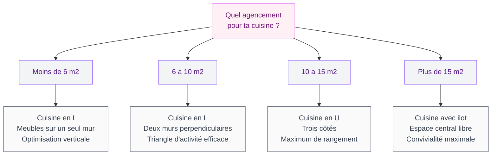
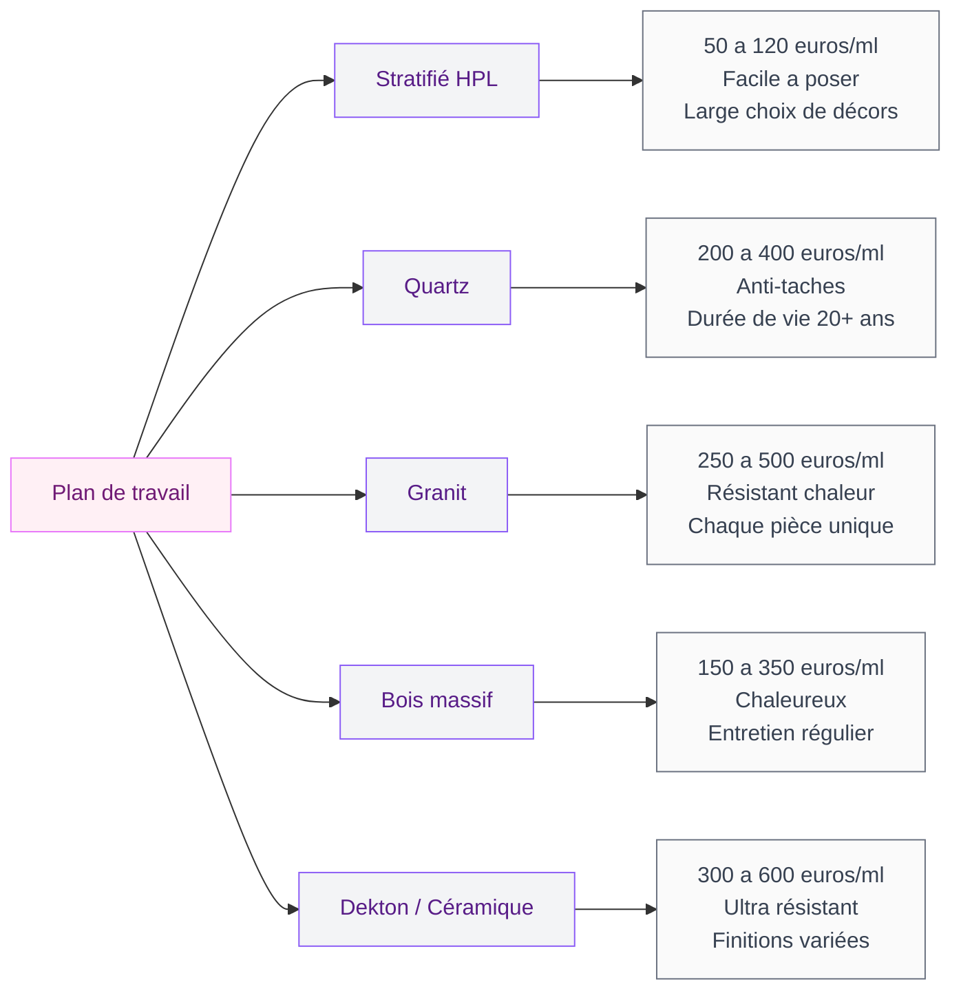

La cuisine, c'est la pièce où tout se passe. On y prépare les repas, on y prend le café du matin, on y reçoit des amis autour d'un verre de vin. En 2026, cette pièce a pris une place encore plus centrale dans nos intérieurs - et les manières de l'aménager ont changé.

Ma première cuisine était "fonctionnelle" : meubles blancs standard, plan de travail en stratifié, zéro personnalité. Quand j'ai décidé de la repenser, j'ai passé des semaines à comparer et visiter des showrooms. Ce guide, c'est tout ce que j'ai appris - et tout ce que j'aurais aimé savoir avant de commencer.

## Les grandes tendances cuisine de 2026

  

### La cuisine ouverte - toujours, mais autrement

La cuisine ouverte sur le salon n'est pas nouvelle, mais la façon de traiter cette ouverture a changé. On ne se contente plus d'abattre un mur et de poser un bar. La tendance 2026, c'est de créer des transitions douces : une verrière en verre cannelé, un îlot qui fait office de séparation, ou un changement de revêtement au sol qui dessine naturellement les deux zones.

Si tu cherches de l'inspiration pour ce type de projet, mon guide sur la [cuisine américaine 2026](/guides/cuisine/cuisine-americaine-2026-dessins-et-modeles/) détaille les modèles qui cartonnent cette année avec des plans et des budgets concrets.

### Le retour des matériaux bruts

En 2026, le laqué brillant et le blanc clinique sont en recul. Ce qui monte : le bois massif, la pierre naturelle, le béton ciré, les métaux patinés. Un plan de travail en chêne huilé va vieillir, se patiner, raconter une histoire. Un plan en granit va garder les marques du temps sans s'abîmer.

Chez Schmidt, les façades en placage bois véritable ont bondi de 35% dans les ventes 2025-2026. Mobalpa mise sur le chêne texturé avec des finitions "toucher bois". Le message est clair : on veut du vrai.

> [!TIP]
> Le bois massif en plan de travail demande un entretien régulier (huile 2 fois par an). Si tu veux le look sans la contrainte, opte pour un stratifié haute pression décor bois chez Leroy Merlin (gamme Alina, à partir de 65 euros le mètre linéaire). Visuellement, c'est bluffant.

### Les formes arrondies s'imposent

Angles adoucis sur les îlots, crédences cintrées, hottes sculpturales : la géométrie de la cuisine s'assouplit. Le tout-droit qui a dominé les cuisines modernes pendant 15 ans laisse place à des lignes plus organiques.

Chez Cuisinella, la collection "Orbita" propose des façades arrondies à partir de 5 800 euros pour une cuisine en L. IKEA a lancé des embouts de plan de travail arrondis à 25 euros pièce - une option pas chère pour adoucir une cuisine existante.

## Choisir le bon agencement selon ton espace

L'agencement dépend de la surface, de la forme de la pièce et de ta façon de cuisiner. Voici les quatre configurations principales et les espaces pour lesquels elles sont pensées.

  

### La cuisine en I (linéaire)

Tout est sur un seul mur. C'est la solution pour les studios et les petites surfaces. L'astuce, c'est de jouer avec la hauteur : des meubles hauts jusqu'au plafond, des étagères ouvertes pour les objets du quotidien, des crochets magnétiques pour les ustensiles. Chaque centimètre compte.

Budget indicatif pour une cuisine en I de 3 mètres linéaires : 2 500 à 4 000 euros chez IKEA (gamme METOD), 5 000 à 8 000 euros chez Mobalpa ou Schmidt.

### La cuisine en L

La configuration la plus populaire en France. Deux murs perpendiculaires qui forment un triangle de travail naturel entre l'évier, les plaques et le réfrigérateur. Le coin du L est souvent sous-exploité : pense aux plateaux pivotants (Leroy Merlin, à partir de 45 euros) ou aux tiroirs d'angle (Blum, à partir de 120 euros le kit).

### La cuisine en U

Trois côtés utilisés, un maximum de rangement et de plan de travail. Idéale pour les cuisines fermées de 10 à 15 m2. Le piège classique : créer un U trop étroit. Il faut au moins 120 cm de passage entre les deux côtés parallèles pour que deux personnes puissent se croiser sans se gêner.

### La cuisine avec îlot

L'îlot n'est pas un luxe réservé aux grandes surfaces. A partir de 10-12 m2, un îlot compact (120x60 cm) peut servir de plan de travail supplémentaire, de coin repas ou de zone de rangement. Chez IKEA, un îlot VADHOLMA tourne autour de 400 euros. Chez un cuisiniste comme Schmidt ou Cuisinella, un îlot sur mesure commence à 1 500 euros.

> [!NOTE]
> Avant de choisir ton agencement, mesure soigneusement ta pièce et note l'emplacement des arrivées d'eau, des évacuations et des prises électriques. Déplacer une arrivée d'eau coûte entre 300 et 800 euros (plombier) et rallonge le chantier d'une demi-journée minimum. Mieux vaut adapter l'agencement aux raccordements existants quand c'est possible.

## Les styles qui dominent en 2026

  

### Le contemporain épuré

Façades lisses sans poignée, tons neutres (blanc laine, gris perle, sable), hotte intégrée dans le plan de travail. Ce style mise sur l'absence de fioritures et fonctionne très bien dans les appartements modernes.

Bulthaup (à partir de 20 000 euros) et SieMatic (à partir de 12 000 euros) excellent dans ce registre. Chez IKEA, la gamme VOXTORP offre un rendu similaire à partir de 3 500 euros.

### Le néo-rustique

Bois brut, façades à cadre style Shaker, poignées en laiton, crédence en zellige artisanal. C'est la version moderne de la cuisine de campagne - sans les napperons et les bordures en dentelle. Le charme de l'ancien, la fonctionnalité du neuf.

Budget : ce style peut coûter assez cher en sur-mesure (15 000 à 25 000 euros chez un artisan menuisier), mais IKEA propose la gamme STENSUND en blanc ou vert qui reproduit très bien ce look entre 4 000 et 7 000 euros.

### Le style méditerranéen

Couleurs chaudes (terracotta, ocre, olive), carrelage en terre cuite au sol, crédence en faïence peinte à la main, étagères ouvertes en bois brut. Ce style évoque le sud de la France, l'Italie, la Grèce. Il se marie bien avec les vieilles maisons en pierre et les appartements avec du caractère.

Pour aller plus loin sur les palettes, consulte le guide [couleurs de cuisine 2026](/guides/cuisine/couleurs-de-cuisine-2026/) qui décrypte les associations qui marchent cette année.

> [!WARNING]
> Le zellige artisanal (crédence très tendance) est magnifique mais fragile. Compte entre 80 et 150 euros le m2 posé. Si tu cuisines beaucoup, protège-le avec un vernis alimentaire transparent (Julien, 25 euros les 500 ml). Sans protection, les taches de graisse s'incrustent dans les irrégularités de la surface.

## Les matériaux qui changent la donne

  

### Plans de travail : les options qui tiennent la route

Le choix du plan de travail, c'est souvent le poste qui fait le plus de différence, visuellement et à l'usage.

Le **stratifié haute pression (HPL)** reste le plus répandu. Les imitations pierre ou bois chez Leroy Merlin (gamme GoodHome) sont difficiles à distinguer du vrai. Pour un budget serré, c'est le meilleur rapport qualité-prix.

Le **quartz** (Silestone, Caesarstone) domine le moyen-haut de gamme. Zéro porosité, résistance aux taches, durée de vie de 20 ans minimum. Comptez 200 à 400 euros le mètre linéaire, pose comprise.

Le **Dekton** et la **céramique grand format** sont les stars 2026 du haut de gamme. Ultra résistants (chaleur, rayures, UV), le prix pique (300 à 600 euros le mètre linéaire) mais la durabilité est quasi illimitée.

### Façades : la matière fait le style

Le choix du matériau de façade définit 80% de l'ambiance visuelle. Les grandes tendances 2026 :

- **Mélaminé texturé** : le basique qui a progressé. Les finitions "toucher bois" ou "toucher pierre" sont bluffantes. Budget : 30 à 60 euros la façade standard (60x80 cm) chez IKEA ou Leroy Merlin.
- **Laqué mat** : très élégant, mais attention aux traces de doigts. La finition Fenix NTM (anti-traces, auto-réparable) est la meilleure option : 80 à 120 euros la façade.
- **Placage bois véritable** : le choix premium pour un rendu naturel et unique. 100 à 200 euros la façade. Schmidt et Mobalpa en proposent dans leurs gammes supérieures.

## Organisation et rangement : les bases qui changent tout

Une belle cuisine mal organisée, c'est une cuisine frustrante. L'organisation passe par trois principes simples.

  

**Le triangle d'activité.** Froid (réfrigérateur), lavage (évier) et cuisson (plaques) doivent former un triangle dont la somme des côtés ne dépasse pas 6-7 mètres. Plus c'est compact, moins tu fais de pas inutiles.

**Le rangement par zone.** Assiettes près du lave-vaisselle, casseroles près des plaques, épices à portée de main de la zone de cuisson. Ça paraît logique, mais beaucoup de cuisines sont organisées au hasard.

**La verticalité.** Meubles hauts jusqu'au plafond, crémaillères murales, tringles magnétiques pour les couteaux. Pour des astuces concrètes, consulte notre guide sur l'[organisation des armoires de cuisine](/guides/cuisine/organisation-armoire-cuisine/).

> [!IMPORTANT]
> Les tiroirs sont plus pratiques que les placards à portes battantes. Tu vois tout ce qui est dedans sans te pencher ni fouiller au fond. Chez IKEA, le surcoût pour passer d'une porte battante à un tiroir intérieur est d'environ 40 euros par meuble bas. C'est le meilleur investissement en confort d'usage.

## Les couleurs qui font la différence

Le choix de la couleur est personnel, mais quelques règles tiennent la route dans le temps :

**Les neutres chauds** (blanc cassé, sable, greige) sont les valeurs sûres. Tu ne t'en lasseras pas, et ils s'adaptent à tous les changements de déco.

**Les couleurs affirmées** (vert sauge, terracotta, bleu boréal, olive) donnent du caractère. Le bon réflexe : les utiliser sur les meubles bas ou l'îlot, et garder du blanc en hauteur pour éviter l'effet "cave".

**Le bicolore** est la vraie tendance 2026. Meubles bas en couleur, meubles hauts en blanc. Façades en bois, plan de travail contrasté. Pour creuser le sujet des palettes, jette un oeil à notre guide sur la [décoration de cuisine](/guides/cuisine/decoration-cuisine/).

## Budget : combien ça coûte vraiment ?

Les prix varient beaucoup selon le cuisiniste, les matériaux et la surface. Voici des fourchettes réalistes pour une cuisine complète (meubles + électroménager + pose) en 2026 :

| Gamme | Budget indicatif | Exemples |
|-------|-----------------|----------|
| Entrée de gamme | 3 000 - 6 000 euros | IKEA METOD, Leroy Merlin GoodHome |
| Milieu de gamme | 7 000 - 15 000 euros | Cuisinella, Mobalpa, Schmidt |
| Haut de gamme | 15 000 - 30 000 euros | SieMatic, Poggenpohl, sur-mesure artisan |
| Prestige | 30 000 euros et plus | Bulthaup, Varenna, Dada |

> [!TIP]
> Les cuisinistes font des promotions cycliques : janvier (après les fêtes), juin (avant l'été) et septembre (rentrée). Les remises atteignent 20 à 40% sur les modèles d'exposition. Chez Schmidt, les cuisines expo sont vendues avec -30% minimum et sont souvent quasi neuves.

## 5 erreurs à éviter en 2026

1. **Sous-estimer l'éclairage.** Spots sous les meubles hauts, éclairage au-dessus du plan de travail, luminaire suspendu sur l'îlot - ça fait 50% de l'ambiance. Budget : 150 à 400 euros pour un kit LED complet.

2. **Oublier les prises.** Il en faut au minimum 6 sur le plan de travail. En ajouter une après coup coûte 80 à 150 euros (électricien). Prévois-en trop plutôt que pas assez.

3. **Choisir un évier trop petit.** Un évier de 40 cm, c'est galère pour laver une grande poêle. Vise 50 cm minimum. Les éviers inox 1 bac XXL Blanco démarrent à 180 euros.

4. **Négliger la ventilation.** Le débit de la hotte (m3/h) doit être au moins 10 fois le volume de la pièce. Pour 20 m3, il faut 200 m3/h minimum.

5. **Suivre une tendance sans l'adapter à son quotidien.** Les façades sans poignée sont belles, mais les systèmes push-to-open montrent vite les traces de doigts gras. Les étagères ouvertes sont photogéniques, mais il faut les dépoussiérer chaque semaine.

## Sur le meme theme

- [changer les portes d'une cuisine ikea faktum](/guides/cuisine/changer-portes-cuisines-ikea-faktum/)

## FAQ

### Quel budget minimum pour refaire sa cuisine en 2026 ?

Compte 3 000 à 5 000 euros tout compris en entrée de gamme (meubles, électroménager basique, auto-installation IKEA). Pour une pose par un pro, ajoute 1 000 à 2 500 euros. Les gammes GoodHome chez Leroy Merlin offrent un très bon rapport qualité-prix sous 4 000 euros.

### Cuisine ouverte ou fermée : que choisir ?

La cuisine ouverte convient si tu aimes cuisiner en compagnie et que tu as de la place. La cuisine fermée est plus pratique si tu cuisines beaucoup (odeurs, bruit de la hotte) ou si tu veux cacher le désordre. En 2026, la tendance est au compromis : une cuisine semi-ouverte avec verrière ou claustra qui permet de fermer visuellement sans cloisonner.

### Quels sont les matériaux de plan de travail les plus résistants ?

Le Dekton et la céramique grand format supportent la chaleur directe, ne rayent pas et ne tachent pas. Le quartz (Silestone, Caesarstone) arrive juste derrière. Le granit nécessite un traitement hydrofuge tous les 2-3 ans. Le bois massif demande le plus d'entretien mais apporte une chaleur que les autres n'ont pas.

### Comment optimiser le rangement dans une petite cuisine ?

Trois leviers : la verticalité (meubles hauts jusqu'au plafond, étagères murales), les tiroirs intérieurs dans les meubles bas, et les solutions d'angle (plateaux pivotants, tiroirs d'angle Blum). Les organisateurs de tiroirs IKEA UPPDATERA (à partir de 5 euros) sont les meilleures solutions petit budget.

### Quelle couleur de cuisine ne se démode pas ?

Le blanc cassé et les tons sable/greige restent indémodables. Si tu veux de la couleur, le vert sauge est le choix le plus sûr de 2026 : il s'accorde avec le bois, le laiton et le marbre, et il ne lasse pas. Evite les couleurs trop vives (rouge, jaune citron, orange vif) en façade complète - elles fatiguent vite. Préfère les introduire en touches : un îlot coloré, une crédence, des accessoires.
