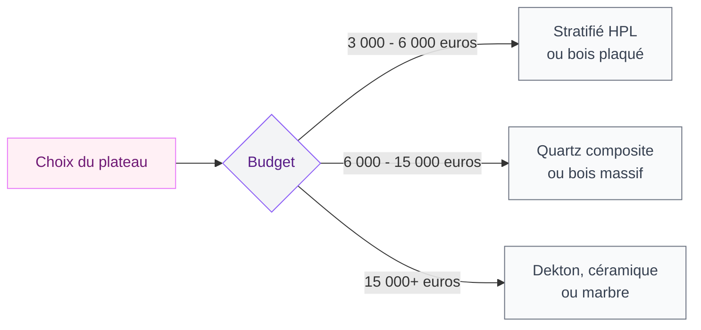

L'îlot central est devenu la pièce qui fait basculer une cuisine de "correcte" à "celle où tout le monde se retrouve". En 2026, il n'est plus juste un plan de travail posé au milieu de la pièce. Les fabricants et les designers l'ont transformé en objet sculptural, multifonction, parfois même en vrai meuble d'architecte. Et le plus intéressant, c'est que ce n'est plus réservé aux cuisines de 30 m².

Je vais te montrer les formes, les matériaux, les couleurs et les astuces concrètes pour intégrer un îlot chez toi - avec des prix réels et des marques accessibles.

## L'îlot 2026 : ce qui change par rapport aux années précédentes


<div class="my-8">
  
</div>

### Des formes qui sortent du rectangle

Le gros virage de 2026, c'est la fin du rectangle systématique. Les îlots aux angles arrondis, en forme de haricot ou avec un pan coupé, prennent de plus en plus de place dans les showrooms. Chez Veneta Cucine, les modèles avec bords courbes se multiplient. Cuisinella a aussi lancé une gamme avec des angles adoucis qui donne un résultat très organique.

Pourquoi ce changement ? D'abord pour des raisons pratiques : dans une cuisine avec passage, un angle arrondi évite les bleus sur les hanches. Et puis l'effet visuel est plus doux, plus accueillant. L'îlot rectangulaire strict fait un peu "bloc opératoire", alors que la courbe invite à tourner autour, à s'y adosser.

> [!TIP]
> Si tu n'as pas le budget pour un îlot sur mesure aux formes arrondies, une astuce simple : ajoute un plateau en bois massif avec un arrondi sur un côté. Chez Leroy Merlin, les plateaux chêne massif avec bord arrondi démarrent à 180 euros pour 200 cm.

### L'îlot comme objet sculptural

Les designers parlent d'îlot "statement" en 2026. L'idée : ton îlot ne doit plus disparaître dans la cuisine. Il doit avoir son propre caractère. On voit des piètements en métal brossé, des bases en béton ciré, des combinaisons de matériaux qui rappellent plus un meuble de salon qu'un élément de cuisine.

Chez Schmidt, les nouvelles collections jouent beaucoup sur ce contraste entre une base monolithique (teinte sombre, sans poignée) et un plateau débordant en pierre naturelle ou en bois épais. Résultat : l'îlot ressemble à une table d'architecte posée au milieu de la pièce.

## Les 5 fonctions de l'îlot en 2026

```mermaid
flowchart TD
    A[L'îlot multifonction 2026] --> B[Cuisson]
    A --> C[Coin repas]
    A --> D[Rangement]
    A --> E[Bureau d'appoint]
    A --> F[Présentation]

<div class="my-8">
  
</div>


    B --> B1[Plaque induction\n+ hotte intégrée]
    C --> C1[Bar surélevé\nou table basse]
    D --> D1[Tiroirs profonds\n+ niches ouvertes]
    E --> E1[Prises escamotables\n+ plan dégagé]
    F --> F1[Vasque à fruits\nrefroidissement intégré]

    style A fill:#FFF0F5,stroke:#E879F9,color:#701A75
    style B fill:#F3F4F6,stroke:#8B5CF6,color:#581C87
    style C fill:#F3F4F6,stroke:#8B5CF6,color:#581C87
    style D fill:#F3F4F6,stroke:#8B5CF6,color:#581C87
    style E fill:#F3F4F6,stroke:#8B5CF6,color:#581C87
    style F fill:#F3F4F6,stroke:#8B5CF6,color:#581C87
    style B1 fill:#F9FAFB,stroke:#6B7280,color:#374151
    style C1 fill:#F9FAFB,stroke:#6B7280,color:#374151
    style D1 fill:#F9FAFB,stroke:#6B7280,color:#374151
    style E1 fill:#F9FAFB,stroke:#6B7280,color:#374151
    style F1 fill:#F9FAFB,stroke:#6B7280,color:#374151
```

### Zone de cuisson intégrée

La tendance la plus forte : déplacer la plaque de cuisson sur l'îlot. Ca libère le plan de travail mural pour la préparation et le rangement. Le combo plaque induction + hotte intégrée descendante (type Bora Basic à 800 euros ou Elica Nikolatesla à partir de 1 200 euros) est devenu le standard des cuisines avec îlot en 2026.

L'avantage : tu cuisines face à tes invités ou ta famille, pas dos au mur. Le changement d'expérience est réel - la cuisine devient un espace de partage au lieu d'un poste de travail isolé.

### Coin repas modulable

Deux approches dominent. La première : le bar surélevé avec tabourets hauts (hauteur 90-100 cm), qui crée une séparation visuelle entre la zone cuisson et la zone repas. La seconde : une extension de l'îlot en table basse (hauteur 75 cm), plus confortable pour les repas quotidiens avec des enfants.

Chez Ikea, le système Metod avec extension de plan permet de créer un coin repas intégré pour 300-600 euros. Pour du sur mesure, les cuisinistes comme Mobalpa ou SoCoo'c proposent des extensions rabattables ou coulissantes entre 500 et 1 200 euros.

### Rangement optimisé

En 2026, le dessous de l'îlot n'est plus un espace perdu. Les tiroirs profonds (70 cm de profondeur, type Legrabox de Blum) se sont généralisés. On y range les casseroles, les plats à four, les robots culinaires. Les niches ouvertes côté salon accueillent les livres de recettes ou la déco.

> [!NOTE]
> Pense aussi aux prises escamotables intégrées dans le plan de travail de l'îlot. Les blocs Schulte ou Bachmann (50-120 euros) disparaissent dans le plateau quand tu ne les utilises pas. Super pratique pour brancher un blender ou charger un téléphone sans câble qui traîne.

### Bureau d'appoint

Depuis le Covid, l'îlot sert aussi de poste de travail temporaire. Un plan dégagé de 80 cm de profondeur, deux prises USB, un bon tabouret ergonomique : tu as un bureau dans ta cuisine sans sacrifier l'espace cuisson. C'est une fonction que les cuisinistes intègrent de plus en plus dans leurs propositions, surtout pour les familles avec ados.

## Les associations de couleurs qui marchent en 2026

La bicolore est reine cette année. Fini la cuisine toute blanche ou toute grise. En 2026, l'îlot a souvent une couleur différente du reste des meubles, et c'est justement ca qui donne du caractère.

<div class="my-8">
  
</div>


### Crème et vert sauge

L'association la plus populaire du moment. Les meubles muraux en crème ou blanc cassé, et l'îlot en vert sauge mat. Ca donne un résultat naturel, apaisant, qui vieillit bien. Le Journal de la Maison a identifié cette palette comme la plus demandée dans les projets de rénovation 2026.

Chez Cuisinella, la gamme Oxygène propose cette combinaison en prêt-à-poser. Chez Schmidt, il faut passer par le configurateur pour trouver un vert sauge approchant (teinte "Lichen" ou "Mousse").

### Blanc cassé et terracotta

Pour ceux qui veulent de la chaleur sans tomber dans l'orange vif. L'îlot en terracotta mat (une sorte de terre cuite douce) avec le reste de la cuisine en blanc cassé crée un contraste méditerranéen très séduisant. Si tu cherches des idées dans cette direction, [la cuisine verte et bois](/guides/cuisine/la-cuisine-verte-et-bois-une-teinte-elegante-et-moderne/) explore aussi cette logique de teintes naturelles qui fonctionnent avec le bois.

### Gris perle et bois miel

Le duo classique revisité. Le gris perle sur les façades murales apporte la modernité, et l'îlot en bois miel (chêne clair ou frêne) réchauffe l'ensemble. C'est le choix le plus sûr si tu as peur de te lasser d'une couleur forte.

> [!WARNING]
> Attention aux associations trop contrastées (noir + blanc pur, par exemple). En 2026, les designers privilégient les contrastes doux. Si tu veux du sombre, associe-le à un matériau naturel plutôt qu'à un blanc clinique.

## Matériaux tendance pour le plateau de l'îlot

Le plateau de l'îlot est la surface la plus sollicitée de ta cuisine. Voici ce qui se fait en 2026.

<div class="my-8">
  
</div>


**Quartz composite** (Silestone, Caesarstone) : le rapport résistance/esthétique est dur à battre. De 100 à 350 euros/m² posé. C'est le choix le plus courant dans les cuisines avec îlot de gamme intermédiaire.

**Dekton** (Cosentino) : surface ultracompacte qui résiste à tout. De 150 à 450 euros/m² posé. Pour les cuisiniers intensifs qui posent des casseroles brûlantes directement sur le plan.

**Bois massif épais** (chêne, noyer) : le plus chaleureux, mais il demande un entretien régulier (huilage tous les 6 mois). De 120 à 300 euros/m² selon l'essence. Chez Ikea, le plan de travail Karlby en chêne plaqué est à 199 euros pour 246 cm - un bon compromis.

**Céramique grand format** : la nouveauté 2026. Des dalles de céramique de 3,2 m posées sur l'îlot, sans joint visible. Effet spectaculaire, résistance excellente. De 200 à 500 euros/m² posé. Plank Hardware propose des finitions qui imitent le marbre sans les inconvénients.



## Quelle taille d'îlot pour quelle cuisine ?

La règle d'or : il faut au minimum 90 cm de passage libre tout autour de l'îlot. En dessous, tu ne peux pas ouvrir un tiroir confortablement.

<div class="my-8">
  
</div>


**Cuisine de 12 à 15 m²** : îlot compact de 120 x 60 cm. Pas de cuisson dessus, mais un coin repas pour deux personnes et du rangement. Budget meubles : 1 500 à 3 000 euros chez Ikea, 3 000 à 6 000 euros chez un cuisiniste.

**Cuisine de 15 à 20 m²** : îlot standard de 180 x 90 cm. Tu peux y intégrer une plaque de cuisson et un coin repas 3 places. Budget meubles : 3 000 à 8 000 euros selon la marque.

**Cuisine de 20 m² et plus** : îlot généreux de 240 x 100 cm ou plus. Place pour la cuisson, l'évier, un bar 4 places, des rangements des deux côtés. Budget meubles : 5 000 à 15 000 euros et au-delà. Pour cette gamme, regarde du côté de [nos inspirations cuisine haut de gamme](/guides/cuisine/cuisine-haut-gamme-77-ai-concept/) qui détaille les matériaux et finitions premium.

> [!IMPORTANT]
> Avant de commander un îlot, fais un test simple : découpe un carton aux dimensions prévues et pose-le dans ta cuisine pendant une semaine. Tu verras vite si la circulation est fluide ou si tu passes ton temps à le contourner.

## Budget global : combien prévoir pour une cuisine avec îlot ?

| Gamme | Budget total (pose comprise) | Ce que tu obtiens |
|-------|------------------------------|-------------------|
| Ikea optimisé | 5 000 - 9 000 euros | Îlot Metod, plan bois, sans cuisson intégrée |
| Mid-range (SoCoo'c, Cuisinella) | 10 000 - 20 000 euros | Îlot avec cuisson, quartz, finitions soignées |
| Haut de gamme (Schmidt, Mobalpa) | 20 000 - 40 000 euros | Sur mesure, matériaux nobles, électroménager premium |
| Luxe (Bulthaup, SieMatic) | 40 000+ euros | Artisanat, marbre, design exclusif |

Ces prix incluent l'îlot et les meubles périphériques. L'électroménager et les travaux de plomberie/électricité sont souvent en supplément (compte 2 000 à 5 000 euros de plus).

Pour les budgets serrés, un îlot mobile sur roulettes reste une option intelligente. Le Vadholma d'Ikea à 299 euros ou le Stenstorp à 369 euros sont de bons points de départ. Tu les bouges quand tu veux et tu n'as aucun travail de plomberie à prévoir.

## Comment personnaliser ton îlot : les détails qui font la différence

La personnalisation, c'est ce qui distingue un îlot générique d'un meuble qui te ressemble. Quelques idées concrètes :

**Les pieds** : remplace les pieds standard par des pieds en métal noir mat ou en laiton brossé. Chez Plank Hardware, les piètements design démarrent à 80 euros les quatre.

**L'éclairage** : une suspension au-dessus de l'îlot change toute l'ambiance. Les suspensions basses (60-70 cm au-dessus du plan) en laiton ou en rotin sont les plus demandées en 2026.

**Le dos de l'îlot** : côté salon, ajoute des niches ouvertes pour ranger livres, bouteilles ou déco. Ca crée un "visage" pour l'îlot quand on le regarde depuis le canapé.

**Les accessoires intégrés** : bac à herbes aromatiques encastré, refroidissement intégré pour les bouteilles, ou encore station de charge sans fil. Comera propose des modules de refroidissement intégrés qui se glissent dans le caisson de l'îlot pour environ 350 euros.

Si tu cherches d'autres idées pour une [petite cuisine moderne avec îlot compact](/guides/cuisine/petites-cuisines-modernes-2026-designs-et-modeles/), on a un guide dédié qui couvre les configurations réduites en détail.


## Sur le meme theme

- [cuisines modernes 2026](/guides/cuisine/cuisines-modernes-2026-designs-modeles/)
- [couleurs de cuisine 2026](/guides/cuisine/couleurs-de-cuisine-2026/)

## FAQ

**Quelle surface minimum pour installer un îlot central ?**
Il faut au moins 12 m² pour un îlot fixe confortable, avec 90 cm de dégagement sur chaque côté. En dessous de 10 m², privilégie un îlot roulant que tu peux déplacer selon tes besoins. Certains cuisinistes réussissent à intégrer un mini-îlot dès 9 m², mais le passage devient serré.

**Faut-il prévoir de la plomberie pour un îlot avec évier ?**
Oui, et c'est souvent le poste le plus coûteux en travaux. Déplacer l'arrivée d'eau et l'évacuation vers le centre de la pièce représente entre 800 et 2 000 euros de plomberie selon la distance et le type de sol. Si tu veux limiter les frais, garde l'évier contre le mur et réserve l'îlot pour la cuisson et le rangement.

**Quel style d'îlot vieillit le mieux ?**
Les îlots en bois massif et les finitions mates traversent les modes sans problème. Les surfaces ultra-brillantes ou les couleurs très vives risquent de dater plus vite. Pour la forme, un rectangle avec angles légèrement arrondis reste le plus polyvalent sur 10-15 ans.

**Comment entretenir un plan de travail en bois sur un îlot ?**
Applique une huile pour bois (type Osmo ou Rubio Monocoat) tous les 4 à 6 mois. Essuie les taches d'eau ou de nourriture rapidement. Évite de poser des casseroles brûlantes directement dessus. Avec cet entretien, un plan en chêne massif dure 20 ans sans problème et prend une belle patine dorée avec le temps.
