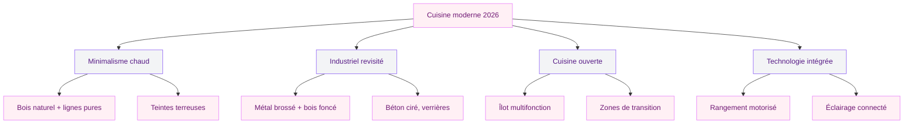
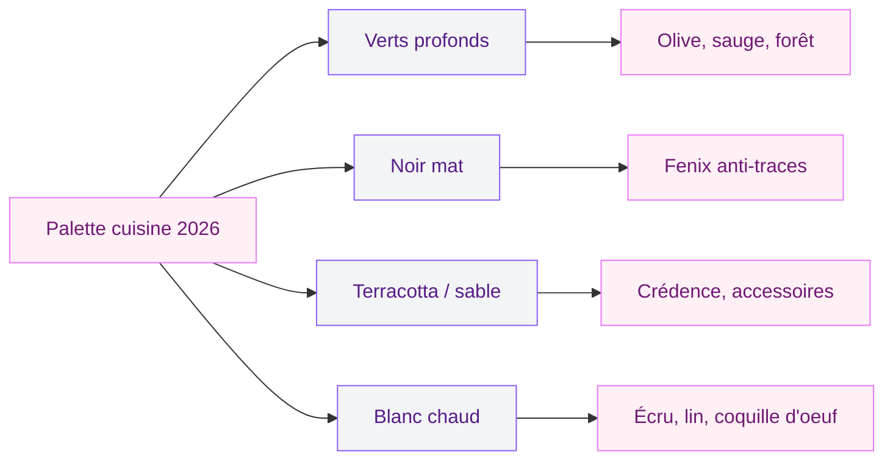
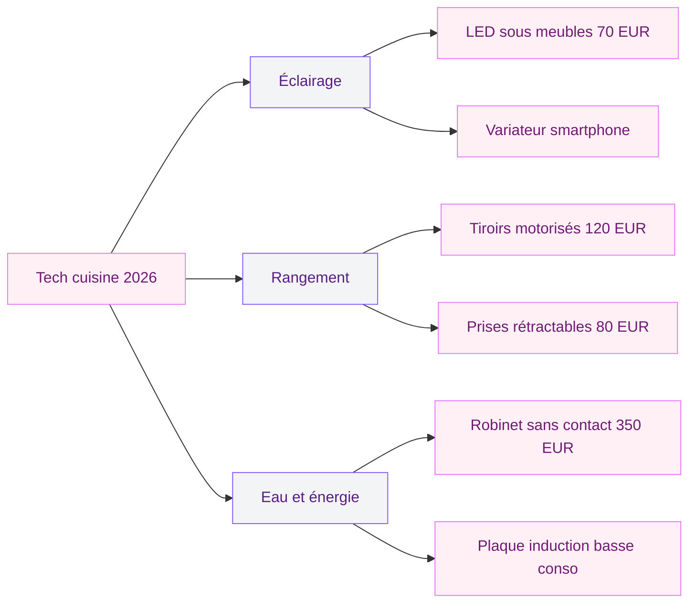

La cuisine moderne en 2026, ce n'est plus juste une rangée de meubles blancs avec un plan de travail gris. On est entrés dans une ère où la cuisine est traitée comme une vraie pièce de vie - avec autant d'attention que le salon, parfois plus. Les marques l'ont compris, les architectes d'intérieur aussi, et les tendances de cette année le confirment : minimalisme intelligent, matériaux bruts et nobles, technologie discrète, et des agencements qui collent enfin à la vraie vie.

Je te fais le tour complet de ce qui se fait de mieux en cuisine moderne cette année, avec des repères de prix, des marques concrètes et des idées que tu peux adapter chez toi.

## Les grands courants de la cuisine moderne en 2026

  

### Le minimalisme chaud

Le minimalisme froid, c'est fini. En 2026, on garde les lignes épurées, les façades lisses, les poignées invisibles - mais on y ajoute de la chaleur. Comment ? Avec du bois naturel, des teintes terreuses et des matières qui ont du grain. Le résultat, c'est une cuisine qui respire le calme sans donner l'impression de vivre dans un showroom.

Les cuisinistes comme Santos ou Leicht ont sorti des gammes qui illustrent parfaitement cette direction : façades en chêne blanchi associées à des plans de travail en Dekton ou en céramique fine. Le contraste entre la douceur du bois et la rigueur de la ligne droite crée un équilibre très agréable a vivre au quotidien.

> [!TIP]
> Pour une cuisine minimaliste qui reste chaleureuse, intègre au moins 30% de surfaces en bois naturel (façades basses, plan de travail, ou étagères ouvertes). Ca casse immédiatement l'effet "laboratoire".

### L'esthétique industrielle revisitée

Le style industriel n'a pas disparu, il a mûri. En 2026, on ne parle plus de copier un loft new-yorkais avec des tuyaux apparents et du béton brut partout. La version actuelle est plus raffinée : métal brossé sur les poignées et les pieds d'îlot, verrières fines en acier noir, béton ciré au sol ou sur la crédence, et bois foncé pour adoucir l'ensemble.

Chez Mobalpa, la collection "Atelier" propose des façades texturées effet métal vieilli qui donnent un caractère dingue a la pièce. Pour un budget plus serré, Leroy Merlin et Castorama ont des crédences adhésives effet béton ou métal qui transforment une cuisine banale pour moins de 150 euros.

Le point central de cette tendance, c'est le mélange métal et bois. Un plan de travail en noyer ou en chêne massif posé sur une structure en acier noir, par exemple. Si tu cherches l'inspiration sur ce duo de matières, va voir [la cuisine verte et bois](/la-cuisine-verte-et-bois-une-teinte-elegante-et-moderne/) qui explore ce mariage de textures en profondeur.

### La cuisine ouverte intelligente

Le layout ouvert continue de dominer en 2026, mais avec une évolution claire : on ne se contente plus d'abattre une cloison et de poser un comptoir. La cuisine ouverte moderne intègre des zones de transition pensées - un îlot avec rangements des deux côtés, une banquette intégrée qui fait le lien entre cuisine et salon, ou un meuble colonne qui sert de séparation visuelle sans fermer l'espace.

L'avantage pour toi ? Tu gagnes en luminosité, tu gardes le contact avec le reste de la maison, et si c'est bien conçu, tu ne sacrifies aucun rangement. Les [cuisines avec îlot 2026](/cuisines-avec-ilot-2026-designs-et-tendances/) montrent bien comment l'îlot central est devenu la pièce maîtresse de ce type d'agencement.

## Les matériaux stars de 2026

  

### Le bois naturel, encore et toujours

Le bois reste le matériau roi de la cuisine moderne. Mais en 2026, on privilégie les essences claires et les finitions naturelles : chêne huilé, frêne blanchi, hêtre clair. Le vernis brillant a quasiment disparu des catalogues. Ce qu'on cherche, c'est le toucher brut, la veine visible, l'imperfection assumée.

Un plan de travail en chêne massif huilé chez Ikea (gamme Karlby) démarre a 200 euros pour 246 cm. Chez Schmidt, pour du chêne français certifié PEFC, il faut compter plutôt 400 a 650 euros la même longueur. Et si tu veux du noyer massif (le haut du panier), les prix grimpent entre 800 et 1 200 euros chez les artisans menuisiers.

> [!NOTE]
> Le chêne huilé demande un entretien régulier (une couche d'huile tous les 6 mois environ), mais il vieillit bien et les petites marques lui donnent du caractère. Le chêne verni est plus facile a entretenir mais perd son côté naturel.

### La céramique et le Dekton

Les plans de travail en céramique grand format et en Dekton (un mélange de quartz, porcelaine et verre) explosent en 2026. Pourquoi ? Parce qu'ils combinent la beauté de la pierre naturelle avec une résistance aux rayures, a la chaleur et aux taches que le marbre ou le granit n'ont pas.

Chez Cosentino (fabricant du Dekton), les coloris 2026 jouent la carte du naturel : imitation travertin, terrazzo, pierre bleue belge. Les prix oscillent entre 150 et 350 euros le mètre linéaire posé, selon l'épaisseur et le coloris. C'est un investissement, mais le matériau dure des décennies sans s'abîmer.

### Le métal en touches dosées

Le métal en cuisine, ce n'est plus les poignées chromées de 2005. En 2026, on l'utilise en finition brossée ou mate : pieds d'îlot en acier noir, étagères en laiton vieilli, hotte en inox brossé. Le métal apporte une structure visuelle et un contraste avec les matériaux plus doux.

La bonne dose ? Pas plus de 20 a 25% de surfaces métalliques dans la cuisine. Au-dela, ca vire au restaurant professionnel. L'idée, c'est d'en faire un accent, pas une dominante.

## Les couleurs qui dominent les cuisines modernes

  

### Les verts profonds

Le vert forêt, le vert sauge, le vert olive - ces teintes continuent leur montée en puissance. Elles apportent de la personnalité sans agresser et se marient a merveille avec le bois et le laiton. Si le sujet t'intéresse, j'ai un guide complet sur [la cuisine couleur olive](/cuisine-olive/) qui détaille toutes les combinaisons possibles.

### Le noir mat

Le noir mat en façade ou en plan de travail donne un rendu très haut de gamme. Mais attention : le noir mat attire la poussière et les traces de doigts comme un aimant. Si tu choisis cette option, privilégie les finitions anti-traces (Fenix, par exemple) qui facilitent l'entretien au quotidien.

### Les teintes terracotta et sable

Très présentes cette année, ces couleurs chaudes ancrent la cuisine dans une ambiance méditerranéenne moderne. Le terracotta fonctionne particulièrement bien en crédence (carreaux de ciment ou zellige) avec des façades blanches ou bois clair.

> [!WARNING]
> Évite de poser du terracotta sur toutes les surfaces en même temps. En petite dose (crédence, un pan de mur, les accessoires), c'est magnifique. Partout, ca écrase la pièce et donne un rendu daté en quelques années.

## Agencements et rangements : ce qui fonctionne

  

### Les colonnes de rangement intégrées

La grande évolution de 2026, c'est la disparition progressive des meubles hauts traditionnels au profit de colonnes de rangement du sol au plafond. Le gain de place est massif : une colonne de 60 cm de large sur 240 cm de haut stocke autant que trois meubles hauts classiques, et le rendu est beaucoup plus propre.

Chez Ikea (gamme Metod), une colonne complète avec tiroirs intérieurs revient a environ 500 a 700 euros. Chez Häcker ou Nobilia (milieu de gamme allemand), il faut compter 900 a 1 500 euros par colonne.

### Le rangement invisible

Tiroirs a double fond, rangements d'angle avec plateau tournant, garde-manger coulissant derrière une façade lisse - l'idée en 2026, c'est que tout disparaisse. La surface de la cuisine reste nette, épurée, et tout l'utile se cache derrière des façades push-to-open.

Les systèmes Blum (Legrabox, Space Tower) sont la référence en quincaillerie de tiroirs. Un tiroir Legrabox standard coûte entre 80 et 150 euros chez les revendeurs pro. Le confort d'usage est incomparable avec les tiroirs basiques.

### L'électroménager encastré

Plus de micro-ondes posé sur le comptoir, plus de cafetière en évidence. En 2026, tout est encastré, intégré, masqué. Les fours colonne, les lave-vaisselle avec façade assortie, les hottes escamotables dans le plan de travail - chaque appareil trouve sa place sans rompre la ligne visuelle.

Pour les [petites cuisines modernes](/petites-cuisines-modernes-2026-designs-et-modeles/), cette tendance est encore plus importante : chaque centimètre visible compte, et un appareil intégré libère de la surface de travail.

> [!TIP]
> Avant de commander ta cuisine, fais la liste de tous tes appareils (y compris les petits comme le grille-pain ou le blender) et prévois un placard ou une niche fermée pour chacun. C'est le secret des cuisines qui restent rangées sans effort.

## La technologie dans la cuisine moderne

En 2026, les innovations les plus utiles en cuisine sont discrètes :

  

- **Éclairage LED sous meubles** : pilotable via smartphone, lumière froide pour cuisiner ou chaude pour l'apéro. Kit Philips Hue a environ 70 euros.
- **Prises rétractables** : encastrées dans le plan de travail, elles disparaissent quand tu n'en as pas besoin. Bloc 3 prises Schulte a environ 80 euros.
- **Tiroirs motorisés** : un appui du coude et le tiroir s'ouvre. Système Blum Servo-Drive a environ 120 euros par tiroir.
- **Robinets sans contact** : un geste de la main et l'eau coule. Grohe et Hansgrohe a partir de 350 euros.

## Budget : combien coûte une cuisine moderne en 2026 ?

C'est la question que tout le monde se pose, alors voici des fourchettes réalistes pour une cuisine de 10 a 12 mètres linéaires (la taille moyenne en France) :

- **Entrée de gamme (Ikea, Brico Dépôt)** : 4 000 a 8 000 euros pose comprise. Tu as des façades correctes, de la quincaillerie basique et de l'électroménager standard.
- **Milieu de gamme (Schmidt, Cuisinella, Nobilia)** : 10 000 a 18 000 euros. Quincaillerie Blum ou Hettich, plan de travail en stratifié épais ou en quartz, électroménager de marque.
- **Haut de gamme (SieMatic, Bulthaup, Poggenpohl)** : 25 000 a 50 000 euros et au-dela. Matériaux premium, conception sur mesure, pose par des artisans spécialisés.

Le poste qui fait le plus varier le prix ? Le plan de travail et l'électroménager. Un plan de travail en stratifié coûte 10 fois moins cher qu'un plan en Dekton ou en marbre. Et un four Bosch série 4 (environ 400 euros) n'a pas le même prix qu'un four Gaggenau (2 500 euros et plus).

> [!IMPORTANT]
> Demande toujours un devis détaillé ligne par ligne. Certains cuisinistes annoncent un prix "a partir de" qui n'inclut ni la pose, ni l'électroménager, ni la plomberie. Le prix réel peut être 40 a 60% plus élevé que le prix d'appel.

## Mes 5 conseils pour réussir ta cuisine moderne

1. **Commence par ton quotidien, pas par Pinterest.** Combien de fois par semaine tu cuisines ? Tu reçois souvent ? Tes réponses orientent le layout bien plus que n'importe quelle photo.

2. **Mixe les matériaux.** Le tout bois ou tout laqué, c'est monotone. Le secret en 2026 : bois et métal, céramique et bois, béton et laiton.

3. **Investis dans la quincaillerie.** Les charnières et coulisses de tiroirs, tu les touches 15 fois par jour. Du Blum ou Hettich change le confort d'usage, et ca dure 20 ans.

4. **Prévois plus de prises que tu ne penses.** Robot, bouilloire, téléphone, tablette pour les recettes - tu as vite besoin de 6 a 8 prises sur le plan de travail.

5. **Teste en showroom.** Les photos mentent. La teinte d'une façade, le toucher d'un plan de travail, le bruit d'un tiroir - ca ne se juge qu'en vrai.

## Sur le meme theme

- [changer les portes d'une cuisine ikea faktum](/changer-portes-cuisines-ikea-faktum/)

## FAQ

### Quelle est la tendance cuisine la plus forte en 2026 ?

Le minimalisme chaud domine clairement cette année. On parle de lignes épurées et de façades lisses, mais avec des matériaux naturels (bois, pierre, céramique) qui apportent de la chaleur. Le tout-blanc froid est terminé ; place aux teintes terreuses, aux verts profonds et aux textures brutes associées a des lignes simples.

### Quel budget prévoir pour une cuisine moderne complète ?

Pour une cuisine de taille moyenne (10 a 12 mètres linéaires), compte entre 10 000 et 18 000 euros en milieu de gamme chez Schmidt, Cuisinella ou Nobilia. En entrée de gamme chez Ikea ou Brico Dépôt, tu peux descendre entre 4 000 et 8 000 euros. Le haut de gamme (SieMatic, Bulthaup) démarre a 25 000 euros.

### Le bois est-il adapté en cuisine moderne ?

Oui, et c'est même l'un des matériaux phares de 2026. Le chêne huilé ou le noyer sont très utilisés en plan de travail et en façades. L'entretien demande un peu de régularité (huile tous les 6 mois), mais le résultat est incomparable en termes de chaleur et de caractère. Pour les zones les plus exposées a l'eau (autour de l'évier), tu peux opter pour un traitement hydrofuge en complément.

### Cuisine ouverte ou fermée : que choisir en 2026 ?

La cuisine ouverte reste largement préférée en 2026, surtout dans les appartements et les maisons récentes. Mais la version 2026 est plus nuancée qu'avant : on ajoute des éléments de séparation (îlot, verrière coulissante, meuble colonne) pour garder un peu d'intimité sans perdre la luminosité. Si tu cuisines beaucoup et que les odeurs te dérangent, une cuisine semi-ouverte avec verrière est le meilleur compromis.

### Quels sont les matériaux les plus résistants pour un plan de travail ?

Le Dekton et la céramique grand format arrivent en tête : résistants aux rayures, a la chaleur (tu peux poser une casserole brûlante dessus) et aux taches. Le quartz (type Silestone) est aussi très solide mais supporte moins bien la chaleur directe. Le granit reste une valeur sûre mais est un peu moins tendance en 2026. Le bois massif est magnifique mais demande plus d'entretien.
