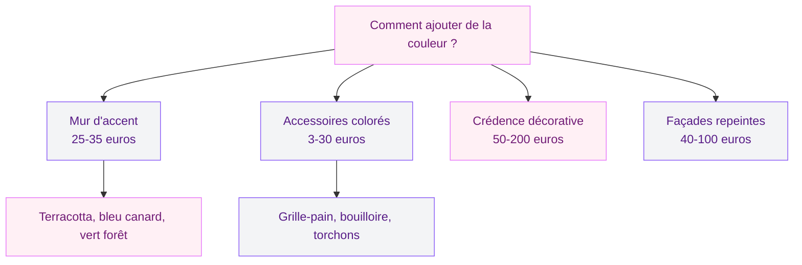
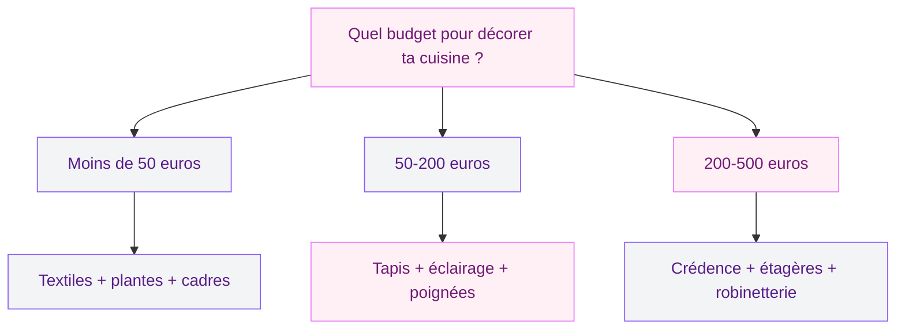

Ta cuisine fonctionne, les placards ferment, le frigo tourne - mais quand tu y entres, tu ne ressens rien. Pas de "wahou", pas d'envie de t'y attarder. C'est le syndrome de la cuisine purement fonctionnelle, et c'est ultra courant. La bonne nouvelle : il ne faut pas une rénovation complète pour changer ça. Quelques gestes bien placés, des choix malins et un budget raisonnable suffisent pour que ta cuisine devienne un vrai lieu de vie.

Je te donne 10 idées concrètes, testées, avec des prix réels et des marques accessibles. Tu peux toutes les appliquer ou n'en choisir que trois - dans les deux cas, le résultat sera visible.

## 1. De l'art mural pour casser la monotonie

Les murs de cuisine sont souvent les grands oubliés. Un carrelage, un coup de peinture blanche, et c'est tout. Pourtant, c'est la surface la plus visible quand tu es aux fourneaux. Un cadre bien choisi au-dessus de la zone repas, une affiche vintage dans un joli cadre bois, ou une série de trois petits formats au-dessus du plan de travail - ça transforme l'ambiance en cinq minutes.

  

Les affiches culinaires rétro sont un classique qui marche à tous les coups : des illustrations d'ingrédients, des recettes anciennes, des publicités vintage. Tu en trouves chez Desenio à partir de 8 euros le format A3, et les cadres en chêne naturel chez Ikea (gamme Ribba) démarrent à 5 euros. Pour un mur galerie de 3-4 cadres, compte 40-80 euros tout compris.

Si tu veux quelque chose de plus personnel, encadre une recette de famille écrite à la main, ou accroche une belle planche à découper en bois brut comme élément décoratif. Ça ne coûte rien et ça raconte une histoire.

> [!TIP]
> Évite d'accrocher des cadres juste au-dessus de la plaque de cuisson : la vapeur et la graisse les abîment vite. Privilégie le mur face à la cuisine ou la zone repas. Pour les techniques d'accrochage, consulte notre [guide pour accrocher un tableau mural](/guides/decoration/bien-accrocher-tableau-mural/).

## 2. Un tapis de cuisine qui change tout

C'est l'astuce la plus sous-estimée. Un tapis de cuisine (un vrai, lavable et antidérapant) devant l'évier ou le plan de travail apporte de la couleur, de la chaleur et un confort sous les pieds que tu n'imagines pas tant que tu n'as pas essayé.

  

Les tapis en vinyle type Beija Flor sont parfaits : imitation carreaux de ciment, faciles à nettoyer d'un coup d'éponge, et ils ne bougent pas. Compte 45-90 euros pour un modèle 60x180 cm. Chez Amazon, les tapis cuisine en microfibre lavable démarrent à 15 euros - moins durables, mais ça permet de tester le concept sans se ruiner.

La règle d'or : choisis une couleur ou un motif qui contraste avec ton sol. Un tapis terracotta sur un carrelage gris, un tapis bleu profond sur un parquet clair - c'est le contraste qui crée l'effet.

## 3. Des étagères ouvertes pour aérer l'espace

Remplacer un ou deux meubles hauts par des étagères ouvertes, c'est un des changements les plus spectaculaires que tu puisses faire. Ça ouvre l'espace, ça donne de la profondeur, et ça te permet d'exposer tes plus beaux objets au lieu de les cacher.

  

Des étagères en chêne massif fixées avec des équerres noires, c'est le combo tendance du moment. Leroy Merlin propose des planches chêne brut à 25-40 euros le mètre linéaire, et les équerres en acier noir coûtent 8-15 euros la paire. Pour deux étagères d'un mètre, tu es à 70-110 euros de matériel.

Ce qui fonctionne sur les étagères ouvertes : des bocaux en verre avec des pâtes ou des épices colorées, 2-3 mugs dépareillés, un petit pot de plante aromatique, un livre de cuisine qui te plaît. Pas trop chargé : trois à cinq objets par étagère suffit.

> [!WARNING]
> Les étagères ouvertes accumulent la poussière et la graisse plus vite que des placards fermés. Place-les de préférence loin de la plaque de cuisson et prévois un nettoyage toutes les deux semaines.

## 4. Un éclairage d'ambiance (pas juste le plafonnier)

L'éclairage, c'est là où la plupart des cuisines se plantent. Un néon central ou un plafonnier unique qui éclaire tout de manière plate et froide - voilà qui tue l'ambiance en une seconde. La solution : multiplier les sources lumineuses.

  

Des spots LED sous les meubles hauts (Ikea Mittled, 20 euros pour un kit de 3) éclairent le plan de travail avec une lumière chaude et pratique. Une suspension au-dessus de la table ou du bar (Maisons du Monde en propose à 35-80 euros) crée un îlot de lumière convivial. Et un ruban LED collé sous les meubles bas (10-15 euros pour 2 mètres chez Amazon) ajoute une touche très moderne le soir.

Le point important : choisis des ampoules en blanc chaud (2700-3000K). Le blanc froid donne un air d'hôpital. Le blanc chaud donne un air de maison.

## 5. Jouer avec les couleurs sans tout repeindre

Tu n'as pas envie de refaire toute ta cuisine en vert sauge ou en olive (même si les [cuisines olive](/guides/cuisine/cuisine-olive/) sont magnifiques) ? Pas de souci. Tu peux injecter de la couleur par petites touches qui font une grosse différence.

  

Un mur d'accent, c'est le plus simple : un seul mur peint dans une teinte forte (terracotta, bleu canard, vert forêt) pendant que les autres restent neutres. Un pot de peinture Dulux Valentine ou V33 coûte 25-35 euros pour 2,5 litres, largement assez pour un mur. Pour choisir la bonne teinte, jette un oeil à notre guide sur les [couleurs de cuisine 2026](/guides/cuisine/couleurs-de-cuisine-2026/) qui détaille les associations qui marchent.

Autre option encore plus simple : changer les accessoires visibles. Un grille-pain rouge, une bouilloire cuivrée, des torchons à motifs, un saladier en céramique colorée. Habitat, Maisons du Monde ou même Action proposent des collections déco cuisine complètes à partir de 3-5 euros l'objet.

## 6. Des plantes pour la vie (et pour le style)

Une cuisine sans plante, ça manque de vie. Et bonne nouvelle : la cuisine est souvent la pièce la plus lumineuse et la plus humide de la maison - conditions idéales pour beaucoup de plantes.

Les herbes aromatiques en pot sont le choix numéro un : basilic, persil, menthe, ciboulette. Utiles pour la cuisine et jolies sur un rebord de fenêtre. Un kit de 3 pots en terre cuite chez Truffaut coûte 12-18 euros. Les pots suspendus en macramé (15-25 euros chez Etsy ou Maisons du Monde) permettent de descendre du vert à hauteur d'yeux sans prendre de place au sol.

Pour les plantes plus décoratives : le pothos (quasi impossible à tuer), le lierre d'intérieur, ou la pilea peperomioides sont parfaits. Un pot en céramique blanche avec une plante tombante sur le dessus d'un meuble haut - ça donne un look très travaillé pour 10-20 euros total.

> [!NOTE]
> Le basilic en pot de supermarché meurt souvent en 2 semaines parce qu'il est surplanté. Rempote-le dans un pot plus grand dès l'achat, sépare les tiges, et il peut durer plusieurs mois.

## 7. Organiser pour décorer : les rangements apparents

L'organisation peut devenir décorative. Un porte-couteaux magnétique en bois fixé au mur (Ikea Kungsfors, 15 euros) met tes couteaux en valeur au lieu de les cacher dans un tiroir. Un rail en inox avec des crochets pour suspendre louches, fouets et passoires (Ikea Grundtal, 8 euros le rail) donne un look pro à ta cuisine.

Les bocaux alignés sur un plan de travail, avec des étiquettes en ardoise (lot de 12 pour 8 euros chez Amazon), ça transforme tes ingrédients du quotidien en éléments de déco. Farine, sucre, riz, pâtes : tout devient beau quand c'est dans un contenant en verre transparent.

Pour aller plus loin dans l'organisation, notre guide sur l'[organisation des armoires de cuisine](/guides/cuisine/organisation-armoire-cuisine/) te donne toutes les astuces pour des placards qui ont autant de style que l'extérieur.

## 8. La crédence comme pièce maîtresse

Si tu ne dois changer qu'une seule chose dans ta cuisine, change la crédence. C'est l'élément qui a le plus d'impact visuel par rapport à l'investissement. Les carreaux de métro blancs restent une valeur sûre (15-25 euros le m2), mais les carreaux zellige (80-150 euros le m2), les crédences en terrazzo ou les crédences adhésives sont aussi d'excellentes options.

Les crédences adhésives (Smart Tiles, Crearreda) permettent de transformer le look sans travaux : tu colles par-dessus l'ancien carrelage et tu retires quand tu veux. Parfait en location. Budget : 20-40 euros le m2. Pour une crédence de 2 m2, ça revient à 40-80 euros et une heure de pose.

Si tu veux peindre ta crédence existante, c'est aussi possible avec les bonnes peintures - notre guide sur la [peinture pour carrelage cuisine](/guides/cuisine/peinture-pour-carrelage-cuisine/) t'explique tout le process étape par étape.

## 9. Changer les poignées et la robinetterie

C'est le genre de détail que personne ne remarque consciemment, mais que tout le monde ressent. Des poignées en laiton brossé sur des façades blanches ou bois, ça donne un air de cuisine de magazine. Des poignées en cuir noir, c'est le look scandinave assuré.

Budget : 5-15 euros la poignée chez Leroy Merlin ou Amazon. Pour une cuisine standard de 10-12 façades, ça représente 60-180 euros. Un week-end de vissage et la cuisine semble neuve.

La robinetterie aussi fait une énorme différence. Un robinet noir mat ou laiton brossé remplace un robinet chromé standard pour 80-200 euros (Ikea Insjoen noir à 89 euros, Grohe Essence laiton à 220 euros). C'est un investissement un peu plus conséquent, mais l'effet est immédiat.

> [!TIP]
> Avant de changer tes poignées, mesure l'entraxe (distance entre les trous). Les entraxes standards sont 96 mm, 128 mm ou 160 mm. Prends la mesure avant de commander pour éviter les mauvaises surprises.

## 10. Des textiles pour la touche finale

Torchons, maniques, sets de table, tablier - les textiles de cuisine sont souvent achetés par défaut, sans réflexion. Pourtant, un set coordonné de torchons en lin (Linen Tales, 15-20 euros les 2) accroché à une patère en bois, ça change le regard qu'on porte sur toute la pièce.

Les sets de table en lin ou en raphia (H&M Home, 8-12 euros les 4) habillent la table ou le bar pour le quotidien. Un chemin de table en coton lavé (La Redoute, 15-25 euros) sur un îlot central ajoute une dimension chaleureuse sans effort.

La clé : choisir une palette cohérente. Si ta cuisine est dans les tons neutres (blanc, bois, gris), des textiles en terracotta, rouille ou vert sauge apportent la touche de couleur qui manque. Si ta cuisine est déjà colorée, reste sur des textiles en lin naturel ou blanc cassé pour équilibrer.

## Le plan d'action pour ne pas s'éparpiller

Toutes ces idées sont bonnes, mais le piège c'est de vouloir tout faire en même temps et de finir avec un mélange incohérent. Voici comment je ferais si je devais décorer ma cuisine en partant de zéro :

**Semaine 1 - Les bases gratuites** : Fais le tri de ce qui traîne sur le plan de travail. Retire les objets moches, nettoie, fais de la place. Déplace les plantes existantes pour les mettre en valeur. Accroche un torchon joli au lieu de celui qui est là depuis 2019.

**Semaine 2 - Les petits achats** : Commande des poignées neuves, un tapis de cuisine et 2-3 cadres. Budget total : 80-120 euros. Installe tout le même week-end pour voir l'effet d'ensemble.

**Semaine 3 et après - Les projets du week-end** : Si tu veux aller plus loin, c'est le moment de poser des étagères ouvertes, d'ajouter un éclairage sous les meubles hauts, ou de réfléchir à une nouvelle crédence.

L'important, c'est la cohérence. Choisis un fil conducteur - une palette de couleurs, un style (naturel, moderne, rétro) - et tiens-toi-y. Une cuisine avec 3 objets bien choisis dans le même esprit sera toujours plus belle qu'une cuisine avec 15 accessoires achetés au hasard.

---

## FAQ - Décoration cuisine

**Comment décorer une cuisine sans faire de travaux ?**
Les textiles (torchons, tapis, sets de table), les plantes, l'art mural et les accessoires décoratifs sont tes meilleurs alliés. En changeant les poignées de tes meubles et en ajoutant un éclairage d'ambiance, tu peux transformer complètement le look de ta cuisine pour moins de 150 euros et sans toucher aux murs ni au carrelage.

**Quel budget prévoir pour redécorer sa cuisine ?**
Tout dépend de l'ampleur du projet. Pour une mise à jour légère (textiles, plantes, cadres), compte 30 à 80 euros. Pour un relooking moyen (poignées, tapis, éclairage, petit meuble), 100 à 300 euros. Pour un changement plus important (crédence neuve, étagères sur mesure, robinetterie), 300 à 600 euros. Même avec un petit budget, les résultats sont visibles.

**Quelles couleurs choisir pour décorer une petite cuisine ?**
Dans une petite cuisine, les couleurs claires et chaudes (blanc cassé, beige, lin) sur les murs et façades principales agrandissent l'espace. Ajoute de la couleur par petites touches : un mur d'accent, des accessoires colorés, des textiles vifs. Le vert sauge et le terracotta fonctionnent bien en dose mesurée, même dans les espaces réduits.

**Faut-il suivre les tendances déco pour sa cuisine ?**
Pas du tout. Les tendances donnent de l'inspiration, mais ta cuisine doit avant tout te ressembler et être pratique au quotidien. Un mélange de pièces qui te plaisent (un objet chiné, un cadre personnel, des plantes que tu aimes) aura toujours plus de charme qu'une cuisine "parfaitement tendance" sortie d'un catalogue. Les bases intemporelles - bois, blanc, matériaux naturels - ne se démodent jamais.

**Comment décorer une cuisine ouverte sur le salon ?**
La clé, c'est la cohérence entre les deux espaces. Reprends les couleurs ou les matériaux du salon dans la cuisine : même teinte de bois, même métal pour les luminaires, palette de couleurs similaire. Les étagères ouvertes font la transition en douceur. Et choisis des accessoires de cuisine suffisamment beaux pour être vus depuis le canapé - c'est là que le style de tes rangements apparents et de tes textiles prend toute son importance.
