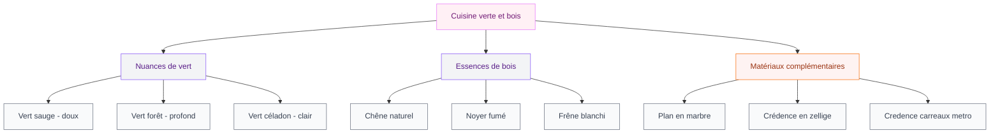
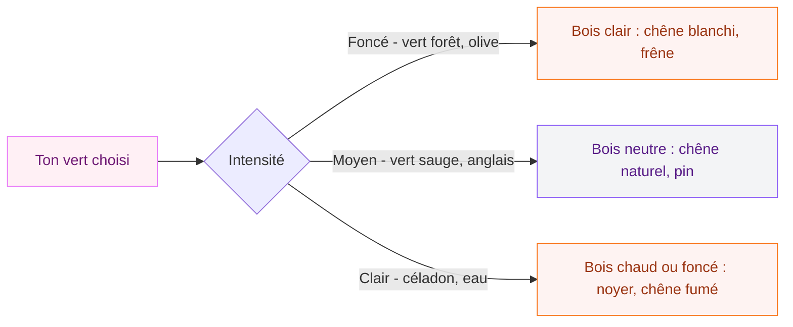

Si tu cherches une combinaison qui a de la personnalité sans basculer dans le clinquant, la cuisine verte et bois est exactement ce qu'il te faut. C'est un mariage qui marche depuis des années, et franchement, on comprend pourquoi : le vert apporte du caractère, le bois réchauffer tout ça, et le résultat final donne une cuisine où on a envie de s'attarder. Je t'explique comment bien l'approcher pour éviter les erreurs classiques.

## Pourquoi le vert et le bois fonctionnent si bien ensemble

Dans la nature, cette combinaison existe partout - les arbres, les forêts, les jardins. Notre cerveau y est tellement habitué qu'il la perçoit comme quelque chose de logique et d'apaisant. En cuisine, ça se traduit par un espace qui ne fatigue pas les yeux, même après des années.

  

Mais il y a une raison plus concrète aussi. Le vert est une couleur qui a une vraie présence visuelle sans être agressive. Il ne crie pas comme le rouge, ne refroidit pas comme le bleu. Le bois, lui, vient adoucir et ancrer. Il ajoute une dimension tactile et chaleureuse que les cuisines tout laqué ou tout béton n'ont pas.

Le résultat : une pièce qui semble à la fois pensée et naturelle, sans effort apparent.

## Choisir la bonne nuance de vert

C'est là que beaucoup de gens butent. "Vert", ça couvre un spectre énorme - du vert fluo au vert bouteille en passant par le vert d'eau. Voici les nuances qui ont fait leurs preuves en cuisine.

  

**Le vert sauge** est probablement le plus facile à vivre. Il est un peu grisé, un peu poussiéreux, et cette discrétion lui permet de s'entendre avec presque tous les tons de bois. Farrow & Ball proposent le "Mizzle" qui est exactement dans cet esprit, autour de 180 euros les 5 litres. IKEA a aussi sa version avec les facades "BODARP" (gris vert), bien plus accessible.

**Le vert forêt ou vert anglais** est plus intense, plus courageux. Il faut une cuisine assez lumineuse et un bois assez clair pour l'équilibrer - du chêne blanchi ou du frêne naturel, par exemple. Résultat très élégant, un peu british, qu'on voit beaucoup en ce moment. La marque Devol, référence britannique du genre, a popularisé ce look, mais il existe des versions accessibles chez Schmidt ou Mobalpa.

**Le vert céladon** - ce vert très pâle, presque eau de mer - est plus doux et plus lumineux. Il se rapproche du vert clair et convient bien aux petites cuisines car il n'assombrit pas l'espace. Associé à un bois chaud comme le hêtre ou le pin, ça donne une ambiance un peu scandinave, très fraîche.

**Le vert kaki ou olive** est le plus terre-à-terre du groupe. Plus chaud, plus terreux, il s'associe particulièrement bien avec les bois foncés type noyer ou chêne fumé. Si tu aimes cet univers, regarde aussi ce qu'on propose sur [la cuisine olive](/guides/cuisine/cuisine-olive/) - les deux esthétiques sont proches et les conseils se recoupent souvent.

> [!TIP]
> Avant de commander tes facades, teste les échantillons de peinture sur un carton de 50x50 cm. Observe-les à différentes heures de la journée - un vert sauge peut virer au gris le soir sous lumière artificielle.

## Quelle essence de bois choisir

La règle de base : plus ton vert est foncé, plus ton bois doit être clair. Et inversement - un vert pâle supporte bien un bois plus foncé sans que l'ensemble paraisse lourd.

  

**Le chêne** est le grand classique. Sa texture grainée et son ton miel sont un fond parfait pour tous les verts. On le trouve partout, de IKEA (plateau KARLBY en chêne, environ 150 euros) à des ébénistes locaux pour du sur-mesure. Le chêne blanchi ou huilé blanc est particulièrement populaire en ce moment.

**Le noyer** apporte une dimension plus luxueuse. Ses reflets brun-chocolat avec le vert forêt ou le vert anglais, c'est un combo qui a l'air très coûteux même quand ça ne l'est pas forcément. L'effet est plus adulte, plus sophistiqué.

**Le frêne** est moins connu mais intéressant. Son grain plus fin et son ton légèrement grisé s'accordent bien avec les verts sauge ou les verts froids. Maison Deco le propose souvent dans ses plans de travail en stratifié imitation bois à des prix raisonnables.

**Le pin ou le bois massif rustique** va mieux avec un vert qui a une touche vintage - vert céladon, vert eau. Ca donne une ambiance campagne chic sans tomber dans le kitsch si c'est bien dosé.

> [!NOTE]
> Les imitations bois en stratifié ou en vinyle ont beaucoup progressé. Pour un plan de travail dans une zone très utilisée, une bonne imitation résiste souvent mieux à l'humidité et aux chocs qu'un vrai bois massif non traité. Pas de honte à les utiliser.

## Comment répartir le vert et le bois

La vraie question est : où va quoi ? Il y a plusieurs façons d'aborder ça.

  

**Facades vertes, plan de travail bois** : c'est la version la plus classique et elle fonctionne bien car le plan de travail est la surface la plus utilisée, donc l'usure du bois devient presque une patine. IKEA fait exactement ça avec ses combinaisons BODARP + plans KARLBY.

**Facades bois, ilot ou quelques elements verts** : plus subtil, le vert n'est pas la couleur dominante mais un accent. Parfait si tu veux tester sans t'engager à fond. Un ilot central vert dans une cuisine tout bois, c'est un détail qui change tout.

**Mixte des deux** : bas en vert, hauts en bois (ou l'inverse). Ca crée une transition visuelle naturelle et allège visuellement la cuisine. Les hauts en bois clair font souvent paraître le plafond plus haut.

## Les matériaux qui complètent le duo

Le vert et le bois fonctionnent très bien à deux, mais ils s'enrichissent encore avec les bons complements.

  

**Le marbre ou l'imitation marbre** est le grand ami de ce duo. Un plan de travail en marbre blanc veiné de gris sur des facades vertes et un ilot en chêne - là, c'est la photo de magazine. Dekton et Silestone proposent des versions résistantes et moins chères que le vrai marbre.

**Le laiton et les finitions dorées** sont parfaits pour les touches métalliques (robinets, poignées, luminaires). Le laiton avec le vert et le bois donne quelque chose de très élégant et un peu rétro dans le bon sens du terme. Des poignées type "arc" en laiton brossé autour de 8-15 euros pièce chez des enseignes comme Centrakor ou La Boutique du Poignet changent complètement la perception d'une cuisine IKEA.

**Les carreaux de zellige ou les carreaux metro** en crédence ajoutent de la texture. Le zellige blanc ou vert sur une crédence, associé aux facades vertes plus unies, crée un jeu de matières qui éloigne l'ensemble du côté trop lisse.

> [!WARNING]
> Évite les plans de travail en bois massif non traité si tu cuisine beaucoup. L'humidité et les chocs quotidiens les abiment rapidement. Préfère le bois huilé ou traité, ou une imitation de qualité.

## Où acheter et quel budget prévoir

**IKEA** reste la référence accessibilité. La gamme SEKTION avec facades AXSTAD (vert mat) ou BODARP (gris-vert) donne de bons résultats. Pour une cuisine de 10m², compte entre 3 000 et 6 000 euros tout compris avec pose.

**Schmidt et Mobalpa** sont dans la gamme intermédiaire. Les coloris verts sont plus nombreux et la qualité de fabrication est souvent meilleure. Budget moyen de 8 000 à 15 000 euros pour une cuisine complète.

**Leroy Merlin** propose des cuisines complètes dans sa gamme "Optirel" avec quelques coloris verts. Moins de choix de nuances mais des prix très compétitifs si tu poses toi-même.

**Le sur-mesure chez un ébéniste local** est l'option premium. Le budget monte à 20 000-40 000 euros mais tu obtiens exactement ce que tu veux, avec des matériaux de qualité supérieure.

Pour la peinture, si tu gardes tes facades existantes et tu peins les murs ou la crédence en vert, compte 50-80 euros pour Farrow & Ball (qualité luxe), 25-40 euros pour Levis ou Dulux, ou 15-25 euros pour une peinture GoodHome de chez Castorama qui couvre bien.

> [!IMPORTANT]
> Si tu refais une cuisine existante en vert avec de la peinture pour facades, utilise impérativement une peinture spéciale meubles avec primaire d'accrochage. Une peinture murale classique tiendra quelques mois puis s'écaillera. Les peintures "V33 Rénovation Meubles" ou "Rust-Oleum Chalked" sont faites pour ça.

## L'éclairage, un détail qui fait tout

La cuisine verte a un ennemi : la lumière jaune froide. Sous un néon blanc bleuté, les verts peuvent paraître crayeux ou étranges. Voici comment bien éclairer.

Opte pour des ampoules à température de couleur entre 2700K et 3000K (blanc chaud). Elles réchauffent le vert et font ressortir les tons dorés du bois. Les spots encastrés dans les meubles hauts (spots de plan de travail) sont très utiles - ils éclairent directement le bois et les facades sans ombres portées.

Une suspension au-dessus d'un ilot en bois ou en métal noir-laiton est aussi un bon investissement visuel. Des marques comme Frandsen, Nordlux ou même Zara Home proposent des modèles autour de 80-200 euros qui changent l'ambiance complètement.

## Le style qui va avec

La cuisine verte et bois est étonnamment caméléon au niveau du style.

**Version contemporaine** : facades mates, plan marbre, poignées laiton, crédence zellige. Sobre mais très chic.

**Version campagne-moderne** : facades en bois peint en vert sauge, plan bois massif huilé, suspension en fer forgé, carreaux metro. L'univers qu'on voit dans les maisons de campagne anglaises rénovées.

**Version scandinave** : vert céladon ou vert pâle, bois blond type chêne ou frêne, aucune poignée (systèmes push-to-open), luminaires épurés. Très propre et lumineux.

Ces associations de couleurs fonctionnent aussi ailleurs dans la maison. Si tu aimes jouer avec les teintes chaudes et terreuses, l'article sur les [couleurs compatibles avec l'orange pour les murs et la décoration](/guides/couleurs/couleurs-compatibles-avec-lorange-pour-les-murs-et-la-decoration/) peut t'inspirer pour penser l'ensemble du rez-de-chaussée de façon cohérente.

## Entretien : quelques points à savoir

Les facades laquées ou MDF peint en vert se nettoient facilement avec un chiffon humide et un peu de liquide vaisselle dilué. Évite les abrasifs et les produits ménagers agressifs qui ternissent la couleur progressivement.

Pour les plans de travail en bois, un huilage une fois par an suffit à les entretenir. Les huiles type "Rubio Monocoat" (environ 40 euros le demi-litre) pénètrent bien et durent longtemps.

Le bois, surtout sur les facades exposées à la vapeur (proche du four ou de la plaque), peut gonfler ou se déformer si le traitement n'est pas maintenu. Un bord de meuble qui commence à cloquée se traite en ponçant légèrement et en réappliquant une fine couche d'huile ou de vernis.

## Ce qu'on retient

La cuisine verte et bois est l'une de ces combinations qui vieillissent bien - elle n'est pas une tendance qui va disparaître dans deux ans. Elle existe depuis les cuisines campagnardes traditionnelles et elle s'est modernisée sans perdre son âme. Le tout est de choisir la bonne nuance de vert pour ton espace et de la marier avec un bois qui la complète plutôt que de la concurrencer.

Si tu es sensible à cette palette terreuse et naturelle, elle peut s'étendre à d'autres pièces de la maison. Une [chambre en teintes terracotta](/guides/chambre/deco-terracotta-chambre/) joue dans le même registre chaud et naturel, et les deux pièces peuvent se parler si on choisit bien les couleurs de transition.

Commence par un test - une poignée de porte, un meuble relooké, un mur en peinture chalk paint - avant de t'engager sur une cuisine complète. Tu verras très vite si l'ambiance te correspond.

---

## Sur le meme theme

- [changer les portes d'une cuisine ikea faktum](/guides/cuisine/changer-portes-cuisines-ikea-faktum/)
- [cuisine rustique chic](/guides/cuisine/le-charme-de-la-cuisine-rustique-un-look-retro-chic-incontournable/)

## FAQ

**Peut-on associer vert et bois dans une petite cuisine ?**
Oui, à condition de choisir un vert clair (céladon, vert pâle) et un bois blond. Dans une petite cuisine, évite le vert forêt foncé sur toutes les facades car ça peut assombrir. Utilise plutôt le vert sur les bas et garde les hauts en bois clair ou blanc.

**Quel bois va le mieux avec le vert sauge ?**
Le chêne naturel (ni trop clair ni trop foncé) est le complément idéal du vert sauge. Sa teinte miel neutre laisse le vert s'exprimer sans créer de contraste trop marqué.

**Est-ce que les cuisines vertes se démodent rapidement ?**
Non. Le vert en cuisine existe depuis des décennies, notamment dans les cuisines anglaises traditionnelles. C'est une couleur plus ancrée dans le temps que les tendances courtes comme le bleu électrique ou le rose.

**Quelle marque propose les meilleures cuisines vertes au rapport qualité/prix ?**
IKEA pour les petits budgets (3 000-6 000 euros), Schmidt ou Mobalpa pour la gamme intermédiaire (8 000-15 000 euros). Les facades IKEA BODARP ou AXSTAD sont des valeurs sûres.

**Peut-on peindre ses facades en vert soi-même ?**
Oui, avec la bonne peinture. Utilise une peinture spéciale meubles (V33 Rénovation, Rust-Oleum Chalked) avec un primaire d'accrochage. Ponce légèrement les facades avant pour une meilleure adhérence. Le résultat peut être très convaincant si tu prends le temps de bien préparer les surfaces.
