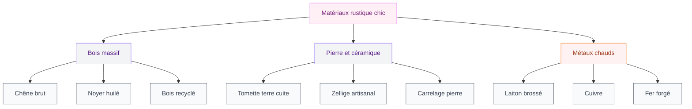
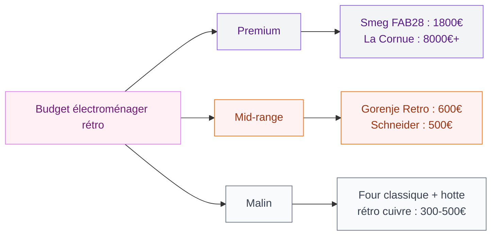
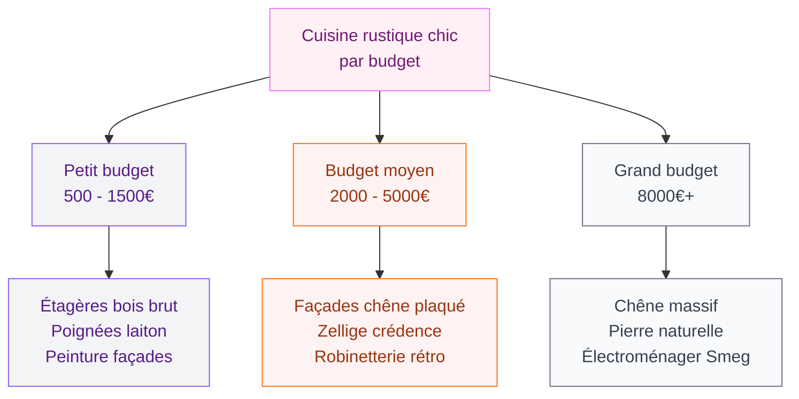

Tu adores les cuisines qui ont une âme, celles où on sent que quelqu'un y vit vraiment, avec des casseroles en cuivre accrochées au mur et une vieille table en chêne qui a des histoires à raconter ? La cuisine rustique chic, c'est exactement ça : le charme de la campagne, l'authenticité des matières brutes, mais avec une touche moderne qui empêche le tout de tomber dans le décor de maison de grand-mère. C'est un équilibre fin entre le rétro et le contemporain, et quand c'est réussi, c'est absolument magnifique.

Je t'explique comment créer cette ambiance chez toi, avec des choix concrets de matériaux, de couleurs et de meubles - et surtout les pièges à éviter.

## Pourquoi la cuisine rustique chic revient en force

Pendant des années, la tendance était au tout lisse, tout blanc, tout épuré. Les cuisines ressemblaient à des blocs opératoires - propres, certes, mais sans personnalité. Le problème ? On s'en lasse vite. Une cuisine rustique chic, elle, vieillit comme le bon vin. Les matériaux naturels se patinent, les couleurs chaudes restent accueillantes, et le style a cette capacité rare de traverser les modes sans paraître daté.

En 2026, la tendance est clairement au retour des matières vivantes. Le bois massif, la pierre, la céramique artisanale - tout ce qui a une texture, une imperfection, une histoire. Les cuisinistes l'ont bien compris : Mobalpa, Cuisines Schmidt et même Ikea proposent désormais des gammes qui jouent sur les codes du rustique remis au goût du jour.

L'autre raison de ce retour en grâce ? L'envie de durabilité. Une cuisine rustique bien faite avec de vrais matériaux, ça dure 20 ou 30 ans. Beaucoup mieux qu'une cuisine en mélaminé qui gondole au bout de 5 ans.

> [!TIP]
> Le rustique chic, ce n'est pas du rustique pur. La différence se joue dans les détails : un plan de travail en chêne massif (rustique) associé à des poignées en laiton brossé (chic). Garde toujours ce principe de contraste en tête.

## Les matériaux qui font tout le style

C'est la base. Sans les bons matériaux, une cuisine rustique ressemble juste à une cuisine vieillotte. Avec les bons, elle devient spectaculaire.

### Le bois : l'ossature du rustique chic

Le bois est au coeur de ce style. Mais attention, pas n'importe quel bois. Oublie le pin vernis des années 90 - on parle ici de chêne brut, de noyer huilé, de frêne naturel. Les essences qui ont du grain, du relief, du vécu.

Pour les façades de meubles, le chêne massif reste le choix numéro un. Chez Leroy Merlin, les façades en chêne plaqué démarrent à 45 euros la porte 60x70 cm. Pour du massif véritable, il faut passer chez un menuisier ou regarder des marques comme Cuisine Plus (comptez 6 000 à 10 000 euros pour une cuisine complète en chêne massif).

Le bois recyclé ou vieilli est aussi une option géniale. Des poutres apparentes au plafond, des étagères en bois de récup, un îlot fabriqué à partir de vieilles planches - ça donne immédiatement ce cachet authentique qu'on recherche.

### La pierre et la céramique : l'ancrage au sol

Un sol en pierre naturelle ou en carrelage effet pierre, c'est ce qui ancre vraiment le style. Le carrelage imitation tomette (ces carreaux hexagonaux en terre cuite) est un grand classique. Chez Saint Maclou, comptez 25 à 40 euros le m2 pour de la tomette en grès cérame. Pour de la vraie terre cuite, c'est plutôt 50 à 80 euros le m2, mais le rendu est incomparable.

Pour la crédence, le zellige fait merveille dans une cuisine rustique chic. Ces petits carreaux marocains faits main, avec leurs irrégularités et leurs reflets, apportent exactement la touche artisanale qu'il faut. Comptez 60 à 120 euros le m2 pose comprise.

> [!NOTE]
> Si tu veux le look de la pierre sans le prix, les plans de travail en stratifié effet pierre ont fait des progrès énormes. La gamme Egger chez Brico Dépôt propose des décors "pierre naturelle" très convaincants à partir de 80 euros le linéaire de 300 cm. De loin, c'est bluffant.

### Les métaux : la touche chic

C'est là où le "chic" entre en jeu. Le laiton brossé, le cuivre, le fer forgé - ces métaux chauds apportent l'élégance qui manque souvent aux cuisines rustiques classiques.

La robinetterie est le point d'entrée le plus simple. Un mitigeur en laiton brossé chez Castorama tourne autour de 80 à 150 euros. Chez des marques comme Grohe ou Hansgrohe, comptez 200 à 400 euros pour un modèle rétro vraiment réussi.

Les poignées de meuble en laiton ou en cuivre sont un autre levier simple et pas cher. Chez AM.PM (La Redoute), tu trouves des boutons en laiton massif à 8 euros pièce. Il en faut généralement 15 à 20 pour équiper une cuisine complète, soit 120 à 160 euros pour transformer complètement le look de tes meubles.

## La palette de couleurs idéale

Le choix des couleurs va déterminer si ta cuisine penche plutôt "campagne anglaise cosy" ou "mas provençal ensoleillé". Les deux sont top, mais il faut être cohérent.

### Les teintes chaudes et terreuses

Le blanc cassé, le crème, le beige sable, le terracotta doux, le vert olive - voilà ta palette de base. Ce sont des couleurs qu'on retrouve dans la nature, dans les vieux murs de pierre, dans les façades des maisons de village. Elles se marient entre elles sans effort.

Pour les murs, un blanc chaud type "White Tie" de Farrow & Ball (environ 110 euros les 2,5 litres) donne un fond parfait. Tu peux aussi peindre un seul pan de mur dans un vert sauge ou un bleu gris doux pour créer un point focal. Si tu cherches à approfondir les associations autour du vert, jette un oeil à notre guide sur la [cuisine verte et bois](/guides/cuisine/la-cuisine-verte-et-bois-une-teinte-elegante-et-moderne/) qui détaille toutes les nuances qui marchent.

### Les façades de meubles

Le bois naturel, évidemment. Mais tu peux aussi opter pour des façades peintes dans des tons sourds : gris chaud, bleu ardoise, vert de gris. L'important est de garder un fini mat ou satin - le brillant tue immédiatement l'esprit rustique.

Si tu veux une teinte plus audacieuse sur tes meubles, l'olive est un choix qui fonctionne à merveille dans un cadre rustique. On en parle en détail dans notre article sur la [cuisine olive](/guides/cuisine/cuisine-olive/).

> [!IMPORTANT]
> Évite le blanc pur (RAL 9010 ou équivalent) pour les meubles d'une cuisine rustique. C'est trop froid, trop clinique. Préfère toujours un blanc cassé, un ivoire ou un blanc lin qui aura plus de profondeur et de chaleur.

## L'électroménager rétro : utile ou gadget ?

C'est la question que tout le monde se pose. Les frigos Smeg à 1 800 euros, les cuisinières La Cornue à 8 000 euros - est-ce que ça vaut le coup ?

Ma réponse honnête : ça dépend de ton budget. L'électroménager rétro est magnifique et peut devenir la pièce maîtresse de ta cuisine. Un frigo Smeg FAB28 en crème ou en vert pastel, c'est un objet qu'on a envie de regarder. Et il fonctionne très bien.

Mais si ton budget est serré, il y a des alternatives malignes. Gorenje fait des frigos rétro autour de 500 à 700 euros, avec un design très similaire au Smeg. Schneider propose aussi une gamme vintage accessible (400 à 600 euros pour un frigo combiné rétro).

Pour la cuisson, une cuisinière à l'ancienne type Godin ou Rosières est un vrai statement piece (1 500 à 3 000 euros). Mais tu peux obtenir un effet similaire avec un four encastrable classique et une jolie hotte en cuivre ou en laiton au-dessus de la plaque - visuellement, c'est cette hotte qui va donner le ton rétro à l'ensemble.

## Les accessoires et détails qui font la différence

Le diable est dans les détails, et c'est encore plus vrai pour le style rustique chic. Quelques éléments bien choisis peuvent transformer une cuisine banale en espace plein de charme.

### L'éclairage

Oublie les spots LED encastrés au plafond (trop moderne, trop froid). Mise plutôt sur des suspensions en métal patiné, en osier tressé ou en céramique. Au-dessus d'un îlot ou d'une table, un trio de suspensions en laiton vieilli crée une ambiance incroyable. Chez Maisons du Monde, comptez 40 à 80 euros par suspension. Chez AM.PM, les modèles en métal tissé tournent autour de 90 à 150 euros.

### Les étagères ouvertes

C'est probablement l'élément le plus simple à mettre en place et le plus efficace. Remplace un ou deux meubles hauts par des étagères en bois brut. Tu y déposes ta vaisselle en céramique, tes bocaux en verre, tes planches à découper en bois - et voilà, ta cuisine a immédiatement plus de caractère.

Trust me, ça change absolument tout. Deux équerres en fonte (15 euros la paire chez Leroy Merlin) et une planche de chêne brut (30 à 50 euros) suffisent pour une étagère qui aura fière allure.

### L'évier

L'évier en céramique blanche à bords surélevés (type farmhouse sink) est le classique absolu du style rustique chic. Un modèle Villeroy & Boch coûte entre 400 et 800 euros. Chez Ikea, l'évier Havsen en céramique est une alternative très correcte à 250 euros.

> [!WARNING]
> Les éviers en céramique sont lourds (20 à 30 kg) et peuvent se fissurer en cas de choc. Assure-toi que ton plan de travail et le caisson en dessous sont suffisamment solides pour supporter le poids, et évite d'y lâcher des poêles en fonte depuis trop haut !

## Les erreurs classiques à éviter

### Trop de bois tue le bois

C'est l'erreur numéro un. Façades en bois + plan de travail en bois + sol en bois + poutres en bois = effet chalet oppressant. Mixe toujours le bois avec d'autres matières. Un plan de travail en pierre ou en quartz blanc pour casser le bois des façades, une crédence en carrelage pour trancher avec le bois des étagères.

### Le faux rustique en plastique

Les façades en stratifié "effet bois noué" ou les poutres en polystyrène, ça se voit tout de suite. Si ton budget ne permet pas le vrai bois massif partout, concentre-le sur les éléments visibles (façades de devant, étagères, îlot) et utilise du plaqué ou du stratifié pour les parties moins exposées (intérieurs de placard, meubles sous le plan de travail).

### L'accumulation de bibelots

Le rustique chic, c'est pas une brocante. Quelques objets bien choisis (un pichet en grès, un bouquet de fleurs séchées, une planche à pain en bois d'olivier) valent mieux qu'une collection entière de casseroles en cuivre, de pots à confiture et de figurines de poule. La règle : si tu ne l'utilises pas ou ne l'adores pas, ne l'expose pas.

Si tu veux approfondir le sujet de la [peinture pour carrelage](/guides/cuisine/peinture-pour-carrelage-cuisine/) comme solution de rénovation rapide, c'est une option intéressante pour transformer une crédence existante sans tout casser.

## Comment adapter le rustique chic à une petite cuisine

Tu te dis peut-être que ce style demande des mètres carrés et une maison de campagne. Pas du tout. Le rustique chic fonctionne aussi en appartement, même dans une cuisine de 6 m2.

La clé : aller au plus simple. Pas besoin de tout faire en bois massif. Un plan de travail en chêne, une crédence en zellige, des poignées en laiton et un bel éclairage suffisent à poser l'ambiance. Si tu as une [petite cuisine](/guides/cuisine/petites-cuisines-modernes-2026-designs-et-modeles/), concentre-toi sur 2 ou 3 éléments forts plutôt que d'essayer de tout changer.

Les étagères ouvertes sont particulièrement adaptées aux petits espaces : elles allègent visuellement le haut des murs et donnent une impression de profondeur que les meubles fermés n'offrent pas.

> [!TIP]
> Dans une petite cuisine, un miroir ancien (chiné en brocante pour 20 à 50 euros) accroché au mur reflète la lumière et agrandit visuellement l'espace. C'est une astuce simple qui marche à tous les coups dans un cadre rustique.

## FAQ

### Quel budget prévoir pour une cuisine rustique chic complète ?

Ça dépend énormément de la taille et des matériaux choisis. Pour relooker une cuisine existante (peinture façades, nouvelles poignées, crédence, éclairage), compte entre 500 et 1 500 euros. Pour une cuisine neuve complète en chêne massif avec électroménager rétro, c'est plutôt entre 8 000 et 15 000 euros chez un cuisiniste.

### Comment rendre une cuisine Ikea plus rustique ?

C'est tout à fait faisable ! Change les poignées pour du laiton ou du cuivre (8 à 15 euros pièce), ajoute des étagères en bois brut, remplace un ou deux meubles hauts par des étagères ouvertes, et installe une suspension en métal patiné. Pour les façades, la gamme Tornviken en bois naturel est la plus adaptée au style rustique.

### Le style rustique chic est-il compatible avec une cuisine ouverte sur le salon ?

Oui, et c'est même un de ses points forts. Le rustique chic crée une ambiance chaleureuse qui se diffuse naturellement dans le salon. L'important est de garder une cohérence de matériaux et de couleurs entre les deux espaces. Un sol en tomette qui continue dans le salon, des suspensions du même style, des teintes qui se répondent - c'est comme ça que tu crées un ensemble harmonieux.
