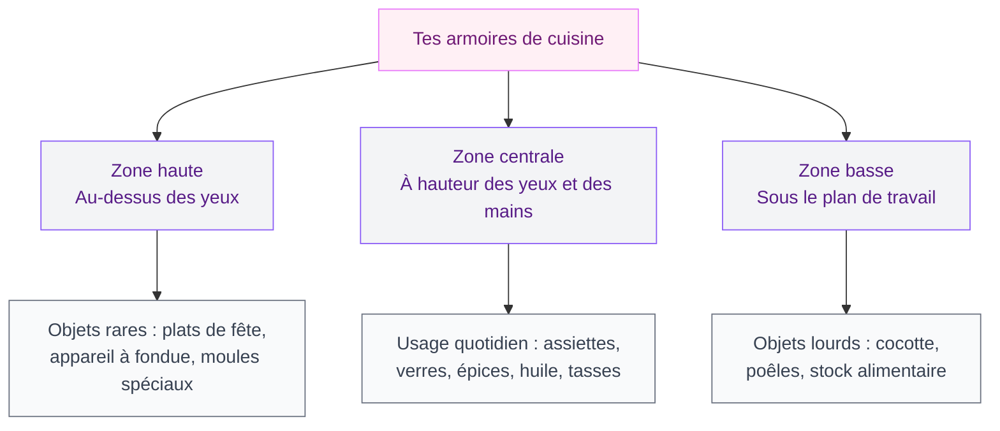
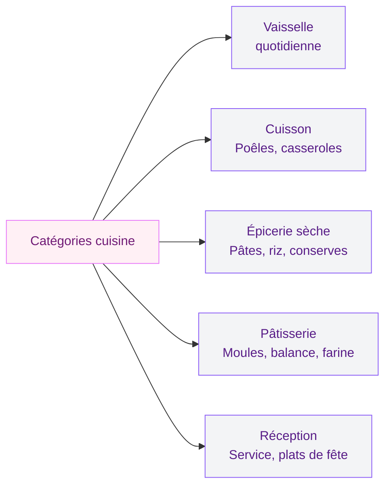

Ouvre un placard de cuisine au hasard. Qu'est-ce que tu vois ? Si la réponse c'est "un empilement de boites, des tasses coincées derrière des assiettes et un moule à gâteau qui menace de tomber" - bienvenue. La différence entre un placard qui te rend dingue et un placard qui te facilite la vie, c'est souvent trois ou quatre ajustements bien pensés. Du malin, du pratique, du testé - pas de solutions à 500 euros.

## Pourquoi tes placards débordent (et comment y remédier)

Avant de tout réorganiser, il faut comprendre ce qui coince. Dans 90% des cas, le problème n'est pas le manque de place - c'est la façon dont l'espace est utilisé. Les armoires sont hautes, profondes, mal compartimentées. Tu empiles, tu enfonces des trucs au fond, tu oublies ce qui est là, tu rachètes en double.

Le vrai point de départ, c'est le tri. Sors tout. Mets-le sur la table et demande-toi pour chaque objet : est-ce que je l'ai utilisé ces 6 derniers mois ? Si non (et que c'est pas un plat à raclette - l'hiver revient toujours), c'est le moment de donner ou de ranger au garage.

> [!TIP]
> Profite du tri pour nettoyer l'intérieur de tes placards avec un mélange eau chaude + vinaigre blanc. Un placard propre, c'est un placard qu'on a envie de garder rangé.

## La règle d'or : placer par fréquence d'utilisation

C'est le principe le plus simple et le plus efficace. Tout ce que tu utilises chaque jour doit être accessible sans te mettre sur la pointe des pieds, sans te baisser, sans pousser trois trucs pour y accéder.

**Zone centrale (entre 80 cm et 160 cm de hauteur)** : c'est ton espace premium. Tes assiettes du quotidien, tes verres, tes tasses, le sel, le poivre, l'huile d'olive, les épices que tu utilises tout le temps. Tout ca doit être là, à portée de main directe.

**Zone haute (au-dessus de 160 cm)** : les trucs que tu sors une fois par mois ou moins. Le service à raclette, la soupière de grand-mère, le plat à tarte pour Noël. Et idéalement, regroupe-les dans des boites étiquetées pour ne pas tout renverser en cherchant.

**Zone basse (sous le plan de travail)** : les objets lourds qui seraient dangereux en hauteur. La cocotte en fonte, les grandes poêles, les bouteilles d'huile en stock, les conserves. Cette zone est aussi parfaite pour les tiroirs coulissants.

## Les accessoires de rangement qui valent le coup

Tous les organiseurs ne se valent pas. Certains finissent au fond du placard eux-mêmes, ce qui est quand même un comble. Voici ce qui marche vraiment.

### Les demi-étagères (shelf risers)

C'est le hack le plus sous-estimé. Une demi-étagère en métal ou en bambou double la capacité d'une étagère en créant deux niveaux : assiettes en dessous, bols au-dessus, tasses en bas, verres en haut.

Chez Ikea, le modèle Variera (environ 6 euros) est simple et efficace. La Redoute propose des versions en bambou autour de 15-20 euros, plus jolies si ton placard est ouvert ou vitré.

> [!NOTE]
> Les demi-étagères fonctionnent mieux dans les placards hauts (plus de 35 cm d'espace entre les étagères). Mesure avant d'acheter pour éviter les mauvaises surprises.

### Les organiseurs de tiroirs

Un tiroir sans séparateur, c'est un tiroir où tout se mélange en moins d'une semaine. Les inserts modulables sont la solution. Chez Ikea, la gamme Uppdatera (entre 5 et 20 euros selon la taille) couvre la plupart des formats de tiroirs standards. Tu peux aussi regarder chez Action ou Gifi, où les organiseurs en plastique démarrent à 2-3 euros.

Pour les couverts, un bac dédié est le minimum. Pour les ustensiles (spatules, louches, fouets), un range-ustensiles vertical dans le tiroir profond est plus malin qu'un pot posé sur le plan de travail - ca libère de la surface de préparation.

### Les plateaux tournants (lazy Susan)

Dans les armoires d'angle, c'est la solution magique. Un plateau tournant te permet d'accéder à tout ce qui est au fond sans devoir vider le devant. C'est parfait pour les épices, les sauces, les huiles. Un modèle basique en plastique coute 8-12 euros chez Gifi ou Amazon. En bambou, chez Maisons du Monde, il faut compter 20-25 euros.

### Les paniers coulissants

Pour les meubles bas profonds, un panier coulissant sur glissières est un vrai changement de vie. Tu tires le panier vers toi au lieu de plonger ton bras au fond du placard pour attraper cette boite de pois chiches qui se planque depuis février.

Chez Leroy Merlin, les kits de paniers coulissants (avec glissières à fixer soi-même) tournent autour de 25-40 euros l'unité. Chez Ikea, le système Utrusta en interne fonctionne bien aussi, entre 20 et 35 euros.

## L'organisation par catégories : le système qui tient dans le temps

Ranger par zone de fréquence, c'est la base. Pour que ca tienne sur la durée, il faut aussi organiser par catégorie : chaque catégorie a SA place, et tout le monde dans la maison le sait.

**Vaisselle quotidienne** : un ou deux placards maximum, proches du lave-vaisselle pour ranger plus vite.

**Ustensiles de cuisson** : à côté de la plaque de cuisson. Poêles, casseroles, couvercles. Un porte-couvercle fixé à l'intérieur de la porte du placard (5-10 euros chez Ikea ou Action) évite le chaos des couvercles qui s'empilent.

**Épicerie sèche** : dans un placard dédié, en bocaux transparents ou boites hermétiques. Tu vois d'un coup d'oeil ce qu'il te reste et tu évites de racheter des pâtes pour la sixième fois.

**Pâtisserie** : regroupe tout ensemble (moules, balance, levure, farine, sucre) même si tu ne pâtisses qu'une fois par mois. Quand tu en as besoin, tu ouvres un seul placard et tout est là.

**Service et réception** : en hauteur ou dans un meuble peu accessible. C'est ce que tu sors deux ou trois fois par an.

> [!WARNING]
> Évite de disperser une même catégorie dans plusieurs placards. Si tes épices sont réparties à trois endroits différents, tu ne sauras jamais ce que tu as déjà en stock.

## Maximiser l'espace vertical : les astuces qui changent tout

La plupart des gens n'utilisent que 60% de la hauteur disponible dans leurs placards. Il reste de l'espace libre en haut, entre les étagères, sur les portes. Voici comment récupérer ces centimètres perdus.

### Empiler intelligemment

Les assiettes, on les empile naturellement. Mais les tasses, les bols, les boites ? Utilise des étagères supplémentaires amovibles. Les planches d'étagère Variera d'Ikea (environ 8 euros) se posent sur pieds dans le placard et créent un deuxième niveau.

Pour les tasses, un crochet sous l'étagère du dessus est plus malin que l'empilement. Les crochets adhésifs Command (environ 5 euros les 6) font le job sans percer.

### Exploiter l'intérieur des portes

L'intérieur de la porte d'un placard, c'est une surface de rangement souvent oubliée. Tu peux y fixer :

- Un petit rack à épices (Bekväm d'Ikea, environ 5 euros) pour les flacons d'épices
- Des crochets pour les gants de four et les torchons
- Un porte-couvercle vertical
- Un organiseur pour film alimentaire et papier alu

Si tu as une [petite cuisine et que tu cherches à optimiser chaque recoin](/guides/cuisine/petites-cuisines-modernes-2026-designs-et-modeles/), ces solutions sur portes sont un vrai gain de place.

### Ajouter des étagères intermédiaires

Beaucoup de placards ont des trous pré-percés pour repositionner les étagères. Vérifie les tiens. Parfois, simplement déplacer une étagère de 5 cm vers le haut ou le bas permet de mieux rentrer une pile d'assiettes ou une rangée de bocaux.

Si tes placards n'ont pas de trous supplémentaires, les supports d'étagère à visser sont dispos chez Castorama ou Leroy Merlin pour moins de 3 euros les quatre.

## Le cas des épices : l'organisation qui fait la différence

Les épices, c'est le point noir de 80% des cuisines. Des flacons de tailles différentes, empilés, impossibles à identifier sans les sortir un par un. La solution dépend de l'espace dont tu disposes.

**Option tiroir** : un insert à épices dans un tiroir permet de voir tous les couvercles d'un coup. C'est la solution la plus pratique si tu as un tiroir dédié. Chez Ikea (Variera, environ 8 euros) ou en version bambou chez Amazon (15-20 euros).

**Option porte** : un rack à épices fixé à l'intérieur de la porte du placard le plus proche de la plaque de cuisson. Le Bekväm d'Ikea (en bois, 5 euros) est un classique qui marche très bien.

**Option plateau tournant** : pour les armoires d'angle, un lazy Susan dédié aux épices. Rapide, visuel, et le plateau tourne en une seconde pour trouver le cumin sans fouiller.

> [!TIP]
> Transvase tes épices dans des flacons identiques avec des étiquettes lisibles. Ca change l'aspect visuel du placard et tu repères tout en un clin d'oeil. Les lots de flacons en verre avec couvercle bambou se trouvent à 15-25 euros les 12 chez Action ou Amazon.

## Les erreurs qui ruinent ton organisation

Même avec les meilleurs accessoires, certaines habitudes sabotent le rangement. Voici les pièges les plus fréquents.

**Garder trop de vaisselle** : si tu vis à deux et que tu as 18 assiettes plates, 12 bols et 15 tasses, c'est trop. Garde le nécessaire pour le quotidien plus une marge pour les invités (6-8 couverts supplémentaires maximum). Le reste prend de la place pour rien.

**Stocker la nourriture partout** : les pâtes dans un placard, le riz dans un autre, les gâteaux ailleurs. Concentre toute l'épicerie sèche au même endroit, dans des contenants uniformes.

**Empiler les poêles sans protection** : les poêles empilées s'abiment mutuellement. Glisse un protège-poêle en feutre entre chaque (environ 8 euros les 3 chez Tefal ou Action).

**Ignorer l'espace au-dessus du réfrigérateur** : si ton frigo n'est pas encastré, il y a souvent 30-40 cm libres au-dessus. Un panier ou une boite y cale parfaitement pour le stock de papier alu, les sacs de congélation ou les nappes.

## Plan d'action : organiser tes placards en un week-end

Voici un plan concret pour réorganiser tes armoires en deux jours.

**Samedi matin** : vide tout - chaque placard, chaque tiroir. Tu tries en trois tas : je garde, je donne, je jette.

**Samedi après-midi** : nettoie l'intérieur des placards, mesure les espaces, note les dimensions pour les accessoires à acheter.

**Dimanche matin** : réinstalle selon les zones (haute, centrale, basse) et les catégories. Pose les demi-étagères, fixe les rangements de porte, place les plateaux tournants dans les angles.

**Dimanche après-midi** : teste en préparant un repas. Est-ce que tu trouves tout rapidement ? Le parcours frigo-plan de travail-plaque est-il fluide ? Ajuste si besoin.

## Budget récapitulatif : combien ca coute ?

| Accessoire | Prix moyen | Où l'acheter |
|------------|-----------|--------------|
| Demi-étagère Variera | 6-8 euros | Ikea |
| Organiseur tiroir Uppdatera | 5-20 euros | Ikea |
| Plateau tournant | 8-25 euros | Gifi, Amazon, Maisons du Monde |
| Panier coulissant | 25-40 euros | Leroy Merlin, Ikea |
| Rack épices porte | 5 euros | Ikea (Bekväm) |
| Bocaux épices x12 | 15-25 euros | Action, Amazon |
| Crochets adhésifs x6 | 5 euros | Command (3M) |
| Protège-poêles x3 | 8 euros | Tefal, Action |

**Budget total pour réorganiser une cuisine standard : 80 à 150 euros.** De quoi changer ton quotidien pendant des années.

> [!IMPORTANT]
> Prends des photos avant et après. Ca parait bête, mais voir le contraste te motive à maintenir l'organisation sur la durée. Et honnêtement, c'est très satisfaisant à regarder.

## Sur le meme theme

- [changer les portes d'une cuisine ikea faktum](/guides/cuisine/changer-portes-cuisines-ikea-faktum/)
- [couleurs de cuisine 2026](/guides/cuisine/couleurs-de-cuisine-2026/)
- [cuisine haut de gamme en seine-et-marne](/guides/cuisine/cuisine-haut-gamme-77-ai-concept/)
- [cuisine olive](/guides/cuisine/cuisine-olive/)

## FAQ

**Combien de temps faut-il pour réorganiser ses placards de cuisine ?**
Compte un bon week-end si tu fais un tri complet et que tu installes des accessoires. Si tes placards sont déjà en état correct et que tu veux juste optimiser, une demi-journée suffit. Le plus long, c'est toujours le tri, pas le rangement.

**Quels sont les meilleurs organiseurs de placards pas chers ?**
Les basiques Ikea (gamme Variera et Uppdatera) offrent le meilleur rapport qualité-prix, avec des articles entre 5 et 20 euros. Action et Gifi proposent aussi des solutions fonctionnelles à moins de 5 euros. Pour les tiroirs, les séparateurs modulables en bambou d'Amazon (10-15 euros le lot) tiennent bien dans le temps.

**Comment éviter que le désordre revienne dans les placards ?**
Deux réflexes : premièrement, la règle "une chose rentre, une chose sort" pour limiter l'accumulation. Deuxièmement, remettre chaque objet à sa place après utilisation - ca prend 5 secondes et ca évite le retour du bazar en deux semaines. Les étiquettes sur les étagères aident aussi toute la famille à savoir où ranger.

**Faut-il tout mettre dans des boites et des bocaux ?**
Pas obligé, mais ca aide beaucoup pour les produits secs (pâtes, riz, céréales, farine). Les bocaux transparents permettent de voir le contenu et le niveau sans ouvrir. Pour la vaisselle, des demi-étagères et un empilement logique suffisent largement.

**Comment organiser une armoire d'angle de cuisine ?**
L'armoire d'angle est le placard le plus galère de la cuisine. Les deux meilleures solutions : un plateau tournant (lazy Susan) qui donne accès au fond sans effort, ou un système de paniers coulissants pivotants comme le modèle Utrusta d'Ikea. Évite d'y ranger des objets lourds que tu utilises souvent - réserve-la plutôt aux épices, conserves ou petits appareils.
