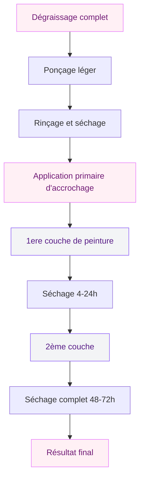
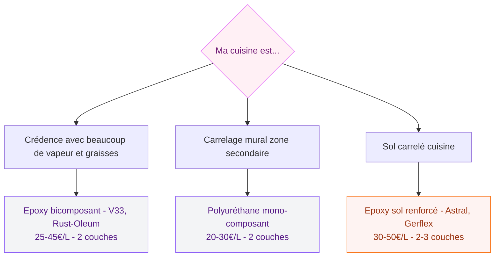

Tu fixes ce carrelage depuis des mois avec un soupir. Blanc cassé dans les années 90, motifs datés, ou juste cette couleur qui ne colle plus avec le reste de ta cuisine - bref, il faut que ca change. Mais poser du carrelage neuf ? C'est un chantier, de l'argent, et souvent pas envie. La bonne nouvelle : la peinture pour carrelage cuisine existe, et elle donne des résultats vraiment bluffants quand tu fais les choses dans l'ordre.

Je te guide pas à pas pour choisir le bon produit, préparer ta surface, appliquer sans rater, et obtenir un rendu qui dure dans le temps.

## Pourquoi peindre le carrelage de sa cuisine ?

La cuisine, c'est la pièce qui subit le plus d'attaques au quotidien : vapeur, projections de graisse, nettoyages répétés. Du coup, quand on dit "peinture carrelage", la première réaction c'est souvent "mais ca va tenir ?" Spoiler : oui, à condition de choisir la bonne peinture et de bien préparer.

L'avantage numéro un, c'est le budget. Poser du carrelage neuf, avec la dépose, les matériaux et la pose, ca peut facilement grimper à 100-200€ le m². Repeindre, c'est 15 à 40€ le m² selon le produit. Et si tu fais toi-même, encore moins. Pour une crédence de 2 m², on parle d'environ 40-80€ tout compris. C'est pas le même monde.

L'autre avantage : la rapidité. Un week-end suffit pour transformer complètement l'ambiance d'une cuisine. Et si tu veux changer à nouveau dans quelques années, tu peux re-peindre par-dessus ou décaper.

> [!NOTE]
> La peinture carrelage ne convient pas aux sols très passants (hall d'entrée, couloir principal). Pour la cuisine, elle fonctionne très bien sur les murs, la crédence et les joints - mais pour le sol de cuisine, opte pour une peinture époxy renforcée.

## Quelle peinture choisir pour le carrelage cuisine ?

C'est LA question. Il existe trois grandes familles, chacune avec ses avantages.

### La peinture époxy : la plus résistante

C'est la référence pour tout ce qui touche à la cuisine et à la salle de bain. La peinture époxy forme un film très dur, résistant aux chocs, aux rayures, aux produits chimiques et à l'humidité. Elle se vend en deux composants à mélanger juste avant l'application (résine + durcisseur).

- Prix moyen : 25-50€ le litre (couvre environ 6-8 m²)
- Marques fiables : Rust-Oleum (kit murs 35€), V33 Rénovation Carrelage (30€/L), Tollens Réno Carrelage
- Idéale pour : crédence, plan de travail carrelé, carrelage mural en zone de cuisson
- Temps de séchage : 24h avant de toucher, 7 jours avant utilisation normale

La contrainte : elle s'applique en général en deux couches, et le pot dure quelques heures une fois mélangé. Il faut donc travailler vite et sans interruption.

### La peinture polyuréthane : le bon équilibre

Moins contraignante que l'époxy (une seule composante, pas de mélange), la peinture polyuréthane est aussi résistante à l'eau et aux taches. Elle convient pour les zones moins exposées : murs autour de la cuisine, carrelage décoratif, coins moins sollicités.

- Prix moyen : 20-35€ le litre
- Marques : Leroy Merlin (Colours Rénovation), Castorama (Dulux Réno Carrelage 22€)
- Finition disponible : brillant, satiné, mat (le mat cache mieux les imperfections)
- Temps de séchage : 4h entre les couches, 48h avant utilisation

### La peinture acrylique spéciale carrelage : la plus accessible

Plus économique (10-20€ le litre), elle reste correcte pour des zones peu exposées : carrelage décoratif, murs de cuisine non soumis aux projections. En revanche, elle résiste moins bien à la chaleur et aux graisses. À réserver pour des travaux temporaires ou des zones secondaires.

> [!TIP]
> Achète toujours 10% de plus que la surface à couvrir. Les retouches après séchage sont difficiles à "noyer" - mieux vaut avoir du produit du même lot sous la main.

## Préparer le carrelage : l'étape qui fait tout

Soyons honnêtes : 80% des échecs viennent d'une mauvaise préparation. La peinture n'accroche pas sur une surface sale ou grasse. En cuisine, c'est encore plus vrai - les résidus de cuisson s'incrustent partout.

Voici le process complet, dans l'ordre :

**Le dégraissage** : Utilise un produit dégraissant puissant type White Spirit ou un nettoyant spécial avant peinture (Henkel Eres, 5€ en GSB). Frotte bien avec une éponge abrasive, insiste sur les joints et les bords de carreaux. Rince à l'eau claire, puis laisse sécher minimum 2h.

**Le ponçage** : Passe un papier abrasif grain 120 sur toute la surface. Pas besoin d'enlever l'émail, juste "griffer" légèrement pour que la peinture accroche. Essaie le coup du chiffon humide après - si tu vois de la poussière blanche, c'est bon.

**Le test du son** : Tape sur chaque carreau avec une pièce de monnaie. Si ca sonne creux, le carreau est décollé et risque de faire partir la peinture avec lui. Dans ce cas, soit tu le recolles avant, soit tu évites de peindre dessus.

**Le primaire d'accrochage** : Souvent vendu avec les kits époxy, il peut aussi s'acheter séparément (Bostik Primaire Accrochage 12€, V33 Primaire 15€). Cette étape double la durée de vie de ta peinture en cuisine. Ne la saute pas.

> [!WARNING]
> Les joints de silicone (coin douche, tour d'évier) ne se peignent pas bien - la peinture finit toujours par se décoller. Remplace-les après avoir peint si nécessaire.

## Application : les bons gestes

Tu as bien préparé ? Super. L'application en elle-même est la partie la plus simple si tu respectes quelques règles.

**Le matériel** :
- Rouleau mousse courte portée (3-4 mm) pour les grandes surfaces
- Pinceau plat de qualité (pas le moins cher du rayon) pour les bords et joints
- Ruban de masquage 3M (oui, ça vaut le coup de payer un peu plus)
- Lunettes + gants pour l'époxy

**La technique** :
Commence par les bords et les joints avec le pinceau, puis enchaîne avec le rouleau sur les carreaux. Travaille par zones de 50 cm x 50 cm pour éviter les reprises visibles. N'insiste pas trop si tu vois des manques - la deuxième couche corrige tout.

Première couche : fine et régulière. L'objectif n'est pas de tout couvrir d'un coup, mais de créer une base. Attends bien le temps de séchage indiqué (4h minimum pour le polyuréthane, 24h pour l'époxy) avant la deuxième couche.

Deuxième couche : croisée par rapport à la première (si tu as roulé horizontalement, roule verticalement). C'est ce qui donne un rendu homogène sans traces.

> [!CAUTION]
> N'utilise pas la cuisine pendant au moins 48h après la dernière couche. L'époxy met jusqu'à 7 jours pour atteindre sa dureté maximale - évite les frottements répétés pendant cette période.

## Peindre les joints : le détail qui change tout

Les joints, c'est souvent le point noir du carrelage ancien - jaunis, abîmés, difficiles à nettoyer. Bonne nouvelle : tu peux les peindre aussi, ou les faire ressortir en couleur contrastée pour un effet graphique vraiment sympa.

Il existe des stylos de rénovation joints (Fuginator, HG Joint Pen - 8-15€) qui permettent de blanchir ou de colorier les joints rapidement. Pour un effet "carrelage noir à joints blancs" très tendance en ce moment, c'est parfait.

Si tu peins tout en blanc ou en couleur uniforme, le rouleau mousse passe sur les joints sans problème. Mais si tu veux garder tes joints visibles dans une autre couleur, tape d'abord les joints, puis pose du ruban sur chaque joint avant de peindre les carreaux.

Pour aller plus loin sur les techniques de peinture qui transforment l'intérieur sans travaux lourds, je t'invite à lire [cet article complet sur la peinture sur carrelage](/guides/couleurs/la-peinture-sur-carrelage-une-methode-pour-renover-votre-interieur/) - il couvre aussi la salle de bain et les sols.

## Couleurs et effets tendance pour la cuisine

Tu peux repeindre en blanc (le classique qui rajeunit tout), mais autant profiter de l'occasion pour oser quelque chose de plus personnel.

Le vert sauge est vraiment la couleur du moment pour les cuisines - ça se marie super bien avec le bois clair et les façades blanches. Si ta cuisine est déjà dans des tons verts ou naturels, tu peux même retrouver les nuances dans notre guide sur [la cuisine olive](/guides/cuisine/cuisine-olive/) pour assortir l'ensemble.

Le noir mat sur carrelage blanc crée un effet graphique fort - mais attention, le noir sur carrelage en finition mate montre beaucoup les traces de doigts. Le satiné est plus pratique au quotidien.

Pour l'inspiration couleurs avec des marques accessibles, la gamme [Peinture Luxens de Leroy Merlin](/guides/decoration/peinture-luxens/) propose de belles teintes pour carrelage à prix raisonnables.

## Budget et comparatif des produits

Pour t'aider à choisir selon ton cas, voici un tableau récapitulatif :

Pour une crédence standard de 2 m², compte environ :
- Dégraissant + ponçage : 8-10€
- Primaire d'accrochage : 10-15€
- Peinture époxy (1 pot suffit) : 25-35€
- Matériel (rouleau, pinceau, ruban) : 10-15€

**Total crédence 2 m² : 53-75€** contre 200-400€ pour une repose de carrelage neuf.

> [!IMPORTANT]
> Ventilement bien la pièce pendant et après l'application, surtout pour l'époxy. Les émanations sont fortes les premières heures. Ouvre fenêtres et aération, et évite de faire dormir quelqu'un dans la pièce adjacente la première nuit.

## Les erreurs les plus fréquentes (et comment les éviter)

**Sauter le primaire** : C'est tentant pour gagner du temps, mais c'est le premier facteur d'échec. Le primaire ne coûte pas cher et il triple littéralement la tenue de la peinture.

**Appliquer trop épais** : Une épaisse couche unique = des coulures, un séchage inégal et une surface qui se marque facilement. Deux couches fines valent bien mieux qu'une couche épaisse.

**Ne pas respecter les temps de séchage** : L'impatience coûte cher. Si tu poses la deuxième couche trop tôt, tu risques de soulever la première. Respecte les délais à la lettre.

**Utiliser le mauvais rouleau** : Un rouleau à peinture classique laisse trop de texture. Pour le carrelage, il faut obligatoirement un rouleau mousse à pores fins (3-4 mm). Rouleau laine = surface d'orange, pas acceptable sur carrelage.

**Peindre par temps humide** : Si l'air est très humide (pluie, brouillard), la peinture sèche mal et peut blanchir. Attends un jour sec.

## Entretien et durée de vie

Une peinture époxy bien appliquée sur carrelage cuisine tient 5 à 10 ans avec un entretien normal. Le polyuréthane, 3 à 5 ans.

Pour l'entretien quotidien : éponge douce et produit neutre. Évite les nettoyants abrasifs (Cif, poudre à récurer) qui rayent le film de peinture. Un peu de liquide vaisselle dilué dans l'eau, ca suffit amplement.

Si tu vois un début de décollement dans un coin (souvent autour des prises ou en bas de crédence), interviens vite : un peu de peinture du même lot sur la zone touchée, en soulevant légèrement si possible pour bien encoller.

La durée de vie dépend aussi beaucoup de ton usage - une cuisine de famille avec des enfants qui cuisinent tous les jours vieillira plus vite qu'une cuisine de célibataire. Mais dans tous les cas, c'est suffisamment durable pour que l'investissement vaille clairement le coup.

---

## FAQ - Peinture pour carrelage cuisine

**Peut-on peindre directement sur du carrelage sans primaire ?**
Techniquement oui, mais le résultat est rarement satisfaisant dans le temps. Le primaire d'accrochage est l'étape qui garantit que la peinture tient vraiment sur l'émail vitrifié. En cuisine, où la surface est soumise à la vapeur et aux nettoyages fréquents, le primaire est vraiment indispensable.

**Quelle peinture pour peindre le carrelage autour de la gazinière ?**
Dans les zones très proches d'une source de chaleur directe, opte pour une peinture époxy haute température ou une peinture antichaleur. Les peintures carrelage classiques ne sont pas conçues pour résister à une chaleur > 80°C. Maintiens aussi une distance de sécurité - ne peins pas à moins de 15 cm d'un brûleur.

**Combien de temps dure la peinture carrelage cuisine ?**
En époxy bicomposant bien appliqué : 5 à 10 ans. En polyuréthane : 3 à 5 ans. Ces durées dépendent beaucoup de la qualité de la préparation et de la fréquence d'utilisation de la cuisine. Un bon entretien (pas de produits abrasifs) prolonge significativement la durée de vie.

**Peut-on peindre des carreaux de sol en cuisine ?**
Oui, mais il faut une peinture sol époxy spécifique, plus résistante au passage et aux chocs que la peinture murale. La préparation est aussi plus exigeante : ponçage plus poussé, et souvent 3 couches nécessaires. Prévois de ne pas utiliser la pièce pendant 72h minimum.
