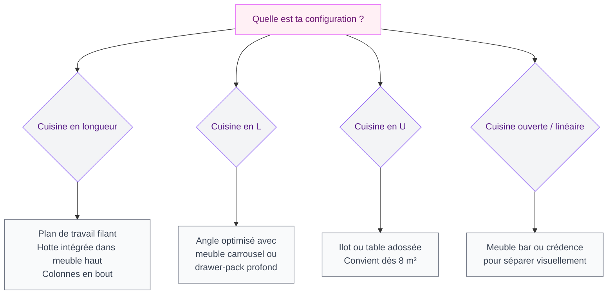
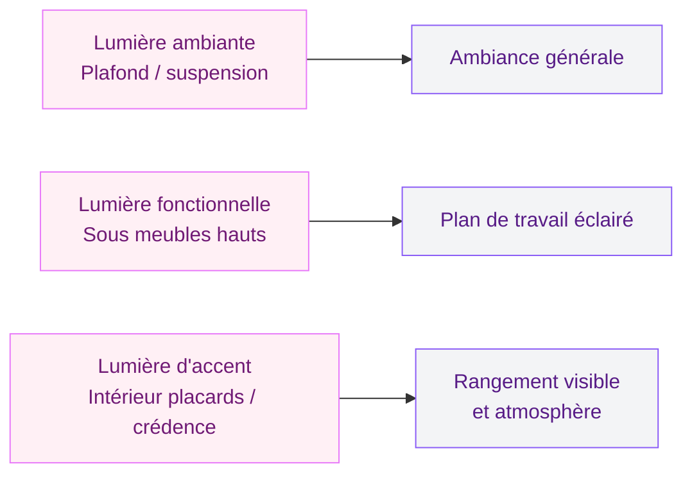

Tu as une cuisine de 6 m², 8 m², ou peut-être un peu plus, et tu regardes ces photos de cuisines américaines sur Pinterest en te disant "jamais je pourrai avoir ca chez moi" ? Je te comprends. Mais voila ce que je peux te dire : 2026 est probablement la meilleure année pour avoir une petite cuisine, parce que les designers et les fabricants ont enfin compris que la majorité des logements en France ne font pas 40 m². Les tendances de cette année sont litteralement taillées pour les petits espaces.

Je vais te montrer ce qui marche, ce qui est beau, et surtout ce qui est accessible - avec des prix concrets et des marques que tu peux vraiment acheter.

## Les 4 grandes tendances pour petites cuisines en 2026

### La monochromie texturée

Fini le blanc laqué brillant des années 2010. En 2026, le mono blanc existe encore, mais il s'enrichit de textures : façades striées (fluted), finitions béton mat, touches bois clair. L'idée ? Tout dans la même teinte de base, mais avec des matières différentes pour créer du relief.

Pour une petite cuisine, c'est parfait : une seule couleur donne une impression d'espace continu, plus grand. Tu évites l'effet "morceau par morceau" qui rétrécit visuellement.

Les teintes stars : beige greige, blanc cassé warm, gris argenté très clair. Les palettes sombres fonctionnent aussi si tu as une bonne lumière (vert sauge, bleu Boston, anthracite), mais réserve-les aux façades basses plutôt qu'aux colonnes hautes.

> [!TIP]
> Pour agrandir visuellement une petite cuisine, choisit la même teinte pour le plan de travail et les façades hautes. Le regard glisse sans interruption et la pièce semble deux fois plus grande.

### Les facades sans poignée

Les poignées, c'est beau sur les grandes cuisines. Sur une petite, chaque centimètre compte et les poignées grignotent de l'espace visuel. Les cuisines sans poignée (push-to-open ou avec fraisage invisible) sont dominantes en 2026, et honnêtement ca change tout.

Chez Ikea, la gamme Voxtorp avec le système Utrusta push-opener tourne autour de 80-120€ par colonne. Chez Nobilia (mid-range), il faut compter 150-200€ le meuble. Pour les budgets plus confortables, Bulthaup et SieMatic proposent des systèmes ultra-fluides, mais on est sur des prix sur devis (generalement 1500€/mètre linéaire).

### L'open concept pensé petit

L'idée d'ouvrir la cuisine sur le salon fait peur quand on a peu de mètres carrés - "mais mes casseroles vont envahir le salon". En 2026, les solutions de transition sont beaucoup plus fines : ilots coulissants, plans de travail en extension, verrières coulissantes. Tu profites de l'air de l'open space sans perdre de rangement.

Si tu veux te lancer dans une refonte avec verrière ou paroi, jette un oeil à ce que propose [une cuisine haut de gamme comme le concept 77 AI](/guides/cuisine/cuisine-haut-gamme-77-ai-concept/) : c'est le genre d'inspiration qu'on peut adapter à plus petit budget.

> [!NOTE]
> Un ilot roulant Ikea (Råskog ou Förhöja) peut servir de plan de travail d'appoint et se range sous le comptoir quand tu n'en as pas besoin. À 40-80€, c'est le meilleur rapport espace/budget du moment.

### Les matériaux naturels intégrés

Le bois (en vrai ou en finition), la pierre, le terrazzo, le béton ciré... Ces matières arrivent en force dans les petites cuisines 2026. Elles apportent de la chaleur et évitent l'effet "cuisine IKEA montée en 2h" qu'on a tous voulu fuir à un moment.

La tendance la plus facile à intégrer sans tout casser : un plan de travail en chêne massif (huilé, pas verni) sur des meubles blancs ou gris. Chez Leroy Merlin, les plans de travail chêne massif 300 cm démarrent à 180€. Chez Cuisines Schmidt, il faut plutôt tabler sur 350-500€ pour la même longueur.

## Quel modèle de cuisine choisir selon ta configuration ?

### La cuisine en longueur (ou "galley kitchen")

C'est le modèle qu'on voit le plus dans les appartements parisiens et lyonnais. Un mur de meubles, parfois deux murs en face l'un de l'autre. Ce format est en fait très efficace si tu l'organises bien : les zones cuisson, préparation et lavage dans un ordre logique (triangle de travail).

En 2026, la solution tendance pour ce format c'est la hotte intégrée dans le meuble haut plutôt que la hotte murale classique. Ca libère de l'espace visuel et le résultat est beaucoup plus propre. La plaque avec hotte intégrée (type Elica Nikolatesla ou Bora Basic) démarre à 700-800€, mais ca remplace à la fois la plaque et la hotte, donc c'est rentable.

### La cuisine en L

Le L, c'est le format le plus polyvalent. Il permet d'intégrer un coin repas si tu gères bien l'angle. Le piège classique : l'angle mort à l'interieur du L, où se cachent des objets oubliés depuis 2018.

Solution en 2026 : le drawer-pack d'angle (tiroirs pivotants qui sortent entièrement). C'est proposé par Häcker, Cuisines IKEA (système Maximera + quart de rond), Siematic. Prix moyen : 200-450€ le module d'angle optimisé.

### La cuisine en U

Pour une cuisine en U, il faut compter au minimum 8 m² pour que ce soit confortable à utiliser. Si tu as cet espace, le U est le roi du rangement. En 2026, on voit beaucoup de U "cassés" - c'est-à-dire avec un côté plus court qui se transforme en mini-bar ou en extension de plan de travail.

> [!TIP]
> Si tu as une cuisine en U, essaie de différencier les hauteurs de plan de travail : 90 cm standard pour cuisson/lavage et 100-105 cm pour la zone de préparation. C'est plus ergonomique et ca crée un interet visuel.

## Les innovations 2026 qui changent vraiment le quotidien

### Le robinet Quooker ou équivalent

Ca parait anecdotique mais le robinet eau bouillante instantanée est en train de changer les petites cuisines. Plus besoin de bouilloire encombrante, plus besoin d'attendre. Le Quooker (1200-1700€ pose comprise) est le leader, mais des alternatives existent : InSinkErator (900-1200€) ou les modèles de marque Franke et Grohe.

Pour une petite cuisine, ca libère un espace précieux sur le plan de travail et c'est un argument fort si tu vends ou loues ton logement.

### Les électroménagers sous-comptoir

En 2026, les marques ont vraiment travaillé sur la compacité. Le lave-vaisselle compact (45 cm de largeur au lieu des 60 standard) de Bosch, Miele ou AEG s'est améliore au point d'avoir des programmes aussi efficaces que le format normal. Idem pour les réfrigérateurs encastrables sous plan de travail.

Pour une cuisine de moins de 7 m², penser "tout sous-comptoir" libère tout le mur pour des meubles hauts de rangement - et ca change completement la perception de l'espace.

### L'éclairage LED intégré

Les cuisines 2026 jouent beaucoup avec la lumière intégrée : bandes LED sous les meubles hauts pour eclairer le plan de travail, lumière à l'intérieur des placards, bandeau lumineux sur la crédence. Chez Ikea, les systèments Omlopp et Ledberg permettent ca pour 30-80€. C'est un upgrade qui transforme l'ambiance sans refaire les meubles.

## Les couleurs tendance pour petite cuisine en 2026

La couleur est souvent ce qui bloque le plus. On veut du caractère mais on a peur que ca rétrécisse. La règle est simple : une couleur forte, oui, mais sur les façades basses uniquement. Les hauts en ton neutre ou en bois clair.

**Vert sauge** : c'est la valeur sure de 2026. Apaisante, naturelle, elle va avec le bois clair et le plan de travail quartz blanc. Chez Cuisines IKEA, les teintes proches (Axstad vert grisé) démarrent à 100€ la façade. Chez Mobalpa ou SoCoo'c, il faudra choisir dans leurs catalogues colorimétriques.

**Vert olive** : plus profond, plus affirmé. Si tu veux voir ce que ca donne avec le bois, jette un oeil à [cet article sur la cuisine olive](/guides/cuisine/cuisine-olive/) qui détaille tout le style.

**Bleu Boston** (bleu profond presque marine) : c'est le contrepoint au beige chaleureux. Audacieux sur les façades basses, il faut l'équilibrer avec un plan de travail clair ou du marbre.

**Terracotta doux** : pour une cuisine méditerranéenne et lumineuse, cette teinte saumon/argile remporte beaucoup de succès. Elle est plus originale que le beige mais reste facile à vivre.

> [!WARNING]
> Évite de mettre une couleur sombre sur les meubles HAUTS si ta cuisine manque de lumière naturelle. Tu risques d'écraser l'espace. Une façade haute sombre fonctionne uniquement si tu as une fenêtre bien exposée ou un éclairage artificiel puissant.

Pour les amoureux des teintes végétales, [la cuisine verte et bois](/guides/cuisine/la-cuisine-verte-et-bois-une-teinte-elegante-et-moderne/) est une lecture complementaire qui donne beaucoup d'idées sur comment jouer avec ces couleurs organiques.

## Budget : combien prévoir selon ton ambition ?

| Niveau | Budget | Ce que tu obtiens |
|--------|--------|-------------------|
| Ikea optimisé | 3 000 - 6 000€ | Pose par pro, électroménager Bosch, plan bois |
| Mid-range | 8 000 - 15 000€ | Cuisiniste SoCoo'c ou Schmidt, finitions soignées |
| Premium | 20 000 - 40 000€ | Cuisiniste haut de gamme, matériaux nobles |

Pour un appartement parisien standard (6-9 m²), le sweet spot est autour de 8 000-12 000€ avec pose comprise. En dessous, tu vas devoir faire des concessions sur la qualité des charnières et les glissières de tiroirs - et dans 3 ans tu regretteras.

> [!IMPORTANT]
> Quel que soit ton budget, prévois 15% de plus pour les imprévus (ajustements de plomberie, electricité décalée, petit mur à abattre ou renforcer). C'est presque systematique dans les renovations de cuisine.

## FAQ

**Une petite cuisine peut-elle avoir un ilot ?**
Oui, à partir de 9 m² si tu choisis un ilot compact (max 80 x 60 cm). L'ilot roulant est la solution la plus flexible : tu le pousses contre le mur quand tu n'en as pas besoin.

**Quelle couleur agrandit visuellement une petite cuisine ?**
Les teintes claires et la monochromie texturée agrandissent. Mais une couleur sombre, bien gérée (uniquement sur les bas avec hauts clairs), peut aussi donner une sensation de profondeur et d'espace assumé.

**Faut-il choisir meubles jusqu'au plafond ?**
Oui, dans la mesure du possible. L'espace entre le meuble haut et le plafond est perdu et accumule de la poussière. Les colonnes jusqu'au plafond maximisent le rangement et donnent un aspect architecturé à la cuisine.

**Quel est le meilleur format de cuisine pour cuisiner vraiment ?**
Pour l'efficacité culinaire, la cuisine en U ou en L avec le triangle cuisson-préparation-lavage bien pensé est imbattable. Le format linéaire fonctionne bien si la longueur dépasse 2,5 mètres.

**Est-ce qu'une petite cuisine peut être tendance ?**
Absolument. Et 2026 le prouve : les tendances (façades sans poignée, matériaux naturels, monochromie texturée, eclairage LED) sont faites pour et adaptées aux petits espaces. Petite cuisine ne veut pas dire cuisine de deuxième classe.
