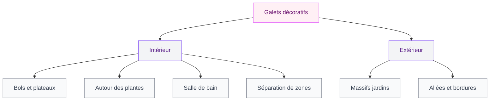
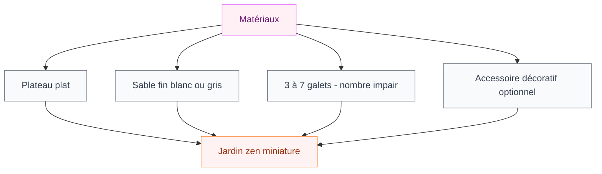

Les galets, c'est un de ces matériaux qui traversent les tendances sans prendre une ride. Minéraux, naturels, doux au toucher, ils apportent immédiatement cette sensation d'équilibre et de calme qu'on cherche tous dans son intérieur. Que tu aies un grand salon, une petite salle de bain ou même un recoin oublié, les galets peuvent vraiment changer l'ambiance d'un espace.

Je m'appelle Laure, et depuis quelques années je teste tout ce qui touche à la déco naturelle. Les galets, j'en ai posé partout : autour de plantes, dans des bols, au pied d'un meuble, même dans une baignoire. Et je peux te dire que c'est l'un des éléments les moins chers et les plus efficaces pour donner du caractère à une pièce.

Dans cet article, je te partage 5 astuces concrètes pour intégrer les galets dans ta déco d'intérieur, avec des idées de produits, des fourchettes de prix et des conseils pratiques pour éviter les erreurs.

---

## Pourquoi les galets transforment un intérieur

Avant de passer aux astuces, un petit point sur ce qui rend les galets si polyvalents en déco.

D'abord, il y a leur texture. Une surface lisse ou légèrement rugueuse, des formes jamais parfaitement identiques, des tons qui vont du blanc cassé au noir profond en passant par le gris, le beige, le rosé ou l'ocre. Cette diversité naturelle crée de la profondeur visuelle sans effort.

Ensuite, il y a leur poids symbolique. Le galet, c'est l'élément naturel par excellence - il évoque l'eau, la montagne, les rivières. Il calme l'oeil et apporte une touche de nature dans des environnements souvent très artificiels.

Et enfin, leur accessibilité. Contrairement à beaucoup de matériaux déco, les galets coûtent peu. On en trouve à partir de 5 euros le kilo en jardinerie ou en grande surface de bricolage, et souvent en vrac dans des espaces naturels (dans le respect des réglementations locales).

---

## Astuce 1 : Un bol de galets comme pièce centrale

C'est la solution la plus simple et souvent la plus élégante. Un grand bol ou une coupe basse remplie de galets posée sur une table basse, un meuble d'entrée ou un buffet - ça donne immédiatement du caractère à un espace.

**Le bon choix de galets**

Pour un bol décoratif, je te recommande des galets polis brillants (souvent appelés galets de rivière ou galets de quartz) plutôt que des galets bruts. Leur surface lisse et leur aspect satiné captent mieux la lumière et donnent un effet plus soigné.

- Galets de marbre blanc : très tendance, ton sobre et élégant. La marque **Hortus** en vend au Leroy Merlin, 3 kg pour environ 8 euros.
- Galets noirs polis (basalte) : effet graphique fort, parfait pour un intérieur épuré ou industriel. Chez **Jardideco**, comptez environ 6 euros le kg.
- Galets de quartz rose : pour une touche plus douce et lumineuse. **Ubbink** propose des sachets de 1 kg à 4,50 euros environ.

**Le contenant qui met en valeur**

L'idéal, c'est un bol assez large et peu profond - les galets ne doivent pas être trop empilés pour qu'on voit bien leurs couleurs et leurs formes. Une coupe en céramique mate, un bol en bois ou même un récipient en verre transparent fonctionnent très bien.

> [!TIP]
> Mélange deux ou trois couleurs de galets dans le même bol pour créer du contraste. Blanc + gris anthracite, c'est un classique qui ne rate jamais.

---

## Astuce 2 : Les galets autour des plantes d'intérieur

C'est probablement mon usage préféré. Remplacer la terre visible à la surface d'un pot par des galets décoratifs change complètement l'aspect d'une plante - et ça a aussi des avantages pratiques.

**Pourquoi c'est une bonne idée**

Les galets à la surface d'un pot d'intérieur réduisent l'évaporation de l'eau, limitent les dépôts de calcaire visibles et empêchent les petites mouches de pondre dans la terre humide (ce fameux problème des sciarides). C'est beau et fonctionnel.

**Quelle épaisseur mettre**

Une couche de 2 à 3 cm de galets suffit. Pas besoin d'en mettre plus - ça alourdirait le pot inutilement et ça compliquerait l'arrosage. Tu dois encore pouvoir vérifier l'humidité de la terre avec ton doigt glissé sous les galets.

**Les meilleures plantes à associer avec des galets**

Certaines plantes se marient particulièrement bien avec ce type de mulch minéral :

- La **Peperomia Hope**, avec ses petites feuilles rondes, prend un aspect presque zen posée dans un pot recouvert de galets blancs. Si tu ne la connais pas encore, va jeter un oeil à notre article sur [la Peperomia Hope](/guides/decoration/la-peperomia-hope/) - c'est une plante vraiment facile à entretenir.
- Les succulentes et cactus adorent ce type d'environnement minéral.
- Les ficus, les dracaenas et les sansevières aussi.

> [!NOTE]
> Pour des plantes qui aiment l'humidité (fougères, calatheas), évite les galets à la surface - ça peut nuire à l'arrosage. Préfère d'autres paillis comme l'écorce de pin.

**Prix et marques**

Pour cet usage, des galets assez petits (8-15 mm) fonctionnent mieux que de gros cailloux. La marque **Blooma** (Castorama) propose des sachets de 1 kg de galets de rivière pour environ 3,50 euros. **Aqua Billes** propose aussi des galets décoratifs colorés pour pots, à partir de 5 euros le sachet de 500 g.

---

## Astuce 3 : Une frise ou un massif de galets pour délimiter un espace

Dans un appartement ouvert ou une grande pièce, les galets peuvent servir à créer des zones visuelles sans construire de cloison. C'est une technique qui vient du design d'intérieur japonais et scandinave, et qui s'adapte très bien aux intérieurs modernes.

**Le principe**

Tu poses une bande de galets au sol (ou sur une surface surélevée comme un plateau bas) pour matérialiser une séparation entre deux espaces : le salon et la zone de travail, le coin lecture et l'espace TV, l'entrée et le couloir.

**Mise en oeuvre pratique**

Pour un massif de galets au sol, la technique la plus propre consiste à délimiter la zone avec un profilé de séparation (aluminium ou inox, environ 10-15 euros chez Leroy Merlin), puis à disposer les galets dans cet espace. Tu peux poser directement sur du parquet flottant ou du carrelage - les galets ne rayent pas, mais mets un film géotextile en dessous pour éviter que des petits cailloux s'échappent.

**Choix des galets**

Pour une frise au sol, opte pour des galets assez plats et de taille homogène (20-40 mm) - ça donne un rendu plus soigné et c'est plus stable sous les pieds. **Carmeuse Nature & Pierres** propose des galets de rivière à bords plats, en sac de 25 kg à environ 15 euros, disponibles en jardineries ou chez Point P.

> [!WARNING]
> Évite les frises de galets dans des zones de fort passage si tu vis avec des enfants en bas âge ou des personnes à mobilité réduite - un galet qui roule peut être source de chute. Réserve cette technique aux zones décoratives ou peu circulées.

---

## Astuce 4 : Les galets en déco de salle de bain

La salle de bain est l'endroit où les galets trouvent peut-être leur place la plus naturelle. L'eau, la pierre, le bois - c'est le trio gagnant de la déco bain zen. Et les galets s'intègrent partout : autour de la baignoire, dans un plateau sous les bougies, ou même collés au mur.

**Autour de la baignoire**

Poser des galets plats et blancs autour du rebord d'une baignoire ou dans la zone de relaxation, c'est simple et très efficace visuellement. Si tu t'intéresses aux ambiances bain zen, tu trouveras aussi beaucoup d'inspiration dans notre article sur la [baignoire japonaise](/guides/salle-de-bain/baignoire-japonaise/) - les galets s'y marient parfaitement.

**Sur le sol de douche**

Il existe des dalles prêtes à poser avec des galets incrustés dans une base en caoutchouc. La marque **MSV** propose des tapis de douche galets naturels à environ 20-35 euros (Leroy Merlin, Amazon). C'est massant sous les pieds, esthétique et facile à poser.

**Dans les niches murales**

Tu as une niche dans ta douche ou au-dessus de ta baignoire ? Remplie de galets clairs avec quelques bougies et une plante, elle devient un véritable point focal décoratif.

> [!TIP]
> En salle de bain, lave tes galets avec du vinaigre blanc dilué une fois par mois pour éviter le dépôt de calcaire et garder leur aspect satiné. Un coup de tissu huilé (huile de lin) sur les galets sombres ravive leur brillance.

**Matériaux adaptés à l'humidité**

Pour la salle de bain, les galets de marbre, de quartz ou de granite sont les meilleurs choix - ils résistent à l'humidité et ne moisissent pas. Évite les galets poreux type calcaire tendre dans les zones très humides.

---

## Astuce 5 : Créer un jardin zen miniature avec des galets

Un jardin zen de table (karesansui en japonais) est un des projets déco les plus simples et les plus relaxants à réaliser. Un plateau peu profond, du sable fin, quelques galets, éventuellement une petite plante succulente ou un morceau de bois flotté - et voilà un objet décoratif qui change complètement l'ambiance d'un bureau ou d'un salon.

**Monter son jardin zen en moins de 30 minutes**

1. Choisis un plateau plat et peu profond (bois, ardoise, béton ciré). Le plateau ne doit pas faire plus de 5 cm de haut.
2. Verse du sable fin blanc ou gris (sable de carrière ou sable de quartz, 5-8 euros chez Leroy Merlin) sur environ 3-4 cm d'épaisseur.
3. Dispose quelques galets en nombre impair (3, 5 ou 7) - c'est une règle esthétique japonaise qui donne un résultat plus harmonieux.
4. Avec un peigne ou une fourchette à dents larges, trace des lignes dans le sable autour des galets.
5. Ajoute optionnellement une petite plante, un caillou particulier ou un morceau de bois flotté.

**Où en trouver les composants**

- Kit jardin zen complet (plateau + sable + galets + peigne) : la marque **Pajoma** en propose à environ 25-35 euros (Amazon, Maisons du Monde).
- En version DIY : plateau en acacia chez **IKEA** (le plateau Boholmen, 9,99 euros), sable de quartz blanc chez Leroy Merlin (2,50 euros le sac de 5 kg), galets chez ta jardinerie habituelle.

> [!IMPORTANT]
> Le jardin zen de table est aussi un outil de relaxation. Prendre 5 minutes le matin pour tracer des lignes dans le sable avec le peigne, c'est une petite pratique mindfulness très facile à intégrer dans sa routine.

---

## Les erreurs à éviter avec les galets en déco

Quelques points pratiques pour ne pas gâcher l'effet recherché :

**Ne pas mélanger trop de couleurs et de tailles**

La beauté des galets vient en partie de leur cohérence. Si tu mélanges des galets rouges, jaunes, verts et bleus de tailles très différentes, ça va vite ressembler à une décoration de fête foraine plutôt qu'à un intérieur zen. Choisis 2 tons maximum, et des tailles assez proches.

**Éviter les galets plastique**

Il en existe en plastique imitation pierre, mais honnêtement, ça se voit toujours. Même les galets les moins chers en vraie pierre ont une texture et un poids qui leur donnent de l'authenticité. Investis 5-10 euros dans de vrais galets plutôt que d'acheter du plastique coloré.

**Penser à l'entretien**

Les galets blancs attirent la poussière et peuvent jaunir avec le temps si tu ne les nettoies pas. Un passage à l'eau claire (ou sous le robinet pour les petits galets de pot) une fois par mois suffit à les garder beaux.

---

## Pour aller plus loin dans ta déco naturelle

Les galets s'inscrivent dans une tendance plus large de la déco naturelle et minérale qui est très forte en ce moment. Si tu aimes cette direction, tu peux aussi regarder du côté du recyclage créatif - par exemple avec les [pneus recyclés en déco](/guides/decoration/pneus-recycles-pour-la-decoration/), une autre façon d'intégrer des matières brutes et inattendues dans ton intérieur.

Et si tu veux prolonger l'expérience galets vers l'extérieur, notre guide sur la façon de [poser une bordure de jardin sans béton](/guides/exterieur/poser-bordure-jardin-sans-beton/) te donnera plein d'idées pour créer des massifs délimités avec des galets dans ton jardin aussi.

---

## FAQ : Galets en déco d'intérieur

**Peut-on utiliser des galets de plage en déco intérieure ?**

Oui, à condition de bien les laver avant usage. Les galets de plage peuvent contenir du sel et des micro-organismes marins qui peuvent dégager une odeur si tu les poses dans un endroit humide. Un trempage dans de l'eau claire pendant 24h suivi d'un rinçage suffit généralement.

**Combien de galets faut-il pour remplir un pot de plante de taille standard ?**

Pour un pot de 15 cm de diamètre, compte environ 200-300 g de galets pour une couche de 2-3 cm. Pour un grand pot de 30 cm, prévois 500 g à 1 kg selon l'épaisseur souhaitée.

**Les galets conviennent-ils à tous les styles déco ?**

Les galets blancs, gris et beiges sont très neutres et s'adaptent à presque tous les styles - scandinave, japonais, minimaliste, bohème. Les galets colorés (rouge, noir poli, vert) sont plus directifs et demandent plus d'attention dans l'association avec le reste de la pièce.

**Comment fixer des galets sur un mur en salle de bain ?**

Utilise une colle à carrelage ou un mastic spécial salle de bain (imperméable). La marque **Bostik** propose du mastic colle multi-usages étanche à environ 8-12 euros le tube. Humidifie légèrement les galets avant pose pour améliorer l'adhérence.

**Y a-t-il un risque pour les parquets avec des galets posés au sol ?**

Un galet posé en frise sur un support plat ne risque pas d'abimer un parquet. En revanche, si un galet roule sous un pied de meuble ou un pied humain, le risque de rayure existe. Utilise toujours un film géotextile ou un plateau sous ta frise de galets.
