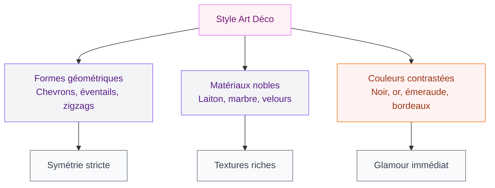
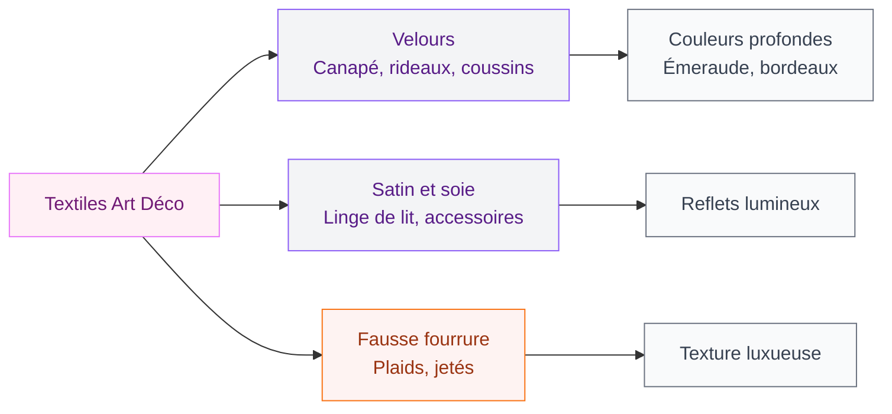
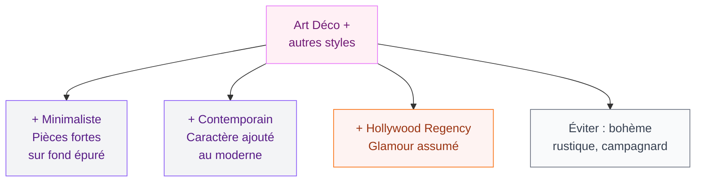

Tu craques pour les lignes géométriques, les matières précieuses et cette ambiance années folles qui dégage un glamour fou ? L'Art Déco, c'est exactement ça. Né dans les années 1920, ce style revient plus fort que jamais dans nos intérieurs en 2026. Que tu veuilles transformer tout ton appart ou juste ajouter quelques touches élégantes, voici 50 idées concrètes pour adopter le style Art Déco chez toi.

## Les codes de l'Art Déco : comprendre le style

L'Art Déco est né à Paris lors de l'Exposition internationale des arts décoratifs de 1925. Son ADN tient en quelques mots : géométrie, symétrie, matériaux nobles et couleurs contrastées. On est loin du [style shabby chic tout en patine douce](/decoration-shabby-chic-idees-et-photos-de-style-et-de-decoration/). Ici, on assume le luxe, la précision et l'audace.

  

Les formes clés : chevrons, éventails, arches, zigzags, motifs sunburst. Les matériaux stars : laiton, marbre, velours, bois laqué, verre fumé. Et les couleurs ? Du sombre, du profond : vert émeraude, bleu nuit, bordeaux, noir et or.

> [!NOTE]
> L'Art Déco se distingue de l'Art Nouveau par ses lignes droites et géométriques. L'Art Nouveau, c'est les courbes organiques et les motifs floraux. L'Art Déco, c'est la rigueur symétrique et les formes angulaires.

## Les murs : papier peint, peinture et moulures

  

### Idées 1-5 : Papier peint géométrique

Le papier peint, c'est LE raccourci pour un effet Art Déco immédiat.

- **Idée 1** : Papier peint éventail doré sur fond vert sapin. Cole & Son "Frontier" autour de 90 euros le rouleau. Un seul mur suffit.
- **Idée 2** : Motif chevron noir et or derrière le canapé. Graham & Brown, versions modernes à 45 euros le rouleau.
- **Idée 3** : Papier peint arches Art Déco en bleu nuit et laiton. Leroy Merlin propose des alternatives à 25 euros.
- **Idée 4** : Motif sunburst en teintes nude et or sur un mur de couloir - ça donne de la profondeur à un espace étroit.
- **Idée 5** : Papier peint panoramique avec gratte-ciels stylisés pour un bureau. Rebel Walls entre 200 et 400 euros.

### Idées 6-10 : Peinture et moulures

- **Idée 6** : Mur d'accent en vert émeraude profond (Tollens "Vert Impérial" à 38 euros le litre). LA couleur Art Déco par excellence.
- **Idée 7** : Boiseries et moulures peintes en noir mat avec murs blancs. Kit moulures chez Orac Decor à partir de 8 euros le mètre.
- **Idée 8** : Duo noir et or sur un seul mur - partie basse en noir, partie haute en or brossé.
- **Idée 9** : Formes géométriques peintes au scotch de masquage : triangles, losanges ou bandes en contraste. Zéro euro de matériel dédié.
- **Idée 10** : Plafond peint en bleu nuit avec une rosace dorée. Audacieux mais terriblement élégant.

> [!TIP]
> Mon astuce pour les moulures : achète des baguettes en polystyrène haute densité chez Castorama (entre 3 et 8 euros le mètre). Colle-les au mur avec de la colle néoprène, puis peins par-dessus. Résultat : des boiseries pour un dixième du prix.

## Le mobilier : pièces maîtresses Art Déco

  

### Idées 11-20 : Canapés, fauteuils et tables

Le mobilier Art Déco se reconnaît à ses formes arrondies mais structurées, ses pieds en métal doré et ses revêtements en velours.

- **Idée 11** : Canapé en velours vert émeraude. Chez Made.com, le modèle "Danielle" tourne autour de 1200 euros. Budget serré ? Le IKEA SODERHAMN avec housse velours Bemz (180 euros) fait illusion.
- **Idée 12** : Fauteuil crapaud en velours moutarde ou bordeaux. Les brocantes en regorgent entre 80 et 200 euros.
- **Idée 13** : Table basse ronde en marbre et laiton. Maisons du Monde à 299 euros, La Redoute Intérieurs autour de 250 euros.
- **Idée 14** : Console d'entrée en demi-cercle avec pieds dorés. AM.PM, modèle "Nyoko" à 349 euros.
- **Idée 15** : Bar ou desserte sur roulettes en métal doré et verre fumé. Maisons du Monde "Gatsby" à 199 euros.
- **Idée 16** : Chaises de salle à manger en velours avec dossier arrondi. IKEA "KRYLBO" à 99 euros pièce.
- **Idée 17** : Bureau en bois laqué noir avec poignées dorées. Les meubles des années 30-40 sur Selency tournent entre 300 et 600 euros.
- **Idée 18** : Tête de lit capitonnée en velours. Chez BUT, les têtes de lit velours démarrent à 199 euros.
- **Idée 19** : Bibliothèque ouverte en métal noir et bois sombre aux finitions dorées.
- **Idée 20** : Table d'appoint en forme d'hexagone ou d'octogone. Zara Home autour de 79 euros.

### Idées 21-25 : Rangement et petits meubles

- **Idée 21** : Commode en bois laqué avec tiroirs à motifs géométriques. Modèles vintage sur Leboncoin entre 100 et 300 euros.
- **Idée 22** : Miroir-armoire de salle de bain avec cadre en laiton brossé.
- **Idée 23** : Porte-manteau mural en laiton avec crochets en éventail (40 à 90 euros chez Made.com).
- **Idée 24** : Coffre de rangement recouvert de velours sombre, qui sert aussi de banquette d'entrée.
- **Idée 25** : Vitrine en métal et verre. Le modèle RUDSTA d'IKEA à 149 euros se customise avec de la peinture dorée en bombe.

## Éclairage : créer l'ambiance années folles

  

### Idées 26-33 : Luminaires

- **Idée 26** : Lustre géométrique en laiton avec globes en verre opalin. House Doctor entre 200 et 400 euros.
- **Idée 27** : Appliques murales en forme d'éventail doré. Zara Home à partir de 49 euros.
- **Idée 28** : Lampe de table en verre fumé et pied en laiton, silhouette "champignon". IKEA "TALLBYN" à 29 euros.
- **Idée 29** : Suspension en cascade avec plusieurs niveaux de cristal. La pièce Great Gatsby par excellence.
- **Idée 30** : Miroir lumineux Art Déco avec cadre en arche. Autour de 120-200 euros chez Leroy Merlin.
- **Idée 31** : Guirlande à grosses ampoules Edison le long d'une étagère ou d'un bar.
- **Idée 32** : Bougies dans des bougeoirs géométriques en laiton - trois hauteurs différentes sur une console.
- **Idée 33** : Lampadaire arc en métal doré. La Redoute à 179 euros, Habitat à 249 euros.

> [!WARNING]
> Un lustre Art Déco demande au minimum 2m50 de hauteur sous plafond pour ne pas écraser l'espace. En dessous, opte pour des appliques murales ou une suspension basse au-dessus d'une table.

## Les textiles : velours, satin et motifs graphiques

  

### Idées 34-40 : Rideaux, coussins et tapis

- **Idée 34** : Rideaux en velours vert foncé tombant jusqu'au sol. IKEA "SANELA" à 49 euros la paire.
- **Idée 35** : Coussins en velours avec passepoil doré. H&M Home entre 15 et 25 euros pièce.
- **Idée 36** : Tapis géométrique noir, ivoire et or. Benuta et Westwing entre 150 et 350 euros pour un 160x230 cm.
- **Idée 37** : Plaid en fausse fourrure sur un fauteuil. Zara Home autour de 70 euros.
- **Idée 38** : Parure de lit en satin avec motifs géométriques. La Redoute entre 59 et 89 euros.
- **Idée 39** : Chemin de table brodé avec motifs chevron dorés.
- **Idée 40** : Serviettes en lin avec broderie géométrique tons or et vert.

## Accessoires : les touches finales

### Idées 41-50 : Miroirs, objets et détails

C'est dans les détails que l'Art Déco prend toute sa dimension.

- **Idée 41** : Miroir sunburst (soleil). L'icône du style. Maisons du Monde à 49 euros, Anthropologie à 120 euros.
- **Idée 42** : Vase en verre fumé ou en céramique noire à motifs géométriques.
- **Idée 43** : Cadres photo en laiton de formes géométriques (octogone, hexagone, arche).
- **Idée 44** : Plateau décoratif en marbre et laiton pour ta table basse.
- **Idée 45** : Boîte décorative en nacre ou en laque noire sur une commode.
- **Idée 46** : Horloge murale Art Déco. Les modèles vintage en bakélite coûtent 50-150 euros en brocante.
- **Idée 47** : Porte-revues en métal doré à côté d'un fauteuil.
- **Idée 48** : Affiches Art Déco encadrées. Reproductions de Tamara de Lempicka chez Desenio à partir de 15 euros.
- **Idée 49** : Vaisselle à motifs géométriques noirs et or. H&M Home ou Maisons du Monde, à partir de 5 euros l'assiette.
- **Idée 50** : Diffuseur de parfum en verre fumé à motif facetté. Rituals à 25 euros.

> [!TIP]
> Si tu débutes avec l'Art Déco, commence par trois accessoires : un miroir sunburst, un vase en verre fumé et des coussins en velours avec passepoil doré. Ces trois éléments suffisent à donner le ton sans changer un seul meuble.

## L'Art Déco pièce par pièce

Tu n'es pas obligée de tout refaire d'un coup.

**Le salon** : un canapé en velours sombre, une table basse ronde en marbre, un miroir sunburst au-dessus du canapé. Pour les couleurs, pense à la palette [dorée qu'on détaille dans notre guide dédié](/decoration-doree-sur-les-murs-les-meubles-ou-les-accessoires/). Le duo or et vert émeraude est parfait pour un salon Art Déco.

**La chambre** : tête de lit capitonnée en velours, lampes de chevet symétriques en laiton, parure de lit en satin. Un papier peint éventail derrière le lit complète le tableau.

**La salle de bain** : robinetterie laiton brossé, miroir en arche, carrelage géométrique noir et blanc. Le style Art Déco marche très bien ici parce que les surfaces brillantes reflètent la lumière comme dans les grands hôtels des années 30.

**L'entrée** : console demi-cercle, miroir doré, porte-manteau en laiton. Trois éléments qui transforment un couloir banal en hall glamour. Tu peux aussi t'inspirer de nos conseils pour [moderniser un appartement dans le style parisien](/comment-moderniser-votre-appartement-dans-le-plus-pur-style-parisien/).

## Art Déco avec un petit budget

Tu n'as pas besoin de dépenser des fortunes. Le secret, c'est de mixer des pièces clés avec des accessoires accessibles.

**Moins de 200 euros** : rideaux velours IKEA (49 euros), deux coussins H&M Home (30 euros), un miroir sunburst (49 euros), un vase en verre fumé (15 euros). Total : 143 euros pour un vrai changement d'ambiance.

**500-800 euros** : ajoute une table basse marbre et laiton (250 euros), un tapis géométrique (200 euros), des appliques dorées (100 euros la paire).

La brocante reste ton alliée : les meubles authentiques des années 30-40 se trouvent encore à des prix raisonnables sur Selency, Leboncoin et dans les vide-greniers.

> [!IMPORTANT]
> L'erreur la plus courante avec l'Art Déco : en faire trop. Ce style est puissant, donc quelques pièces bien choisies suffisent. Si tu surcharges, tu passes du glamour au casino de Las Vegas.

## Art Déco et styles voisins

L'Art Déco se marie bien avec d'autres courants. Avec le style [minimaliste](/decoration-minimaliste-idees-et-photos-faciles/), un miroir sunburst et quelques accessoires en laiton suffisent. Le contraste entre l'épure et le glamour fonctionne très bien.

Avec le style contemporain, l'Art Déco apporte du caractère. Un salon aux lignes modernes prend une autre dimension avec un tapis géométrique et des coussins en velours.

Évite par contre le mélange avec le style bohème ou le rustique : les codes sont trop éloignés.

## Sur le meme theme

- [décoration classique contemporaine](/decoration-classique-20-images-et-idees-contemporaines/)

## FAQ

**Quelle est la différence entre Art Déco et Art Nouveau ?**
L'Art Nouveau (1890-1910) mise sur les courbes organiques et les motifs floraux. L'Art Déco (1920-1940) préfère les formes géométriques et la symétrie. En résumé : Art Nouveau = nature, Art Déco = géométrie.

**Comment intégrer l'Art Déco dans un petit appartement ?**
Concentre-toi sur les accessoires : un miroir sunburst, des coussins en velours, un vase en verre fumé, une lampe en laiton. Choisis un seul mur d'accent avec un papier peint géométrique et évite les gros meubles sombres qui vont écraser l'espace.

**Quelles couleurs sont typiques du style Art Déco ?**
Vert émeraude, bleu nuit, bordeaux, noir et or sont les couleurs signatures. Le doré (or mat ou laiton brossé) sert de fil conducteur. Les tons crème et ivoire servent de base neutre pour équilibrer les couleurs profondes.

**L'Art Déco est-il compatible avec un budget serré ?**
Oui. Un changement d'ambiance Art Déco peut coûter moins de 150 euros en misant sur des pièces clés chez IKEA, H&M Home et Maisons du Monde. Les brocantes offrent aussi des pièces authentiques à bon prix.
