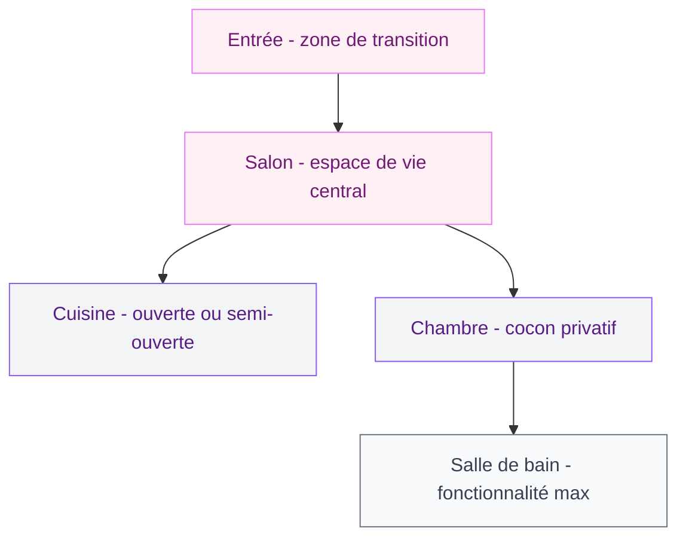
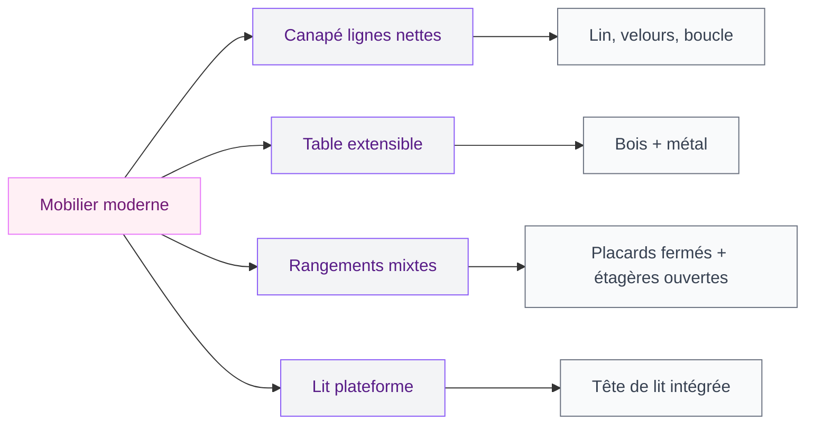

Un appartement de 60m2 qui ressemble vraiment à quelque chose, c'est possible - et non, tu n'as pas besoin d'un budget d'architecte ni d'une surface de château. Ce qui fait la différence entre un 60m2 banal et un 60m2 qu'on a envie de retrouver chaque soir, c'est surtout une chose : des choix cohérents. Les bons meubles, les bons matériaux, les bonnes couleurs. Et surtout, un agencement qui respecte l'espace au lieu de le combattre.

Voilà pourquoi j'ai compilé des dizaines de photos d'appartements modernes - des vrais, rénovés par des gens normaux avec des budgets normaux - et les conseils qui vont avec. On va aller pièce par pièce, style par style, avec des marques et des prix concrets. Prête ?

## Ce que "moderne" veut vraiment dire en déco

Le style moderne en décoration intérieure, c'est souvent mal compris. Beaucoup pensent que ça veut dire froid, blanc cassé et vide comme un loft de magazine. Pas du tout.

  

La déco contemporaine, c'est surtout une question de proportion et d'intemporalité. On ne suit pas la tendance du moment pour la suivre - on sélectionne des pièces qui vieillissent bien, qui fonctionnent ensemble et qui laissent respirer l'espace. Le minimalisme en est le moteur, pas le but final.

Dans un appartement moderne réussi, tu vas trouver :

- Des lignes nettes, sans fioritures inutiles
- Un mélange de matériaux : bois chaleureux + inox ou verre + textile doux
- Une palette de couleurs maîtrisée (rarement plus de trois teintes)
- Un éclairage pensé, pas juste une ampoule au plafond
- Des rangements intégrés qui disparaissent dans le décor

> [!TIP]
> Le minimalisme ne signifie pas "peu de choses". Ca veut dire "chaque chose a sa place et sa raison d'être". Tu peux avoir un appartement moderne avec beaucoup d'objets - à condition qu'ils soient bien choisis et bien disposés.

Contrairement à ce qu'on croit, la transformation d'un intérieur banal en appartement moderne ne passe pas forcément par la rénovation. Un bon agencement des meubles existants, deux ou trois pièces clés remplacées et une cohérence de couleurs peuvent suffire à moderniser une pièce du tout au tout.

## Agencement : la base de tout dans un 60m2

Dans un appartement de 60m2, chaque mètre carré compte. L'agencement n'est pas une question d'esthétique en premier - c'est une question de flux. Comment tu te déplaces dans l'espace ? Est-ce que les pièces s'enchaînent logiquement ? Est-ce que la lumière circule ?

  

### L'entrée : ne la sacrifie pas

Dans les appartements modernes de 60m2, l'entrée est souvent le parent pauvre. On la zappe au profit d'un couloir étroit et on passe à autre chose. Erreur ! L'entrée donne le ton de tout l'appartement. Même sur 3m2, tu peux créer quelque chose de cohérent.

Mon conseil : un miroir grand format (Ikea propose le modèle NISSEDAL à 79€, parfait), un crochet mural design (H&M Home, autour de 25€) et une petite console fine. C'est tout. Ca crée immédiatement une zone de transition qui respire le soin.

### Le salon : tout part de là

Dans un 60m2, le salon est souvent la pièce qui doit tout faire - détente, travail, repas parfois. L'agencement du salon doit donc être malin. Quelques règles qui fonctionnent vraiment :

**Ancre le canapé** : place-le dos à un mur ou contre un angle, jamais en flottant au centre de la pièce dans un petit espace. Ca libère de la place et ça structure visuellement.

**Zoning visuel** : dans un salon-salle à manger, un tapis délimite la zone canapé sans poser de cloison. Ikea VONGE 160x230cm à 149€ fait parfaitement le job.

**Meuble TV mural** : dans un 60m2, un meuble TV bas avec pieds au sol prend de la place visuellement. Opte pour une solution murale - moins cher à l'achat, plus léger à l'oeil. Made.com propose de très belles options entre 200 et 400€.

Si tu cherches de l'inspiration pour ton salon en particulier, les [salons modernes et élégants 2026](/salons-modernes-et-elegants-2026/) regorgent d'idées concrètes avec des ambiances très différentes.

> [!NOTE]
> Dans un appartement traversant, l'agencement doit tenir compte des deux sources de lumière. Evite de placer des meubles hauts en plein milieu - tu bloquerais la traversée lumineuse qui est l'un des grands atouts de ce type de bien. Pour aller plus loin sur ce sujet, le guide sur l'[appartement traversant](/appartement-traversant/) détaille vraiment bien comment exploiter la double exposition.

## Meubles modernes : sélectionner sans se tromper

La modernisation d'un intérieur passe souvent par les meubles. Mais attention - "moderne" ne veut pas dire "cher". Ca veut dire cohérent, proportionné et fonctionnel.

  

### Les pièces clés d'un appartement moderne réussi

**Le canapé** : c'est le meuble roi du salon. Dans la déco contemporaine, on aime les canapés aux lignes droites, sans accoudoirs trop épais ni pieds trop massifs. La banquette type "sofa 3 places compact" est très populaire dans les 60m2. Budget : 500-900€ chez La Redoute, 800-1500€ chez AM.PM, 1500€+ chez des marques plus premium comme Ligne Roset.

**La table de salle à manger** : dans un 60m2, oublie les grandes tables familiales. Opte pour une table extensible ou une table ronde - elles permettent de circuler plus facilement et de recevoir plusieurs personnes. Habitat propose des modèles ronds en chêne à partir de 350€ qui sont vraiment solides.

**Les rangements** : c'est là que beaucoup font des erreurs dans les appartements modernes. On pense "je vais tout mettre dans un grand meuble" et on finit avec un mur écrasant. Mieux vaut combiner : quelques placards fermés pour les objets du quotidien, des étagères ouvertes pour les objets décoratifs. Kallax d'Ikea (129-299€) reste une valeur sûre quand on y ajoute des paniers pour cacher le bazar.

### Le mobilier multifonction : l'allié du 60m2

Dans les appartements de 60m2 modernes, le mobilier multifonction est ton meilleur ami. Voici ceux qui valent vraiment leur place :

- **Canapé-lit à mécanisme rapide** : pour recevoir sans avoir une chambre d'amis dédiée. FRIHETEN chez Ikea à 549€ est un classique qui a fait ses preuves.
- **Table basse avec rangement** : compartiments ou tiroirs intégrés pour cacher les câbles et télécommandes. Beaucoup de modèles entre 100 et 250€ chez BUT ou Maisons du Monde.
- **Bureau escamotable** : pour le télétravail sans dédier une pièce entière. Un modèle mural rabattable Ikea NORBERG coûte 65€ et disparaît complètement quand il ne sert pas.

## Matériaux et couleurs : les vrais choix qui font la différence

  

### Le bois et la pierre : le duo gagnant

Dans les appartements modernes qui fonctionnent vraiment, on retrouve presque toujours une combinaison de bois et de pierre (ou leurs imitations). Ces deux matériaux apportent de la chaleur et de la texture sans alourdir l'espace.

Le bois : parquet chêne huilé, planches de pin brut, contreplaqué bouleau - selon le budget. Le parquet flottant chêne clair est l'une des transformations les plus efficaces qu'on puisse faire dans un appartement. Comptez 30-50€/m2 pour un bon produit installé soi-même, 60-90€/m2 posé par un pro.

La pierre : carreau de ciment, zellige, travertin ou tout simplement une surface peinte en teinte "pierre" - l'effet reste très réussi pour une fraction du prix. Quelques carreaux de zellige autour de l'évier de cuisine ou en crédence de salle de bain transforment une pièce entière.

L'inox joue aussi un rôle dans les appartements modernes, surtout en cuisine. Une crédence inox ou des éléments de robinetterie brushed steel donnent ce petit côté pro qui fait monter le niveau du décor. C'est aussi très résistant et facile à entretenir - un vrai bonus dans un espace de 60m2 où on n'a pas envie de passer sa vie à nettoyer.

> [!TIP]
> Pour associer bois et inox sans que ca fasse cuisine professionnelle froide, l'astuce c'est d'ajouter du textile. Des torchons en lin, un tablier suspendu, une plante grasse sur le plan de travail. Ces éléments organiques réchauffent instantanément l'atmosphère.

### Couleurs : construire une palette cohérente

Dans un appartement de 60m2 moderne, la couleur doit travailler pour toi - pas contre toi. Voici la stratégie qui fonctionne :

**Base neutre** (70% des surfaces) : blanc cassé, gris clair, beige rosé, écru. Ces teintes agrandissent et unifient l'espace. Dulux Valentine "Craie" ou Farrow & Ball "All White" sont des valeurs sûres.

**Teinte d'ancrage** (20%) : gris anthracite, vert sauge, terracotta, bleu canard. Une couleur plus affirmée pour un mur, des meubles ou un tissu. Ca crée le caractère.

**Accent** (10%) : ocre, cuivre, or mat, noir mat. Des petites touches qui donnent la vie - un vase, des poignées de tiroir, un cadre.

Ce ratio 70-20-10 est la règle d'or des décorateurs d'intérieur pour les appartements modernes. Trust me, ca évite les mauvaises surprises à la fin des travaux.

> [!WARNING]
> Evite de peindre TOUTES tes pièces dans des couleurs différentes dans un 60m2. Ca fragmente visuellement l'espace et le rend plus petit qu'il n'est. Mieux vaut une palette de deux ou trois couleurs qui circulent d'une pièce à l'autre avec des variations de ton.

## Transformation avant/après : ce qui change vraiment

  

### Cas 1 : le salon réinventé

Un salon de 60m2 typique des années 80-90 : carrelage beige, canapé marron en cuir vieillissant, meuble TV massif et éclairage unique au plafond. Budget transformation : 2 500€.

Ce qui a changé :
- Parquet flottant chêne clair sur le carrelage (sans l'arracher) : 800€
- Canapé 3 places en velours vert sauge La Redoute : 750€
- Meuble TV mural blanc mat Made.com : 320€
- Deux appliques murales Ikea + lampadaire arc : 180€
- Tapis 160x230 Ikea + coussins Zara Home : 220€
- Peinture un mur en gris ardoise : 120€
- Miroir grand format + quelques plantes : 130€

Résultat : un salon moderne, lumineux, qui ne ressemble plus du tout à un appartement des années 90. La modernisation n'a touché aucune structure, aucune installation électrique. Juste des choix cohérents.

### Cas 2 : la cuisine ouverte

La tendance des appartements modernes de 60m2 est clairement à la cuisine ouverte sur le salon. Ca agrandit visuellement et facilite la convivialité. Si tu as une cloison non porteuse entre ta cuisine et ton salon, sa suppression peut vraiment transformer l'appartement.

Pour la cuisine, le minimalisme est roi. Façades sans poignée, plans de travail sans joint visible, hotte intégrée. Un relookage de façades seules (remplacement des portes sans toucher aux caissons) se fait autour de 1 500-3 000€ et change complètement l'ambiance.

## La chambre : le cocon moderne dans un 60m2

Dans les appartements de 60m2, la chambre est souvent la pièce la plus sacrifiée - elle hérite des meubles qui ne rentrent nulle part ailleurs et finit encombrée. Pourtant c'est la pièce où tu passes le plus de temps.

Le guide sur la [décoration de la chambre à coucher 2026](/decoration-de-la-chambre-a-coucher-2026-tendances-et-photos/) détaille toutes les tendances actuelles, mais voici l'essentiel pour une chambre moderne dans un 60m2 :

**Le lit plateforme** : sans pieds visibles ou avec des pieds très fins, il donne une ligne basse et contemporaine à la chambre. Un lit MALM Ikea à 199€ avec une tête de lit tissu ajoutée remplit parfaitement ce rôle.

**Les rangements intégrés** : dans une chambre moderne de 60m2, les armoires traditionnelles prennent trop de place visuellement. L'idéal : des placards intégrés sur toute la hauteur du mur, avec des portes coulissantes miroir. Ca double la lumière perçue et ca évite les volumes qui écrasent.

**La literie** : c'est souvent négligé mais une belle parure de lit fait 50% du travail décoratif dans une chambre. Du coton lavé en lin ou du percale égyptien, dans des tons neutres (blanc, beige, grège), ca suffit à donner un look "hotel boutique" sans aucun autre changement.

> [!IMPORTANT]
> Dans un appartement de 60m2, le rangement de la chambre ne doit pas empiéter sur le salon ou l'entrée. Si tu manques de place pour les affaires de saison, les lits avec coffre de rangement intégré sont une option à étudier sérieusement. Le BRIMNES Ikea propose cette configuration à partir de 399€.

## Sur le meme theme

- [décoration petit salon](/decoration-petit-salon/)
- [décoration art déco](/50-idees-de-decoration-art-deco/)

## FAQ : appartements modernes de 60m2

**Comment décorer un appartement de 60m2 avec un petit budget ?**

Start avec l'agencement - déplacer tes meubles ne coûte rien et peut transformer une pièce. Ensuite : peinture (un seul mur couleur = moins de 100€), textiles (coussins, tapis, rideaux font beaucoup pour le budget), et une ou deux pièces clés bien choisies plutôt que dix objets baclés. Le budget minimum pour un vrai changement d'ambiance tourne autour de 500-800€ bien répartis.

**Quel style moderne convient le mieux à un 60m2 ?**

Le style scandinave modernisé et le style contemporain épuré sont les deux approches qui fonctionnent le mieux dans les petites surfaces. Le scandinave apporte de la chaleur avec ses matières naturelles (bois, laine), le contemporain joue sur les lignes nettes et le contraste. Les deux partagent le même principe : moins d'objets, mais mieux choisis.

**Faut-il forcément un architecte d'intérieur pour rénover un 60m2 ?**

Non. Si tu ne touches pas à la structure, la plomberie ou l'électricité, un décorateur en ligne suffit. Un architecte d'intérieur devient utile pour une rénovation complète (abattre des cloisons, refaire cuisine et salle de bain).

**Comment gérer le manque de rangement dans un appartement moderne ?**

La solution tient en trois axes : vertical (utiliser la hauteur jusqu'au plafond), invisible (meubles avec portes fermées plutôt qu'étagères ouvertes surchargées) et multifonction (banquette avec coffre, table basse avec tiroirs, lit avec rangement intégré). Dans un 60m2 moderne bien pensé, le rangement ne se voit pas - il disparaît dans le décor.

**Quels matériaux choisir pour un appartement moderne résistant ?**

Pour le sol : parquet contrecollé huilé (très résistant, se réentretient facilement) ou carrelage grand format. Pour les plans de travail : stratifié HPL ou quartz reconstitué sont plus résistants que le marbre naturel et bien moins chers. Pour les façades de cuisine et salle de bain : MDF laqué mat (plus résistant aux rayures que le laqué brillant). Et pour les textiles : le velours côtelé et le lin lavé vieillissent très bien dans le temps.
