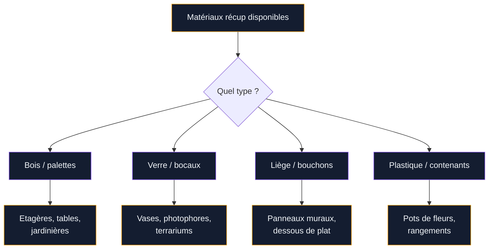

On jette trop de trucs qui pourraient encore servir. Les bouteilles en verre, les palettes de livraison, les bouchons de liege, les contenants en plastique... Tous ces objets qui finissent à la poubelle ou au recyclage ont un potentiel déco que tu sous-estimes probablement. Et si tu les transformais en pièces uniques pour ta maison ?

L'artisanat avec des matériaux recyclés, c'est une approche simple et économique pour décorer ton intérieur. Pas besoin de talent artistique ni de gros budget : la plupart des projets que je te présente ici coûtent entre 0 et 20 euros, et se réalisent en quelques heures. Le plus dur, c'est souvent de choisir par où commencer.

Je t'ai sélectionné 15 idées concrètes, classées par matériau, avec à chaque fois les étapes, le budget et des conseils pour un résultat soigné.

## Les palettes : le matériau star du recyclage déco

Le bois de palette reste le chouchou des bricoleurs récup. Il est gratuit (ou presque), facile à travailler, et donne un rendu rustique très tendance. Tu en trouves sur Leboncoin, devant les zones commerciales ou chez les artisans qui s'en débarrassent.

  

### Etagères murales en palette

Découpe deux ou trois planches d'une palette standard (120 x 80 cm). Ponce-les au papier de verre grain 120, puis applique une couche de cire ou de vernis mat. Fixe-les au mur avec des équerres invisibles. Budget total : moins de 10 euros si tu as déjà du papier de verre.

Ces étagères font un effet super dans une cuisine pour poser des bocaux d'épices ou dans un couloir pour les cadres photos. Et si tu veux aller plus loin avec ce matériau, tu peux même [fabriquer un bar en palettes](/comment-fabriquer-soi-meme-un-bar-en-palettes/) pour ton salon ou ta terrasse.

### Jardinière d'intérieur en palette

Découpe la moitié d'une palette, ajoute un fond avec une planche et une bâche plastique pour l'étanchéité. Tu obtiens un bac à plantes vertical ou horizontal, parfait pour les herbes aromatiques dans la cuisine. Le bois non traité vieillit bien et apporte une touche naturelle.

> [!TIP]
> Vérifie le marquage sur ta palette avant de la travailler. Les palettes marquées "HT" (traitement thermique) sont sûres. Évite les palettes marquées "MB" (bromure de méthyle) qui contiennent des produits chimiques.

### Table d'appoint en caisse de palette

Empile deux ou trois caisses en bois de récup, fixe-les entre elles avec de la colle à bois forte, et ajoute des roulettes en dessous (environ 8 euros les 4 chez Castorama). Tu as une table d'appoint mobile avec du rangement intégré, pour 15 euros maximum.

## Le verre : bocaux et bouteilles transformés

Le verre est un matériau génial pour la récup déco. Il est beau, solide, et se recycle à l'infini. Mais plutôt que de le mettre dans le bac vert, transforme-le.

  

### Vases colorés avec des bouteilles

Nettoie bien tes bouteilles de vin ou de jus de fruits, retire les étiquettes (30 minutes dans l'eau chaude + un peu de vinaigre blanc). Peins-les avec de la peinture acrylique ou de la peinture en bombe, en deux couches légères. Des bouteilles de tailles différentes regroupées sur un plateau en bois font un centre de table moderne.

Pour des techniques plus détaillées sur la peinture sur verre, jette un oeil à notre guide pour [peindre des bocaux et des bouteilles en verre](/comment-peindre-des-bocaux-ou-des-bouteilles-en-verre/). Tu y trouveras les bonnes peintures et les étapes de préparation.

> [!NOTE]
> La peinture en bombe Rust-Oleum Chalk Paint (13 euros environ) donne un fini mat ultra tendance sur le verre. Deux couches fines espacées de 20 minutes suffisent pour un résultat opaque et uniforme.

### Photophores avec des bocaux de confiture

Colle de la dentelle, de la ficelle de jute ou du masking tape autour d'un bocal propre. Glisse une bougie chauffe-plat à l'intérieur. En 10 minutes, tu obtiens un photophore qui ferait bonne figure dans un magazine déco. Coût : 0 euros si tu as déjà la ficelle. Une série de 5 bocaux alignés sur un rebord de fenêtre crée une ambiance très chaleureuse en soirée.

### Terrarium dans un grand bocal

Les grands bocaux type Le Parfait (1 litre ou plus) sont parfaits pour créer des mini-terrariums. Ajoute une couche de graviers au fond, puis du terreau, et plante des succulentes ou de la mousse. Ce projet coûte entre 5 et 12 euros selon les plantes que tu choisis. Un terrarium demande très peu d'entretien et dure des mois.

## Les bouchons de liège : petits mais pleins de potentiel

Les bouchons de liège s'accumulent vite si tu bois du vin de temps en temps. Il en faut entre 50 et 200 selon le projet, mais en quelques mois de collecte (ou via les sites de dons), tu as largement assez.

  

### Panneau mural en bouchons

Colle des bouchons coupés en deux (dans le sens de la longueur) sur un cadre en bois ou directement sur un panneau de contreplaqué. La colle chaude au pistolet fonctionne bien pour ça. Tu obtiens un panneau d'affichage naturel où tu peux épingler des photos, des cartes postales ou des mémos. Budget : 5-10 euros pour le panneau de support.

### Dessous de plat en bouchons

Arrange 15 à 20 bouchons en cercle ou en carré, maintenus ensemble par un élastique épais ou collés sur un support rond en carton rigide. Le liège isole naturellement la chaleur - c'est un dessous de plat fonctionnel et joli. Tu peux en fabriquer plusieurs en série, parfaits comme cadeaux faits maison.

> [!WARNING]
> Utilise un pistolet à colle basse température si tu travailles avec des enfants. La colle chaude classique atteint 200 degres et peut causer des brûlures. Les modèles basse température (environ 12 euros chez Action ou Gifi) chauffent à 120 degres, bien plus sûrs.

### Porte-clés ou marque-places

Un bouchon de liège fendu sur un côté (avec un cutter) devient un marque-place pour une table de fête : glisse un petit carton avec le prénom dedans. En ajoutant un piton à vis et un anneau, c'est un porte-clés original. Ces petits projets sont parfaits pour impliquer les enfants.

## Le plastique et les contenants du quotidien

On jette des kilos de plastique chaque mois. Certains contenants ont des formes parfaites pour la déco ou le rangement, si tu prends le temps de les transformer.

  

### Pots de fleurs avec des bouteilles en plastique

Coupe une bouteille en plastique de 1,5 ou 2 litres aux deux tiers de la hauteur. Ponce le bord coupé avec du papier de verre fin pour éviter les bords tranchants. Peins l'extérieur avec de la peinture acrylique (deux couches), perce trois trous de drainage au fond, et remplis de terreau. Ces pots reviennent à 0 euros et sont parfaits pour des herbes aromatiques.

Si tu veux suspendre tes créations, tu peux aussi les intégrer dans des [jardinières suspendues faites maison](/6-idees-pour-fabriquer-des-jardinieres-suspendues-maison/) pour un coin verdure sur ton balcon.

### Rangement avec des contenants de lait ou de lessive

Les gros bidons de lait ou de lessive (3 à 5 litres) deviennent des rangements très pratiques une fois découpés. Coupe le haut du bidon en diagonal pour créer une ouverture facile. Peins l'extérieur ou recouvre-le de tissu adhésif. Parfait pour ranger les pinceaux dans un atelier, les crayons des enfants ou les accessoires de jardin.

### Boîtes à bijoux avec des roulettes de ruban

Les petites bobines de ruban adhésif ou de masking tape, une fois vides, font des contenants à bijoux très mignons. Recouvre-les de tissu, de papier kraft ou de peinture, et ajoute un couvercle en carton décoré. Chaque bobine peut accueillir des bagues, des boucles d'oreilles ou des petits colliers. Coût : quasiment rien.

## Le tissu et le papier : les oubliés de la récup

Les vieux draps, les chutes de tissu, le papier journal et le carton sont aussi des matériaux de récup qui se transforment facilement.

  

### Fleurs en tissu ou en papier

Des chutes de tissu coloré ou du papier de soie deviennent de très belles fleurs décoratives. Un bouquet de fleurs en papier dure des années (pas d'arrosage, pas de flétrissement) et apporte de la couleur à n'importe quelle pièce. Pour la technique complète, consulte le guide pour [réaliser des fleurs en tissu ou en papier étape par étape](/comment-realiser-des-fleurs-en-tissu-ou-en-papier-etape-par-etape/).

### Paniers tressés en vieux draps

Découpe un drap usagé en bandes de 5 cm de large. Tresse trois bandes ensemble en une corde épaisse, puis enroule cette corde en spirale en la cousant au fur et à mesure. Tu obtiens un panier souple et robuste, idéal pour ranger les petites affaires sur une étagère.

> [!IMPORTANT]
> Lave toujours tes matériaux recyclés avant de les travailler. Un bocal avec des résidus de nourriture, un tissu poussiéreux ou une palette sale donneront un résultat médiocre et potentiellement malodorant.

## Budget et récap des 15 projets

Le gros avantage de l'artisanat recyclé, c'est le budget. Voici un récapitulatif des coûts pour chaque projet :

| Projet | Matériau principal | Budget estimé |
|---|---|---|
| Etagères murales | Palette | 5-10 euros |
| Jardinière en palette | Palette + bâche | 5-8 euros |
| Table d'appoint | Caisses + roulettes | 12-18 euros |
| Vases colorés | Bouteilles + peinture | 5-13 euros |
| Photophores | Bocaux + ficelle | 0-3 euros |
| Terrarium | Grand bocal + plantes | 5-12 euros |
| Panneau mural | Bouchons + support | 5-10 euros |
| Dessous de plat | Bouchons + colle | 0-3 euros |
| Marque-places / porte-clés | Bouchons | 0-2 euros |
| Pots de fleurs | Bouteilles plastique | 0-2 euros |
| Rangement bidon | Bidon + peinture | 2-5 euros |
| Boîte à bijoux | Bobines + tissu | 0-3 euros |
| Fleurs en tissu | Chutes de tissu | 0-5 euros |
| Fleurs en papier | Papier de soie | 2-4 euros |
| Paniers tressés | Vieux draps | 0 euros |

La majorité des projets coûte moins de 10 euros. Et si tu compares avec les prix en magasin déco, un vase peint à la main vaut facilement 15-25 euros chez Maisons du Monde, et une jardinière en bois se vend 30-50 euros chez Truffaut.

## Conseils pratiques pour réussir tes projets récup

Quelques astuces qui font la différence entre un résultat amateur et un objet vraiment beau :

**Ponçage et préparation.** C'est la base. Que ce soit du bois, du verre ou du plastique, une surface bien préparée (nettoyée, poncée, dégraissée) garantit que la peinture et la colle tiennent dans le temps.

**Peinture de qualité.** Investir 10 euros dans une bonne peinture acrylique plutôt que d'utiliser un fond de pot séché fait une vraie différence. La gamme Pébéo ou les sprays Rust-Oleum sont des valeurs sûres.

**Séchage patient.** La tentation de manipuler un objet avant qu'il soit complètement sec est classique. Attends toujours au moins le temps indiqué sur le pot, et ajoute quelques heures par sécurité.

**Finitions soignées.** Un vernis de finition, un coup de cire, un bord bien poncé... ce sont ces petits détails qui transforment un bricolage en objet déco.

## Sur le meme theme

- [pneus recyclés pour la déco](/pneus-recycles-pour-la-decoration/)

## FAQ

**Quels matériaux recyclés sont les plus faciles à travailler pour un débutant ?**

Le verre et les bouchons de liège sont les plus accessibles. Les bocaux ne demandent quasiment aucune transformation avant décoration, et les bouchons se coupent et se collent très facilement. Le bois de palette est simple aussi, mais il faut au minimum une scie et du papier de verre.

**Est-ce que la peinture tient bien sur du plastique recyclé ?**

Oui, à condition de bien préparer la surface. Ponce légèrement le plastique au papier de verre fin (grain 200), dégraisse à l'alcool, et applique une peinture acrylique en deux couches fines. Un vernis de finition améliore la durabilité. Certaines peintures comme la Rust-Oleum Painter's Touch sont formulées pour adhérer au plastique sans apprêt.

**Comment collecter assez de bouchons de liège pour un panneau mural ?**

Pour un panneau de 40 x 60 cm, il faut environ 80 à 100 bouchons. Si tu bois quelques bouteilles par mois, il te faudra 6 à 12 mois de collecte. Tu peux accélérer en demandant à tes amis, en récupérant dans les bars et restaurants, ou en cherchant des lots sur Leboncoin. Certains bars donnent leurs bouchons si tu demandes gentiment.

**L'artisanat recyclé est-il adapté aux enfants ?**

La plupart des projets conviennent aux enfants de 6 ans et plus avec supervision. Les photophores en bocaux, les dessous de plat en bouchons et les pots en bouteille plastique sont parfaits pour les petits. Évite les projets avec des outils coupants (scie, cutter) ou de la colle chaude pour les enfants en dessous de 10 ans, ou accompagne-les pour ces étapes.
