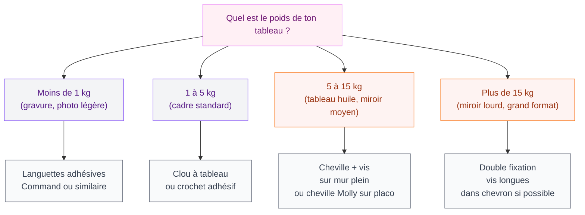
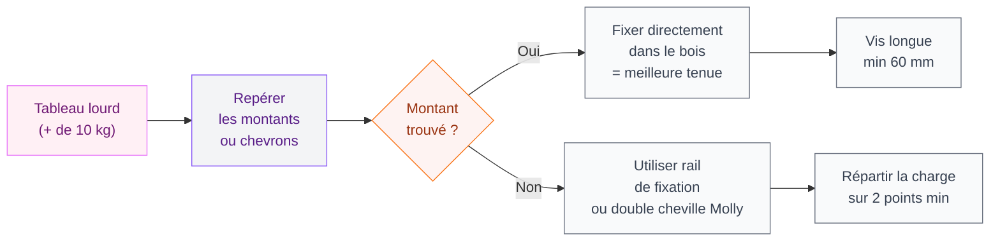
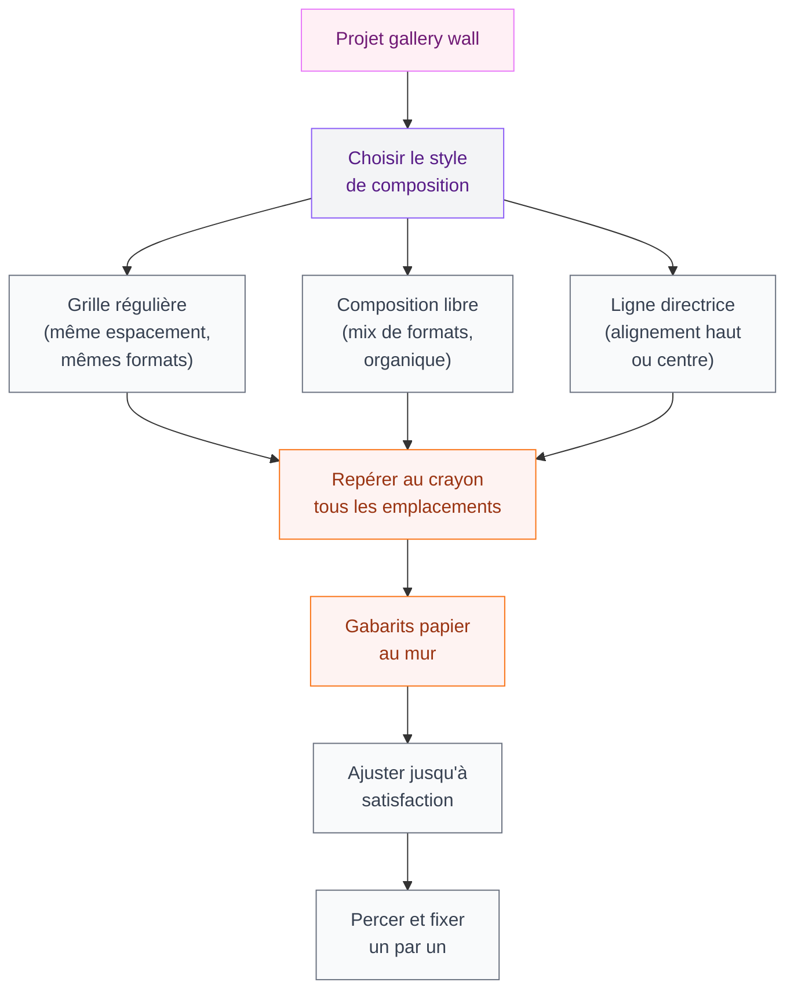

Tu as trouvé le tableau parfait. Tu l'as rapporté à la maison avec soin. Et là, le moment redouté arrive : l'accrochage. Un mauvais centimètre, un clou raté, et c'est la catastrophe - trou de trop, tableau de travers, mur abîmé. Pourtant, accrocher un tableau au mur, ça s'apprend. Et une fois que tu connais les bonnes techniques, tu le fais sereinement, même sur du placo ou du béton.

Dans ce guide, je te donne tout ce dont tu as besoin : choisir la bonne fixation selon ton mur, placer le clou au bon endroit du premier coup, gérer les cadres lourds, et même accrocher sans percer si tu es locataire ou si tu veux éviter les trous. Allez, on attaque !

---

## Connais ton mur avant tout

La première étape, c'est vraiment de savoir à quoi tu as affaire. Tous les murs ne se fixent pas de la même façon, et utiliser la mauvaise cheville, c'est le meilleur moyen de voir ton tableau finir par terre trois jours plus tard.

### Mur plein : béton, brique ou parpaing

C'est le mur le plus solide. Tu peux y fixer des charges importantes sans problème. Pour repérer un mur plein, tape dessus avec les jointures : le son est mat et sourd. Si tu as un détecteur de maçonnerie (un petit outil à 10-15€ en magasin de bricolage), encore mieux.

Pour ce type de mur, tu utilises une **cheville universelle** (les grises standards) avec une vis et bien sûr un perçage au marteau-piqueur ou à la perceuse avec un foret béton. Un seul point de fixation peut supporter jusqu'à 20-30 kg selon la cheville choisie.

### Cloison creuse : placo et BA13

Le son est creux, presque résonnant quand tu tapes. C'est du placo ou une cloison sèche. Ce type de mur est plus délicat : si tu plantes une vis sans cheville adaptée, elle ne tiendra pas.

La solution ici, c'est la **cheville Molly** (à expansion) ou la **cheville à bascule** (dite "papillon"). Une cheville Molly bien posée tient facilement 8-10 kg. Pour un tableau lourd, tu doublewill les points de fixation.

> [!TIP]
> Pour savoir si tu es sur du placo, enfonce doucement une aiguille fine (type épingle à coudre) dans le mur. Si elle s'enfonce sur 1-2 cm facilement, c'est du placo. Si elle bloque immédiatement, c'est du mur plein.

### Mur en bois ou aggloméré

Moins fréquent mais ça arrive dans les vieilles maisons ou les chalets. Une simple vis à bois suffit, sans cheville. Le bois accroche naturellement.

---

## Choisir la bonne fixation selon le poids

Le poids du tableau, c'est vraiment le critère numéro 1 pour choisir ta méthode. Voici un guide rapide :

  

### Les languettes adhésives : la solution sans percer

Les **languettes Command de 3M** sont le produit star pour accrocher sans abîmer les murs. Elles existent en plusieurs capacités : 500g, 1 kg, 2 kg par languette. Pour un cadre de 3 kg, tu en utilises trois ou quatre en répartissant bien la charge.

La clé pour que ça tienne : la surface doit être propre, sèche et non poreuse. Sur du papier peint texturé ou de la peinture qui s'écaille, la languette ne tiendra pas. Sur du mur lisse peint ou du carrelage, ça fonctionne très bien.

Pour les retirer sans casse, tu tires la languette vers le bas en restant bien parallèle au mur - pas en tirant droit vers toi. La colle se décolle progressivement sans emporter la peinture.

> [!WARNING]
> Ne dépasse jamais la capacité maximale indiquée sur le packaging. Si ton cadre fait 2,5 kg, prends des languettes prévues pour 3 kg au minimum. Mieux vaut avoir une marge de sécurité.

### Les crochets et clous spéciaux tableaux

Pour un tableau entre 1 et 10 kg sur un mur plein, le **clou biais à tableau** (ou crochet à tableau) est parfait. Ce petit crochet en métal se pose avec un clou incliné à 45°, ce qui lui donne une tenue bien supérieure à un clou planté droit.

Prix : 2-5€ le lot de 10 chez Leroy Merlin ou Castorama. C'est la solution la plus simple et la plus rapide pour des cadres de taille moyenne.

---

## Placer le clou exactement où il faut

C'est là que beaucoup de gens ratent. Tu sais où mettre le tableau en gros, mais trouver l'emplacement exact du clou, c'est une autre histoire.

### La méthode du gabarit papier

C'est ma technique préférée pour les tableaux avec un fil ou un crochet au dos :

1. Pose le tableau face contre une feuille de papier kraft ou de journal
2. Retrace le contour du cadre au crayon
3. Marque sur le papier l'emplacement exact du fil ou du crochet (en appuyant avec le doigt pour faire une marque)
4. Colle ce gabarit au mur à l'endroit voulu avec du scotch repositionnable
5. Plante ton clou exactement sur la marque
6. Retire le papier
7. Accroche le tableau

Résultat : le tableau est exactement là où tu voulais, du premier coup.

### La règle des deux tiers

Pour des tableaux seuls sur un mur, le centre visuel devrait se situer **à 145-160 cm du sol** - environ à hauteur des yeux d'une personne debout. C'est la règle des musées et des galeries, et elle fonctionne vraiment bien chez soi.

Si tu décores au-dessus d'un canapé ou d'une commode, laisse **10-20 cm** entre le meuble et le bord bas du tableau. Trop près, ça fait étouffé ; trop loin, ça perd la cohérence.

> [!NOTE]
> Pour un mur de tableaux (gallery wall), commence par le tableau central ou le plus grand, et développe autour en laissant 5-10 cm entre chaque cadre. Pose-les d'abord au sol pour tester la composition avant de faire le moindre trou.

### Vérifier l'horizontalité

Un tableau légèrement de travers, ça se voit immédiatement et ça rend fou. Deux solutions simples :

- Un **niveau à bulle** posé sur le haut du cadre après l'accrochage
- L'application **Niveau** sur ton smartphone (elle est déjà installée sur iPhone, et il en existe plein de gratuites sur Android)

Si ton tableau a deux crochets au dos et penche toujours d'un côté, colle un petit morceau de feutre autocollant sous le coin qui monte - ça suffit souvent à corriger un léger déséquilibre.

---

## Accrocher un tableau lourd : les règles à connaître

Un tableau de 15 kg ou plus, un miroir encadré, un grand format - ça mérite une attention particulière. Ce n'est pas le moment d'improviser.

  

### Trouver les montants dans le placo

Derrière une cloison en placo, il y a des montants en métal ou en bois espacés tous les 60 cm environ. Fixer dans un montant, c'est la garantie d'une tenue solide même pour des charges importantes.

Pour les trouver, tu as plusieurs options :
- Un **détecteur de montants** électronique (20-40€, vaut l'investissement)
- La méthode de l'aimant : les montants métalliques attirent un aimant puissant
- La percussion : le son change légèrement au-dessus d'un montant

### Les rails de tableaux : la solution élégante et pratique

Si tu redécores souvent ou si tu as beaucoup de tableaux à accrocher, un **rail de tableau** fixé en haut du mur est une vraie révolution. Tu accroches un rail discret une seule fois (en haut du mur ou en dessous de la corniche), et ensuite tu fais glisser des câbles ou des tiges avec des crochets réglables en hauteur.

Tu peux déplacer tes tableaux à l'infini sans refaire un seul trou. C'est ce qu'utilisent les hôtels et les espaces de coworking design. Ça commence à 30-40€ pour un mètre linéaire chez des marques comme Artiteq ou Picture Hanging Systems.

C'est aussi parfait si tu aimes changer régulièrement ta déco - quelque chose dont on parle d'ailleurs dans notre guide sur les [salons modernes et élégants 2026](/guides/decoration/salons-modernes-et-elegants-2026/), où ce type de flexibilité décorative prend tout son sens.

---

## Trucs et astuces que personne ne te dit

### Coller un bouchon de liège derrière

Tu accroches un tableau et il pend toujours légèrement vers l'avant ? Colle deux petits morceaux de feutre épais ou de bouchon de liège découpé dans les coins inférieurs du cadre. Le tableau reste bien à plat contre le mur et ne laisse plus passer la poussière derrière.

### Marquer l'emplacement sans crayon

Si tu ne veux pas marquer le mur (surtout sur du papier peint), utilise un bout de scotch repositionnable. Tu le colles à l'endroit voulu, tu marques dessus au stylo, tu perces à travers ou juste à côté, puis tu décolle proprement.

### Protéger les murs des frottements

Les cadres en bois ou en métal peuvent rayer la peinture avec le temps. Des petits patins autocollants en feutre (type "patins pour meubles") collés à l'arrière des coins du cadre règlent ça pour quelques centimes.

> [!TIP]
> Tu veux accrocher plusieurs tableaux de formats différents dans une composition murale ? Découpe des gabarits en papier kraft à la taille exacte de chaque cadre, fixe-les au mur avec du scotch et recule pour juger la composition avant de faire le moindre trou. Ça prend 15 minutes et ça évite beaucoup de regrets.

### Réparer un trou raté

Tu as planté ton clou au mauvais endroit ? Pas de panique. Un tube d'**enduit de rebouchage** (1,50-3€ chez Leroy Merlin) suffit pour effacer le trou. Tu remplis, tu laisses sécher, tu ponçes légèrement et tu repasses une touche de peinture. Invisible.

---

## Accrocher sans percer : guide locataire

Tu es en location et ton propriétaire t'a clairement dit "pas de trous" ? Tu as quand même envie de personnaliser ton intérieur et de te sentir chez toi. C'est tout à fait possible, même si la palette d'options se réduit un peu.

  

Les **languettes Command** restent la solution numéro 1 pour les locataires. Elles tiennent jusqu'à 5 kg par lot de languettes si tu en combines plusieurs, et elles se retirent sans laisser de trace sur la peinture (sur des surfaces lisses et en bon état).

Les **bandes velcro adhésives** sont une alternative pour les cadres légers. Tu colles le côté mâle sur le mur, le côté femelle sur le dos du cadre. Chaque bande tient environ 1 à 2 kg selon le modèle.

Enfin, pour les grands formats sans perçage, pense aux **chevalets de présentation** posés au sol - ça fait un effet galerie très tendance, et c'est ce qu'on voit beaucoup dans les intérieurs [style déco française romantique](/guides/decoration/decoration-francaise-idees-et-photos-romantiques/) où l'art trône librement dans l'espace sans être fixé aux murs.

> [!IMPORTANT]
> Avant d'utiliser des languettes adhésives chez un locataire, teste toujours sur une petite zone discrète. Sur certaines peintures anciennes ou papiers peints, le retrait peut quand même arracher la surface. Mieux vaut le savoir avant d'accrocher.

---

## La galerie de tableaux : composer un mur entier

Un mur de cadres bien composé, c'est souvent la pièce la plus personnelle et la plus réussie d'un appartement. Mais ça se prépare.

Pour un résultat cohérent, choisis un point commun entre tes cadres : soit la couleur du passe-partout (tous blancs ou tous noirs), soit le style des cadres (tous bois naturel, tous métal doré), soit le thème des oeuvres. Tu peux mixer des formats complètement différents à partir du moment où ce fil conducteur existe.

La déco minimaliste, par exemple, mise sur peu de cadres mais très bien choisis et bien espacés. Si c'est ton style, notre article sur la [décoration minimaliste : idées et photos faciles](/guides/decoration/decoration-minimaliste-idees-et-photos-faciles/) t'aidera à aller dans ce sens.

Sur un mur de galerie, évite de placer un tableau très lourd (plus de 5 kg) avec seulement des languettes adhésives. Le poids cumulé des cadres et les vibrations liées à l'ouverture des portes peuvent avoir raison des languettes avec le temps. Pour les formats lourds d'une gallery wall, perce franchement.

---

## Sur le meme theme

- [choisir un tableau mural](/guides/decoration/choisir-tableau-mural/)
- [cadre tableau mural végétal](/guides/decoration/choisir-cadre-tableau-mural-vegetal/)

  

## Questions fréquentes

**Quelle hauteur pour accrocher un tableau ?**
Le centre du tableau devrait être à environ 145-160 cm du sol dans la plupart des pièces. Au-dessus d'un canapé, laisse 15-20 cm entre le dossier et le bas du cadre.

  

**Comment savoir combien pèse mon tableau ?**
Pose-le sur une balance de cuisine ou de salle de bain. Si tu n'en as pas, tiens-le à bout de bras 30 secondes : s'il pèse visiblement, compte au moins 3-5 kg.

**Les languettes Command tiennent-elles sur du papier peint ?**
Pas toujours. Sur un papier peint lisse en bon état, ça peut fonctionner, mais le retrait reste risqué. Sur du papier peint texturé ou ancien, évite : l'adhérence est insuffisante et le retrait peut arracher des morceaux.

**Peut-on accrocher un tableau sur du carrelage ?**
Oui, avec des languettes adhésives spécial lisse, ou avec un perçage et des chevilles spéciales carrelage. Le carrelage craque facilement si tu perces trop vite - utilise une perceuse à vitesse réduite sans percussion, et un foret spécial carrelage.

**Comment accrocher un cadre sans crochet au dos ?**
Si le cadre n'a pas de crochet, tu peux visser toi-même des anneaux à piton dans le bois du cadre, puis tendre un fil de tableau entre les deux. Coûte moins de 2€ et prend 5 minutes. Sinon, les supports adhésifs en L (type Command large) existent pour les cadres plats sans crochet.
