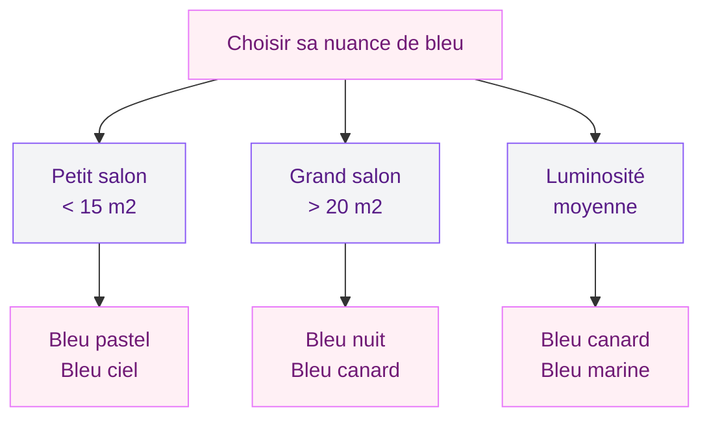
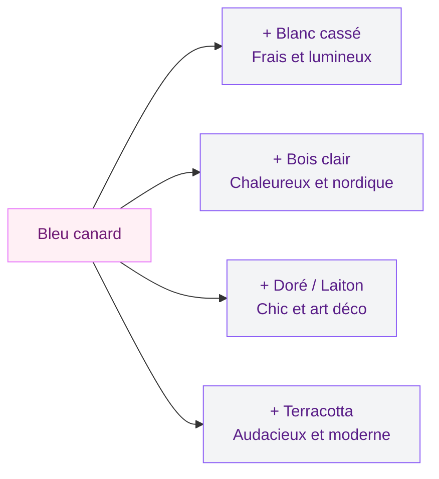
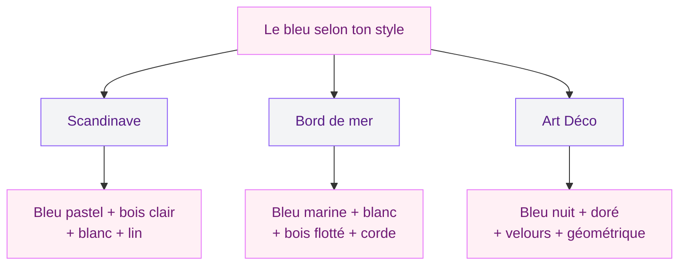

Le bleu, c'est la couleur qu'on adore en théorie mais qu'on hésite toujours à poser chez soi. Trop froid ? Trop intense ? Trop risqué ? Je comprends l'hésitation. Sauf que le bleu, bien dosé, c'est probablement la teinte la plus polyvalente qui existe en déco. Il peut rendre un salon apaisant, sophistiqué, lumineux ou dramatique - tout dépend de la nuance que tu choisis et de comment tu l'associes. Aujourd'hui, je te donne toutes les clés pour oser le bleu dans ton salon sans te tromper.

## Quelle nuance de bleu choisir pour ton salon ?

Tous les bleus ne racontent pas la même histoire. Avant de foncer chez Leroy Merlin, prends deux minutes pour comprendre ce que chaque nuance apporte comme ambiance.

  

### Le bleu canard - l'élégant polyvalent

C'est le bleu qui tire vers le vert, profond et velouté. Il fonctionne dans presque tous les styles et c'est celui qui pardonne le plus. Posé sur un mur d'accent ou sur un canapé en velours, il donne immédiatement du caractère sans écraser la pièce. C'est mon préféré pour les salons qui manquent de personnalité.

En peinture, un bleu canard de qualité se trouve chez Tollens ("Sarcelle" ou "Bleu Paon") autour de 35-45 euros le litre, ou chez Farrow & Ball ("Vardo") pour 85-100 euros le litre si tu veux un rendu mat profond absolument magnifique.

### Le bleu nuit - l'enveloppant

Sombre, dense, presque noir sous certaines lumières. Le bleu nuit crée un effet cocon parfait pour les grands salons qui paraissent froids ou impersonnels. Il absorbe la lumière, donc réserve-le aux pièces qui reçoivent pas mal de lumière naturelle ou associe-le à un bon éclairage d'ambiance.

> [!WARNING]
> Le bleu nuit dans un petit salon mal éclairé va donner une impression de cave. Si ta pièce fait moins de 15 m2 et que tu n'as qu'une fenêtre, limite-toi à un seul pan de mur ou opte pour des accessoires bleu nuit plutôt qu'un mur complet.

### Le bleu ciel et le bleu pastel - la fraîcheur douce

Les bleus clairs apportent une sensation d'espace et de légèreté. Ils marchent très bien dans les petits salons ou les pièces orientées sud qui baignent dans la lumière. L'ambiance est plus décontractée, presque bord de mer. Par contre, seuls sur les murs, ils peuvent vite faire "chambre de bébé" - il faut les ancrer avec des matériaux naturels et des tons chauds.

### Le bleu marine - le classique chic

Plus soutenu que le bleu ciel, moins sombre que le bleu nuit. Le bleu marine, c'est l'entre-deux parfait. Il a un côté preppy et raffiné qui fonctionne super bien en style art déco ou dans un salon avec de belles moulures. Associé à du blanc pur et du laiton doré, le résultat est assez spectaculaire.

## Les meilleures associations de couleurs avec le bleu

Le bleu seul ne fait pas tout. C'est dans la combinaison que la magie opère. Voici les duos et trios qui marchent à chaque fois.

  

### Bleu + blanc : le duo indémodable

On commence par la valeur sure. Bleu et blanc, c'est frais, lumineux, facile à réussir. Ça fonctionne avec n'importe quelle nuance de bleu. Un mur bleu canard avec un canapé blanc cassé et des coussins à rayures ? Tu obtiens un salon qui respire, entre élégance et décontraction. Pour un rendu plus chaleureux, préfère le blanc cassé ou le blanc crème au blanc pur, qui peut rendre l'ensemble un peu clinique.

### Bleu + bois naturel : la chaleur nordique

Si tu aimes le style scandinave, cette association est faite pour toi. Le bois clair (chêne, bouleau, frêne) tempère le côté froid du bleu et apporte cette sensation de confort qu'on aime tant dans les intérieurs du nord. Un meuble TV en chêne clair, un fauteuil en bois et tissu lin, des étagères en pin - le bois crée le pont entre le bleu et le reste de la pièce.

> [!TIP]
> Multiplie les essences de bois clair plutôt que d'en choisir une seule. Un mix de chêne, rotin et bambou donne plus de richesse visuelle qu'un salon où tout est dans le même bois.

### Bleu + doré (ou laiton) : l'élégance maximale

C'est l'association reine du style art déco. Bleu profond (marine ou nuit) combiné à des touches dorées - pieds de lampe en laiton, miroir à cadre doré, table basse avec structure métal doré. Le contraste entre le bleu froid et le doré chaud crée une tension visuelle sublime. Pas besoin de beaucoup de doré, quelques éléments suffisent pour que tout s'éclaire.

Si tu aimes cette direction, jette un oeil à notre guide sur les [idées de décoration art déco](/50-idees-de-decoration-art-deco/) pour pousser le style encore plus loin.

### Bleu + terracotta : le duo audacieux

Plus original et très tendance en ce moment. Le bleu (canard ou marine) associé à la terracotta crée un contraste chaud-froid saisissant. Des coussins terracotta sur un canapé bleu canard, un vase en terre cuite sur une étagère peinte en bleu marine - ça vibre et ça donne de l'énergie à la pièce sans la surcharger. On en parle aussi dans notre article sur les [couleurs du salon 2026](/couleurs-du-salon-2026-palettes-de-murs-et-de-decors/) si tu veux approfondir les palettes tendance.

## Où placer le bleu dans ton salon ?

Tu n'es pas obligée de peindre tous tes murs en bleu pour profiter de cette couleur. Voici les différentes façons de l'intégrer, de la plus engagée à la plus subtile.

  

### Un mur d'accent bleu

C'est le grand classique et c'est efficace. Choisis le mur le plus visible quand tu entres dans la pièce - souvent celui derrière le canapé ou celui face à l'entrée. Un seul mur bleu foncé (canard, marine, nuit) avec les trois autres en blanc chaud transforme radicalement l'ambiance. C'est aussi la solution la plus facile à corriger si tu changes d'avis : un seul mur à repeindre.

### Le canapé bleu, pièce maîtresse

Un canapé en velours bleu canard, c'est une déclaration. C'est souvent le meilleur investissement si tu veux du bleu sans toucher aux murs (pratique quand on est locataire). Chez IKEA, le modèle Kivik avec une housse velours bleu tourne autour de 600-800 euros. Pour du haut de gamme, Made.com ou La Redoute proposent des canapés en velours côtelé bleu entre 900 et 1500 euros. Et si tu veux du sur-mesure, Tediber ou Caravane montent au-dessus de 2000 euros.

### Les rideaux bleus

Les rideaux, c'est la touche de bleu la plus douce. Des rideaux en lin bleu pastel ou bleu gris filtrent la lumière et ajoutent de la couleur sans dominer. Ils créent aussi un joli cadre autour de la fenêtre. Si tu veux éviter les erreurs classiques sur le choix et la pose, consulte notre guide sur les [erreurs de rideaux à ne pas commettre](/erreurs-rideaux/).

> [!NOTE]
> Les rideaux en lin bleu foncent légèrement au lavage. Achète une nuance un tout petit peu plus claire que ce que tu vises et lave-les une fois avant de les accrocher pour stabiliser la teinte.

### Les accessoires : coussins, tapis, objets déco

C'est l'option "zéro risque". Tu gardes tes murs neutres, ton canapé classique, et tu amènes le bleu par petites touches : coussins bleu marine, tapis bleu et crème, vases en céramique bleue, bougeoirs, cadres. L'avantage, c'est que tu peux tester, ajuster, changer de saison en saison. C'est aussi la porte d'entrée idéale si tu n'es pas sure de vouloir vivre avec du bleu au quotidien.

## Quel style de déco avec du bleu ?

Le bleu n'est pas réservé à un seul style. Voici les trois qui s'en emparent le mieux.

  

### Style scandinave

Bleu pastel ou bleu grisé + bois clair + blanc + lin. L'ambiance est douce, lumineuse, décontractée. On mise sur des formes simples, des meubles aux lignes droites, et on laisse respirer l'espace. Le bleu sert de touche de couleur dans un décor majoritairement neutre.

### Style bord de mer

Bleu ciel, bleu marine, blanc pur, bois flotté, corde, matières naturelles. C'est la palette "vacances éternelles". On peut aller du très sobre (un seul élément bleu dans un décor blanc et bois) au très affirmé (murs bleu ciel, voilages blancs, mobilier bois brut). Pour approfondir ce style, regarde notre article sur la [décoration maritime moderne](/decoration-maritime-50-photos-et-idees-modernes/).

### Style art déco

Bleu nuit ou bleu marine + doré + velours + motifs géométriques. On joue sur le contraste, la richesse des matières, les reflets. C'est le style le plus "glamour" du bleu. Un canapé en velours bleu nuit, un miroir soleil doré, un papier peint à motifs géométriques bleu et or - tu obtiens un salon qui en impose.

## Les 5 erreurs à éviter avec le bleu dans le salon

  

### 1. Trop de bleu partout

Murs bleus, canapé bleu, rideaux bleus, tapis bleu. On finit dans un aquarium. Le bleu a besoin de respirer, d'être contrebalancé par des neutres chauds et des matières naturelles. Règle simple : le bleu ne devrait pas dépasser 40% des surfaces visibles de la pièce.

### 2. Choisir un bleu trop électrique

Le bleu Klein, le bleu roi très vif - sur un écran Pinterest, c'est tentant. Dans un salon de 20 m2 où tu passes tes soirées, c'est fatigant pour les yeux. Préfère toujours des bleus légèrement sourds, avec une pointe de gris ou de vert. Ils vivent mieux au quotidien.

### 3. Oublier l'éclairage

Le bleu absorbe la lumière, surtout les teintes foncées. Si tu peins un mur en bleu nuit, prévois un éclairage adapté : appliques murales, lampadaire d'angle, guirlande lumineuse. Sans ça, ton beau mur bleu va disparaître le soir et ta pièce va sembler plus petite.

> [!CAUTION]
> Évite les ampoules à lumière blanche froide (6000K) avec du bleu foncé. Le résultat est sinistre. Choisis des ampoules blanc chaud (2700-3000K) qui réchauffent le bleu et créent une ambiance cosy.

### 4. Associer le bleu avec du gris froid

Bleu + gris, ça peut marcher, mais uniquement avec un gris chaud (greige, gris tourterelle). Le gris souris ou le gris anthracite froid combiné au bleu donne un salon triste et sans vie. Si tu veux du gris, ajoute un troisième élément chaud (bois, laiton, ocre) pour équilibrer.

### 5. Ignorer les échantillons

Une couleur bleu sur un écran et cette même couleur sur ton mur, ce n'est jamais pareil. La lumière de ta pièce, l'orientation, le revêtement de sol - tout influence le rendu. Commande systématiquement des échantillons et teste-les sur place avant de te lancer. Deux euros d'échantillon peuvent te sauver de 200 euros de peinture à refaire.

## Sur le meme theme

- [salon brun](/salons-bruns-idees-et-images/)

## FAQ - Le bleu dans le salon

### Le bleu canard, c'est encore tendance en 2026 ?

Oui, et il a de beaux jours devant lui. Le bleu canard est devenu un classique de la déco. Il ne dépend plus des tendances saisonnières - c'est une couleur qui a trouvé sa place comme le gris ou le beige l'ont fait avant elle. Tu peux y aller les yeux fermés.

### Comment réchauffer un salon peint en bleu ?

Le bois, le rotin et les matières naturelles sont tes meilleurs alliés. Ajoute un tapis en jute ou en sisal, des coussins en lin écru, un plaid en laine. Côté couleur, la moutarde, la terracotta et le doré réchauffent instantanément un bleu froid. En éclairage, privilégie les ampoules blanc chaud (2700K).

### Peut-on peindre son plafond en bleu ?

Techniquement oui, et le résultat peut être bluffant dans un salon avec une belle hauteur sous plafond (2,70 m et plus). Un plafond bleu ciel donne une impression de ciel ouvert assez poétique. En bleu foncé, ça crée un effet cocon très enveloppant. En revanche, si ton plafond est bas (2,50 m ou moins), ça va écraser la pièce. Mieux vaut garder le blanc et reporter le bleu sur les murs.

### Quel bleu pour un salon orienté nord ?

Les salons orientés nord reçoivent une lumière froide et bleutée. Si tu ajoutes du bleu par dessus, tu risques d'amplifier cette froideur. Oriente-toi vers des bleus chauds : bleu canard (qui a du vert), bleu pétrole, bleu lavande. Évite les bleus grisés ou le bleu glacier, qui vont accentuer le côté froid. Et compense avec des matières chaudes - bois, laine, velours.

### Bleu foncé ou bleu clair pour un petit salon ?

Contrairement aux idées reçues, un bleu foncé sur un seul mur d'accent peut donner de la profondeur à un petit salon et lui donner l'air plus grand. Le secret, c'est de ne l'appliquer que sur un seul mur et de garder le reste clair. Le bleu pastel sur tous les murs marche aussi, à condition de rester dans des tons très doux et de compenser avec un bon éclairage.
