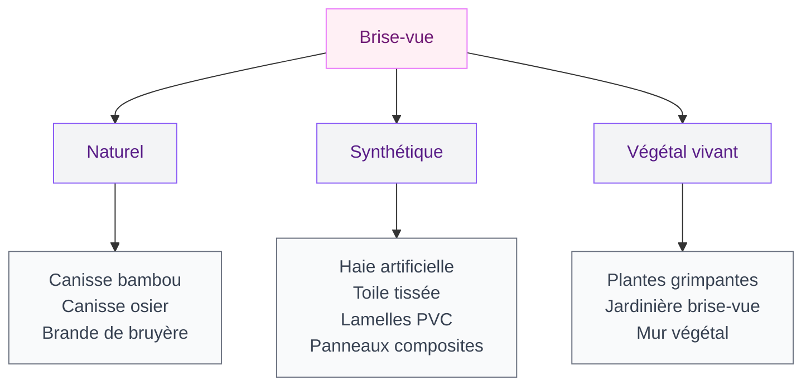
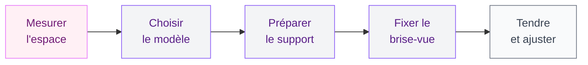

Tu en as assez de croiser le regard de ton voisin chaque fois que tu prends ton café sur le balcon ? Le brise-vue est la solution la plus simple pour retrouver un peu d'intimité en extérieur - que ce soit sur un petit balcon parisien, une terrasse en rez-de-jardin ou le long d'une clôture. Mais entre les canisses en bambou, les haies artificielles, les toiles tissées et les plantes grimpantes, le choix est large et les écarts de prix vont du simple au décuple. Voici mon comparatif pour t'aider à choisir le modèle qui correspond à ta situation, ton budget et tes envies.

## Qu'est-ce qu'un brise-vue et à quoi ça sert ?

Un brise-vue - on dit aussi pare-vue ou écran d'occultation - est un dispositif que l'on fixe sur un garde-corps, une clôture ou une structure porteuse pour bloquer la vue depuis l'extérieur. Son rôle premier, c'est de créer de l'intimité. Mais selon le modèle choisi, il peut aussi couper le vent, filtrer le soleil, réduire le bruit ambiant et habiller un espace extérieur qui manque de caractère.

  

On le retrouve dans trois configurations principales :

- **Sur un balcon** - fixé au garde-corps ou à la rambarde, souvent en toile ou en canisse légère
- **Sur une terrasse** - posé contre un mur mitoyen, une clôture basse ou une structure autoportante
- **En limite de jardin** - fixé à des poteaux ou intégré dans une clôture existante, parfois remplacé par des plantes grimpantes

> [!NOTE]
> Le terme "brise-soleil" désigne autre chose : c'est un élément architectural fixe ou orientable (lames horizontales ou verticales) conçu pour bloquer les rayons du soleil sans supprimer la vue. Popularisé par Le Corbusier dans ses bâtiments modernes, le brise-soleil est un outil de confort thermique, pas un pare-vue. Ne confonds pas les deux si tu cherches de l'intimité.

## Les grandes familles de brise-vue

Le marché propose des dizaines de références, mais elles se regroupent en quelques catégories bien distinctes. Chacune a ses points forts, ses limites et ses usages idéaux.

  

### Les brise-vue naturels

**La canisse en bambou** reste un grand classique. Légère, peu coûteuse (5 à 12 euros/m), elle se fixe en quelques minutes avec du fil de fer sur un balcon ou une clôture. Son occultation est partielle (entre 60 % et 80 % selon l'épaisseur des tiges), ce qui laisse passer un peu de lumière et de vent. Inconvénient : sa durée de vie est limitée à 3 ou 4 ans en extérieur. Le bambou se fissure, grisaille et finit par se casser sous l'effet du gel et du soleil.

**La canisse en osier** offre une esthétique plus rustique et une occultation similaire. Elle est un cran au-dessus en terme de solidité, mais reste sensible à l'humidité. Compte 8 à 18 euros/m selon la qualité.

**La brande de bruyère** est un écran dense fabriqué à partir de tiges de bruyère compressées. Son occultation est excellente (jusqu'à 95 %) et son aspect très naturel s'intègre bien dans un jardin. C'est aussi un bon coupe-vent. Comptez 12 à 25 euros/m pour une épaisseur correcte (4 cm minimum). Sa durée de vie tourne autour de 5 à 8 ans.

> [!TIP]
> Pour prolonger la durée de vie d'une canisse en bambou, applique une couche de saturateur bois incolore à la pose. Ça ralentit le grisaillement et le dessèchement, et tu gagnes facilement un à deux ans.

### Les brise-vue synthétiques

**La haie artificielle** imite le feuillage naturel avec des feuilles en plastique fixées sur un treillis souple. L'occultation peut atteindre 100 %, l'entretien est quasi nul et la durée de vie dépasse souvent 10 ans avec un traitement anti-UV. Prix : 15 à 35 euros/m. Les meilleurs modèles (type Jet7Garden ou France Green) sont bluffants de réalisme - les premiers prix, beaucoup moins.

**La toile tissée** (aussi appelée brise-vue en toile HDPE) est un tissu synthétique serré, généralement en polyéthylène haute densité. C'est le choix le plus répandu pour les balcons en ville. Elle se découpe, se tend facilement, résiste au vent et se lave au jet. Occultation de 80 % à 95 % selon le grammage (choisir 220 g/m2 minimum). Prix : 5 à 15 euros/m. IDMarket et Blooma proposent des gammes accessibles et correctes.

**Les lamelles PVC** s'insèrent dans un grillage rigide existant, à la verticale. C'est une solution propre et durable (15 ans et plus), qui offre une occultation totale. Le rendu est plus "clôture de lotissement" que décoratif, mais c'est efficace et facile à poser. Compte 8 à 20 euros/m.

**Les panneaux composites** (bois-plastique) sont le haut de gamme des brise-vue. Ils imitent le bois, ne pourrissent pas, ne se déforment pas, et durent facilement 20 ans. Ils s'intègrent dans une structure poteaux-rails en aluminium. Prix : 30 à 50 euros/m - un investissement, mais la finition est impeccable.

### Les brise-vue végétaux vivants

**Les plantes grimpantes** sont la solution la plus esthétique et la plus écologique. Un jasmin étoilé, un chèvrefeuille, une clématite ou un lierre planté au pied d'un treillage forme un écran dense en une à deux saisons. L'avantage : le rendu est vivant, il évolue avec les saisons, attire les pollinisateurs et améliore la qualité de l'air. L'inconvénient : ça demande de la patience et un minimum d'entretien (taille, arrosage, tuteurage).

Pour aller plus loin sur le sujet, mon guide sur les [jardins verticaux](/jardins-verticaux-de-40-photos-dinspiration-verte/) donne plein d'idées pour créer un mur végétal qui fait aussi office de brise-vue.

**La jardinière brise-vue** combine un bac planté et un treillage intégré. C'est la solution idéale pour les terrasses et les balcons, là où on ne peut pas planter en pleine terre. Les bambous non traçants (Fargesia), les graminées et les lauriers-tin sont les essences les plus utilisées. Budget : 80 à 200 euros par jardinière complète (bac + plantes + support).

> [!WARNING]
> Sur un balcon en étage, vérifie la charge maximale autorisée avant d'installer des jardinières lourdes. Un bac de 1 mètre rempli de terreau humide peut peser 60 à 80 kg. Renseigne-toi auprès de ton syndic ou consulte le règlement de copropriété.

## Comparatif des prix et de la durabilité

Voici un récapitulatif pour comparer rapidement les options :

  

| Type de brise-vue | Prix indicatif au m | Occultation | Durée de vie | Entretien |
|---|---|---|---|---|
| Canisse bambou | 5 à 12 euros | 60-80 % | 3-4 ans | Faible |
| Canisse osier | 8 à 18 euros | 60-80 % | 4-5 ans | Faible |
| Brande de bruyère | 12 à 25 euros | 85-95 % | 5-8 ans | Nul |
| Toile HDPE | 5 à 15 euros | 80-95 % | 5-8 ans | Lavage |
| Haie artificielle | 15 à 35 euros | 90-100 % | 10-15 ans | Nul |
| Lamelles PVC | 8 à 20 euros | 100 % | 15+ ans | Nul |
| Panneaux composites | 30 à 50 euros | 100 % | 20+ ans | Nul |
| Plantes grimpantes | 10 à 30 euros/plant | Variable | Pérenne | Taille, arrosage |

> [!IMPORTANT]
> Les prix ci-dessus sont des fourchettes constatées en 2026 sur les sites IDMarket, Leroy Merlin et Castorama. Pour les grandes longueurs (plus de 10 mètres), acheter en rouleau plutôt qu'au mètre linéaire réduit le coût de 15 à 30 %.

## Comment choisir le bon brise-vue pour ta situation

Le meilleur brise-vue dépend de trois critères : où tu veux le poser, ce que tu attends de lui, et combien tu es prêt à investir.

  

### Pour un balcon en ville

Privilégie la toile HDPE ou la haie artificielle souple. Ces deux options sont légères, faciles à fixer avec des colliers de serrage, et supportent bien le vent. La toile se lave au jet quand elle noircit et se change en 10 minutes. Si tu veux un rendu plus vivant, une jardinière avec des bambous Fargesia ou des graminées hautes fait un écran naturel en quelques mois.

### Pour une terrasse en rez-de-jardin

Tu as plus de possibilités. Un panneau composite ou une haie artificielle haute densité offrent un écran total et durable sans entretien. Si tu préfères le végétal, une haie mixte (photinia + laurier) plantée en bac ou en pleine terre forme un brise-vue dense en 2 à 3 ans. Pour une solution rapide et temporaire, la brande de bruyère ou les canisses font le job.

Tu cherches aussi à te protéger du soleil ? Combine ton brise-vue avec une solution d'ombrage - j'en parle en détail dans mon guide sur [comment ombrager ta terrasse](/ombrager-terrasse/).

### Pour une clôture de jardin

Les lamelles PVC dans un grillage rigide sont le choix le plus pratique. Si tu vises un rendu haut de gamme, les panneaux composites ou les claustras bois sont plus esthétiques mais aussi plus chers. Les plantes grimpantes sur un treillage ou un grillage transforment une clôture banale en mur végétal vivant - la solution la plus belle à long terme.

Pour les projets de pergola végétalisée le long d'une limite de propriété, regarde aussi le guide sur [la pergola bioclimatique](/la-pergola-bioclimatique-lalliance-parfaite-entre-esthetique-et-confort/) qui combine ombrage et intimité.

## Poser un brise-vue soi-même : les étapes

La pose varie selon le type de brise-vue, mais le principe reste simple pour la plupart des modèles.

  

### Brise-vue souple (toile, canisse, haie artificielle)

1. **Mesure** la longueur et la hauteur de la zone à couvrir
2. **Déroule** le rouleau le long du support (garde-corps, grillage, clôture)
3. **Fixe** avec des colliers de serrage en nylon tous les 20 à 30 cm - en haut, au milieu et en bas
4. **Tends** bien pour éviter les poches de vent
5. **Découpe** l'excédent avec un cutter ou des ciseaux

Temps de pose : 30 minutes à 1 heure pour un balcon standard de 3 à 5 mètres.

### Panneaux rigides (composite, PVC, bois)

La pose de panneaux rigides demande un peu plus de matériel : des poteaux à sceller ou à visser, des rails de fixation, un niveau et une perceuse. Si tu pars de zéro, compte une demi-journée à deux pour une clôture de 10 mètres. Pour une pose impeccable, un sol bien de niveau et des poteaux parfaitement d'aplomb font toute la différence.

> [!TIP]
> En copropriété, la couleur extérieure du brise-vue peut être imposée par le règlement. Vérifie avant d'acheter - certains syndics exigent une teinte uniforme (souvent gris, taupe ou vert foncé) sur tous les balcons de l'immeuble.

## Entretien et durée de vie : ce qui dure et ce qui ne dure pas

Les brise-vue synthétiques (toile, haie artificielle, PVC, composite) demandent très peu d'entretien. Un coup de jet d'eau une ou deux fois par an suffit à enlever la poussière et les dépôts verts. Les modèles avec traitement anti-UV conservent leur couleur beaucoup plus longtemps que les premiers prix.

Les brise-vue naturels (canisse, brande, osier) vieillissent plus vite. Le bambou sèche et se fissure, la bruyère se tasse, l'osier noircit. Leur durée de vie réelle est de 3 à 5 ans en zone exposée (plein sud, bord de mer, région venteuse). C'est le prix à payer pour un rendu naturel et un budget d'entrée modeste.

Les brise-vue végétaux vivants durent le plus longtemps - une haie bien entretenue ou un jasmin grimpant peut vivre des dizaines d'années. Mais ils demandent un suivi régulier : taille au moins deux fois par an, arrosage en période sèche, traitement ponctuel contre les parasites.

---

Le brise-vue parfait n'existe pas de façon universelle. Tout dépend de ton espace, de ton budget et du rendu que tu recherches. La bonne nouvelle, c'est que même les solutions les plus économiques (une toile HDPE à 5 euros le mètre) transforment immédiatement un balcon ou une terrasse en coin d'intimité. Commence par la version simple, teste, et monte en gamme si tu sens le besoin d'un résultat plus durable ou plus esthétique.

## Sur le meme theme

- [tableau planning et pense-bête](/choisir-tableau-planning-pense-bete/)
- [tapis logo personnalisé](/choisir-tapis-logo-personnalise/)

## FAQ

### Quel brise-vue choisir pour un balcon exposé au vent ?

Opte pour une toile HDPE avec un grammage d'au moins 220 g/m2. La toile laisse passer une partie du vent au lieu de le bloquer entièrement (ce qui évite l'effet voile qui arrache le brise-vue). Fixe-la avec des colliers tous les 20 cm et tends-la bien. Évite les canisses en bambou qui se cassent sous les rafales et les haies artificielles denses qui font prise au vent.

### Est-ce qu'il faut une autorisation pour poser un brise-vue ?

Sur un balcon en copropriété, le règlement impose souvent un modèle ou une couleur précise. Vérifie auprès de ton syndic avant d'acheter. En maison individuelle, un brise-vue fixé sur une clôture existante ne nécessite pas de déclaration. Par contre, si tu construis une clôture ou un mur pour le supporter, une déclaration préalable en mairie peut être requise au-delà de 2 mètres de hauteur.

### Quelle est la hauteur idéale pour un brise-vue ?

Pour un balcon, la hauteur du garde-corps suffit (environ 1 m à 1,10 m). Pour une terrasse ou un jardin, vise 1,50 m à 1,80 m pour bloquer la vue depuis le niveau du sol chez les voisins. Au-delà de 2 mètres, certaines communes imposent une déclaration préalable ou un permis - renseigne-toi en mairie.

### Canisse en bambou ou toile synthétique : que choisir ?

La canisse en bambou coûte moins cher à l'achat (5 à 12 euros/m) et offre un rendu naturel. Mais elle dure 3 à 4 ans maximum et son occultation est partielle. La toile synthétique coûte le même prix, dure 5 à 8 ans, offre une meilleure occultation et se lave facilement. Sur un balcon en ville, la toile est généralement le meilleur rapport qualité-prix. Dans un jardin, la canisse a plus de charme.

### Comment fixer un brise-vue sur un garde-corps en verre ?

Les colliers de serrage classiques ne fonctionnent pas sur du verre. Utilise des ventouses à crochet (charge 2 à 5 kg) ou des pinces à verre spécialisées que tu trouves en quincaillerie. Certains modèles de toile HDPE se vendent avec un système d'oeillets qui permet de tendre le brise-vue à l'aide de tendeurs élastiques fixés au sol et au plafond, sans toucher le verre.
