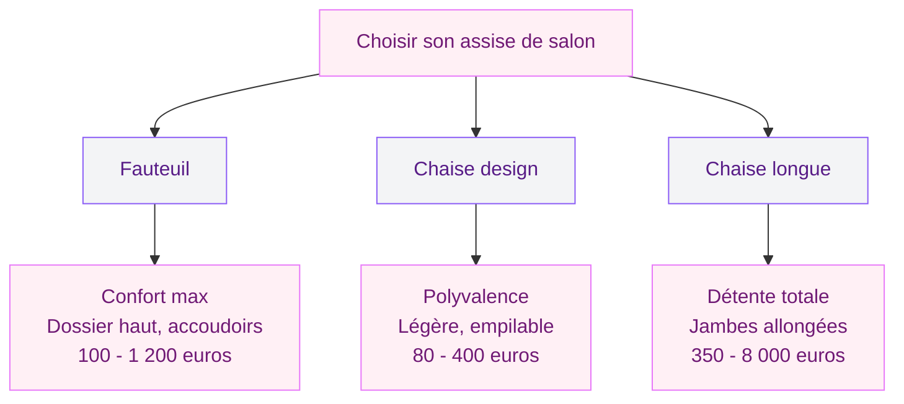
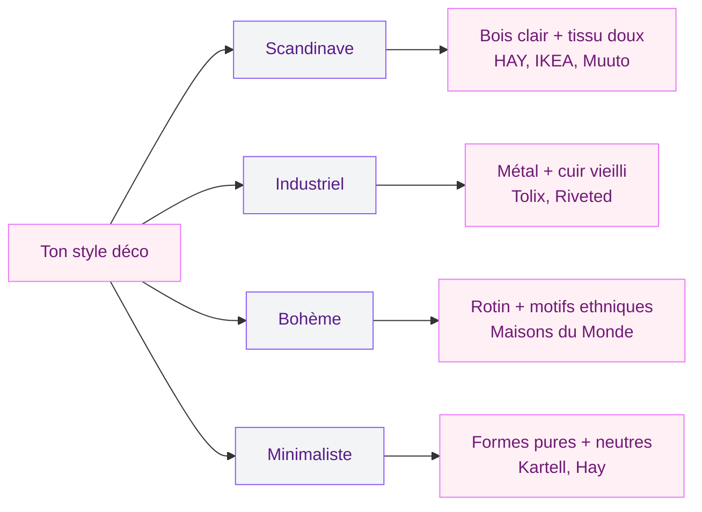

Tu passes des heures sur ta chaise de salon sans y penser, et pourtant c'est elle qui fait la différence entre un moment de détente et un mal de dos qui s'installe. Que tu cherches un fauteuil cocooning pour tes soirées Netflix, une chaise design qui donne du style à ta pièce ou une chaise longue pour lire les pieds en l'air, il y a des règles simples à suivre pour ne pas te planter.

J'ai testé pas mal de modèles et appris à mes dépens - mon premier fauteuil, magnifique en photo, était trop bas, trop mou, impossible à quitter sans rouler sur le côté. Je te partage tout ici pour que tu fasses le bon choix du premier coup.

## Fauteuil, chaise design ou chaise longue : quel type te correspond ?

Commence par définir ce que tu attends vraiment de ton assise. Ce n'est pas la même chose de chercher une chaise pour dîner confortablement, un fauteuil pour te lover avec un bouquin ou une chaise longue pour allonger les jambes après une grosse journée.

  

### Le fauteuil classique : confort et présence

Le fauteuil de salon, c'est la pièce maîtresse : il occupe de la place, attire le regard et donne le ton de ta déco. On parle d'une assise avec accoudoirs, dossier enveloppant et souvent un coussin généreux.

Côté budget, l'écart est grand. Le Poäng IKEA reste une référence à environ 100 euros. Miliboo propose des fauteuils scandinaves entre 250 et 500 euros. Et pour investir dans une pièce qui dure vingt ans, le fauteuil Prouvé Standard de Vitra tourne autour de 1 200 euros - un objet d'art autant qu'un siège.

> [!TIP]
> Avant d'acheter un fauteuil en ligne, mesure l'espace disponible en incluant la zone de recul. Un fauteuil inclinable a besoin de 15 à 20 cm derrière lui pour fonctionner.

### La chaise design : style et polyvalence

Si ton salon est aussi ta salle à manger, la chaise design est ton alliée. Elle est plus légère, se déplace facilement, et peut servir à table comme en appoint devant la télé. Les modèles empilables te font gagner de la place quand tu ne les utilises pas.

Les références du genre : la chaise DSW de chez Vitra (environ 400 euros pour l'originale, 80 à 120 euros pour une reproduction chez 4-Pieds). La chaise Tip Ton de Vitra (autour de 300 euros) est géniale pour son système de bascule vers l'avant, parfait si tu travailles aussi depuis ton salon.

### La chaise longue : le luxe au quotidien

La chaise longue combine une assise avec un appui pour les jambes. Contrairement à ce qu'on croit, certains modèles compacts se glissent dans un coin du salon sans problème.

L'icône, c'est la Eames Lounge Chair de Herman Miller / Vitra (6 000 à 8 000 euros pour l'originale). Des alternatives existent : Miliboo entre 400 et 700 euros, Maisons du Monde à partir de 350 euros.

## Les critères techniques à vérifier avant d'acheter

Le design c'est bien, mais une chaise de salon, tu vas t'asseoir dessus des centaines de fois par an. Autant qu'elle soit bien construite.

  

### La hauteur d'assise : le chiffre clé

La hauteur d'assise idéale se situe entre 42 et 48 cm pour une chaise classique, et entre 38 et 42 cm pour un fauteuil bas. Si tu mesures moins de 1,65 m, vise le bas de la fourchette. Si tu fais plus de 1,80 m, monte vers 48 cm minimum.

C'est un détail qui change tout au niveau du confort des genoux et du bas du dos. Un siège trop haut, tes pieds ne touchent plus le sol, la circulation se coupe. Trop bas, tes genoux remontent et tu forces sur le dos pour te lever.

> [!WARNING]
> Les dimensions données sur les sites e-commerce mènent souvent à confusion : "hauteur" peut désigner la hauteur totale du meuble (avec dossier) et non l'assise. Vérifie bien le schéma technique ou contacte le service client avant de commander.

### La profondeur d'assise : le piège caché

La profondeur d'assise doit permettre à ton dos de toucher le dossier pendant que tes pieds restent à plat au sol. En général, entre 40 et 50 cm, c'est bon pour la plupart des gabarits. Plus profond que 50 cm, tu risques de te retrouver le dos dans le vide ou de devoir ajouter un coussin dans le creux - pas idéal.

### Les matériaux : bois, métal, plastique

Le choix du matériau impacte le poids, la durabilité et l'entretien de ta chaise.

- **Le bois massif** (chêne, hêtre, noyer) : robuste, chaleureux, s'embellit avec le temps. Compte 200 euros et plus pour une chaise solide. À entretenir avec une huile ou un vernis tous les 2-3 ans.
- **Le métal** (acier, aluminium) : léger, contemporain, facile à nettoyer. Les structures métal se trouvent à partir de 100 euros. Attention aux modèles trop fins qui peuvent plier sous des poids importants.
- **Le plastique/polypropylène** : économique, léger, facile à nettoyer. Les chaises en polypropylène type Kartell Masters tournent autour de 70 euros (reproduction) à 300 euros (originale). Parfait pour les familles avec enfants.

> [!NOTE]
> Le rotin et l'osier sont aussi de bonnes options pour un salon - ils apportent un côté naturel et détente. Si cette matière te tente, jette un oeil à notre guide sur [le rotin et l'osier](/guides/decoration/rotin-osier/) pour tout savoir sur l'entretien et les styles.

### Le revêtement : tissu, cuir ou simili ?

Pour l'assise et le dossier, trois grandes familles de revêtements s'affrontent :

- **Tissu** (coton, lin, velours) : doux, vaste choix de coloris. Le velours est très tendance en 2026. Budget : 150 à 600 euros selon la qualité. Inconvénient : les taches.
- **Cuir véritable** : noble, se patine avec le temps. Compte au moins 500 euros pour un fauteuil en cuir correct. Entretien avec un lait nourrissant deux fois par an.
- **Simili cuir / PU** : facile à nettoyer, prix abordable (100 à 300 euros). Inconvénient : peut se craqueler au bout de 3 à 5 ans avec une utilisation intensive.

## Adapter ta chaise à ton style déco

Ta chaise de salon ne vit pas en isolation - elle dialogue avec le canapé, la table basse, les murs. Voici comment créer une cohérence visuelle sans que tout soit assorti à l'identique (ce qui serait un peu ennuyeux).

  

### Style scandinave

Bois clair (bouleau, frêne), lignes épurées, couleurs douces (blanc cassé, gris perle, bleu pastel). Le fauteuil Poäng d'IKEA est l'archétype de ce style. Pour monter en gamme, regarde les marques danoises comme HAY (fauteuil About A Lounge, environ 600 euros) ou Muuto.

### Style industriel

Structures métal noir ou brut, cuir vieilli, bois recyclé. Les chaises de type "Tolix" (la A-Chair originale autour de 300 euros, les copies à partir de 50 euros) sont parfaites pour ce look. Si tu veux approfondir ce style dans ton intérieur, notre guide sur les [salons modernes et élégants 2026](/guides/decoration/salons-modernes-et-elegants-2026/) te donnera des pistes d'association.

### Style bohème

Rotin, osier, macramé, couleurs chaudes et motifs ethniques. Un fauteuil en rotin tressé type paon (entre 200 et 450 euros chez Maisons du Monde) apporte immédiatement ce côté détente et voyageur.

### Style contemporain minimaliste

Formes géométriques, monochromes, peu de décoration. Les chaises en polypropylène aux lignes pures (type Kartell ou Hay) s'intègrent naturellement. Les teintes neutres - noir, blanc, gris anthracite - sont tes alliées. Pour plus d'inspiration sur ce registre, va voir notre article sur la [décoration minimaliste](/guides/decoration/decoration-minimaliste-idees-et-photos-faciles/).

## Où acheter : mes bonnes adresses par budget

Voici mon classement des enseignes selon ton budget et ce que tu cherches.

  

### Budget serré (moins de 200 euros)

- **IKEA** : le Poäng (100 euros), le Strandmon (300 euros en promo régulièrement à 200), les chaises Odger en plastique recyclé (75 euros). Large choix, livraison possible.
- **Conforama** : fauteuils basiques entre 80 et 180 euros. La qualité varie, teste en magasin.
- **4-Pieds** : spécialiste de la chaise, beaucoup de modèles design entre 50 et 200 euros. Les reproductions de classiques (DSW, DAW) y sont correctes.

### Budget moyen (200 à 600 euros)

- **Miliboo** : des fauteuils et chaises de salon au design contemporain. Les modèles en velours tournent autour de 300-400 euros, livrés en 2-3 semaines.
- **La Redoute / AM.PM** : des fauteuils en rotin ou tissu entre 250 et 500 euros. La qualité s'est beaucoup améliorée ces dernières années.
- **Maisons du Monde** : un large choix entre 200 et 500 euros avec des styles variés (bohème, vintage, contemporain).

### Budget premium (plus de 600 euros)

- **Mobilier de France** : des pièces de designers reconnus, fauteuils entre 600 et 2 000 euros. Conseil en magasin.
- **Vitra / Herman Miller** (via DWR ou revendeurs) : les icônes du design. La Eames Lounge Chair, le fauteuil Prouvé - des pièces qui traversent les décennies.
- **BoConcept** : fauteuils personnalisables (choix du tissu, de la couleur, des pieds). Compte 800 à 1 500 euros pour un fauteuil.

> [!TIP]
> Les soldes de janvier et de juin sont les meilleurs moments pour acheter du mobilier design. Les réductions peuvent atteindre 30 à 40% chez Miliboo, La Redoute ou BoConcept. En dehors des soldes, surveille les ventes privées sur Veepee et Westwing.

## Entretien : garder ta chaise belle longtemps

Un bon entretien, c'est ce qui fait la différence entre une chaise qui dure 5 ans et une qui en dure 15.

  

### Tissu et velours

Passe l'aspirateur sur l'assise une fois par semaine (embout brosse douce). Pour les taches fraîches, tamponne avec un chiffon humide et un peu de savon de Marseille - ne frotte jamais. Les housses amovibles lavables en machine, c'est un vrai plus : vérifie ce point avant d'acheter.

### Cuir et simili

Pour le cuir : un chiffon humide chaque semaine et un lait nourrissant tous les 6 mois. Évite les produits chimiques agressifs. Pour le simili, un simple coup d'éponge suffit, mais évite la chaleur directe (ne place pas ta chaise à côté d'un radiateur).

### Bois et métal

Le bois se nettoie avec un chiffon légèrement humide. Une huile pour bois une fois par an ravive la teinte et protège des taches. Le métal se nettoie à l'eau savonneuse - sèche-le bien pour éviter les traces d'oxydation.

## Petit salon : comment intégrer une chaise sans étouffer l'espace

Si ton salon fait moins de 15 m2, quelques règles simples fonctionnent bien.

Privilégie les chaises à pieds fins et apparents plutôt que les fauteuils massifs posés au sol. Quand tu vois le sol sous le meuble, ton oeil perçoit plus d'espace. Les modèles transparents (type chaise Ghost de Kartell, environ 300 euros) sont malins : ils existent sans s'imposer visuellement.

Les poufs et fauteuils poire sont de bonnes options d'appoint - ils se rangent facilement et prennent peu de place visuelle. Un pouf en velours chez La Redoute tourne autour de 60 à 120 euros.

Pour plus d'astuces, notre guide sur la [décoration petit salon](/guides/decoration/decoration-petit-salon/) regorge d'idées applicables.

> [!NOTE]
> Dans un petit salon, une seule "vraie" assise supplémentaire suffit en plus du canapé. Mieux vaut une pièce de qualité bien choisie que trois sièges encombrants qui gênent la circulation.

## Sur le meme theme

- [salon brun](/guides/decoration/salons-bruns-idees-et-images/)

## FAQ

### Quelle est la meilleure chaise de salon pour le mal de dos ?

Pour le mal de dos, choisis un fauteuil avec un soutien lombaire marqué et une assise ni trop molle ni trop dure. Les modèles ergonomiques de chez HAG ou Stressless (à partir de 800 euros) sont conçus pour ça. Si ton budget est plus serré, un fauteuil classique avec un coussin lombaire rapporté (20 à 40 euros chez Tempur ou Amazon) fait déjà une grosse différence.

### Fauteuil ou chaise longue : que choisir pour un petit espace ?

Pour un petit espace, le fauteuil compact gagne à tous les coups. Une chaise longue, même compacte, prend au minimum 150 cm de longueur au sol. Un fauteuil bien choisi occupe 70 à 90 cm de profondeur. Si tu tiens à la chaise longue, opte pour un modèle pliable ou à dossier réglable que tu peux replier quand tu ne l'utilises pas.

### Combien coûte une bonne chaise de salon ?

Le budget dépend de tes attentes. Pour une chaise fonctionnelle et correcte, compte entre 80 et 150 euros (IKEA, Conforama, 4-Pieds). Pour un fauteuil de qualité qui dure 10 ans et plus, le segment 300 à 600 euros (Miliboo, La Redoute, Maisons du Monde) offre un bon équilibre. Au-dessus de 800 euros, tu entres dans le mobilier design ou haut de gamme avec des marques comme Vitra, BoConcept ou Mobilier de France.

### Comment savoir si une chaise sera confortable sans l'essayer ?

Vérifie trois choses sur la fiche produit : la hauteur d'assise (entre 42 et 48 cm pour un usage classique), la profondeur d'assise (entre 40 et 50 cm) et la densité de la mousse (au moins 30 kg/m3 pour un confort durable). Lis aussi les avis clients en filtrant ceux qui parlent du confort après plusieurs mois d'utilisation, pas juste à la réception.

### Quel tissu choisir pour une chaise de salon avec des enfants ou des animaux ?

Privilégie les tissus traités antitaches (Aquaclean, par exemple - tu les trouves chez Miliboo et BoConcept). Le simili cuir est aussi un bon plan : un coup d'éponge et c'est propre. Évite le velours rasé et le lin naturel non traité, qui marquent vite. Si tu as des chats, le tissu microfibre résiste bien aux griffes, mieux que le bouclé ou le velours classique.
