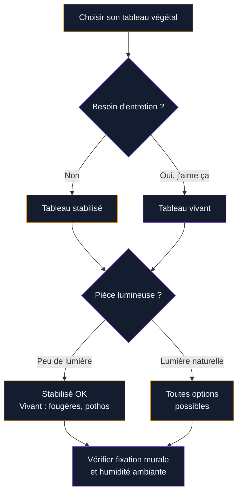
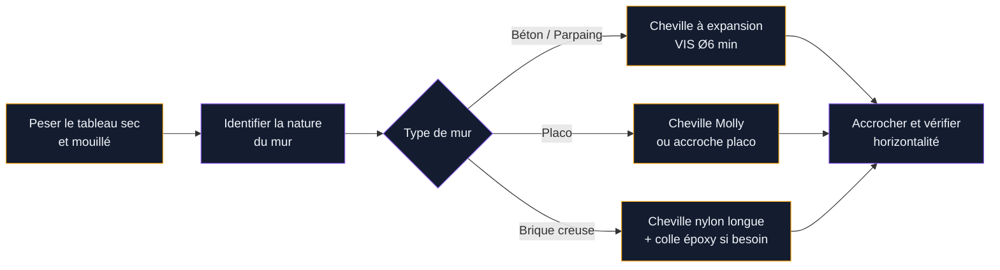

Un mur entier tapissé de verdure, des mousses veloutées qui contrastent avec le blanc des cloisons, un tableau végétal qui attire tous les regards dès qu'on entre dans la pièce... Ce type de décoration a explosé sur Instagram et Pinterest, et pour cause : l'effet est saisissant sans demander de travaux. Mais entre les cadres industriels en acier, les modèles DIY en bois de palette et les tableaux stabilisés vendus entre 80 et 800 €, comment s'y retrouver ?

Je t'explique tout ce qu'il faut savoir pour choisir le bon cadre, sélectionner les bonnes plantes (ou mousses) et poser ton tableau végétal sans stress.

---

## Ce qu'est vraiment un tableau végétal mural

Un tableau végétal mural, c'est un support vertical - cadre, palette, caisse - dans lequel on fait pousser ou on fixe des végétaux. Il en existe deux grandes familles, et elles ne demandent pas du tout le même entretien.

**Les tableaux avec plantes vivantes** : des végétaux plantés dans un substrat maintenu par un feutre horticole ou un système de poches. Ils poussent, ils vivent, ils demandent de l'eau et de la lumière. Plus spectaculaires, mais plus exigeants.

**Les tableaux stabilisés** : des mousses, lichens ou végétaux traités chimiquement pour conserver leur couleur et leur texture sans avoir besoin d'eau ni de lumière directe. Zéro entretien, durée de vie de 5 à 10 ans selon les marques.

La confusion entre les deux crée souvent des déceptions. Un tableau de mousse stabilisée ne pousse pas. Un mur végétal vivant ne supporte pas l'obscurité totale. Bien identifier ce que tu veux avant d'acheter, c'est 80 % du travail.

> [!TIP]
> Si tu n'as pas de fenêtre proche ou que tu voyages souvent, oriente-toi vers un tableau stabilisé. Le rendu est quasi identique à l'oeil nu, et tu n'auras jamais à t'inquiéter d'un arrosage oublié.

---

## Les types de cadres disponibles : tour d'horizon

### Le cadre en acier ou aluminium

C'est le format "professionnel" que tu vois dans les halls d'hôtel ou les open spaces. Des marques comme **Mobilane** ou **ANS Vertical Gardens** proposent des structures modulaires à partir de 150 € le m², avec système d'arrosage intégré pour les versions vivantes.

Pour une maison, les dimensions courantes vont de 40x60 cm à 120x80 cm. Un cadre acier de 60x60 cm avec plantes vivantes coûte entre 90 et 180 € selon la densité végétale.

Avantages : robuste, aspect soigné, possibilité de l'agrandir par modules.
Inconvénients : fixation murale à prévoir sérieusement (chevilles, charge lourde), prix plus élevé.

### Le cadre en bois

Le classique pour une ambiance chaleureuse ou scandinave. On trouve deux déclinaisons :

- **La caisse en bois avec poches de feutre** (type "pocket planter") : chaque poche contient du substrat et une ou plusieurs plantes. Marque populaire : **Elho Green Basics**, autour de 35 à 55 € pour un modèle mural 40x80 cm.
- **Le cadre photo XXL avec fond de mousse** : un châssis en bois avec un fond en mousse de sphaigne ou un feutre horticole maintenu par un grillage. Tu peux le fabriquer toi-même pour 20 à 40 € de matériaux.

Avantages : look naturel, poids léger, DIY accessible.
Inconvénients : le bois ne supporte pas bien l'humidité prolongée sans traitement.

### Les tableaux stabilisés prêts-à-poser

C'est le format le plus vendu en ligne. Des cadres avec mousse stabilisée (mousse de forêt, mousse boule, lichen), souvent présentés dans un encadrement blanc ou noir type "tableau".

Prix indicatifs :
- **Cadre 30x40 cm** : 45 à 80 € (Déco Végétale, Jardinerie Truffaut, Amazon)
- **Cadre 60x80 cm** : 120 à 250 € (Forest Moss, Vertiplants)
- **Grands formats 100x150 cm** : 350 à 700 €

Les différences de prix reflètent surtout la densité de la mousse et la qualité du traitement. Un tableau à 60 € peut jaunir au bout de 2 ans si le processus de stabilisation est bâclé.

> [!NOTE]
> Pour les tableaux stabilisés, vérifie que le fabricant précise "mousse naturelle stabilisée" et non "mousse artificielle teintée". La vraie mousse stabilisée garde une texture souple et ne dégage pas d'odeur chimique.

---

## Quel cadre selon la pièce ?

Le choix du cadre ne se fait pas sans considérer l'endroit où tu vas l'installer. Lumière, humidité, surface murale : chaque pièce a ses contraintes.

### Salon et entrée

L'idéal pour un grand format. La lumière est souvent bonne, les murs sont secs. Un cadre vivant de 60x80 cm avec des plantes comme le pothos, le philodendron ou la peperomia fonctionne très bien ici. Si tu préfères zéro souci, un tableau stabilisé de même dimension fera exactement le même effet visuel.

Pour l'entrée, je te conseille de regarder du côté de la [décoration minimaliste](/guides/decoration/decoration-minimaliste-idees-et-photos-faciles/) : un tableau végétal bien choisi peut remplacer à lui seul plusieurs éléments décoratifs.

### Salle de bains

L'humidité ambiante est un avantage pour les plantes vivantes, mais attention aux tableaux en bois non traité qui pourrissent rapidement. Dans une salle de bains, oriente-toi vers :
- Un cadre en acier ou en PVC (résistant à l'humidité)
- Des plantes adaptées : fougères de Boston, sélaginelles, hémigraphis

Si tu as déjà réfléchi à mettre des [plantes en salle de bains](/guides/salle-de-bain/plantes-salle-de-bains/), un tableau végétal est l'étape suivante logique.

> [!WARNING]
> Évite les tableaux stabilisés en salle de bains. L'humidité constante peut dégrader le traitement chimique et accélérer le jaunissement de la mousse. Les fabricants le précisent rarement, mais c'est un fait vérifié.

### Chambre

Pour la chambre, le tableau stabilisé est souvent préférable : pas d'arrosage à gérer, pas de substrat humide qui peut dégager de l'humidité la nuit. Un format 40x60 cm derrière le lit crée un effet tête de lit végétal très tendance, à partir de 80 €.

### Bureau et espace de travail

Même raisonnement que pour le salon. Un petit format (30x40 cm) posé sur un bureau avec un mini trépied ou fixé directement au mur derrière l'écran ajoute une touche de nature sans encombrer. Les [peperomia hope](/guides/decoration/la-peperomia-hope/) et autres plantes compactes sont parfaites pour les tableaux vivants en format réduit.

---

## Comment fixer un tableau végétal au mur

C'est souvent la partie qu'on sous-estime. Un tableau végétal vivant de 60x80 cm peut peser entre 8 et 15 kg selon le substrat et l'arrosage. Il faut faire ça bien.

Pour les tableaux jusqu'à 5 kg (petits stabilisés, cadres légers), des strips adhésifs type **Command Damage-Free** (3M) suffisent sur une surface propre et sèche.

Au-delà, il faut percer. Un guide détaillé sur la fixation murale est disponible dans notre article [bien accrocher tableau mural](/guides/decoration/bien-accrocher-tableau-mural/). Les points clés à retenir :

- Utilise deux points d'accroche minimum pour les formats supérieurs à 50 cm de large
- Prévois un léger espace entre le mur et l'arrière du cadre pour la circulation d'air (surtout pour les tableaux vivants)
- Protège le mur avec une petite plaque de silicone ou un carré de liège pour éviter les traces d'humidité

> [!IMPORTANT]
> Avant de percer, vérifie toujours la présence de câbles électriques ou de tuyaux avec un détecteur de métaux (disponible à 15-20 € en GSB). Une perforation au mauvais endroit peut coûter bien plus cher que le tableau lui-même.

---

## Plantes recommandées pour un tableau vivant

Toutes les plantes ne supportent pas la vie verticale dans un substrat peu épais. Voici celles qui s'y adaptent le mieux :

**Plantes robustes et tolérantes à l'ombre :**
- Pothos (Epipremnum aureum) : le plus résistant, supporte les oublis d'arrosage
- Philodendron scandens : feuillage brillant, croissance rapide
- Fougère de Boston (Nephrolepis exaltata) : idéale pour les atmosphères humides

**Plantes compactes pour petits cadres :**
- Peperomia argyreia (feuilles type pastèque) : ne dépasse pas 20 cm
- Sedum diverses espèces : pour les endroits ensoleillés
- Hémigraphis alternata : feuillage bicolore violet et vert

**Mousses pour les espaces entre plantes :**
- Mousse de sphaigne : maintient l'humidité, parfaite comme base de substrat
- Mousse de forêt (Hypnum cupressiforme) : vivace, se satisfait de peu de lumière

L'arrosage d'un tableau vivant se fait généralement par le haut (pulvérisateur ou système goutte-à-goutte) une à deux fois par semaine selon la saison. Certains cadres avec réservoir intégré (marque **Flowall**, autour de 95 € en format 40x60 cm) facilitent beaucoup la tâche.

---

## Budget : ce que ça coûte vraiment

Faire un tableau végétal mural, ça peut coûter 25 € en DIY ou 600 € pour un modèle haut de gamme. Voici les fourchettes réelles pour chaque option.

| Format | DIY vivant | Acheté vivant | Stabilisé |
|--------|-----------|---------------|-----------|
| 30x40 cm | 20-35 € | 55-90 € | 45-80 € |
| 60x80 cm | 50-80 € | 120-200 € | 130-280 € |
| 100x120 cm | 100-150 € | 280-450 € | 320-600 € |

Le DIY vivant comprend : cadre en bois brut (palette ou caisse), feutre horticole, substrat, plants. Le stabilisé n'a pas de coût d'entretien sur 5-8 ans, ce qui le rend souvent plus économique sur la durée.

---

## Les erreurs à éviter

**Choisir uniquement selon le look** : un tableau en forme de losange de 90 cm de large peut être magnifique en photo et ingérable dans ton appartement sans grande fenêtre. Commence toujours par la lumière disponible.

**Oublier le fond de protection murale** : un tableau vivant en contact direct avec le mur sans protection peut laisser des traces d'humidité permanentes ou des moisissures. Un cadre espacé de 2 à 3 cm du mur, avec un film plastique ou une planche de polystyrène extrudé au dos, règle le problème.

**Mélanger des plantes aux besoins incompatibles** : mettre un sedum (pleine lumière, peu d'eau) à côté d'une fougère (ombre, humidité constante) dans le même cadre, c'est condamner l'un des deux. Choisis des plantes avec les mêmes besoins hydriques et lumineux.

**Sous-estimer le poids** : un cadre vivant de 60x80 cm peut doubler de poids après arrosage. Anticipe toujours le poids "saturé en eau" pour le choix des fixations.

---

## FAQ

**Un tableau végétal stabilisé peut-il durer en salle de bains ?**
Non, pas idéalement. L'humidité constante dégrade le traitement de stabilisation et fait jaunir la mousse. Préfère une plante vivante adaptée à l'humidité ou un tableau vivant avec un cadre en PVC.

**Combien de temps dure un tableau végétal stabilisé ?**
Entre 5 et 10 ans dans de bonnes conditions (lumière indirecte, pas d'humidité excessive, pas de soleil direct). Les marques premium comme Forest Moss annoncent 8 ans de durée de vie.

**Peut-on faire un tableau végétal sans percer le mur ?**
Oui, pour les formats légers jusqu'à 3-4 kg. Les strips adhésifs 3M Command Large Picture Strips supportent jusqu'à 7 kg sur surface lisse. Au-delà, il faut percer.

**Quelle lumière minimum pour un tableau végétal vivant ?**
La plupart des plantes adaptées aux tableaux vivants survivent avec une luminosité équivalente à un bureau en intérieur (1000-2000 lux). Évite les couloirs sans fenêtres ou les murs opposés aux ouvertures.

**Le tableau végétal attire-t-il des insectes ?**
Comme toute plante d'intérieur, un tableau vivant peut attirer des moucherons fungus gnats si le substrat reste trop humide. Un arrosage maîtrisé et un substrat bien drainant limitent fortement ce risque.

**Peut-on personnaliser la forme d'un tableau végétal ?**
Oui, les artisans et certaines enseignes (Vertiplants, végétal design en local) réalisent des tableaux sur mesure en forme de lettre, d'animal ou de motif géométrique. Les prix démarrent autour de 200 € pour un format 50x50 cm.
