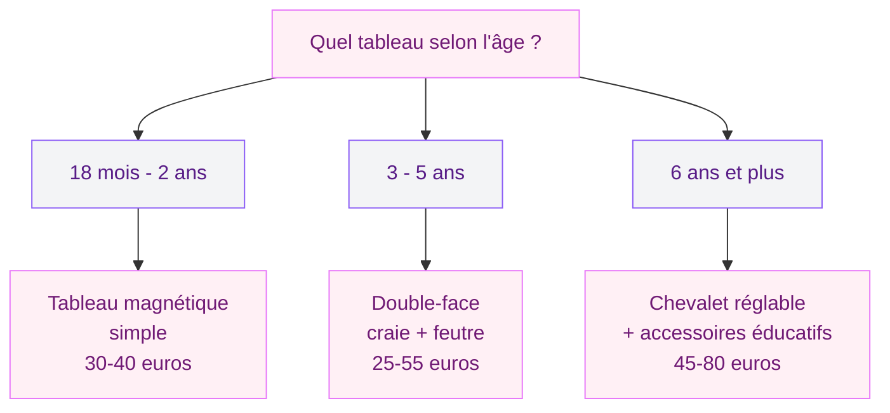
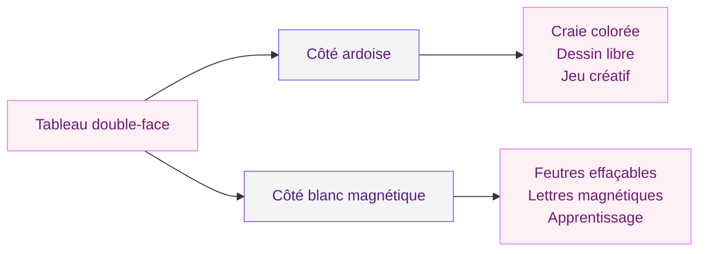

Tu veux offrir un tableau à ton enfant, mais tu te retrouves face à des dizaines de modèles en magasin et en ligne. Magnétique, ardoise, double-face, chevalet réglable, avec ou sans accessoires éducatifs - le choix est large, et le bon modèle dépend vraiment de l'âge et des besoins de ton enfant. Un tableau adapté à 18 mois ne ressemble pas du tout à celui qu'il faudra à 7 ans.

J'ai passé pas mal de temps à comparer les références du marché (Janod, Smoby, Ikea, Lidl) et à lire les retours de parents sur des sites comme MagicMaman et Je Suis Papa. Voici mon guide pour t'aider à choisir sans te tromper, avec des prix concrets et des recommandations par tranche d'âge.

---

## Pourquoi un tableau est un bon investissement pour un enfant

Avant de parler modèles, un mot rapide sur les bénéfices. Un tableau n'est pas juste un jouet : c'est un outil d'apprentissage qui accompagne l'enfant pendant plusieurs années.

**Motricité fine.** Dessiner à la craie ou au feutre, coller des aimants, effacer - chaque geste travaille la coordination main-oeil et la précision des doigts. Les ergothérapeutes recommandent le dessin vertical (debout, sur un tableau) parce qu'il sollicite l'épaule et le poignet différemment du dessin à plat sur une table.

**Expression libre.** Un tableau, c'est un espace où l'enfant peut gribouiller, écrire, inventer sans crainte d'abîmer quoi que ce soit. On efface et on recommence. Ca libère la créativité bien plus qu'une feuille de papier qu'on jette à la poubelle.

**Apprentissage structuré.** Les tableaux magnétiques avec lettres, chiffres ou cartes de géographie transforment le jeu en apprentissage. L'enfant manipule les lettres de son prénom, forme des mots, découvre les formes géométriques. C'est concret et ludique.

> [!TIP]
> Place le tableau dans un endroit où ton enfant passe du temps naturellement - la salle de jeux, la chambre ou un coin du salon. Un tableau rangé dans un placard ne sera pas utilisé.

---

## Le bon tableau selon l'âge de ton enfant

C'est le critère numéro 1. Un modèle trop complexe frustrera un tout-petit, et un modèle trop basique ennuiera un enfant de 6 ans en quelques semaines.

### 18 mois - 2 ans : le tableau magnétique simple

A cet âge, l'enfant découvre la manipulation d'objets. Le tableau magnétique est le meilleur choix parce qu'il n'y a pas de craie (risque d'ingestion), pas de feutres à perdre, et les aimants colorés captent l'attention.

**Ce qu'il faut :**
- Une surface magnétique lisse et large
- Des aimants gros et épais (impossible à avaler)
- Une hauteur basse ou un tableau posable au sol
- Pas de petites pièces détachables

**Modèles recommandés :**
- **Janod Splash** (environ 35 euros) : bois massif, pieds stables, aimants animaux inclus
- **Smoby magnétique 2-en-1** (environ 30 euros) : plastique solide, facile à nettoyer

> [!WARNING]
> Vérifie toujours que les aimants fournis respectent la norme EN 71 (jouets pour enfants). Les petits aimants ronds type néodyme sont extrêmement dangereux en cas d'ingestion - ils peuvent provoquer des perforations intestinales.

### 3 - 5 ans : le tableau double-face craie et feutre

C'est l'âge où l'enfant commence à dessiner des formes reconnaissables, à écrire ses premières lettres, à jouer "à la maîtresse". Le tableau double-face réunit deux surfaces en un seul produit : un côté ardoise pour la craie, un côté blanc pour les feutres effaçables.

**Ce qu'il faut :**
- Double-face (ardoise + blanc magnétique)
- Hauteur réglable (l'enfant grandit vite entre 3 et 5 ans)
- Un bac de rangement en bas pour les craies et les feutres
- Stabilité renforcée (l'enfant s'appuie dessus)

**Modèles recommandés :**
- **Janod Splash double-face** (environ 50 euros) : bois, réglable sur 3 hauteurs, accessoires inclus (craies, feutres, brosse)
- **Smoby double-face réglable** (environ 45 euros) : plastique robuste, pieds larges, rouleau de papier intégré
- **Ikea Mala** (environ 25 euros) : le rapport qualité-prix imbattable, bois de pin, pliable

Le modèle Ikea Mala mérite une mention spéciale. A 25 euros, il fait tout ce qu'on lui demande : double-face, pliable pour le rangement, compatible avec le rouleau de papier Ikea (5 euros les 30 mètres). C'est le best-seller du marché et les avis parents sont globalement positifs.

### 6 ans et plus : le chevalet réglable et les supports éducatifs

A partir de 6 ans, l'enfant écrit, compte, fait des opérations. Le tableau devient un vrai support de travail en plus du jeu. C'est le moment de passer à un modèle plus grand, réglable en hauteur, avec des accessoires pédagogiques.

**Ce qu'il faut :**
- Hauteur réglable (idéalement de 80 à 130 cm)
- Surface assez grande pour écrire des phrases entières
- Compatibilité avec des aimants éducatifs (alphabet, chiffres, cartes)
- Solidité pour durer jusqu'à 10-12 ans

**Modèles recommandés :**
- **Janod Graffiti réglable** (environ 65 euros) : bois massif, réglable sur 5 positions, rouleau papier, accessoires magnétiques alphabet
- **Smoby bureau-tableau évolutif** (environ 75 euros) : se transforme en bureau à plat pour le dessin

Pour les parents qui cherchent des lettres magnétiques de qualité, les coffrets Janod "Magneti'Book" (environ 20 euros) sont bien conçus : lettres en carton magnétique épais, rangement dans une boîte à fermeture magnétique. Le modèle "Alphabet" et le modèle "Chiffres" complètent bien un tableau blanc magnétique.

---

## Les critères techniques à vérifier avant d'acheter

Au-delà de l'âge, quelques points méritent ton attention en magasin ou sur la fiche produit en ligne.

### Stabilité et sécurité

Un tableau qui tombe sur un enfant, c'est le scénario à éviter. Vérifie que :
- Les pieds sont écartés (base large)
- Le système de pliage se verrouille (pas de fermeture accidentelle)
- Le poids est suffisant pour ne pas basculer au moindre contact
- Les vis et assemblages ne sont pas accessibles aux petits doigts

Les chevalets en bois (Janod, Ikea) sont globalement plus stables que les modèles tout plastique. Le bois pèse plus lourd, ce qui ancre le tableau au sol. Si tu as déjà aménagé une [salle de jeux pour tes enfants](/guides/decoration/salle-de-jeux-enfants/), tu sais que la stabilité du mobilier est le point de départ de tout.

### Matériaux : bois ou plastique ?

**Le bois** (pin, hêtre, bouleau) est le matériau privilégié par les marques premium comme Janod ou Vilac. Il est solide, esthétique, se répare facilement (un coup de ponçage + vernis) et vieillit bien. L'inconvénient : c'est plus lourd et plus cher.

**Le plastique** (Smoby, Ecoiffier) est léger, facile à nettoyer, souvent moins cher. Les modèles récents sont solides et colorés. L'inconvénient : moins durable sur le long terme, et l'aspect "jouet" peut détonner dans une chambre soigneusement décorée.

> [!NOTE]
> Si tu hésites, le bois est le meilleur choix pour un tableau qui doit durer 3 ans ou plus. Le plastique convient bien pour un premier tableau à petit prix qu'on remplacera quand l'enfant grandira.

### Nettoyage et entretien

C'est un point que beaucoup de parents négligent à l'achat et regrettent ensuite.

**Côté ardoise :** la craie laisse des traces fantômes si on n'essuie pas régulièrement avec un chiffon humide. Les craies sans poussière (Giotto Robercolor, environ 6 euros les 10) sont un vrai confort au quotidien - moins de poudre au sol, moins de traces sur les mains.

**Côté blanc :** les feutres effaçables bon marché laissent souvent des résidus après quelques semaines. Investis dans des feutres de marque (Bic Velleda, environ 5 euros les 4) et nettoie la surface chaque semaine avec un spray nettoyant pour tableau blanc (3-5 euros). Un tableau blanc bien entretenu reste impeccable pendant des années.

Si tu cherches des informations plus détaillées sur les tableaux blancs et les feutres effaçables, mon guide sur les [tableaux Velleda et feutres effaçables](/guides/decoration/choisir-tableau-velleda/) couvre ce sujet en profondeur.

---

## Le tableau double-face : l'option la plus polyvalente

Si tu ne devais retenir qu'un seul conseil de cet article, ce serait celui-ci : **prends un double-face.** C'est le format qui satisfait le plus d'enfants, le plus longtemps.

Pourquoi ? Parce que le côté ardoise et le côté feutre n'offrent pas la même expérience. La craie, c'est sensoriel, créatif, salissant - les enfants adorent. Le feutre effaçable, c'est propre, précis, adapté à l'apprentissage de l'écriture. Avec les deux côtés, l'enfant choisit selon son humeur et son activité du moment.

En plus, le côté blanc est souvent magnétique, ce qui permet d'y ajouter des aimants éducatifs, des dessins imprimés avec des aimants adhésifs, ou même une carte de France magnétique. Le tableau grandit avec l'enfant.

---

## Combien ça coûte : le comparatif par gamme de prix

Voici un récapitulatif rapide pour t'orienter selon ton budget.

| Gamme | Prix | Marques | Ce que tu obtiens |
|-------|------|---------|-------------------|
| Entrée de gamme | 20-30 euros | Ikea Mala, Lidl, Action | Double-face basique, bois ou plastique simple, peu d'accessoires |
| Milieu de gamme | 35-55 euros | Janod, Smoby, Vertbaudet | Double-face réglable, accessoires inclus, bois ou plastique solide |
| Haut de gamme | 60-80 euros | Janod Graffiti, Smoby évolutif, Vilac | Evolutif, bois massif, accessoires éducatifs, rouleau papier |

Le meilleur rapport qualité-prix se situe entre 35 et 55 euros. C'est là où tu trouves des modèles complets, réglables, avec des accessoires corrects sans payer le premium des gammes supérieures.

> [!IMPORTANT]
> Attention aux faux "packs complets" sur Amazon. Certains tableaux à 20 euros annoncent "100 accessoires inclus" - en réalité, ce sont des aimants en plastique minuscules et des craies de mauvaise qualité. Lis les avis et vérifie les photos des acheteurs avant de commander.

---

## Où placer le tableau dans la maison

L'emplacement compte autant que le modèle. Un tableau mal placé ne sera pas utilisé.

**Dans la chambre :** près du bureau ou du coin jeu, jamais face au lit (ca stimule au lieu de calmer au moment du coucher). Prévois une protection au sol sous le tableau - un vieux drap ou un tapis lavable - pour les projections de craie.

**Dans la salle de jeux :** l'emplacement idéal. Le tableau fait partie du mobilier de jeu, et le désordre ne dérange personne. Si tu aménages une salle dédiée, pense à la disposition globale comme je l'explique dans le guide sur la [salle de jeux pour enfants](/guides/decoration/salle-de-jeux-enfants/).

**Dans le salon :** possible si tu choisis un modèle esthétique (bois naturel, Janod ou Vilac) et si tu le replies quand il n'est pas utilisé. Le modèle pliable Ikea Mala se range derrière un meuble en 5 secondes.

Un dernier point sur l'emplacement : évite de mettre le tableau contre un mur que tu veux garder impeccable. Même avec des craies sans poussière, il y aura des traces. Pour accrocher un modèle mural (certains tableaux enfant se fixent au mur comme un vrai tableau), consulte notre guide [bien accrocher un tableau mural](/guides/decoration/bien-accrocher-tableau-mural/) pour les bonnes techniques de fixation.

---

## Questions fréquentes

**A quel âge un enfant peut-il utiliser un tableau ?**
Dès 18 mois, un enfant peut manipuler des aimants sur un tableau magnétique. La craie et les feutres arrivent vers 2-3 ans, quand la motricité fine est assez développée pour tenir l'outil sans le casser ou le mettre à la bouche.

**Le tableau double-face est-il vraiment utile ?**
Oui, c'est le format le plus polyvalent et le plus durable. Le côté ardoise sert au dessin libre et à la créativité, le côté blanc au travail plus structuré (lettres, chiffres, jeux magnétiques). La plupart des parents qui ont testé les deux côtés séparément finissent par racheter un double-face.

**Les craies sont-elles dangereuses pour les enfants ?**
Les craies classiques ne sont pas toxiques, mais elles produisent de la poussière qui peut irriter les voies respiratoires des enfants sensibles. Les craies sans poussière (Giotto, Jovi) réduisent ce problème de 80-90%. Evite les craies de trottoir bon marché qui s'effritent très vite.

**Quelle taille de surface de dessin choisir ?**
Pour un enfant de 2-4 ans, une surface de 40x30 cm suffit. A partir de 5 ans, vise au moins 50x40 cm pour qu'il ait de la place pour écrire des mots et dessiner des scènes complètes. Les modèles "grand format" (60x50 cm et plus) conviennent aux fratries qui dessinent ensemble.

**Peut-on fixer un tableau enfant au mur ?**
Oui, il existe des modèles muraux (Janod mural, Ikea Luns) qui se fixent comme un tableau classique. C'est un gain de place pour les petites chambres. Pour la technique de fixation, suis les conseils de notre guide sur l'[accrochage de tableaux muraux](/guides/decoration/bien-accrocher-tableau-mural/).
