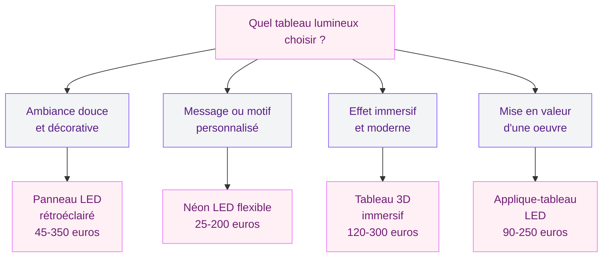
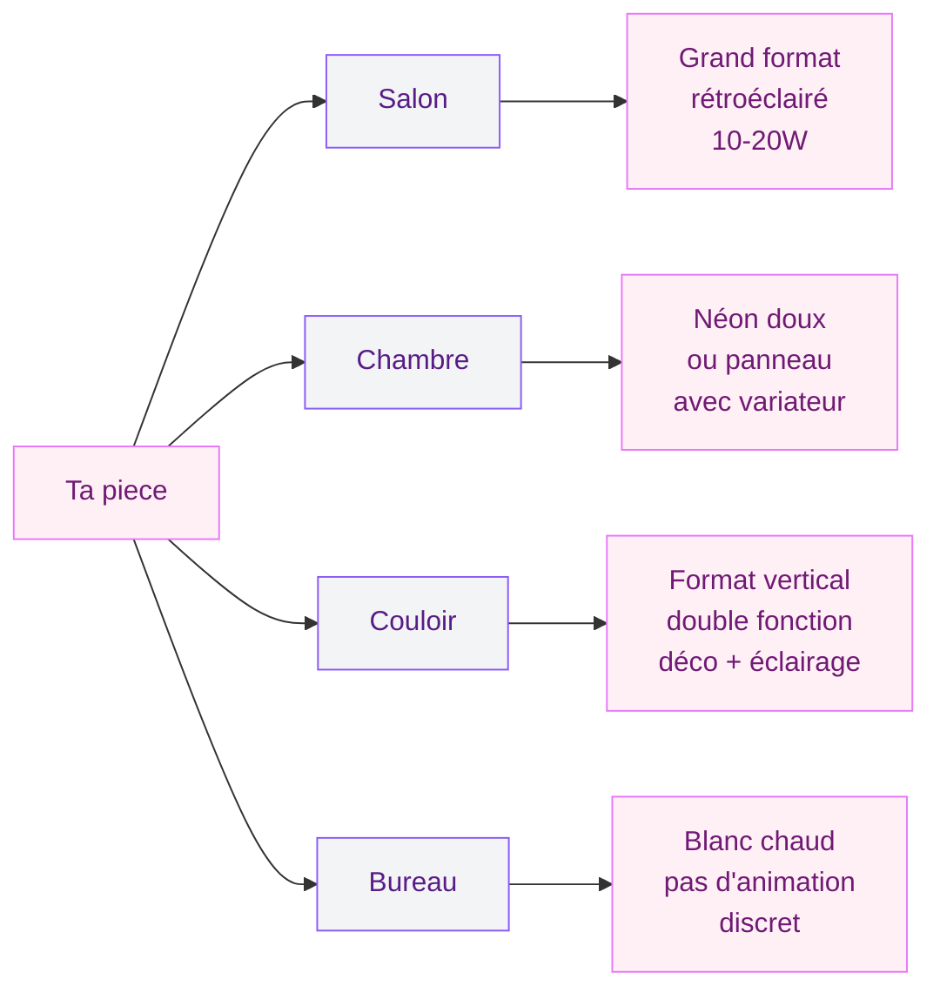

Un mur triste, un couloir sombre, un coin du salon sans personnalité - le tableau lumineux cumule art mural et ambiance lumineuse en un seul objet. L'effet est immédiat : tu allumes, et la piece change d'atmosphere.

Mais entre un néon flexible à 25 euros, un panneau LED 3D à 180 euros et une toile rétroéclairée à 500 euros, le choix peut devenir un casse-tete. Je t'explique les différentes technologies, comment choisir selon ta piece et ton budget, et comment installer ton tableau sans prise de tete.

---

## Les différents types de tableaux lumineux

Chaque technologie a ses avantages, ses limites et son rendu propre. Voici les grandes familles du marché.

### Le panneau LED rétroéclairé

Le modele le plus populaire en 2026. Une toile imprimée ou un panneau plexiglas est éclairé par l'arriere par un bandeau LED. La lumiere traverse l'image ou se diffuse autour du cadre, créant un halo doux.

**Prix indicatifs :**
- Format 40x60 cm : 45 a 90 euros
- Format 60x90 cm : 80 a 150 euros
- Grands formats 100x150 cm : 150 a 350 euros

L'atout du panneau LED, c'est sa finesse : moins de 3 cm d'épaisseur pour s'intégrer comme un tableau classique. Les LED ne chauffent quasiment pas et consomment entre 5 et 15W selon la taille.

### Le tableau néon flexible (LED néon)

Le néon en verre a été largement remplacé par le "néon LED", un tube souple en silicone moins cher et moins fragile. Tu le trouves en mots, formes (coeur, étoile, silhouettes) ou motifs personnalisés. Un mot type "Home" ou "Love" coute entre 25 et 60 euros. Les créations sur mesure (prénom, phrase, logo) démarrent autour de 80 a 200 euros selon la complexité.

> [!TIP]
> Le néon LED flexible consomme entre 3 et 8W par metre. Pour un mot de 50 cm de long, tu es autour de 4-5W - autant dire que tu peux le laisser allumé toute la soirée sans y penser.

### Le tableau lumineux 3D immersif

Ces tableaux utilisent des LED programmables (rubans adressables type WS2812B) derriere une structure en relief. Le résultat : effets de profondeur, animations, couleurs changeantes pilotées par télécommande ou smartphone. Des marques comme VeilleuseDeReve proposent des modeles "portail lumineux" ou "fenetre cosmique" assez bluffants. Budget : 120 a 300 euros.

### L'applique-tableau (éclairage intégré au cadre)

L'applique-tableau combine un cadre classique avec un éclairage intégré dans la partie haute ou sur les cotés - comme dans les galeries d'art. Des fabricants comme Stéphane Davidts proposent des modeles LED en laiton ou chrome a partir de 90 euros pour un rendu "muséal" chez toi.

---

## Pourquoi choisir la LED plutot que l'halogene ou le néon classique

La LED a gagné la partie sur a peu pres tous les criteres.

**Pas de chaleur (ou presque).** Une LED chauffe entre 30 et 40 degres en surface. La chaleur abime les impressions sur toile, fait jaunir le papier et déforme les supports plastiques. Un halogene monte a 150-200 degres - un risque réel pour un tableau décoratif. Si tu as d'autres oeuvres sur tes murs, notre guide pour [bien accrocher un tableau mural](/guides/decoration/bien-accrocher-tableau-mural/) t'aidera a les protéger.

**Durée de vie longue.** Les LED de qualité tiennent 30 000 a 50 000 heures, soit 20 a 35 ans a raison de 4 heures par jour. Les néons classiques durent 10 000 a 15 000 heures et perdent en luminosité bien avant.

**Consommation basse.** Un panneau LED de 60x90 cm consomme entre 8 et 15W. Un néon traditionnel équivalent : 30 a 60W. Sur un an a raison de 5 heures par jour, ca fait la différence.

> [!NOTE]
> Pour préserver les couleurs de l'image imprimée sur ton tableau rétroéclairé, choisis une température de couleur "blanc chaud" entre 2700K et 3000K. Les LED en 6000K (blanc froid) donnent un rendu bleuté qui dénature les tons chauds de l'image.

**Flexibilité créative.** Disponibles en blanc chaud, blanc froid, RGB ou RGBW, certains modeles intègrent animations, variateur ou WiFi pour piloter via smartphone. Un ruban LED RGB de 5 metres coute entre 15 et 40 euros.

---

## Comment choisir selon ta piece

Le bon tableau dépend aussi de la piece. Chaque espace a ses contraintes.

### Salon et séjour

C'est l'endroit ou l'impact est le plus fort. Au-dessus du canapé ou de la console TV, un panneau rétroéclairé grand format (80x120 cm ou plus) crée un point focal saisissant le soir. Vise 10-20W pour une lumiere d'ambiance qui ne rivalise pas avec l'éclairage principal.

Si ton salon est plutot [déco minimaliste](/guides/decoration/decoration-minimaliste-idees-et-photos-faciles/), un seul tableau lumineux bien placé suffit. Pas la peine d'en mettre trois.

### Chambre

En chambre, la douceur prime. Un néon LED avec un mot apaisant ("Dream", "Respire", ton prénom) ou un panneau rétroéclairé en lumiere chaude fait un bon remplacant de veilleuse. Prends un modele avec variateur ou télécommande pour baisser l'intensité au moment de t'endormir.

Budget a prévoir pour une chambre : 30 a 80 euros pour un néon LED, 60 a 120 euros pour un panneau rétroéclairé format 40x60 cm.

### Couloir et entrée

La piece oubliée de la déco. Un tableau lumineux y remplit deux fonctions : décorer un mur vide et éclairer un passage sombre. Un format vertical (30x90 cm ou 40x120 cm) convient bien aux couloirs étroits.

### Bureau et espace de travail

Pour un bureau, évite les couleurs vives ou les animations qui distraient. Un panneau LED blanc chaud avec une image apaisante (nature, architecture) ou un néon discret sont de meilleurs choix. Si tu aménages un [coin gaming](/guides/decoration/comment-creer-une-station-de-gaming/), la, tu peux sortir les RGB et les effets dynamiques.

---

## Installer ton tableau lumineux : le guide pas a pas

90 % des tableaux lumineux s'installent aussi facilement qu'un cadre classique. Voici les étapes.

### Etape 1 : vérifier l'alimentation

La plupart fonctionnent en basse tension (12V ou 24V) via un transformateur sur prise classique. Vérifie qu'une prise est accessible pres de l'emplacement prévu. Si elle est trop loin, deux options :

- **Une rallonge plate** (2 a 5 euros) que tu peux glisser derriere une plinthe ou le long du mur, tres discrete.
- **Un passage de cable mural** si tu veux un rendu propre et que tu es proprio. Ca demande un peu de bricolage (percer un trou dans le mur, passer le cable, reboucher). Budget : 10 a 20 euros de matériel.

Quelques modeles fonctionnent sur batterie USB rechargeable, pratique pour les néons légers, mais l'autonomie reste limitée (6 a 12 heures).

### Etape 2 : choisir la fixation

Le poids détermine la fixation. La plupart des panneaux LED pesent entre 1 et 4 kg.

- **Moins de 2 kg** : languettes adhésives type Command 3M (pas de trou dans le mur).
- **2 a 5 kg** : crochets a clou ou vis + cheville standard.
- **Plus de 5 kg** (grands formats, cadres en bois massif) : chevilles adaptées au type de mur (Molly pour placo, cheville béton pour mur plein).

> [!WARNING]
> Attention au poids des tableaux 3D immersifs - certains modeles avec structure en bois et plusieurs couches de LED dépassent les 5 kg. Vérifie toujours le poids indiqué par le fabricant avant de choisir ta fixation.

### Etape 3 : positionner et accrocher

Le centre doit se trouver entre 145 et 160 cm du sol. Au-dessus d'un meuble (console, canapé, tete de lit), laisse 15 a 25 cm entre le haut du meuble et le bas du cadre.

Utilise un niveau a bulle pour vérifier l'horizontale. Marque les fixations au crayon, perce ou colle, accroche, branche - et profite.

### Etape 4 : gérer le cable d'alimentation

Le point noir classique : le cable qui pend sous le cadre. Quelques solutions :

- **Goulotte décorative** peinte de la meme couleur que le mur (3 a 8 euros en magasin de bricolage).
- **Passer le cable derriere le mur** si c'est une cloison en placo (intervention plus lourde).
- **Masquer avec un meuble** : une console ou une bibliothèque sous le tableau cache naturellement le cable.

> [!TIP]
> Les goulottes décoratives plates de 15x10 mm sont quasiment invisibles une fois peintes. Choisis un modele avec adhésif au dos pour ne pas abimer le mur - ca se pose en 5 minutes.

---

## Les criteres techniques a vérifier avant d'acheter

Voici les points a vérifier avant d'acheter.

**Température de couleur (en Kelvin).** Entre 2700K et 3000K pour un blanc chaud agréable. En dessous de 2700K, tu tombes dans l'ambré. Au-dessus de 4000K, c'est trop froid pour de la déco.

**Indice de rendu des couleurs (IRC ou CRI).** Vise au-dessus de 80, idéalement 90 pour que les couleurs de l'image restent fideles. Les LED bas de gamme a IRC 60-70 donnent un rendu terne.

**Puissance et luminosité.** Pour un tableau décoratif, tu ne cherches pas a éclairer une piece entiere. Vise entre 300 et 800 lumens selon la taille. Un variateur est un vrai plus pour adapter l'intensité selon le moment.

**Classe IP (indice de protection).** Pour un usage intérieur standard, IP20 suffit. Si tu veux installer un tableau lumineux dans une salle de bain ou pres d'un évier, vise IP44 minimum.

**Alimentation.** 12V ou 24V via transformateur, c'est le standard. Evite les modeles branchés directement en 220V sans transformateur - ca existe sur certains imports douteux.

---

## Erreurs a éviter

**Acheter un tableau trop petit pour le mur.** Un panneau de 30x40 cm sur un mur de 3 metres, ca fait perdu et mesquin. Pour un mur standard de 2 a 3 metres, vise minimum 60x80 cm.

**Oublier le variateur.** Un tableau lumineux sans variateur, c'est tout ou rien. Le soir, tu veux une lumiere douce et tamisée. Si ton modele n'a pas de variateur intégré, tu peux en ajouter un entre le transformateur et le ruban LED pour 8 a 15 euros.

**Mélanger trop de sources lumineuses.** Un tableau lumineux est un accent, pas un plafonnier. Avec lustre, lampes de table et spots encastrés, il doit rester discret en intensité pour ne pas transformer le salon en vitrine de magasin.

**Ignorer la qualité de l'image.** Une image basse résolution pixelise des que le rétroéclairage s'allume. Demande une impression en 300 DPI minimum sur support translucide.

---

## Ou acheter un tableau lumineux en France

**Boutiques en ligne spécialisées** : Luminaire Signature, VeilleuseDeReve, NéonTendance. Modeles variés, SAV en francais.

**Grandes enseignes** : Leroy Merlin, Maisons du Monde, La Redoute Intérieurs. Choix limité mais tu peux voir les modeles en magasin avant d'acheter.

**Artisans sur Etsy** : pour du sur-mesure (néon personnalisé, panneau imprimé avec ta photo), les artisans Etsy France proposent des créations uniques. Budget : 60 a 250 euros selon la complexité.

**Amazon** : large choix, prix bas, qualité variable. Vérifie l'IRC et la température de couleur, et privilégie les vendeurs avec un SAV en Europe.

> [!IMPORTANT]
> Méfie-toi des tableaux lumineux vendus a moins de 20 euros sur Amazon ou AliExpress. Les LED de mauvaise qualité peuvent scintiller (flickering), ce qui provoque maux de tete et fatigue oculaire. Un bon panneau LED commence autour de 40-50 euros pour un format 40x60 cm.

---

## FAQ

**Est-ce qu'un tableau lumineux consomme beaucoup d'électricité ?**
Non, tres peu. Un panneau LED de taille moyenne (60x90 cm) consomme entre 8 et 15W. A raison de 5 heures par jour pendant un an, ca représente environ 15 a 27 kWh, soit 3 a 6 euros sur ta facture annuelle. C'est négligeable.

**Peut-on laisser un tableau lumineux allumé toute la nuit ?**
Techniquement oui, les LED ne chauffent pas assez pour présenter un risque. Mais pour la durée de vie de tes LED et pour ta facture, un minuteur ou une prise connectée programmable (10 a 20 euros) est un bon investissement. Tu programmes l'extinction automatique et tu n'y penses plus.

**Comment fabriquer un tableau lumineux soi-meme ?**
C'est tout a fait faisable en DIY. Il te faut un cadre en bois ou en alu (15-30 euros), un ruban LED autocollant (10-25 euros pour 2 metres), une alimentation 12V (8-12 euros) et une surface diffusante (plexiglas opale ou tissu blanc, 10-20 euros). Tu colles le ruban LED a l'intérieur du cadre, tu places la surface diffusante devant, tu branches - et c'est fait. Budget total : 40 a 80 euros pour un résultat personnalisé.

**Quelle taille choisir pour un mur de salon ?**
Pour un mur de 2 a 3 metres de large au-dessus d'un canapé, un format 80x120 cm ou 100x70 cm est un bon point de départ. Le tableau doit occuper entre un tiers et deux tiers de la largeur du meuble en dessous pour rester équilibré visuellement.

**Les tableaux lumineux sont-ils compatibles avec un variateur mural ?**
Ca dépend du modele. Les tableaux avec transformateur intégré ont souvent leur propre variateur (télécommande ou bouton). Pour les modeles alimentés en 12V, tu peux ajouter un dimmer LED entre le transformateur et le panneau - ca coute 8 a 15 euros et ca se branche en quelques minutes sans outil particulier.
