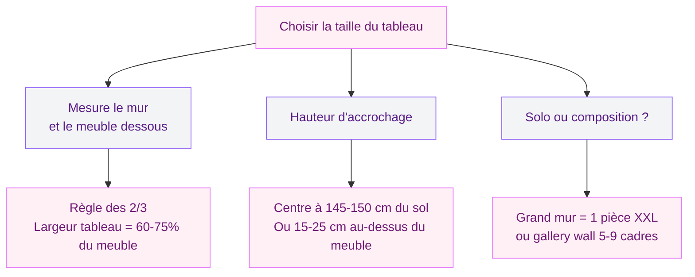
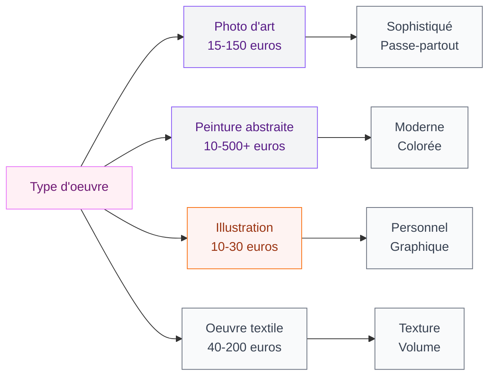

Tu as un mur vide qui te fixe chaque jour et tu ne sais pas quoi y mettre ? Un tableau mural, c'est souvent le premier réflexe - et c'est le bon. Un seul cadre bien choisi peut transformer l'ambiance d'une pièce entière. Mais entre l'abstrait, la photo de paysage, le triptyque XXL et le petit format graphique, comment savoir ce qui va vraiment fonctionner chez toi ?

Je te donne ma méthode complète pour choisir un tableau mural sans te tromper. On va parler style, taille, couleurs, emplacement et budget. À la fin, tu sauras exactement quoi chercher - et où le trouver.

---

## Commence par ton style déco

Le tableau que tu accroches au mur doit s'intégrer dans l'ambiance générale de ta pièce. Pas besoin de matcher parfaitement avec chaque objet, mais il faut une cohérence visuelle. Sinon, l'effet "pièce témoin de magasin" est garanti.

### Identifier ton fil conducteur

Regarde autour de toi. Ta pièce est plutôt scandinave avec du bois clair et des lignes simples ? Un tableau abstrait aux tons pastel ou une photo noir et blanc minimaliste fonctionnera bien. Ton salon tire vers le bohème avec des coussins colorés et du rotin ? Un tableau aux motifs végétaux ou une aquarelle aux teintes chaudes fera mouche.

Voici quelques associations qui marchent à tous les coups :

- **Style scandinave** : illustrations épurées, photos nature en noir et blanc, art abstrait tons doux
- **Style bohème** : aquarelles, motifs botaniques, portraits au trait, macramé en textile
- **Style industriel** : typographie grand format, photographie urbaine, art brut sur toile brute
- **Style classique** : reproductions de maîtres, paysages à l'huile, encadrements dorés
- **Style contemporain** : art abstrait aux couleurs vives, oeuvres géométriques, photos d'art conceptuel

Si tu hésites sur le style général de ton intérieur, jette un oeil à notre guide sur les [salons modernes et élégants 2026](/salons-modernes-et-elegants-2026/) pour trouver l'inspiration.

> [!TIP]
> Teste avant d'acheter : imprime une version A4 de l'oeuvre que tu aimes, scotche-la au mur et vis avec pendant 3 jours. Si elle te plaît toujours, c'est bon signe.

---

## La taille : l'erreur numéro 1

C'est LE piège classique. Tu achètes un petit tableau 30x40 cm et tu le colles sur un immense mur de 3 mètres de large. Résultat : on dirait un timbre poste perdu dans le vide. Ou l'inverse - un grand format écrase une pièce trop petite.

  

### La règle des deux tiers

La règle la plus fiable, c'est celle des deux tiers. Ton tableau (ou ton ensemble de cadres) doit occuper environ 60 à 75 % de la largeur du meuble en dessous. Au-dessus d'un canapé de 200 cm ? Vise un tableau ou une composition d'environ 120 à 150 cm de large.

### Hauteur d'accrochage

Le centre du tableau doit se situer à environ 145-150 cm du sol. C'est la hauteur moyenne du regard en position debout. Si le tableau est au-dessus d'un canapé ou d'un buffet, descends un peu : laisse 15 à 25 cm entre le haut du meuble et le bas du cadre.

### Formats selon les espaces

| Espace | Format recommandé | Exemples concrets |
|--------|------------------|-------------------|
| Au-dessus du canapé | 100x70 cm à 150x100 cm | Toile unique ou triptyque |
| Couloir étroit | 30x40 cm ou 40x60 cm | Série de 3-4 petits cadres alignés |
| Au-dessus du lit | 80x60 cm à 120x80 cm | Paysage horizontal ou diptyque |
| Petit pan de mur | 40x40 cm à 50x70 cm | Illustration graphique solo |
| Grand mur vide | 120x80 cm ou gallery wall | Composition murale ou pièce statement |

> [!NOTE]
> Un tableau trop petit se repère immédiatement, un tableau légèrement trop grand se pardonne mieux. Dans le doute, prends le format au-dessus.

---

## Les couleurs : créer une harmonie

Ton tableau ne doit pas reprendre exactement les couleurs de ton canapé ou de tes rideaux. L'idée, c'est de créer un dialogue entre les teintes, pas un uniforme.

### La méthode 60-30-10

C'est la règle des décorateurs d'intérieur. 60 % de couleur dominante (murs, grands meubles), 30 % de couleur secondaire (textiles, tapis), 10 % de couleur d'accent (accessoires, et... ton tableau). Le tableau fait partie de ces 10 % qui donnent du peps à l'ensemble.

Ça veut dire quoi concrètement ? Si ton salon est beige et blanc avec des touches de bleu canard, un tableau qui reprend ce bleu avec une touche de moutarde va parfaitement fonctionner. Pas besoin que le bleu soit identique - une teinte proche suffit.

### Les combinaisons qui marchent

- **Intérieur neutre** (blanc, beige, gris) : tu peux te permettre un tableau coloré, c'est le moment d'oser
- **Intérieur coloré** : reste dans les tons complémentaires ou choisis un tableau en noir et blanc pour calmer le jeu
- **Palette monochromatique** : joue sur les nuances d'une seule couleur pour un effet sophistiqué

Pour approfondir le sujet des palettes, notre guide sur les [couleurs du salon 2026](/couleurs-du-salon-2026-palettes-de-murs-et-de-decors/) te donnera plein d'idées.

> [!WARNING]
> Évite de choisir un tableau uniquement parce qu'il "va avec le canapé". Les tendances changent, tu vas peut-être changer ta housse dans un an. Choisis une oeuvre qui te plaît vraiment, pas un accessoire coordonné.

---

## Quel type d'oeuvre choisir ?

Au-delà du style, le type d'oeuvre change l'ambiance d'une pièce de manière radicale. Voici les grandes familles et ce qu'elles apportent.

  

### La photographie d'art

C'est l'option la plus accessible pour débuter. Une belle photo noir et blanc, un paysage dramatique, une scène de rue... La photo d'art donne un côté sophistiqué sans trop de risque. Les tirages numériques sur papier fine art coûtent entre 30 et 150 euros selon la taille et l'artiste. Des sites comme Desenio ou Juniqe proposent des sélections variées à partir de 15 euros pour le poster seul.

### La peinture abstraite

L'abstrait, c'est le choix star pour les intérieurs modernes. Pas besoin de "comprendre" une oeuvre abstraite - elle fonctionne par les couleurs, les formes et l'énergie qu'elle dégage. L'avantage : une toile abstraite s'adapte à presque tous les décors. Chez IKEA, la gamme BILD propose des reproductions entre 10 et 50 euros. Pour des originaux, des plateformes comme Singulart ou Artmajeur offrent des peintures à partir de 200 euros.

### L'illustration et le graphisme

Idéal pour une chambre, un bureau ou une pièce de vie au style affirmé. Les affiches typographiques, les illustrations botaniques, les dessins au trait - tout ça crée une ambiance plus personnelle. Etsy regorge de créateurs qui vendent des impressions à 10-30 euros, prêt à encadrer.

---

## Le gallery wall : l'art de la composition

Si un seul tableau ne suffit pas (ou si tu as plusieurs pièces que tu adores), le mur de cadres - le fameux gallery wall - est une solution géniale. Mais attention : mal exécuté, ça ressemble vite à un bric-à-brac de brocante.

### Les règles d'or

1. **Un fil conducteur** : soit la couleur des cadres (tout en noir, tout en bois naturel), soit le thème (photos de voyage, illustrations botaniques), soit la palette colorée des oeuvres
2. **Des espaces réguliers** : 5 à 8 cm entre chaque cadre. Ni trop serré (effet étouffant), ni trop espacé (plus de cohésion)
3. **Un format mixte** : mélange des tailles et orientations (portrait + paysage + carré) pour du dynamisme, mais garde au moins un élément commun

### Méthode pratique

Avant de percer, découpe des formes en papier journal aux dimensions de tes cadres. Scotche-les au mur et ajuste la disposition. Tu peux prendre des photos avec ton téléphone pour comparer les versions. Quand tu es satisfait(e), marque les emplacements des clous avec un crayon à travers le papier.

Trust me, cette étape de 20 minutes t'évite des heures de frustration et des dizaines de trous inutiles. Si tu veux aller plus loin sur la technique d'accrochage, consulte notre article sur [bien accrocher un tableau mural](/bien-accrocher-tableau-mural/).

> [!IMPORTANT]
> Pour un gallery wall réussi, commence par placer le cadre le plus grand au centre (ou légèrement décentré vers la gauche - c'est là où l'oeil se pose naturellement). Construis ensuite autour de lui.

---

## Où placer ton tableau selon la pièce

L'emplacement change tout. Le même tableau peut passer de "magnifique" à "bizarre" selon l'endroit où tu le mets.

  

### Le salon

L'endroit classique : au-dessus du canapé. Ça fonctionne parce que le canapé crée une ligne horizontale forte et le tableau équilibre la composition. Autre option : le mur face au canapé, pour que tu puisses l'admirer depuis ta position assise.

### La chambre

Au-dessus de la tête de lit, c'est le choix le plus logique. Opte pour des sujets apaisants : paysages calmes, abstraits aux tons doux, photos de nature. Évite les couleurs trop vives ou les images stimulantes - tu veux dormir, pas courir un marathon.

### Le couloir

Souvent négligé, le couloir est pourtant parfait pour une petite galerie. Des cadres alignés à la même hauteur sur toute la longueur du mur, c'est élégant et ça donne du rythme à un espace de passage.

---

## Le cadre : un choix à ne pas sous-estimer

Le cadre, c'est comme la reliure d'un livre. Il peut mettre en valeur ou complètement gâcher l'oeuvre qu'il entoure.

### Les classiques qui fonctionnent

- **Cadre noir fin** : passe-partout, moderne, discret. Le choix safe par défaut, et il coûte entre 5 et 20 euros chez IKEA (gamme RIBBA ou FISKBO)
- **Cadre bois naturel** : chêne, pin, noyer - ça réchauffe l'oeuvre et s'intègre aux décors scandinaves ou bohèmes. Sostrene Grene propose des cadres bois à partir de 8 euros
- **Cadre blanc** : allège et clarifie, parfait pour les photos et illustrations aux couleurs vives
- **Cadre doré** : à petite dose, il apporte une touche chic sans effort. Combine avec une oeuvre sobre pour éviter l'effet "château"

### Le passe-partout : oui ou non ?

Le passe-partout (ce carton de couleur entre le cadre et l'image), c'est un atout sous-estimé. Un passe-partout blanc autour d'une petite illustration la rend immédiatement plus prestige. Il crée un espace de respiration visuelle et attire l'oeil vers l'oeuvre.

Si tu cherches des idées pour associer cadres et décoration murale végétale, notre guide sur les [cadres et tableaux muraux végétaux](/choisir-cadre-tableau-mural-vegetal/) te donnera des pistes originales.

---

## Budget : combien ça coûte vraiment ?

Pas besoin de casser ta tirelire pour habiller tes murs. Voici un tour d'horizon réaliste des prix en 2026.

  

### Reproductions et affiches

| Source | Prix moyen | Format |
|--------|-----------|--------|
| IKEA (BILD, GRONBY) | 5-30 euros | Poster ou toile |
| Desenio | 10-40 euros | Poster sans cadre |
| Juniqe | 15-60 euros | Poster ou toile |
| Etsy (créateurs) | 10-50 euros | Impression numérique |
| H&M Home | 8-25 euros | Poster ou cadre inclus |

### Oeuvres originales

| Source | Prix moyen | Ce que tu obtiens |
|--------|-----------|-------------------|
| Marchés aux puces | 20-150 euros | Peintures, gravures vintage |
| Artmajeur | 100-1000 euros | Originaux d'artistes |
| Singulart | 200-3000 euros | Oeuvres contemporaines |
| Galeries locales | 300-5000+ euros | Pièces uniques |

### Mon astuce budget

Si tu veux un look premium sans exploser le budget, combine un poster Desenio à 15 euros avec un cadre IKEA RIBBA à 10 euros et un passe-partout sur mesure à 8 euros chez un encadreur local. Pour 33 euros, tu as un rendu qui fait "galerie d'art".

> [!TIP]
> Les marchés aux puces et les brocantes sont des mines d'or pour les cadres. Tu trouves des encadrements en bois massif ou en laiton à 5-15 euros - des pièces qui coûteraient 50 à 80 euros neuves. Il suffit de changer l'image à l'intérieur.

---

## Les erreurs à éviter

Après avoir aidé des dizaines de lectrices à choisir leurs tableaux, voici les pièges que je vois revenir en boucle :

1. **Accrocher trop haut** : c'est l'erreur la plus répandue. Si tu dois lever la tête pour regarder ton tableau, il est trop haut. Rappelle-toi : centre à 145 cm du sol.

2. **Choisir trop petit** : par timidité ou par peur de "trop en faire", on prend souvent un format trop modeste. Le résultat manque d'impact. N'aie pas peur du grand format.

3. **Tout assortir** : un tableau qui reprend exactement les couleurs du canapé, des coussins et du tapis, ça fait catalogue de meuble. Laisse un peu de contraste et de surprise.

4. **Négliger l'éclairage** : un beau tableau dans l'ombre, c'est un gâchis. Une petite applique murale orientable (type IKEA TRALALA à 25 euros) ou une bande LED derrière le cadre change complètement la donne.

5. **Acheter sur un coup de tête en vacances** : cette toile "trop belle" achetée au marché de Santorin ne rendra peut-être pas pareil dans ton appartement parisien. Prends toujours une photo et réfléchis 48h avant.

---

## Sur le meme theme

- [tableau planning et pense-bête](/choisir-tableau-planning-pense-bete/)

  

## FAQ

### Comment choisir la bonne taille de tableau pour mon mur ?

Mesure la largeur du meuble sous le tableau (canapé, buffet, console). Le tableau doit faire 60 à 75 % de cette largeur. Pour un mur vide sans meuble, vise environ 50 à 70 % de la largeur totale du mur pour un rendu équilibré.

### Faut-il assortir le tableau aux couleurs de la pièce ?

Pas au point de tout matcher parfaitement. Choisis un tableau qui reprend une ou deux teintes présentes dans la pièce, ou qui apporte un accent complémentaire. L'objectif est un dialogue entre les couleurs, pas un copier-coller.

### Où acheter des tableaux pas chers mais jolis ?

IKEA, Desenio, Juniqe et Etsy proposent des reproductions entre 10 et 50 euros. Les marchés aux puces sont aussi d'excellentes sources. Ajoute un beau cadre et un passe-partout pour un rendu premium à petit prix.

### Peut-on mélanger plusieurs styles sur un même mur ?

Oui, c'est même recommandé pour un gallery wall dynamique. Garde un fil conducteur : palette commune, cadres similaires ou thème partagé. Limite-toi à 2-3 styles maximum.
