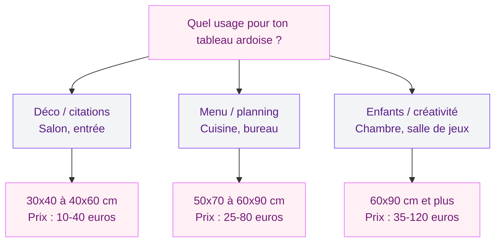
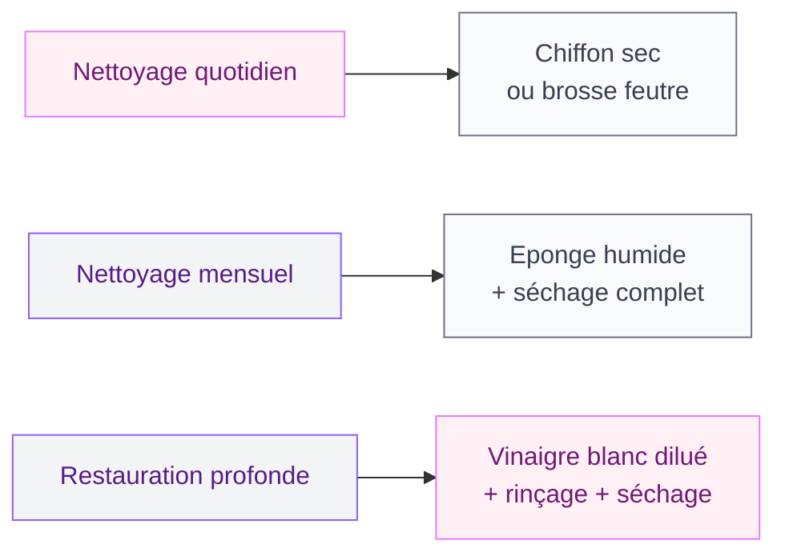

Tu adores l'idée d'un tableau noir dans ta déco, mais tu ne sais pas lequel prendre ? Entre le modèle en ardoise naturelle à 80 euros et le panneau en mélamine à 15 euros chez Action, le choix peut vite devenir un casse-tête. Et entre nous, un mauvais choix se paie cher : craie qui accroche mal, surface impossible à nettoyer, cadre qui gondole au bout de six mois.

Que tu cherches un tableau ardoise pour la cuisine, un grand format pour les enfants ou un modèle pro pour ton restaurant, je t'explique tout : les matériaux, les tailles, les prix et les pièges à éviter. Tu sauras exactement quoi acheter (et où) d'ici la fin de cet article.

---

## Les différents types de tableaux noirs : lequel te correspond ?

Tous les tableaux noirs ne sont pas fabriqués de la même façon. Le matériau de la surface change tout : le confort d'écriture, la durée de vie, le rendu visuel et le prix. Voici les quatre grandes familles.

### Ardoise naturelle

C'est le top du top. Une vraie plaque d'ardoise, celle qu'on utilisait dans les écoles d'autrefois. La surface a un grain naturel agréable sous la craie, l'écriture est fluide et le contraste est parfait. L'ardoise se nettoie d'un simple coup d'éponge humide et ne fantôme quasiment jamais.

**Prix** : entre 30 et 120 euros selon la taille. Les modèles de chez RETIF (spécialiste commerce) tournent autour de 50-80 euros pour un 60x80 cm avec cadre bois. On en trouve aussi chez Maisons du Monde et Nature & Découvertes.

**Le bémol** : c'est lourd. Une ardoise naturelle de 60x80 cm pèse facilement 5 à 8 kg. Il faut une fixation solide au mur, pas des languettes adhésives. Et le prix est élevé par rapport aux alternatives.

### Panneau mélaminé noir (MDF laqué)

Le modèle le plus courant et le moins cher. C'est un panneau de MDF ou d'aggloméré recouvert d'une couche de peinture noire spéciale "ardoise". On le trouve partout : Ikea (la gamme MALARNA à 12 euros), Action, Gifi, Cultura.

**Prix** : entre 8 et 35 euros selon la taille et la marque.

L'écriture est correcte avec de la craie standard, mais la surface est plus lisse qu'une vraie ardoise. Le rendu est un peu moins "authentique". Avec le temps (1 à 2 ans d'usage régulier), la surface peut s'user et la craie ne s'efface plus aussi bien.

> [!TIP]
> Pour les petits budgets, le panneau mélaminé est un très bon choix si tu le destines à un usage ponctuel (menu de la semaine, citations déco). Pour un usage quotidien intensif, monte vers l'ardoise naturelle ou le magnétique.

### Tableau noir magnétique

C'est un panneau métallique recouvert d'une peinture ardoise. Tu peux y écrire à la craie ET y coller des magnets, des photos, des recettes avec de petits aimants. C'est le meilleur des deux mondes.

**Prix** : entre 25 et 90 euros. KalaMitica propose une gamme très réussie avec des modèles de 56x38 cm à partir de 45 euros, disponibles en noir classique et aussi en vert foncé ou bordeaux. Chez Leroy Merlin et Castorama, tu trouves des références entre 30 et 70 euros.

La qualité d'écriture est un peu en dessous de l'ardoise naturelle (la surface métallique est très lisse), mais la polyvalence compense largement.

### Peinture ardoise (pour créer ton propre tableau)

Plutôt que d'acheter un tableau, tu peins directement un pan de mur, une porte ou un meuble avec de la peinture ardoise. C'est la solution la plus flexible : tu choisis la taille exacte que tu veux.

**Prix** : entre 15 et 30 euros le pot de 250 ml (marques Julien, Maison Déco, Rust-Oleum), qui couvre environ 2 m2 en deux couches. Deux couches minimum pour un rendu homogène.

> [!NOTE]
> La peinture ardoise existe aussi en version magnétique. Tu appliques d'abord une sous-couche magnétique (environ 25 euros le pot), tu attends que ça sèche, puis tu passes la peinture ardoise par-dessus. Résultat : un mur sur lequel tu écris à la craie ET tu colles des magnets.

---

## Quelle taille choisir selon l'usage ?

La taille est le critère que tout le monde néglige. Trop petit, tu manques de place et tu finis par écrire minuscule. Trop grand, le tableau écrase la pièce. Voici les bons repères.

  

  

### Petit format (30x40 cm à 40x60 cm)

Parfait pour une touche déco dans l'entrée, un petit message dans le salon ou une citation inspirante au-dessus du bureau. Tu y tiens 3 à 5 lignes de texte, pas plus. C'est aussi la taille idéale si tu veux un chevalet de table pour un événement (mariage, anniversaire, brunch).

### Format moyen (50x70 cm à 60x90 cm)

Le format polyvalent par excellence. Tu y notes le menu de la semaine dans la cuisine, la to-do list dans le bureau ou les consignes pour les enfants. C'est aussi le format préféré des restaurateurs pour les plats du jour affichés à l'entrée.

### Grand format (60x90 cm et plus)

Pour les enfants qui veulent dessiner à la craie sans limite, ou pour un vrai mur d'expression dans un salon, un atelier ou un commerce. Les modèles muraux de 90x120 cm offrent un espace confortable pour un planning complet ou un menu élaboré.

**Astuce marques** : chez Janod, la gamme de chevalets double-face (ardoise d'un côté, tableau blanc de l'autre) est top pour les enfants de 3 à 8 ans. Le modèle "Splash" à environ 50 euros est réglable en hauteur et tient bien dans le temps.

---

## Ardoise vs mélamine vs magnétique : le comparatif

| Critère | Ardoise naturelle | Mélaminé noir | Magnétique | Peinture ardoise |
|---------|------------------|---------------|------------|-----------------|
| Prix (60x80 cm) | 50-120 euros | 12-35 euros | 30-90 euros | 15-30 euros (pot) |
| Confort d'écriture | Excellent | Correct | Bon | Variable |
| Durée de vie | 10+ ans | 1-3 ans | 5-10 ans | 3-5 ans (repeindre) |
| Poids | Lourd (5-8 kg) | Léger (1-3 kg) | Moyen (3-5 kg) | Aucun (mural) |
| Magnets | Non | Non | Oui | Avec sous-couche |
| Look déco | Authentique | Basique | Moderne | Sur mesure |

---

## Où placer ton tableau ardoise ? Les meilleurs spots

  

### Dans la cuisine

C'est le spot numéro 1 et pour cause : le tableau ardoise dans la cuisine, c'est un classique qui fonctionne toujours. Menu de la semaine, liste de courses, recette du jour, petit mot pour la famille. Place-le à côté du frigo ou au-dessus du plan de travail, à hauteur des yeux (centre du tableau à environ 160 cm du sol).

Pour un look cohérent, associe-le avec des accessoires en bois naturel ou en métal noir mat. Si tu cherches à créer une ambiance naturelle et épurée, notre guide sur la [déco minimaliste](/guides/decoration/decoration-minimaliste-idees-et-photos-faciles/) te donnera plein d'idées complémentaires.

### Dans l'entrée

Un petit format vertical (30x60 cm) à côté de la porte, c'est pratique et joli. Tu y notes les rendez-vous de la journée, un message de bienvenue ou les rappels pour le soir. Associe-le à un porte-manteau et un vide-poche pour créer un "coin organisation" fonctionnel.

### Dans la chambre d'enfant

C'est là que le tableau ardoise prend tout son sens. Les enfants adorent dessiner à la craie - c'est moins salissant que la peinture, ça se nettoie en deux secondes, et ça stimule la créativité sans limites. Installe un grand format (90x120 cm minimum) à leur hauteur, avec un petit rebord en bas pour poser les craies.

> [!IMPORTANT]
> Pour les enfants de moins de 3 ans, évite la craie classique (risque d'ingestion) et préfère les marqueurs craie liquide lavables. Les modèles Crayola ou Giotto sont conçus pour les petites mains et s'effacent à l'eau.

### En contexte professionnel

Restaurants, cafés, boulangeries, salons de coiffure : le tableau ardoise reste l'outil de communication visuelle le plus efficace pour afficher les menus, les tarifs ou les promotions du jour. RETIF et Bruneau proposent des gammes professionnelles avec des modèles sur pied, muraux ou de comptoir, entre 30 et 150 euros.

---

## Entretien : comment garder ton ardoise comme neuve

L'entretien d'un tableau noir, c'est simple mais il y a quelques règles à respecter pour éviter le "fantômage" (ces traces grises qui ne partent plus).

**Au quotidien** : un coup de brosse feutre ou de chiffon sec suffit. Pas besoin de mouiller. La craie sèche se retire très bien sans eau.

**Une fois par mois** : passe une éponge légèrement humide sur toute la surface, puis sèche avec un chiffon propre. Ca retire les résidus de craie incrustés et redonne un noir profond.

**Si ton ardoise fantôme** : mélange une cuillère de vinaigre blanc dans un demi-litre d'eau tiède. Applique avec un chiffon doux, frotte délicatement, rince à l'eau claire et sèche bien. Cette méthode fonctionne aussi bien sur l'ardoise naturelle que sur les panneaux mélaminés.

> [!WARNING]
> Ne laisse jamais la craie humide sécher sur le tableau. L'eau mélangée à la poussière de craie crée une pâte qui s'incruste dans les pores de l'ardoise. Quand tu nettoies à l'humide, essuie toujours jusqu'à ce que la surface soit complètement sèche.

---

## Bien accrocher ton tableau ardoise au mur

Le poids est la variable clé. Un petit panneau mélaminé de 2 kg se fixe avec des languettes adhésives. Une ardoise naturelle de 7 kg demande des chevilles et des vis.

  

Pour les méthodes détaillées selon ton type de mur (placo, béton, brique), consulte notre guide complet pour [bien accrocher un tableau mural](/guides/decoration/bien-accrocher-tableau-mural/) - tu y trouveras les bonnes fixations pour chaque poids.

**Quelques règles rapides** :

- Centre du tableau à environ 150-160 cm du sol (hauteur des yeux)
- Si c'est pour les enfants, descends à 90-100 cm pour qu'ils écrivent debout
- Laisse 15-20 cm de marge entre le tableau et le meuble en dessous
- Vérifie l'horizontalité avec un niveau à bulle avant de fixer

Si tu aimes les compositions murales mélangées (ardoise + cadres + plantes), tu trouveras des idées d'agencement dans notre guide sur les [cadres et tableaux végétaux](/guides/decoration/choisir-cadre-tableau-mural-vegetal/).

---

## Les erreurs à ne pas faire

**Acheter de la craie bas de gamme** - La craie à 1 euro le lot de 12 chez le bazar du coin griffe la surface et s'effrite en poussière. Les craies Giotto Robercolor ou Jpc sont bien meilleures : elles glissent, cassent moins et produisent peu de poussière. Compte 4-6 euros le lot de 10.

**Oublier le rebord porte-craie** - Sans rebord, tes craies finissent par terre et ta poussière de craie salit le meuble en dessous. Si ton modèle n'en a pas, fixe une petite étagère en bois de 5-8 cm de profondeur juste sous le tableau. Un tasseau IKEA à 3 euros fait le job.

**Placer le tableau au-dessus d'un canapé clair** - La poussière de craie tombe vers le bas. Sur un canapé blanc ou beige, ça laisse vite des traces. Place plutôt ton ardoise au-dessus d'un meuble foncé ou dans une zone sans textile en dessous.

**Utiliser des feutres Posca permanents en pensant que c'est effaçable** - Les Posca standards sont permanents sur l'ardoise. Pour un rendu similaire (couleurs vives, trait net) mais effaçable, choisis des marqueurs craie liquide "chalk markers" comme les Edding 4090 ou les Securit. Ils s'effacent à l'eau.

---

## Double-face : un choix malin pour les enfants

Les chevalets double-face combinent un côté ardoise noire et un côté tableau blanc (type Velleda). C'est l'option la plus polyvalente pour une chambre d'enfant ou une salle de jeux. Les enfants dessinent à la craie d'un côté et au feutre effaçable de l'autre.

  

**Mes recommandations** : le chevalet Janod "Splash" (environ 50 euros, réglable en hauteur, bois massif) et le modèle Smoby (environ 35 euros, plastique résistant, avec rangement intégré pour les accessoires). Si tu cherches aussi un tableau blanc pour ton usage perso, jette un oeil à notre guide sur les [tableaux Velleda](/guides/decoration/choisir-tableau-velleda/) qui compare tous les formats et surfaces.

> [!TIP]
> Pour un chevalet d'enfant, choisis un modèle avec des pieds réglables en hauteur. Les enfants grandissent vite, et un chevalet trop bas oblige à se baisser en permanence. La hauteur d'écriture doit arriver entre l'épaule et le menton de l'enfant.

---

## Sur le meme theme

- [tableau planning et pense-bête](/guides/decoration/choisir-tableau-planning-pense-bete/)

## FAQ

**Quelle est la différence entre un tableau noir en ardoise et un tableau en mélamine ?**
L'ardoise naturelle est une roche taillée en plaque fine : elle a un grain spécifique, une écriture agréable et dure des dizaines d'années. Le mélaminé est un panneau de bois recouvert de peinture ardoise : c'est plus léger, moins cher, mais la surface s'use en 1 à 3 ans d'usage régulier. Pour un usage déco occasionnel, le mélaminé convient. Pour un usage quotidien, l'ardoise naturelle ou le magnétique sont de meilleurs choix.

**Comment éviter la poussière de craie sur les meubles ?**
Trois solutions : utilise des craies "sans poussière" (Giotto Robercolor ou Hagoromo), installe un petit rebord sous le tableau pour capter la poussière qui tombe, et passe un chiffon humide sur le rebord une fois par semaine. Tu peux aussi opter pour des marqueurs craie liquide qui ne produisent aucune poussière.

**Un tableau ardoise magnétique, ca existe vraiment ?**
Oui, et c'est très pratique. Le principe : une plaque d'acier recouverte de peinture ardoise. Tu écris à la craie et tu colles des magnets en même temps. KalaMitica est la marque de référence pour ce type de produit, avec des modèles à partir de 35-45 euros. Tu peux aussi créer le tien en appliquant une sous-couche magnétique puis de la peinture ardoise sur un mur.

**Quel tableau ardoise choisir pour un restaurant ou un commerce ?**
Pour un usage pro, privilégie un modèle en ardoise naturelle ou en panneau magnétique robuste, avec un cadre en bois massif. RETIF propose des gammes dédiées (ardoises murales, chevalets de trottoir, modèles de comptoir) entre 30 et 150 euros. Choisis un format adapté à ta vitrine : les modèles sur pied A1 (60x85 cm) sont les plus visibles depuis la rue. Bruneau est aussi une bonne adresse pour les modèles de bureau et de salle de réunion.