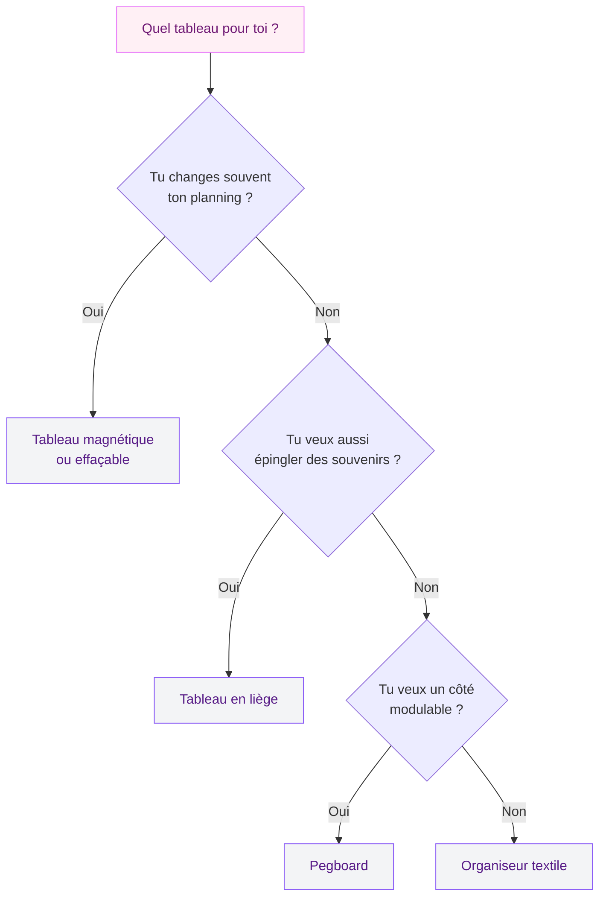
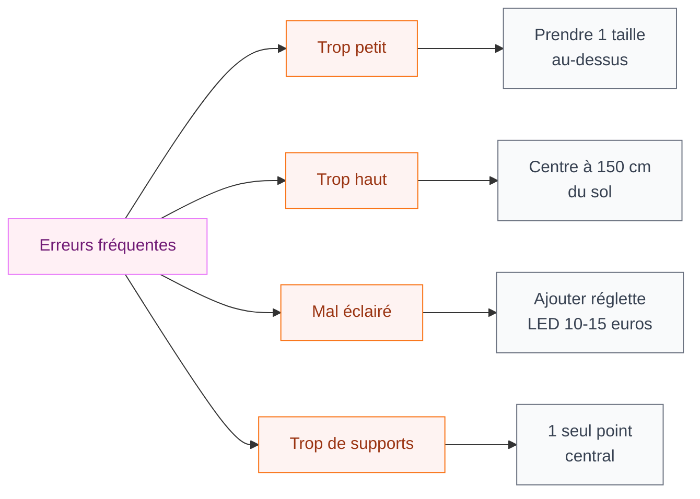

Tu as des post-it collés partout sur le frigo, un calendrier papier qui date d'il y a deux ans et une liste de courses griffonnée sur un bout de nappe ? On est toutes passées par là. Le problème, ce n'est pas le manque de volonté - c'est l'absence d'un vrai système visuel qui fonctionne ET qui ne casse pas ta déco.

Un bon tableau planning ou un pense-bête mural, ça peut tout changer. Tu centralises tes rendez-vous, tes listes, tes idées, le planning familial... et ton intérieur reste propre, organisé, agréable à regarder. Mais entre un tableau en liège à 9 euros chez Ikea et un organiseur mural design à 150 euros sur Etsy, le choix est vaste. Je t'aide à trouver le format parfait pour toi.

---

## Les grands types de tableaux planning et pense-bête

Avant de craquer sur le premier modèle Pinterest qui te fait de l'oeil, il vaut mieux comprendre ce qui existe. Chaque format a ses avantages et ses limites, et le meilleur pour toi dépend de ta façon de fonctionner au quotidien.

### Le tableau en liège classique

C'est le grand classique. Un panneau de liège encadré (ou pas) sur lequel tu épingles tout ce que tu veux : photos, cartes postales, listes, billets de concert, tickets de caisse à garder. Le format va de 30x40 cm (petit modèle de bureau) à 90x120 cm (format familial).

**Prix** : de 8 à 25 euros pour un modèle basique (Ikea VAGGIS à 9 euros, Leroy Merlin à partir de 12 euros). Les versions avec cadre en bois naturel ou en rotin se trouvent entre 25 et 60 euros chez Maisons du Monde ou La Redoute.

**Pour qui ?** Celles qui aiment le côté tactile, qui épinglent des souvenirs en plus des plannings, qui veulent un support polyvalent.

**Limite** : le liège s'effrite avec le temps, surtout si tu plantes et replantes souvent tes punaises. Au bout de 2 à 3 ans d'usage intensif, il faut le remplacer.

### Le tableau magnétique et effaçable

Le format "white board" version déco. Il en existe en verre (super chic, entre 40 et 120 euros), en métal laqué (plus abordable, 20 à 60 euros), ou même en film adhésif à coller directement sur un mur ou une porte.

Tu écris au feutre effaçable, tu colles des magnets pour tes photos ou tes rappels, et tu effaces tout quand c'est fait. Hyper pratique pour les plannings de semaine qui changent souvent.

**Prix** : un tableau magnétique en verre 40x60 cm coûte environ 45 à 80 euros (Leroy Merlin, Amazon). Les films adhésifs magnétiques démarrent à 15 euros le rouleau chez Action ou Castorama.

> [!TIP]
> Si tu veux un tableau magnétique sans le look "salle de réunion", cherche les modèles en verre coloré (noir, rose poudré, vert sauge). La marque Naga propose des tableaux en verre vraiment beaux à partir de 50 euros.

### Le panneau perforé (pegboard)

Le pegboard, c'est ce panneau avec plein de trous réguliers dans lequel tu insères des crochets, des étagères et des accessoires modulables. On le connaît surtout dans les garages et les ateliers, mais la version déco a envahi Instagram.

Tu peux y accrocher des paniers pour le courrier, des crochets pour les clés, des petites étagères pour les plantes, et un mini-calendrier ou un bloc-notes. C'est le format le plus modulable de tous.

**Prix** : le pegboard Ikea SKADIS (56x76 cm) coûte 19 euros, accessoires en sus (2 à 5 euros pièce). Les versions en bois naturel chez des créateurs Etsy vont de 45 à 120 euros.

**Pour qui ?** Les personnes qui aiment réorganiser souvent leur espace, qui veulent combiner rangement et organisation visuelle.

### L'organiseur mural textile ou macramé

Le format "déco bohème". Un support en tissu, en lin ou en macramé avec des poches, des pinces ou des anneaux pour glisser des cartes, des enveloppes, des petits carnets. Plus décoratif qu'utilitaire, mais parfait si tu veux un pense-bête discret qui se fond dans un intérieur naturel ou scandinave.

**Prix** : entre 15 et 45 euros pour un modèle en lin avec 4 à 6 poches (H&M Home, Zara Home). Les créations artisanales en macramé montent à 60-90 euros.

> [!NOTE]
> L'organiseur textile n'est pas adapté si tu as beaucoup d'informations à gérer. C'est un complément, pas un système principal. Combine-le avec un calendrier numérique ou un tableau magnétique si tu as un quotidien chargé.

---

## Comment choisir le bon format pour ton quotidien

Le choix dépend de trois choses : ce que tu veux y mettre, où tu veux l'installer, et ton style déco. Voici un schéma pour t'aider à trancher.

  

  

### Critère 1 : la fréquence de mise à jour

Si ton planning change chaque semaine (menus, activités des enfants, rendez-vous médicaux), le tableau magnétique effaçable est imbattable. Tu notes, tu effaces, tu recommences. Zéro déchet de papier, zéro punaise perdue derrière le meuble.

Si ton contenu est plus stable - un planning mensuel, un suivi d'objectifs, un mood board - le liège ou le pegboard feront très bien l'affaire.

### Critère 2 : la taille de ta famille (ou de ton équipe)

Pour une personne seule ou un couple, un format 40x60 cm suffit largement. Pour une famille de 3 à 5 personnes, passe au minimum à 60x90 cm. Et si tu veux un vrai command center familial (on en parle juste après), prévois un mur entier de 120 cm de large.

### Critère 3 : l'intégration déco

C'est là où beaucoup de gens se plantent. Un tableau blanc en plastique dans une entrée en bois et lin, ça jure. Un pegboard métallique dans un intérieur baroque aussi.

La règle est simple : **ton tableau doit reprendre au moins un matériau ou une couleur déjà présente dans la pièce**. Si ton entrée est en tons chauds avec du bois, choisis un panneau en liège avec cadre bois. Si ta cuisine est moderne avec du métal et du verre, un tableau magnétique en verre sera parfait.

Pour t'inspirer sur les harmonies de matières, tu peux jeter un oeil à nos idées de [décoration minimaliste](/guides/decoration/decoration-minimaliste-idees-et-photos-faciles/) ou de [salons modernes 2026](/guides/decoration/salons-modernes-et-elegants-2026/).

---

## L'idée qui cartonne : le "command center" familial

Si tu as des enfants ou un foyer bien rempli, le "command center" (centre de commandement), c'est LE concept à adopter. L'idée est simple : dédier un espace mural à l'organisation de toute la famille, en un seul endroit.

### Ce qu'on y met

- Un calendrier mensuel (magnétique ou effaçable)
- Un espace par personne (colonnes ou zones colorées)
- Un bac à courrier (entrant / à traiter / archive)
- Un porte-clés
- Une liste de courses (petit bloc-notes ou ardoise)
- Un espace "urgent" bien visible

### Où l'installer

L'entrée est le spot numéro 1. Tout le monde passe par là en arrivant et en partant. La cuisine fonctionne aussi, surtout si tu as un pan de mur libre près du frigo.

Évite la chambre (c'est un espace de repos) et le salon (c'est un espace de détente). Le command center, c'est un outil, pas une déco de vitrine.

> [!WARNING]
> Ne surcharge pas ton command center. Si tu mets trop d'éléments, personne ne le consulte. Limite-toi à 5 ou 6 rubriques maximum. Le reste peut aller dans une appli ou un carnet.

### Budget pour un command center complet

| Élément | Prix indicatif | Où l'acheter |
|---------|---------------|--------------|
| Tableau magnétique 60x90 cm | 40-70 euros | Leroy Merlin, Amazon |
| Pegboard + accessoires | 25-40 euros | Ikea (SKADIS) |
| Bac à courrier mural | 10-20 euros | Ikea, La Redoute |
| Porte-clés mural | 5-15 euros | Maisons du Monde |
| Bloc-notes magnétique | 5-10 euros | Action, Hema |
| **Total** | **85-155 euros** | |

Tu vois, pour moins de 100 euros avec un peu de malin shopping, tu montes un centre d'organisation complet qui va te simplifier la vie.

---

## Version DIY : fabriquer ton propre tableau planning

Tu préfères le sur-mesure ? Bonne nouvelle : fabriquer un tableau planning ou un pense-bête déco est un projet accessible, même si tu n'es pas bricoleuse confirmée.

  

  

### Le tableau en liège customisé

**Matériel** : plaque de liège (5-10 euros en rouleau chez Castorama), cadre photo grand format ou tasseaux de bois, colle forte, peinture si tu veux colorer des zones.

**Étapes** :
1. Découpe le liège à la taille du cadre
2. Colle-le sur le fond du cadre avec de la colle néoprène
3. Optionnel : peins des bandes de couleur avec de l'acrylique pour délimiter les zones (lundi à dimanche, ou une zone par membre de la famille)
4. Fixe au mur avec deux crochets

Temps : 30 à 45 minutes. Coût total : 15 à 30 euros.

### Le pegboard en bois fait maison

Si tu veux un pegboard en bois naturel (bien plus joli que la version plastique), tu peux en fabriquer un avec une planche de MDF ou de contreplaqué.

**Matériel** : planche de MDF 60x80 cm (8-12 euros), perceuse à colonne ou perceuse classique avec mèche de 6 mm, tourillons en bois de 6 mm (3 euros les 50), ponceuse ou papier de verre.

**Étapes** :
1. Trace un quadrillage de points espacés de 5 cm sur la planche
2. Perce chaque point à 6 mm de diamètre sur 1,5 cm de profondeur
3. Ponce les bords et la surface
4. Insère les tourillons là où tu veux poser des accessoires
5. Fixe au mur

Temps : 1 à 2 heures. Coût total : 20 à 35 euros. Si tu aimes ce type de projet, nos astuces pour [fabriquer un bureau avec des caissons](/guides/decoration/fabriquer-un-bureau-avec-des-caissons/) peuvent aussi t'intéresser.

> [!TIP]
> Pour un look encore plus soigné, applique une huile de lin ou un vernis mat sur ton pegboard en bois. Ça protège la surface et ça donne un rendu plus "meuble" que "chantier".

---

## Les erreurs à éviter absolument

Après avoir aidé des dizaines de lectrices à installer leur système d'organisation murale, voici les pièges les plus courants.

### Choisir un format trop petit

C'est l'erreur numéro 1. Tu achètes un joli petit tableau 30x40 cm, et au bout de deux semaines il déborde. Résultat : tu reviens aux post-it sur le frigo. Prends toujours une taille au-dessus de ce que tu penses avoir besoin.

### Placer le tableau trop haut

Le centre du tableau doit être à hauteur des yeux, soit environ 150-160 cm du sol pour le milieu du panneau. Si c'est un command center familial avec des enfants, descends le bas du tableau à 90-100 cm pour que les plus jeunes y accèdent aussi.

### Oublier l'éclairage

Un tableau planning installé dans un coin sombre de l'entrée, personne ne le regarde. Si tu n'as pas de lumière naturelle suffisante, ajoute une petite réglette LED (10-15 euros) au-dessus. Ça fait aussi un bel effet déco le soir. Pour mieux comprendre comment la lumière change tout dans une pièce, consulte notre guide sur [les décorations dorées pour murs et meubles](/guides/decoration/decoration-doree-sur-les-murs-les-meubles-ou-les-accessoires/) qui aborde aussi les jeux de lumière.

### Multiplier les supports

Un tableau en liège dans l'entrée, un white board dans la cuisine, une ardoise dans le couloir et un calendrier dans la chambre... ça part d'une bonne intention, mais au final l'information est dispersée partout et tu ne sais plus où regarder. Mieux vaut un seul point central bien organisé que cinq supports éparpillés.

---

## Numérique ou physique : faut-il vraiment choisir ?

La question revient souvent : "Pourquoi un tableau mural alors que j'ai Google Calendar sur mon téléphone ?" Bonne question. La réponse, c'est que les deux ne remplissent pas la même fonction.

  

Le planning numérique est génial pour les rappels automatiques, les agendas partagés et les rendez-vous à long terme. Mais il a un défaut : **il est invisible quand l'écran est éteint**. Tu n'y penses plus en rentrant chez toi.

Le tableau physique, lui, est toujours là. Tu passes devant, tu jettes un oeil, tu te rappelles que demain c'est jour de poubelles ou que ta fille a piscine à 16h. C'est ce qu'on appelle la "mémoire ambiante" - l'information s'imprime sans effort parce qu'elle fait partie de ton environnement visuel.

Mon conseil : utilise les deux en complément. Les rendez-vous et rappels dans le téléphone, le planning hebdomadaire et les tâches du quotidien sur le tableau mural. C'est la combinaison la plus efficace.

> [!IMPORTANT]
> Un tableau mural n'est utile que si tu le mets à jour. Bloque 5 minutes le dimanche soir pour planifier ta semaine et effacer l'ancienne. Sans cette habitude, même le plus beau command center finit par devenir un fond de mur inutile.

---

## Sur le meme theme

- [tableau pour enfant](/guides/decoration/choisir-tableau-enfant/)

## En résumé : quel format pour quel profil ?

| Ton profil | Le format idéal | Budget |
|-----------|----------------|--------|
| Étudiante / studio | Liège 40x60 cm | 10-20 euros |
| Couple actif | Tableau magnétique 50x70 cm | 40-70 euros |
| Famille 3-5 personnes | Command center complet | 85-155 euros |
| Fan de déco bohème | Organiseur textile + pegboard | 40-80 euros |
| Bricoleuse | DIY liège ou pegboard bois | 15-35 euros |

L'organisation murale, c'est un petit investissement qui rapporte gros en sérénité au quotidien. Que tu optes pour un simple panneau de liège à 10 euros ou un command center complet, l'important c'est de choisir un format que tu utiliseras vraiment - et qui te fera plaisir à regarder chaque jour.

Alors, tu te lances ?
